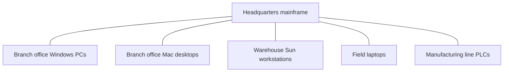
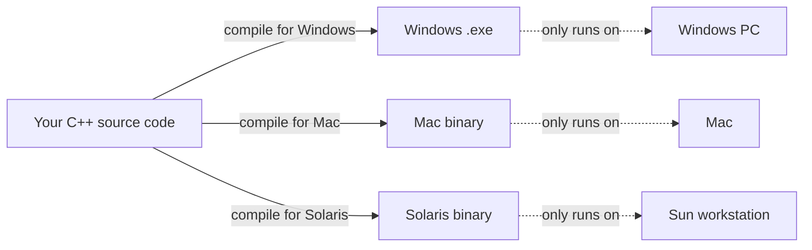

By the late 1980s, the computer industry looked nothing like the
mainframe world of a decade earlier. Personal computers sat on
desks. Servers hummed in back rooms. Networks connected branch
offices. And businesses wanted software that did things people had
never asked computers to do before: track every customer, manage
every shipment, balance every account, in real time, in every store
in every country.

This is the era of **enterprise software**, and it changed what
programmers needed from a language.

<svg
  viewBox="0 0 640 230"
  role="img"
  aria-label="Three office clusters stand on one horizon dome and exchange packets along dotted arcs — businesses wiring branch offices in every country into one system"
  style={{ display: "block", width: "100%", maxWidth: "640px", height: "auto", margin: "2.5rem auto" }}
>
  <g fill="currentColor" opacity="0.07">
    <path d="M80 230A240 186 0 0 1 560 230Z" />
  </g>
  <g fill="currentColor" opacity="0.15">
    <rect x="60" y="224" width="520" height="4" rx="2" />
  </g>
  <g style={{ color: "var(--ds-blue-500)" }} fill="currentColor">
    <rect x="302" y="62" width="12" height="38" fillOpacity="0.85" />
    <rect x="318" y="52" width="14" height="48" fillOpacity="0.85" />
    <rect x="336" y="70" width="10" height="30" fillOpacity="0.85" />
  </g>
  <g style={{ color: "var(--ds-green-500)" }} fill="currentColor">
    <rect x="162" y="150" width="10" height="26" fillOpacity="0.85" />
    <rect x="176" y="142" width="12" height="34" fillOpacity="0.85" />
    <circle cx="231" cy="99" r="5" />
  </g>
  <g style={{ color: "var(--ds-yellow-500)" }} fill="currentColor">
    <rect x="462" y="138" width="12" height="34" fillOpacity="0.85" />
    <rect x="478" y="148" width="10" height="24" fillOpacity="0.85" />
    <circle cx="397" cy="96" r="5" />
  </g>
  <g fill="currentColor" opacity="0.3">
    <circle cx="272" cy="84" r="3" />
    <circle cx="244" cy="92" r="3" />
    <circle cx="218" cy="108" r="3" />
    <circle cx="196" cy="126" r="3" />
    <circle cx="352" cy="80" r="3" />
    <circle cx="382" cy="90" r="3" />
    <circle cx="410" cy="104" r="3" />
    <circle cx="436" cy="120" r="3" />
    <circle cx="208" cy="190" r="3" />
    <circle cx="260" cy="198" r="3" />
    <circle cx="314" cy="202" r="3" />
    <circle cx="368" cy="200" r="3" />
    <circle cx="420" cy="192" r="3" />
  </g>
</svg>

## What "enterprise" really means

When we say *enterprise software*, we are not just talking about
"software for a big company." We are talking about programs that
have these uncomfortable properties:

- They live for **decades**, often outlasting the people who wrote
  them.
- They are **huge** — millions of lines, hundreds of programmers.
- They run on a **zoo of different machines**: Windows PCs, Sun
  workstations, IBM mainframes, Mac desktops, eventually phones.
- They must be **reliable**: a crash in a banking system is not just
  annoying, it costs money or breaks the law.
- They must be **secure**: they hold data that other people would
  love to steal.

If you write a payroll system in one language for one kind of
computer, you might have to *rewrite it* for every other kind of
computer the company uses. For a big enterprise, that meant
maintaining several near-identical codebases. Imagine fixing the same
bug in five places, in five slightly different programming languages.

## C++ — almost the answer

In the early 1980s, **Bjarne Stroustrup** at Bell Labs created
**C++**, which added classes and objects to the wildly popular C
language. C++ was a huge step forward:

- It was fast (it compiled directly to machine code).
- It had classes, inheritance, and (eventually) templates.
- It worked on every platform that C worked on, which was everywhere.

For a while in the late 80s and early 90s, C++ looked like the future
of all serious software. But it had two problems that grew sharper as
enterprise programs grew larger.

### Problem 1: portability was a fantasy

In theory, you could compile the same C++ source code for Windows,
Mac, and Unix. In practice, every platform had different libraries,
different conventions, different sizes for built-in types, different
ways of opening windows, reading files, drawing pixels, talking to
the network. A serious C++ program for Windows shared maybe 60% of
its code with the Mac version. The other 40% was platform-specific.

Every platform required a separate build, separate testing, separate
release. For a global company shipping to 20 platforms, this was
ruinously expensive.

### Problem 2: manual memory management

In C++, the programmer was personally responsible for every byte of
memory: asking the operating system for it with `new`, giving it back
with `delete`, never forgetting, never giving it back twice, never
using it after returning it. Forgetting to free memory caused
*memory leaks* (the program slowly bloats until it crashes).
Returning memory twice or using it after freeing it caused
*undefined behavior* (the program might crash, or do something
worse, like silently corrupt customer data).

In a small program, a careful programmer can manage this. In a
five-million-line enterprise program written by a hundred people over
ten years, a single forgotten `delete` could ruin everyone's week.

<MultipleChoice
  markdown={`Why was *cross-platform portability* such a big deal for enterprise software in the 1990s?

- Because computers were getting more expensive
  > The cost of hardware was actually falling.
- [o] Because big organizations ran many different kinds of machines and could not afford to maintain a separate program for each one
  > Enterprise environments were heterogeneous, and rewriting per platform was painful.
- Because users wanted programs to look identical everywhere
  > Visual consistency mattered but was not the main driver.
- Because the internet did not yet exist
  > The internet was emerging, but this problem predates and outlasts that.`}
/>

## The internet enters the picture

There was one more force at work. By the mid 1990s, the **World Wide
Web** was exploding. Suddenly there was a brand-new kind of program:
a small piece of code that could be **downloaded from a server and
run inside a web browser**, on any user's machine, anywhere in the
world. Nobody knew in advance what kind of computer the user had.

For this dream to work, you needed a language that could:

- be downloaded over a slow connection (so: compact);
- run safely on a stranger's machine (so: sandboxed, can't trash the
  hard drive);
- look and behave *identically* on every platform (so: truly portable
  — not portable-in-theory like C++).

C++ was simply the wrong tool. It compiled to machine code that was
specific to one CPU. You could not just download a C++ binary onto
"whatever the user has." Something else was needed.

## A perfect storm

So by the early 1990s, the world had:

- An industry desperate for a way to write portable enterprise
  software without rewriting it for every platform.
- A new web that needed safe, downloadable, portable programs.
- A generation of programmers who had been taught OOP at university
  and wanted to use it in industry.
- A research community that had been refining OOP for thirty years.

The conditions were set for a new language. The catch is that this
language was not actually invented to solve any of these problems. It
was invented to control **smart toasters and TV remotes**. That's the
next page.

<MultipleChoice
  markdown={`Which of these was a real limitation of C++ for very large enterprise systems?

- C++ could not represent integers larger than 100
  > Type ranges were normal.
- C++ did not support inheritance
  > It did, very early.
- [o] C++ required the programmer to manually allocate and free memory, which became error-prone at large scale
  > Manual memory management is powerful but fragile in big codebases.
- C++ could not compile on Unix systems
  > C++ ran perfectly well on Unix.`}
/>

<MultipleChoice
  markdown={`Why was the web browser an awkward place to run C++ programs?

- Browsers could not display text
  > They could.
- [o] C++ compiled to a CPU-specific binary, but a browser could be running on any CPU on any operating system
  > The browser ran on many platforms, and a single C++ build could not target all of them.
- C++ did not support graphics
  > It supported graphics through platform libraries.
- Browsers did not support classes
  > Browsers are not the unit that "supports" or "doesn't support" classes.`}
/>
