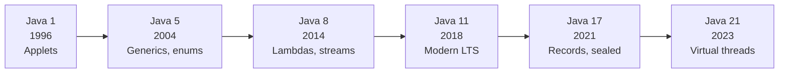

A useful way to understand Java is as a series of *eras*. The
language has changed shape several times — quietly enough that
existing programs still work, but enough that the kinds of programs
people *write* in Java have evolved dramatically.

## Era 1: Applets in the browser (1995-2000)

The first thing the world saw Java do was animate stuff inside web
pages. A Java **applet** was a small program (a `.class` file) that
the browser downloaded and ran in a sandbox. Applets did simple
animations, calculators, simple games, and proof-of-concept demos.

For a brief window in the late 1990s, applets looked like the future
of interactive content on the web. They never quite lived up to that
promise. They were slow to start, hard to secure, and quickly
out-competed by JavaScript (which despite the confusing name is an
*unrelated* language) and later by Flash.

Applets are now extinct. Modern browsers no longer support them. But
they were Java's debut on the world stage and they are the reason
millions of people first heard the word.

## Era 2: Desktop and the early server (1996-2002)

Java grew up. Sun added **Swing**, a portable library for building
desktop user interfaces. Companies started writing internal desktop
tools in Java — administration consoles, monitoring dashboards,
financial workstations.

At the same time, Java quietly invaded the server. The first version
of **servlets** in 1997 let Java programs respond to web requests.
**JSP** (JavaServer Pages) followed shortly. For the first time you
could write a web application's *backend* in Java.

## Era 3: The enterprise stack (2000-2010)

This is the era where Java became, for a generation, almost
synonymous with "serious backend software." A bewildering ecosystem
of standards grew up around the JVM: **J2EE**, **EJB**, **JNDI**,
**JMS**, **JTA**, **JSF**, **JAX-RS**, and so on. Banks, insurers,
airlines, and government departments built entire platforms on these
foundations.

Some of these standards aged well; others were notoriously
over-engineered. The reaction against the heavier parts produced a
new style — lighter-weight frameworks like **Spring** (introduced in
2003), which is still the dominant backend framework in the
Java world today.

You do **not** need to know the details of any of these frameworks
to learn Java. They are downstream of the language. This course
deliberately stays away from them so we can focus on the foundations
that make all of them comprehensible later.

## Era 4: Android and the mobile boom (2008-2017)

In 2008, Google launched **Android**. Every Android app was, for
nearly a decade, written in Java. Suddenly there were hundreds of
thousands of Java programmers who had nothing to do with enterprise
backends or banking. They were writing mobile games, social apps,
camera filters, fitness trackers.

Android did not use Sun's JVM directly. It used its own VM — first
**Dalvik**, then **ART** — that ran a slightly different bytecode.
But the source language was Java, and most of the Java standard
library was available.

Today Kotlin has taken over for new Android code, but as we noted,
Kotlin is itself a JVM language. The Java *language* is no longer
the default on Android, but the Java *platform* still is.

## Era 5: Big data and the JVM as a platform (2010-2020)

By 2010, "big data" was the headline. The dominant tools — **Hadoop**,
**Spark**, **Kafka**, **Elasticsearch**, **Cassandra** — were
written in Java or Scala, running on the JVM. Data engineering and
data infrastructure became a major Java domain.

This era also saw the JVM platform mature: **Scala** (2004),
**Clojure** (2007), and **Kotlin** (2011) all grew up enough to
support production systems.

## Era 6: Modern Java (2017-today)

Around Java 8 (2014), and especially Java 9 (2017), Oracle (which had
acquired Sun in 2010) accelerated Java's evolution. New versions ship
every **six months** now, instead of every two or three years.
Recent versions have added:

- **Lambdas and streams** (Java 8, 2014) — a more functional style
  for working with collections.
- **The module system** (Java 9, 2017) — finer-grained packaging.
- **Records** (Java 16, 2021) — concise classes for plain data.
- **Sealed classes** (Java 17, 2021) — restrict who may inherit.
- **Pattern matching for switch** (Java 21, 2023) — richer
  conditionals.
- **Virtual threads** (Java 21, 2023) — massive concurrency without
  pain.

We will not use most of these advanced features in this course, but
it is worth knowing they exist. Java is not standing still.

## What got dropped

It is honest to mention things Java has *given up on*.

- **Applets** are gone. Browser plug-in security made them
  untenable.
- **Web Start** (a way of launching Java apps from a URL) is gone.
- **Java EE** (the enterprise standard) has been handed off to the
  **Eclipse Foundation** under the new name **Jakarta EE**.
- **Sun** itself is gone, acquired by Oracle in 2010.

What survived and grew is exactly the core of the original
proposition: a portable, statically typed, garbage-collected OOP
language running on the JVM.

<MultipleChoice
  markdown={`Which of the following best describes the trajectory of Java from 1995 to today?

- It has been used mostly for graphical desktop applications
  > Briefly, but never primarily.
- [o] It started as a small portable language for embedded and browser use, and became a major language for servers, mobile, and data infrastructure
  > Correct. Java's center of gravity moved server-side and stayed there.
- It has been replaced by Kotlin in almost all use cases
  > Kotlin is popular for Android, but most server-side Java code is still Java.
- It has not changed since 1996
  > It has evolved significantly, especially since Java 8.`}
/>

<MultipleChoice
  markdown={`Why are Java applets no longer used?

- Because the JVM no longer supports them
  > The JVM still supports the relevant APIs; the issue is elsewhere.
- [o] Because browsers stopped supporting browser plug-ins, and JavaScript took over interactive content in web pages
  > Correct. The browser environment changed, and applets did not fit anymore.
- Because Java itself has been deprecated
  > Java is alive and well.
- Because Sun never released them
  > Sun did release them; they were a major early Java technology.`}
/>

The technical history is helpful, but Java's biggest legacy is not
any one product. It is the way Java *changed how programmers in
general think about building software*. That is the next page — and
then we are done with the story and ready to write code.
