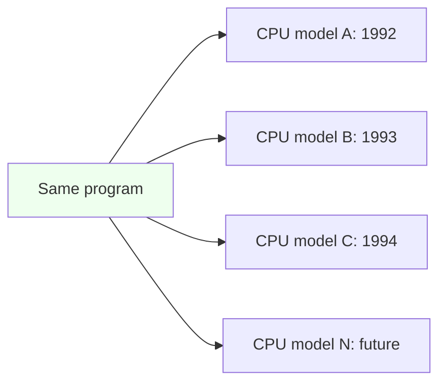

In 1991, a small team inside **Sun Microsystems** set up a secret
project, code-named **Green**. The goal had nothing to do with
enterprise software or the web. The goal was to build software for
**consumer electronics** — TVs, set-top boxes, smart toasters, the
"interactive devices" that everybody in Silicon Valley thought were
about to take over the living room.

The team was led by a Canadian computer scientist named
**James Gosling**.

<svg
  viewBox="0 0 640 220"
  role="img"
  aria-label="A TV, a toaster, and a remote control on one shelf, each carrying the same small green chip joined by a dotted thread — the secret Green project writing software for everyday devices"
  style={{ display: "block", width: "100%", maxWidth: "640px", height: "auto", margin: "2.5rem auto" }}
>
  <g fill="currentColor" opacity="0.15">
    <rect x="80" y="190" width="480" height="4" rx="2" />
  </g>
  <g style={{ color: "var(--ds-blue-500)" }} fill="currentColor">
    <rect x="110" y="70" width="120" height="84" rx="10" fillOpacity="0.25" />
    <rect x="122" y="82" width="96" height="60" rx="6" fillOpacity="0.45" />
    <polygon points="138,154 148,154 132,186 122,186" fillOpacity="0.4" />
    <polygon points="192,154 202,154 218,186 208,186" fillOpacity="0.4" />
  </g>
  <g style={{ color: "var(--ds-yellow-500)" }} fill="currentColor">
    <rect x="280" y="118" width="110" height="66" rx="16" fillOpacity="0.4" />
    <rect x="394" y="134" width="8" height="18" rx="3" fillOpacity="0.8" />
  </g>
  <g fill="currentColor" opacity="0.3">
    <rect x="298" y="108" width="26" height="12" rx="4" />
    <rect x="336" y="108" width="26" height="12" rx="4" />
  </g>
  <g style={{ color: "var(--ds-blue-500)" }} fill="currentColor">
    <rect x="470" y="96" width="44" height="92" rx="12" fillOpacity="0.3" />
  </g>
  <g fill="currentColor" opacity="0.4">
    <circle cx="484" cy="116" r="5" />
    <circle cx="500" cy="116" r="5" />
    <circle cx="484" cy="134" r="5" />
    <circle cx="500" cy="134" r="5" />
  </g>
  <g style={{ color: "var(--ds-green-500)" }} fill="currentColor">
    <rect x="158" y="104" width="16" height="16" rx="3" />
    <rect x="322" y="142" width="16" height="16" rx="3" />
    <rect x="484" y="154" width="16" height="16" rx="3" />
  </g>
  <g style={{ color: "var(--ds-green-500)" }} fill="currentColor">
    <circle cx="244" cy="150" r="3" fillOpacity="0.45" />
    <circle cx="262" cy="150" r="3" fillOpacity="0.45" />
    <circle cx="404" cy="162" r="3" fillOpacity="0.45" />
    <circle cx="424" cy="162" r="3" fillOpacity="0.45" />
    <circle cx="444" cy="162" r="3" fillOpacity="0.45" />
  </g>
</svg>

## The toaster problem

Consumer electronics had a peculiar property. Every device used a
different microchip. One year a TV would ship with one CPU; the next
year, with a different one, because the manufacturer found a cheaper
chip. If you wrote your TV software in C++ for the first chip, you
would have to recompile, retest, and frequently rewrite it for the
second one. For a company that wanted to ship millions of devices,
this was unacceptable.

Gosling's team needed a language whose programs would **outlive the
chip** they were written for.

They also needed the language to be:

- **Reliable** — if your toaster crashes you can't ship the user a
  debugger.
- **Small** — embedded chips have little memory.
- **Safe** — a bug must not allow the toaster to set itself on fire,
  or download malware.

## Why not C++?

The team genuinely tried to use C++ at first. Gosling has told the
story in interviews: he kept patching C++ to make it more portable
and more memory-safe, and eventually concluded he had been *building
a new language by accident*. So he embraced the inevitable and built
one from scratch.

The language was first called **Oak**, after a tree outside Gosling's
office window. They later renamed it **Java**, supposedly after a
coffee shop the team frequented. (The lawyers had also found that
"Oak" was already trademarked.)

## What Gosling kept, what he removed

Gosling was deeply familiar with C and C++, and many design decisions
in Java are best understood as a direct reaction to them.

| Idea | C++ | Java |
| --- | --- | --- |
| Manual memory management | Yes — `new`/`delete` | **No** — automatic garbage collection |
| Pointer arithmetic | Yes | **Removed** — too dangerous |
| Multiple inheritance | Yes | **Removed** — too confusing; replaced by interfaces |
| Operator overloading | Yes | **Removed** — too easy to abuse |
| Compiled to machine code? | Yes | **No** — compiled to *bytecode* |
| Same program runs everywhere? | Theoretically | **Yes**, by design |
| Strong typing | Mostly | **Strict**, enforced |
| Classes | Optional (you can write C-style) | **Mandatory** — every value lives inside a class |

The pattern is clear. Gosling kept the *shape* of C-family syntax so
existing programmers would feel at home, but he ripped out every
feature that, in his experience, had been the source of catastrophic
production bugs.

This conservatism is the reason Java looks "boring" to fans of
exotic languages. It is also exactly why Java still runs banks,
airlines, and stock exchanges thirty years later.

In short, what Gosling kept and what he threw away:

| Kept | Removed |
| --- | --- |
| C-style syntax | Pointer arithmetic |
| Classes / OOP | Manual memory management |
| Strong typing | Multiple inheritance |
| Threads | Operator overloading |

<MultipleChoice
  markdown={`What was Java originally designed for?

- Building web pages
  > Web use came later, by happy accident.
- Scientific computing
  > That was FORTRAN's strength.
- [o] Programming consumer electronics devices like TVs and set-top boxes
  > The Green project's original target was embedded devices.
- Database servers
  > Java would later dominate this space, but it was not the original target.`}
/>

## The pivot to the web

The consumer electronics market did not take off the way Sun
expected. The smart TV revolution would take another twenty years.
But around 1994 the team noticed something interesting: the *exact
same* properties that made Java good for toasters — small,
portable, sandboxed, safe — were *exactly* what was needed for the
brand-new World Wide Web.

In 1995, Sun released Java publicly and built a special browser
called **HotJava** that could run little Java programs called
**applets** embedded in web pages. Netscape, the dominant browser of
the day, quickly added support too.

For the first time in history, you could click a link and run a
*program* — not just see a static page. People had never seen
anything like it.

## The marketing slogan that mattered

Sun promoted Java with a single slogan that captured the entire
ambition of the project:

> **Write once, run anywhere.**

It was, of course, a simplification. (Programmers later joked it was
"write once, debug everywhere.") But it captured a real technical
achievement: for the first time, a serious mainstream language
genuinely *did* let you compile your code once and run the same
binary on dramatically different machines.

The next page is about how that worked. It is the single most
important idea in the rest of this course.

<MultipleChoice
  markdown={`Which of these C++ features did Gosling deliberately remove from Java?

- Classes
  > Java *kept* classes — and made them mandatory.
- Functions
  > Java has methods, which are essentially functions inside classes.
- [o] Manual memory management with explicit \`new\` and \`delete\`
  > Java introduced automatic garbage collection.
- Strong typing
  > Java has *stricter* typing than C++, not weaker.`}
/>

<MultipleChoice
  markdown={`Why does Java look superficially similar to C and C++?

- Because they all run on the JVM
  > C and C++ do not run on the JVM.
- Because they are all interpreted languages
  > C and C++ are compiled to machine code, not interpreted.
- [o] Because Gosling kept C-family syntax on purpose so existing C/C++ programmers would feel at home
  > Surface familiarity was a deliberate adoption strategy.
- Because all programming languages look the same
  > They very much do not.`}
/>
