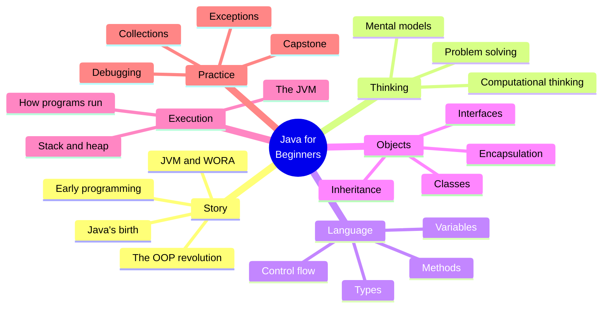

Welcome to **Java Programming for Beginners**, a course designed for
people who have never written a line of code — or who have tried, and
felt completely lost about what is actually happening inside the
machine.

This is not a course about memorizing Java syntax. This is a course
about **learning to think like a programmer**, with Java as the
language we happen to speak while we do it.

By the end you should be able to:

- Read a problem written in English and turn it into a working program.
- Picture in your head what a program is doing while it runs.
- Understand *why* concepts like variables, classes, objects,
  inheritance, and exceptions exist — not just how to type them.
- Organize a small program across many files in a way that other
  humans (including future-you) can understand.
- Talk about software systems using the right mental model, so you
  can pick up new languages and frameworks much faster afterwards.

## Why Java?

Java is one of the most influential programming languages ever
created. It is used in banks, hospitals, government, Android phones,
huge backend systems at Google and Amazon, and almost every computer
science program in the world. If you understand Java, you will be
prepared to read and reason about an enormous amount of real software.

But more importantly: Java *forces* you to be explicit. Every value
has a clearly named type. Every method belongs to a class. Every
program runs on a virtual machine that you can reason about. These
constraints feel strict at first, but they are *exactly* what makes
Java such an excellent teaching language — there is nowhere for ideas
to hide.

## How this course is structured

The course begins with a **story**. Before we write any code, you
will learn how programming languages came to exist, what problems
they were invented to solve, and how Java in particular emerged from
a crisis in the software industry. This story is not decoration. It
will give you a permanent intuition for *why* programs look the way
they do.

After the story we move into **thinking** — computational thinking,
problem solving, and the habits a programmer develops over time.

Only then do we open Java itself. We learn variables, types, control
flow, and methods, with constant reference to **what is happening in
memory**. Then we meet objects and classes, the central ideas of
modern software design. After that we look under the hood — how the
**Java Virtual Machine** turns your code into running behavior — and
we round out the course with data organization, exceptions,
debugging, basic algorithms, and a small capstone project.

## How to use this site

Every page mixes narrative prose with three interactive widgets.

1. **Executable Java code blocks.** Each block is compiled by `javac`
   and run on the JVM inside your browser via **CheerpJ**. The first
   run in a session is slow because the JVM has to boot; subsequent
   runs are fast.
2. **Multi-file challenge cards.** Real programs live in many files.
   You will see workspaces with several `.java` files side by side
   and fill in the missing parts; automated tests check your work.
3. **Multiple-choice questions.** Short single-answer checks
   throughout each page. Each choice has an explanation, so even a
   wrong answer teaches you something.

<Callout type="info" title="Each code block is independent">
A variable, class, or method defined in one `<CodeBlock>` is **not**
visible in the next. Every example is self-contained.
</Callout>

## A tiny taste

Here is a complete Java program. Do not worry about understanding
every line — we will earn each piece of it over the next few weeks.

<CodeBlock
  adapter="java"
  starterCode={`public class Main {
  public static void main(String[] args) {
    String name = "world";
    for (int i = 1; i <= 3; i++) {
      System.out.println("Hello, " + name + "! (" + i + ")");
    }
  }
}
`}
/>

Notice three things, and then we will move on:

- The program is wrapped in a `class` called `Main`. **Every Java
  program lives inside a class.** We will learn what a class really
  is, conceptually, soon.
- The line that starts with `public static void main` is the
  *entry point* — the first thing the JVM runs.
- The output appears below the editor. That little box is the
  closest thing we have to the "voice" of your program.

When you are ready, turn the page. We are going to start a long way
from Java — back when programs were punched into paper cards.
