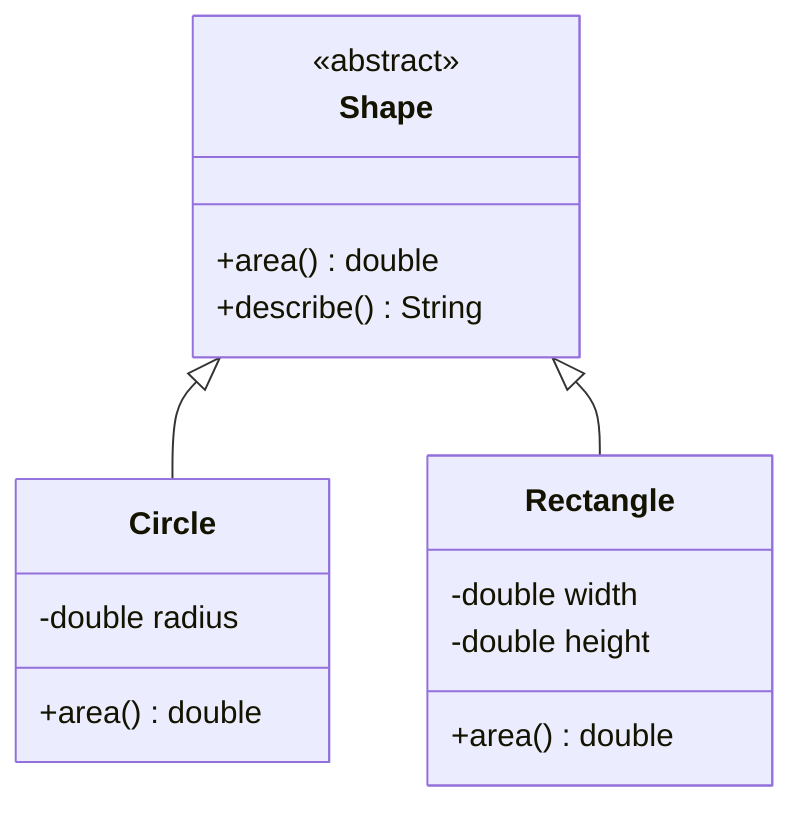

So far each of our classes has stood alone. But many real-world
modeling problems involve **families** of related things: shapes,
employees, accounts, vehicles, events. Java lets one class *extend*
another, inheriting its fields and methods. This is **inheritance**,
and it's one of the most powerful — and most over-used — features of
OOP.

## "Is-a" relationships

Inheritance models an **is-a** relationship. A `Dog` *is an* `Animal`.
A `SavingsAccount` *is a* `BankAccount`. A `Circle` *is a* `Shape`.

If you cannot honestly say "X *is a* Y" in plain English, do not
use inheritance to connect them.



The arrow with the open triangle means "extends." `Circle` and
`Rectangle` are both `Shape`s.

## A first inheritance example

<CodeBlock
  adapter="java"
  entryFilename="Main.java"
  files={[
    {
      filename: "Main.java",
      initialContent: `public class Main {
    public static void main(String[] args) {
        Shape[] shapes = {
            new Circle(2.0),
            new Rectangle(3.0, 4.0),
            new Circle(1.0),
        };

        for (Shape s : shapes) {
            System.out.println(s.describe());
        }
    }
}
`,
    },
    {
      filename: "Shape.java",
      initialContent: `public abstract class Shape {
    public abstract double area();

    public String describe() {
        return getClass().getSimpleName() + " with area " + area();
    }
}
`,
    },
    {
      filename: "Circle.java",
      initialContent: `public class Circle extends Shape {
    private final double radius;

    public Circle(double radius) {
        this.radius = radius;
    }

    @Override
    public double area() {
        return Math.PI * radius * radius;
    }
}
`,
    },
    {
      filename: "Rectangle.java",
      initialContent: `public class Rectangle extends Shape {
    private final double width;
    private final double height;

    public Rectangle(double width, double height) {
        this.width = width;
        this.height = height;
    }

    @Override
    public double area() {
        return width * height;
    }
}
`,
    },
  ]}
/>

Run it. The single `for` loop prints information about three
different concrete shapes, even though the loop never says the words
`Circle` or `Rectangle`. That is **polymorphism** — the same call
(`s.describe()`) does different things depending on the *actual*
object behind the reference.

## How polymorphism actually works

Each object remembers what class it is. When you write `s.area()`,
the JVM looks at the runtime class of `s` (not the declared type of
the variable) and dispatches to *that* class's `area`. This is
**dynamic dispatch**.

```mermaid
sequenceDiagram
    participant Loop as for loop
    participant JVM
    participant C as Circle area
    participant R as Rectangle area
    Loop->>JVM: s.area() — s is a Circle
    JVM->>C: invoke Circle.area
    C-->>JVM: 12.566
    JVM-->>Loop: 12.566

    Loop->>JVM: s.area() — s is a Rectangle
    JVM->>R: invoke Rectangle.area
    R-->>JVM: 12.0
    JVM-->>Loop: 12.0
```

This is the mechanism that lets *new* shape classes be added later
*without changing any of the code in `Main`*. As long as a new class
`extends Shape` and overrides `area`, the loop works. That property
— "code written today keeps working as new types are added
tomorrow" — is the chief reason polymorphism exists.

## `abstract` classes and `abstract` methods

In the example, `Shape` is `abstract`. That means:

- You cannot do `new Shape()` directly. (What would its area be?)
- `Shape` may declare `abstract` methods (like `area()`) that have
  no body and *must* be implemented by every non-abstract subclass.
- `Shape` may also have concrete methods (like `describe()`) that
  use the abstract ones.

`abstract` is the language's way of saying: "this class is
incomplete on its own; it exists to be extended."

## `super` and overriding

A subclass can call a superclass method via `super.method(...)`,
and can call a superclass constructor via `super(...)` as the
**first** line of its own constructor.

<CodeBlock
  adapter="java"
  entryFilename="Main.java"
  files={[
    {
      filename: "Main.java",
      initialContent: `public class Main {
    public static void main(String[] args) {
        Employee e = new Employee("Ada", 50000);
        Manager  m = new Manager("Grace", 80000, 10);
        System.out.println(e.describe());
        System.out.println(m.describe());
    }
}
`,
    },
    {
      filename: "Employee.java",
      initialContent: `public class Employee {
    protected final String name;
    protected final int    salary;

    public Employee(String name, int salary) {
        this.name = name;
        this.salary = salary;
    }

    public String describe() {
        return name + " (salary " + salary + ")";
    }
}
`,
    },
    {
      filename: "Manager.java",
      initialContent: `public class Manager extends Employee {
    private final int reports;

    public Manager(String name, int salary, int reports) {
        super(name, salary);            // must be the first line
        this.reports = reports;
    }

    @Override
    public String describe() {
        return super.describe() + " managing " + reports + " people";
    }
}
`,
    },
  ]}
/>

`super.describe()` says "do whatever the parent class would
do, and let me add to it."

The `@Override` annotation isn't required, but **always** use it. It
asks the compiler to check that you really are overriding a method
in a parent class. If you misspell the method name (`describ()`
instead of `describe()`), the compiler will flag it instead of
silently treating it as a *new* unrelated method.

## When inheritance is the wrong tool

Inheritance is a *very strong* coupling between two classes. The
child knows about the parent's fields. The child can be broken by
changes to the parent. The child *cannot* easily change parents
later.

A good rule: **prefer composition over inheritance**. If `Car`
*has-a* `Engine`, that is composition (a field of type `Engine`), not
inheritance. Inherit only when the "is-a" relationship is genuine,
permanent, and substitutive — meaning anywhere a `Shape` is expected,
a `Circle` works correctly.

Common red flags that you should *not* be using inheritance:

- The subclass overrides almost every method to do something
  unrelated.
- The subclass needs to throw "unsupported operation" exceptions
  because the parent's contract doesn't fit.
- You wrote `extends` just to reuse one method.

<MultipleChoice
  markdown={`What does polymorphism let you do?

- Convert one type into another at compile time
  > That's casting, not polymorphism.
- Allocate less memory for subclasses
  > Memory layout is unrelated.
- [o] Call the same method on different objects and have each respond in its own way, decided at runtime
  > Correct. That's exactly dynamic dispatch.
- Write a class without any methods
  > Not what polymorphism means.`}
/>

<MultipleChoice
  markdown={`Which is the *best* signal that inheritance is appropriate between two classes?

- They share a few fields
  > Sharing fields can also be done via composition.
- They sound related in English
  > Too loose a criterion.
- [o] Every instance of the child class genuinely *is a* legitimate instance of the parent and can be used wherever the parent is expected
  > Correct — this is the Liskov substitution intuition.
- The child wants to reuse one helper method from the parent
  > Reuse alone is not enough — use composition instead.`}
/>

<MultipleChoice
  markdown={`Why is the \`@Override\` annotation valuable?

- It makes the override happen
  > The override happens whether or not you annotate it.
- [o] It tells the compiler "this method is supposed to override a parent's method," so a typo or signature mismatch becomes a compile error instead of a silently-new method
  > Correct.
- It marks the method as final
  > That's \`final\`, not \`@Override\`.
- It improves runtime performance
  > It has no runtime effect.`}
/>

## A small polymorphism challenge

<ChallengeCard
  adapter="java"
  title="Speak, animals"
  instructions={`Create a class hierarchy:

- An abstract class \`Animal\` with a method \`String speak()\` (abstract) and a method \`String greet()\` that returns \`"Hello, I say " + speak()\`.
- A class \`Dog extends Animal\` whose \`speak()\` returns \`"Woof!"\`.
- A class \`Cat extends Animal\` whose \`speak()\` returns \`"Meow."\`.

\`Main.java\` is given and must print exactly:

\`\`\`
Hello, I say Woof!
Hello, I say Meow.
\`\`\``}
  entryFilename="Main.java"
  files={[
    {
      filename: "Main.java",
      initialContent: `public class Main {
    public static void main(String[] args) {
        Animal[] zoo = { new Dog(), new Cat() };
        for (Animal a : zoo) {
            System.out.println(a.greet());
        }
    }
}
`,
    },
    {
      filename: "Animal.java",
      initialContent: `public abstract class Animal {
    // TODO: declare speak() abstract
    // TODO: implement greet()
}
`,
      solutionContent: `public abstract class Animal {
    public abstract String speak();

    public String greet() {
        return "Hello, I say " + speak();
    }
}
`,
    },
    {
      filename: "Dog.java",
      initialContent: `public class Dog extends Animal {
    // TODO
}
`,
      solutionContent: `public class Dog extends Animal {
    @Override
    public String speak() {
        return "Woof!";
    }
}
`,
    },
    {
      filename: "Cat.java",
      initialContent: `public class Cat extends Animal {
    // TODO
}
`,
      solutionContent: `public class Cat extends Animal {
    @Override
    public String speak() {
        return "Meow.";
    }
}
`,
    },
  ]}
  tests={[
    {
      id: "zoo",
      name: "Polymorphic greet()",
      expect: {
        stdoutLines: [
          "Hello, I say Woof!",
          "Hello, I say Meow.",
        ],
        stdoutLinesExact: true,
      },
    },
  ]}
/>

Inheritance lets us reuse code along *is-a* lines. But Java has
another tool — **interfaces** — that captures *can-do* relationships
without the heavy coupling of `extends`. That is the next page.
