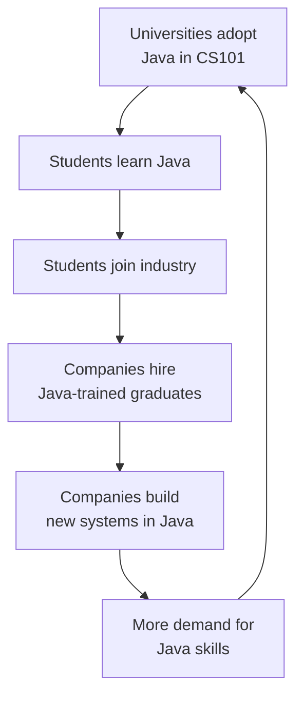

By 1997, Java was technically impressive. By 2007, it was *everywhere*.
That growth happened for reasons that go beyond the language design.
A language wins because of luck, timing, marketing, and culture, as
much as because of its features.

<svg
  viewBox="0 0 640 230"
  role="img"
  aria-label="A heavy flywheel spun faster and faster by four pushes around its rim — free tools, timing, marketing, and community momentum compounding into dominance"
  style={{ display: "block", width: "100%", maxWidth: "560px", height: "auto", margin: "2.5rem auto" }}
>
  <g style={{ color: "var(--ds-blue-500)" }} fill="currentColor">
    <path fillRule="evenodd" d="M390 120a70 70 0 1 1-140 0 70 70 0 1 1 140 0ZM372 120a52 52 0 1 1-104 0 52 52 0 1 1 104 0Z" fillOpacity="0.3" />
    <circle cx="320" cy="120" r="12" />
    <rect x="316" y="60" width="8" height="120" rx="4" fillOpacity="0.35" transform="rotate(35 320 120)" />
    <rect x="316" y="60" width="8" height="120" rx="4" fillOpacity="0.35" transform="rotate(125 320 120)" />
  </g>
  <g style={{ color: "var(--ds-green-500)" }} fill="currentColor">
    <rect x="391" y="98" width="14" height="44" rx="7" />
    <circle cx="412" cy="152" r="3" fillOpacity="0.6" />
    <circle cx="420" cy="166" r="3" fillOpacity="0.6" />
  </g>
  <g style={{ color: "var(--ds-yellow-500)" }} fill="currentColor">
    <rect x="298" y="35" width="44" height="14" rx="7" />
    <circle cx="270" cy="32" r="3" fillOpacity="0.7" />
    <circle cx="254" cy="26" r="3" fillOpacity="0.7" />
  </g>
  <g style={{ color: "var(--ds-blue-500)" }} fill="currentColor">
    <rect x="235" y="98" width="14" height="44" rx="7" fillOpacity="0.6" />
    <circle cx="228" cy="88" r="3" fillOpacity="0.5" />
    <circle cx="220" cy="74" r="3" fillOpacity="0.5" />
  </g>
  <g style={{ color: "var(--ds-green-500)" }} fill="currentColor">
    <rect x="298" y="191" width="44" height="14" rx="7" fillOpacity="0.6" />
    <circle cx="370" cy="208" r="3" fillOpacity="0.5" />
    <circle cx="386" cy="214" r="3" fillOpacity="0.5" />
  </g>
  <g fill="currentColor" opacity="0.3">
    <circle cx="401" cy="91" r="3.5" />
    <circle cx="386" cy="65" r="3.5" />
    <circle cx="363" cy="45" r="3.5" />
  </g>
  <g style={{ color: "var(--ds-blue-500)" }} fill="currentColor">
    <polygon points="352,40 334,34 342,52" fillOpacity="0.55" />
  </g>
</svg>

## Free, but corporate

Java was launched by **Sun Microsystems**, a serious hardware
company. That mattered. Hobbyist languages often die when their
creator loses interest. Java had a corporate parent willing to spend
real money to keep the JVM, the compiler, the standard library, and
the developer tools healthy. Sun gave away the entire software
development kit for free, on every major platform, while charging
for the high-end servers it ran on.

For a CTO in 1998 wondering "is this language safe to bet a
ten-year project on?", a free, well-supported, corporate-backed
language was extremely attractive. Java felt like a *grown-up*
choice in a way that, say, Perl or Tcl did not.

## A clean, teachable language

Java's deliberately restrained design — no pointer arithmetic, no
manual memory management, mandatory classes, strict typing — made it
an ideal first language for university courses. There were fewer
weird footguns to explain. The same `Hello World` example worked the
same on a student's laptop and on the professor's office machine.

In the early 2000s, university after university switched their
introductory computer science course to Java. The **College Board**
made Java the official language of the **AP Computer Science** exam
in 2003. Once a generation of students grew up writing Java, those
students went into industry and naturally wrote Java there too.

This is a self-reinforcing loop, and it is the deepest reason Java is
still the most-taught language on the planet.

## Enterprise loved Java for very specific reasons

Beyond schools, large companies adopted Java aggressively in the
early 2000s, for reasons that line up cleanly with the pains we have
already discussed.

| Enterprise pain | Java answer |
| --- | --- |
| "Our developers crash production with bad memory management." | Garbage collection — no `delete` to forget. |
| "Code we write today must run on hardware we have not bought yet." | Bytecode + JVM — recompile not required. |
| "Our codebase will outlive any single developer." | Strict typing, clean OOP, mandatory class structure — easy for newcomers to read. |
| "We need a single language across desktop, server, and embedded." | Java ran on all three. |
| "We need a huge standard library so we are not writing string functions from scratch." | The Java Class Library shipped with everything. |

By the late 1990s, **Sun, IBM, Oracle, and BEA** had built an entire
"enterprise Java" ecosystem (J2EE, later Java EE, now Jakarta EE) on
top of plain Java. This was, for a long time, the standard way to
build banking, insurance, and government back-office systems.

## Android, the second wave

In 2008 something happened that nobody at Sun had predicted. Google
launched **Android**, a brand-new mobile operating system, and chose
Java as its application programming language. Suddenly *every Android
app on Earth* was a Java program. Hundreds of thousands of new
developers learned Java specifically to write apps. (Android did not
use Sun's JVM; it had its own bytecode and VM, but the language at
the top was Java.)

This was a huge second wave of adoption, well after Java had peaked
once on the server. Today Kotlin has largely replaced Java for new
Android apps — but Kotlin runs on the JVM, so the underlying skill
transfers cleanly.

<MultipleChoice
  markdown={`Why was Java attractive to large enterprises in the late 1990s?

- Because it was the fastest language available
  > It was fast, but not the fastest.
- Because it could be combined with COBOL in the same source file
  > It could not.
- [o] Because it was portable across platforms, garbage-collected, strongly typed, and supported by a major hardware vendor
  > Several pragmatic advantages combined to make Java a safe long-term bet.
- Because it was the cheapest language to license
  > It was free, but so were many others.`}
/>

<MultipleChoice
  markdown={`Why is Java such a common choice as a *first* programming language in universities?

- Because it is the simplest language to write small programs in
  > Languages like Python are arguably simpler for very small programs.
- [o] Because its strict structure (mandatory classes, strong typing, simple memory model) forces students to learn programming concepts clearly without too many language footguns
  > Java is *explicit*, which is pedagogically useful.
- Because the JVM is required for the AP exam
  > The AP exam uses Java, not the other way around.
- Because Java is required by law in many countries
  > It is not.`}
/>

## What "winning" looks like, concretely

Today, in 2026:

- Java is consistently in the top 3 most-used programming languages
  in industry surveys (TIOBE, Stack Overflow, GitHub Octoverse).
- Most of the world's banks, airlines, telcos, and government
  back-office systems run on the JVM.
- Big companies like Netflix, Amazon, Google, LinkedIn, Uber, and
  Twitter have giant Java (and JVM-language) codebases.
- Android's runtime, plus Kotlin and Scala, mean the JVM is the
  underlying platform for an enormous fraction of mobile and
  data-engineering software.

You are not learning a hobby language. You are learning *the* lingua
franca of the modern serious-software world.

## The thing nobody tells beginners

Java has a reputation, in some circles, of being "old" or "boring."
This is a strange critique, because what people usually mean by it
is: *Java is what serious companies use to build software that has
to work.* That is supposed to be a compliment.

It is true that Java is conservative. Features arrive slowly, and
each one is carefully thought through. But the upside is that Java
programs written in 2002 still compile and run in 2026, and skills
you learn here will be relevant for decades. Few technology
investments hold their value that well.

Next we will see *how* Java itself evolved over those decades — from
tiny applets to enormous backend systems.
