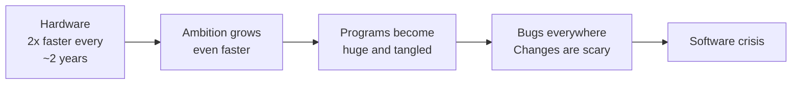
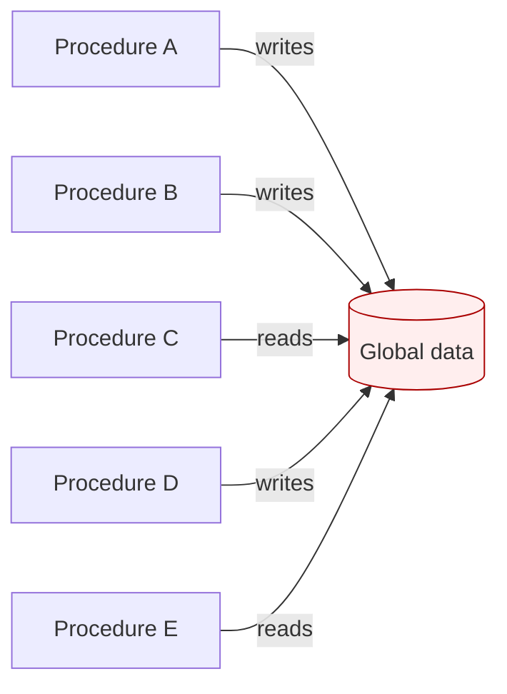
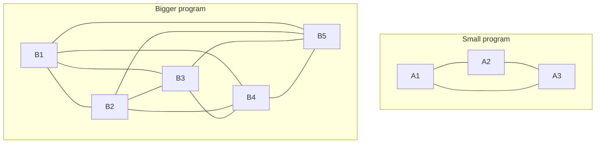

By the late 1960s something strange was happening in the software
industry. Hardware was getting dramatically more powerful every
couple of years. But the *programs* people wanted to build were
growing even faster. Payroll systems for entire countries. Banking
systems with thousands of branches. The flight software for the
Apollo missions. Air traffic control.

And those programs were *failing*. Not occasionally — chronically.

## The software crisis

In 1968 a NATO-sponsored conference in Garmisch, Germany coined the
phrase **software crisis**. The problem they described was
remarkable:

- Projects were routinely delivered years late and far over budget.
- Programs that *did* ship were full of bugs.
- Nobody could read, modify, or maintain large programs — including
  the people who originally wrote them.
- Adding more programmers to a late project usually made it *later*.

It was no longer enough to know how to write instructions. The
profession of "software engineer" was being invented in real time, in
response to a real disaster.

## Why procedural programs got tangled

Procedural programming gave us procedures and global data. As
programs grew to hundreds of thousands of lines, two specific
patterns of pain emerged.

### 1. Global state

Many procedural programs kept their data in **global variables** —
variables that any procedure anywhere could read or write. In a tiny
program this is fine. In a 200,000-line program it is a nightmare. A
bug in one corner of the program could silently corrupt data, and
hours later, on the other side of the codebase, a *completely
unrelated* feature would crash because of it.

Try to imagine debugging: if `C` reads a wrong value, *who corrupted
it?* `A`? `B`? `D`? Any of them, at any time.

### 2. No grouping of "data + behavior"

In a procedural program, the data for a "bank account" might be in
one place (an array of numbers and strings) and the procedures that
worked on bank accounts in another. Nothing forced the rule "only
account-related code may touch account data." A new programmer could
easily write code that bypassed the official procedures and just
edited the numbers directly. Now there are *two* sets of rules — the
official one in the procedures and the unofficial one in whoever
wrote the shortcut.

This is sometimes called the **maintenance problem**: a program is
*easy* to write but *very hard* to change without breaking it.

<MultipleChoice
  markdown={`What was the central observation of the 1968 NATO conference on the "software crisis"?

- That computers were too slow to run real programs
  > Hardware was actually improving very quickly.
- [o] That building large software systems was much harder than anyone had expected, and existing techniques did not scale
  > Big programs were collapsing under their own weight.
- That programmers were not paid enough
  > Compensation was not the issue named at the conference.
- That assembly language was about to disappear
  > Assembly was alive and well; the issue was managing complexity, not language choice.`}
/>

## Complexity grows faster than size

Here is the part that surprises beginners. If you double the number
of lines in a program, you do **not** double the complexity. You
typically *square* it.

Why? Because each new piece of code interacts with the pieces around
it. In a 100-line program there might be 50 interesting interactions.
In a 200-line program there might be 200. In a 10,000-line program
there are millions of interactions a human is supposed to keep
straight in their head.

This is the deepest reason why we need ideas like **abstraction**,
**encapsulation**, and **modularity** — the topics this course is
ultimately about. They are tools for *limiting* the number of
interactions a human has to think about at any one time.

## The cry for help

By the 1970s, the smartest people in the field were searching for new
ways to organize code. They tried *structured programming* (no more
spaghetti `goto` statements). They tried *modular programming* (group
related procedures and data into "modules"). They tried *abstract
data types* (hide the implementation behind a clean interface).

All of these were genuine improvements. But the breakthrough idea —
the one that would eventually make Java possible — was different and
more radical. It said: *the unit of a program should not be a
procedure or a module. It should be an **object**.*

That is the next page.

<MultipleChoice
  markdown={`Why is *global mutable data* especially problematic in large procedural programs?

- It uses too much memory
  > Memory usage is not the central issue.
- [o] Any procedure anywhere can change it, so when something goes wrong it is very hard to know who is responsible
  > The lack of ownership makes bugs nearly impossible to track down.
- The compiler cannot generate code for global variables
  > Compilers handle global variables fine.
- It cannot store strings, only numbers
  > Storage type is not the issue.`}
/>

<MultipleChoice
  markdown={`What does "complexity grows faster than size" mean for a programmer?

- That programs always run more slowly the larger they get
  > Speed and complexity are separate concerns.
- [o] That every new piece of code interacts with the existing code, so the effort to keep everything correct grows non-linearly
  > This is why we need techniques that *limit* interactions, not just techniques that let us write more lines.
- That long programs are impossible to write
  > They are possible, but they require deliberate techniques.
- That you should never write more than 1000 lines of code
  > There is no magic line count.`}
/>
