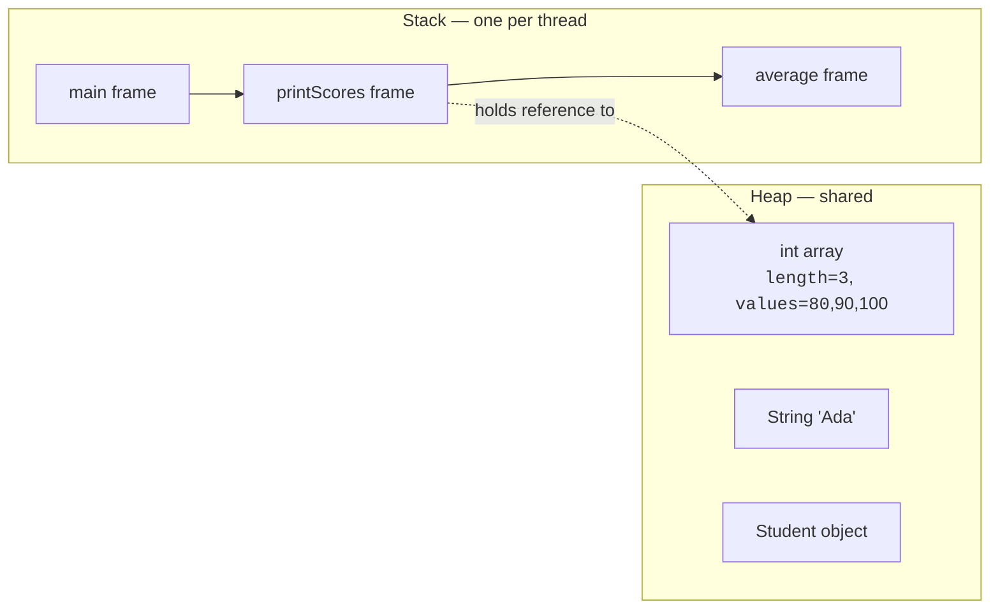
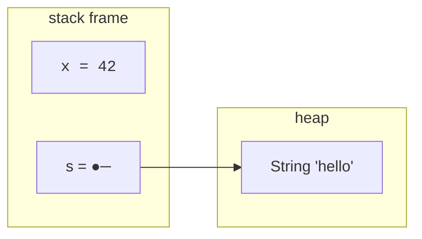
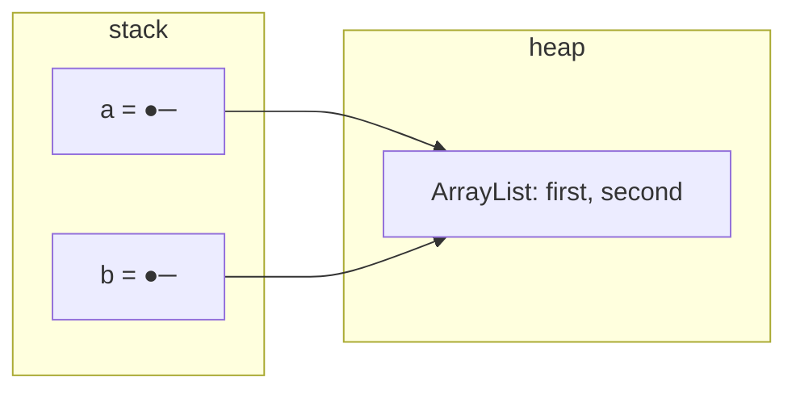
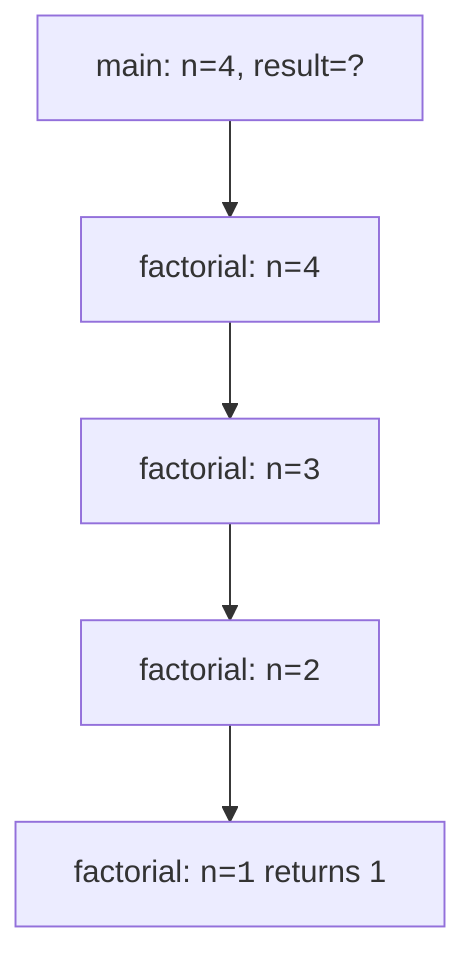
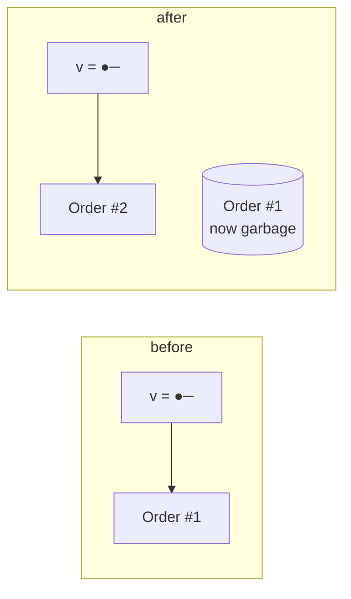

You can write Java for years without thinking about memory. But the
*moment* you hit a tricky bug — a `NullPointerException`, an
unexpected shared mutation, a stack overflow — a mental model of
the **stack** and the **heap** turns confusion into clarity.

<svg
  viewBox="0 0 640 240"
  role="img"
  aria-label="A tidy column of stacked frames holds small values that tether out by dotted lines to free-floating green shapes on the heap, while one shape with no tether quietly fades — stack, heap, and reachability"
  style={{ display: "block", width: "100%", maxWidth: "640px", height: "auto", margin: "2.5rem auto" }}
>
  <g style={{ color: "var(--ds-blue-500)" }} fill="currentColor">
    <rect x="110" y="150" width="150" height="34" rx="8" fillOpacity="0.18" />
    <rect x="110" y="114" width="150" height="34" rx="8" fillOpacity="0.26" />
    <rect x="110" y="78" width="150" height="34" rx="8" fillOpacity="0.34" />
    <rect x="110" y="42" width="150" height="34" rx="8" fillOpacity="0.45" />
    <circle cx="140" cy="59" r="5" />
    <circle cx="166" cy="59" r="5" />
    <circle cx="140" cy="95" r="5" />
    <circle cx="140" cy="131" r="5" />
    <circle cx="166" cy="131" r="5" />
    <circle cx="140" cy="167" r="5" />
  </g>
  <g style={{ color: "var(--ds-green-500)" }} fill="currentColor">
    <circle cx="196" cy="59" r="5" />
    <circle cx="196" cy="131" r="5" />
    <circle cx="420" cy="80" r="30" fillOpacity="0.4" />
    <rect x="490" y="150" width="70" height="44" rx="20" fillOpacity="0.35" />
    <circle cx="540" cy="70" r="20" fillOpacity="0.3" />
  </g>
  <g fill="currentColor" opacity="0.3">
    <circle cx="236" cy="62" r="3" />
    <circle cx="276" cy="66" r="3" />
    <circle cx="316" cy="70" r="3" />
    <circle cx="356" cy="74" r="3" />
    <circle cx="390" cy="77" r="3" />
    <circle cx="244" cy="134" r="3" />
    <circle cx="292" cy="139" r="3" />
    <circle cx="340" cy="143" r="3" />
    <circle cx="388" cy="147" r="3" />
    <circle cx="436" cy="149" r="3" />
    <circle cx="464" cy="151" r="3" />
    <circle cx="458" cy="76" r="3" />
    <circle cx="492" cy="72" r="3" />
  </g>
  <g fill="currentColor" opacity="0.15">
    <circle cx="430" cy="184" r="16" />
    <circle cx="462" cy="200" r="3" />
    <circle cx="474" cy="210" r="2.5" />
  </g>
  <g fill="currentColor" opacity="0.2">
    <rect x="104" y="188" width="162" height="5" rx="2.5" />
  </g>
</svg>

## The two regions, side by side



- **Stack:** holds method *call frames*. Each frame contains the
  parameters and local variables of one call. Strictly
  last-in-first-out: when a method returns, its frame disappears.
- **Heap:** holds objects. Every `new` allocates here. Objects
  outlive the method that created them, as long as *some* reference
  still points at them.

## Primitives live on the stack; objects live on the heap

When you write:

```java
int    x = 42;
String s = "hello";
```

- `x` is a *primitive* `int`. Its 4 bytes sit directly inside the
  current stack frame.
- `s` is a *reference variable*. Inside the frame it holds an
  arrow (a memory address). The `"hello"` `String` object itself
  lives on the heap.



Two different variables can hold *the same arrow* — they then refer
to the *same* heap object. That is **aliasing**, and it is the
single most important thing to picture about heap memory.

## Aliasing demonstrated

<CodeBlock
  adapter="java"
  files={[
    {
      filename: "main.java",
      starterCode: `import java.util.ArrayList;
import java.util.List;

public class Main {
  public static void main(String[] args) {
    List<String> a = new ArrayList<>();
    a.add("first");

    List<String> b = a; // b and a are the SAME list
    b.add("second");

    System.out.println("a = " + a); // prints both
    System.out.println("b = " + b); // prints both
    System.out.println("same? " + (a == b));
  }
}
`,
    },
  ]}
/>

`b = a` did **not** copy the list. It copied the *reference*. Now
`a` and `b` both point at the *same* heap object. Adding via `b`
shows up via `a`.



## What happens during a method call

Every method call pushes a fresh frame onto the stack. Every return
pops it. Watch what happens here:

<CodeBlock
  adapter="java"
  files={[
    {
      filename: "main.java",
      starterCode: `public class Main {
  public static void main(String[] args) {
    int n = 4;
    long result = factorial(n);
    System.out.println(n + "! = " + result);
  }

  static long factorial(int n) {
    if (n <= 1)
      return 1;
    return n * factorial(n - 1);
  }
}
`,
    },
  ]}
/>

Calling `factorial(4)` builds up a stack of frames:



Each frame has *its own* `n`. They do not interfere with each
other. As each call returns, its frame is destroyed and its locals
disappear. This is why recursion works at all.

If recursion goes too deep, the stack runs out of room and you get
`StackOverflowError`. Try removing the base case sometime — you'll
see it instantly.

## Pass-by-value, always

Java is **always pass-by-value**. What gets copied depends on the
type:

- For a primitive parameter, the *value* is copied. Changing it
  inside the method does not affect the caller's variable.
- For a reference parameter, the *reference* is copied. The method
  gets its own arrow pointing at the *same* object. Mutating the
  object affects what the caller sees, but reassigning the
  parameter does *not* change the caller's variable.

<CodeBlock
  adapter="java"
  entryFilename="Main.java"
  files={[
    {
      filename: "Main.java",
      starterCode: `import java.util.ArrayList;
import java.util.List;

public class Main {
  public static void main(String[] args) {
    int n = 5;
    bumpPrimitive(n);
    System.out.println("after bumpPrimitive: n = " + n);

    List<String> items = new ArrayList<>();
    items.add("a");
    mutate(items); // changes the object
    System.out.println("after mutate: items = " + items);

    replace(items); // does NOT replace caller's variable
    System.out.println("after replace: items = " + items);
  }

  static void bumpPrimitive(int x) {
    x = x + 100; // local x changes; caller unaffected
  }

  static void mutate(List<String> list) {
    list.add("b"); // same object → caller sees change
  }

  static void replace(List<String> list) {
    list = new ArrayList<>(); // local reassign; caller unaffected
    list.add("hidden");
  }
}
`,
    },
  ]}
/>

Expected output:

```
after bumpPrimitive: n = 5
after mutate: items = [a, b]
after replace: items = [a, b]
```

The mental picture: every parameter is an *arrow drawn fresh* inside
the new frame. Pointing it somewhere new does not affect the
caller's arrow. Modifying the *target* of the arrow does.

## When does heap memory get freed?

When no live reference points at an object, it becomes
**unreachable** — and eventually, the garbage collector reclaims
the space. You almost never think about this directly. You just
stop holding references to things you no longer need (often by
letting variables go out of scope, or by reassigning fields).



After `v = new Order(2);`, the original `Order #1` has no incoming
arrows. It will be collected on a future GC pass.

## Two famous bugs explained

### `NullPointerException`

A reference variable that holds the special value `null` points to
*no* object. Dereferencing it (`x.foo()`) crashes with an `NPE`.

```java
String s = null;
System.out.println(s.length());   // NullPointerException
```

The fix: don't *use* references that may be null without checking
first, or design APIs that never return null in the first place.

### `StackOverflowError`

A method calls itself (directly or indirectly) without a base case,
pushing frames forever until the stack runs out:

```java
static void boom() { boom(); }   // StackOverflowError
```

The fix: every recursion must reach a base case.

<MultipleChoice
  markdown={`What is stored in a stack frame for a method call?

- All objects the method has ever created
  > Objects live on the heap, not in stack frames.
- [o] The method's parameters and local variables, including primitives by value and references that point to heap objects
  > A frame holds just this call's locals; the objects themselves stay on the heap.
- A copy of every object passed to the method
  > Java does not deep-copy objects on call; it copies the reference.
- The bytecode of the method
  > Bytecode lives in the method area, not in a frame.`}
/>

<MultipleChoice
  markdown={`After \`List<String> b = a;\`, how many list objects exist on the heap?

- Two — \`a\` and \`b\` each point to a different list
  > No, only one list exists.
- Zero — Java doesn't allocate a list yet
  > One was already allocated when \`a\` was created.
- [o] One — \`a\` and \`b\` are two references pointing to the *same* list
  > That's aliasing.
- One, but \`b\` is an immutable copy
  > It's not a copy at all.`}
/>

<MultipleChoice
  markdown={`A method receives a parameter of type \`Order\` and then writes \`order = new Order();\` inside its body. What does the caller observe?

- The caller's variable now points to the new Order
  > No — the parameter was a *local* reference variable.
- The original Order is silently destroyed
  > Other references may still hold it.
- [o] Nothing — Java is pass-by-value; reassigning the parameter only changes the local reference inside the method, not the caller's variable
  > The parameter is the method's own copy of the arrow; repointing it leaves the caller's arrow untouched.
- A compile error
  > It compiles fine.`}
/>

You now have the mental model that unlocks everything else: stack
frames flow with calls, heap objects live until no one points at
them, and references are *arrows*, not copies. Next we leave
single-object thinking and start organizing *collections* of data.
