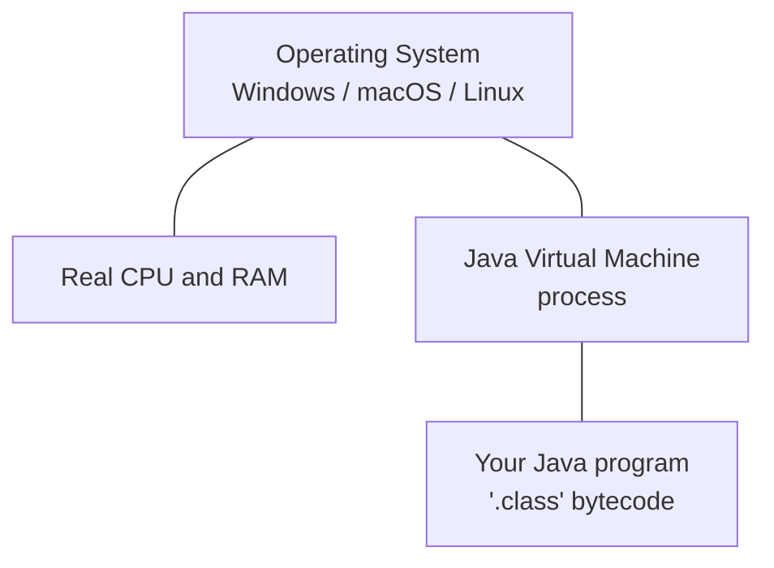
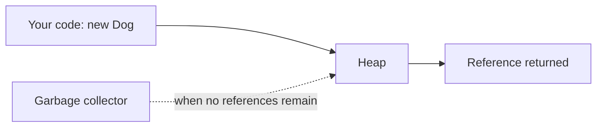
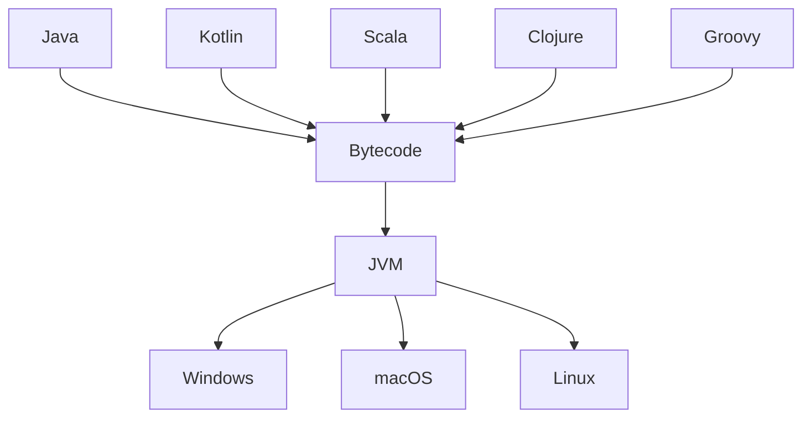

The **Java Virtual Machine** — the **JVM** — is the single most
important reason Java succeeded. It is a program that *pretends to
be a computer*. Your Java code runs inside it, on this imaginary
machine, instead of running directly on the real CPU in front of you.

That sounds inefficient, and a beginner is right to be suspicious.
The genius of the JVM is that you get the benefits of an idealized,
portable machine *without* paying a serious speed penalty most of
the time.

## What "virtual machine" means

A **virtual machine** is a program that imitates a computer. It has
its own "memory" (allocated from the real OS), its own "CPU"
instructions (bytecode), and its own rules for how programs are
allowed to behave.

The OS sees the JVM as just another program. The JVM, in turn,
provides a *simulated* environment in which your Java program runs.
Your Java program never sees the real OS or the real CPU directly —
it sees the JVM.

This indirection is what gives the JVM its powers.

## What the JVM does for you

A non-trivial amount of work that you would have to do yourself in
C or C++ is done for you, automatically, by the JVM. Each of these
deserves a moment of appreciation.

### 1. Memory management (garbage collection)

In Java, when you write `new Dog("Rex")`, the JVM finds free memory
on its **heap** and gives you a reference to a fresh `Dog` object.
When no living variable still refers to that object, the JVM's
**garbage collector** notices and reclaims the memory, in the
background, while your program is running.

You never have to call `delete`. You cannot accidentally free the
same memory twice. You cannot accidentally use memory after it has
been freed. An enormous category of bugs simply does not exist in
Java.

### 2. Bytecode verification

Before running any `.class` file, the JVM checks it. It refuses to
load code that:

- references memory or fields it should not see,
- jumps to an invalid instruction,
- tries to use a value as the wrong type,
- and many other malformed conditions.

This is the technical foundation that made it safe, in 1995, to
download a random Java applet from a website and run it in your
browser. The JVM was the trusted gatekeeper.

### 3. Just-In-Time compilation

The JVM starts by *interpreting* your bytecode — that is, executing
it one instruction at a time, like reading a recipe. This is slow but
simple.

While doing so, the JVM watches which methods are called over and
over. Those are called **hot methods**. After a while, the JVM
**recompiles** hot methods into real native machine code for your
CPU, using a JIT compiler. Now those methods run at C-like speed,
while the rest of the program — which doesn't matter much for
performance — is still interpreted.

The result: Java is often within 10-20% of C++ performance, while
remaining portable. A C++ program is fast from the first
microsecond; a Java program *warms up* over its first few seconds.

### 4. Threading and synchronization

The JVM provides a single, consistent threading model that behaves
the same on every operating system. Writing a multi-threaded program
in plain C requires very different code on Windows, Mac, and Linux.
In Java, you write `new Thread(...)` once.

### 5. A massive standard library

The JVM ships with the **Java Class Library** — thousands of
pre-written classes for working with text, numbers, dates,
collections, files, networks, security, threads, and more. Almost
nothing you commonly need is missing. We will start meeting these
classes soon.

<MultipleChoice
  markdown={`The JVM is best described as:

- The compiler that turns Java source into bytecode
  > That's \`javac\`. The JVM *runs* bytecode.
- A type of CPU made by Sun Microsystems
  > It's a *virtual* CPU, implemented in software.
- [o] A program that pretends to be a computer, executes bytecode, manages memory, and shields your code from the real OS
  > The JVM is the runtime environment for Java programs.
- A graphical environment for writing Java code
  > That would be an IDE.`}
/>

## The JVM is bigger than Java

Something wonderful happened. Other language designers looked at the
JVM and realized: *we could compile our language to bytecode too*.
The JVM doesn't actually care that the bytecode came from Java
source. It just runs valid bytecode.

So today, on top of the JVM, there is a whole family of languages:

- **Kotlin** — popular for Android and server-side, designed by
  JetBrains.
- **Scala** — blends OOP and functional programming.
- **Clojure** — a modern dialect of Lisp.
- **Groovy** — scripting and build tools.

A library written in one of these languages can be used from any of
the others. The JVM, in other words, has become an entire *platform*
— bigger than the Java language itself.

## A quick demonstration

You can see the JVM watching itself if you ask it. The program below
asks the JVM how much memory it currently has, how much it has used
so far, and how many CPUs it can see.

<CodeBlock
  adapter="java"
  initialCode={`public class Main {
    public static void main(String[] args) {
        Runtime r = Runtime.getRuntime();
        long mb = 1024 * 1024;
        System.out.println("Available processors: " + r.availableProcessors());
        System.out.println("Total memory (MB):   " + r.totalMemory() / mb);
        System.out.println("Free memory  (MB):   " + r.freeMemory()  / mb);
        System.out.println("Max memory   (MB):   " + r.maxMemory()  / mb);
    }
}
`}
/>

`Runtime.getRuntime()` is your handle on the JVM itself, from inside
your own program. We will not need it often, but it is a good
reminder that the JVM is not a mystery — it is just another piece of
software that you can ask questions of.

<MultipleChoice
  markdown={`Which of these is a *runtime* service provided by the JVM (not by your code)?

- Naming your classes
  > That's your job.
- [o] Reclaiming memory used by objects that are no longer referenced
  > The garbage collector is part of the JVM.
- Choosing which fields a class has
  > That's your job.
- Drawing windows on the screen
  > Possible via Java libraries, but not the JVM's defining job.`}
/>

<MultipleChoice
  markdown={`Why are languages like Kotlin and Scala able to use Java libraries?

- Because they are just Java with different syntax
  > They are distinct languages.
- Because the JVM auto-translates source code between languages
  > It does not.
- [o] Because they all compile to JVM bytecode, which is a shared, language-agnostic format
  > The JVM is the meeting point.
- Because Java libraries are written in those languages
  > Java libraries are written in Java.`}
/>

The JVM was a phenomenal piece of engineering. But great engineering
is not enough on its own — Java *also* arrived at the right time,
with the right marketing, and the right corporate backing. That is
how it conquered education and industry.
