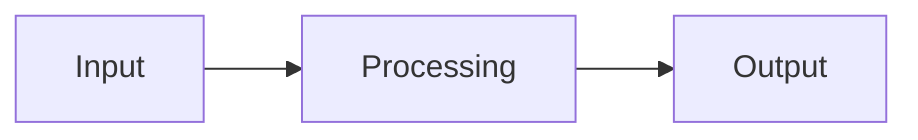

Before we write a single line of Java, let us be honest about what a
program *is*. Once that is clear, the syntax we are about to learn
will feel like a small detail by comparison.

<svg
  viewBox="0 0 640 210"
  role="img"
  aria-label="Notes on a music staff with a playhead partway across: the played notes solid, the coming notes faint — a program as a precise plan performed exactly, one instruction at a time"
  style={{ display: "block", width: "100%", maxWidth: "640px", height: "auto", margin: "2.5rem auto" }}
>
  <g fill="currentColor" opacity="0.15">
    <rect x="80" y="70" width="480" height="3" rx="1.5" />
    <rect x="80" y="92" width="480" height="3" rx="1.5" />
    <rect x="80" y="114" width="480" height="3" rx="1.5" />
    <rect x="80" y="136" width="480" height="3" rx="1.5" />
    <rect x="80" y="158" width="480" height="3" rx="1.5" />
  </g>
  <g style={{ color: "var(--ds-yellow-500)" }} fill="currentColor">
    <rect x="300" y="52" width="5" height="124" rx="2.5" fillOpacity="0.8" />
    <circle cx="302" cy="40" r="5" />
  </g>
  <g style={{ color: "var(--ds-blue-500)" }} fill="currentColor">
    <circle cx="130" cy="114" r="8" />
    <rect x="134" y="80" width="4" height="34" rx="2" />
    <circle cx="230" cy="136" r="8" />
    <rect x="234" y="102" width="4" height="34" rx="2" />
    <circle cx="340" cy="92" r="8" fillOpacity="0.25" />
    <rect x="344" y="58" width="4" height="34" rx="2" fillOpacity="0.25" />
    <circle cx="450" cy="114" r="8" fillOpacity="0.25" />
    <rect x="454" y="80" width="4" height="34" rx="2" fillOpacity="0.25" />
  </g>
  <g style={{ color: "var(--ds-green-500)" }} fill="currentColor">
    <circle cx="180" cy="92" r="8" />
    <rect x="184" y="58" width="4" height="34" rx="2" />
    <circle cx="395" cy="136" r="8" fillOpacity="0.25" />
    <rect x="399" y="102" width="4" height="34" rx="2" fillOpacity="0.25" />
    <circle cx="505" cy="92" r="8" fillOpacity="0.25" />
    <rect x="509" y="58" width="4" height="34" rx="2" fillOpacity="0.25" />
  </g>
  <g style={{ color: "var(--ds-yellow-500)" }} fill="currentColor">
    <circle cx="275" cy="114" r="8" />
    <rect x="279" y="80" width="4" height="34" rx="2" />
  </g>
</svg>

## A program is a precise plan

A program is a **precise, unambiguous plan** for what a machine
should do. That is the whole definition. Recipes, knitting patterns,
sheet music, and tax forms are all "programs" in this larger sense.
What makes computer programs special is just two things:

1. They are written in a language a machine can understand
   *exactly*, with no room for interpretation.
2. The machine can execute them *fast* — billions of operations per
   second.

Everything else — variables, classes, lambdas, design patterns — is
just a way of writing those instructions more clearly.

## Inputs, processing, output

Almost every program, at the largest scale, looks like this:



- **Input.** Where does the data come from? The keyboard, a file,
  the network, a sensor, another program.
- **Processing.** What is done with the data? Calculation,
  rearrangement, filtering, comparison.
- **Output.** Where does the result go? A screen, a printer, a file,
  the network, a robot arm.

When you stare at a complicated piece of software and feel lost, it
often helps to ask: *what is the input? what is the output? what is
the processing in between?* Almost any program will yield to those
three questions.

## A first program — annotated

Here is a tiny Java program. Read it the way you would read a
recipe.

<CodeBlock
  adapter="java"
  files={[
    {
      filename: "main.java",
      starterCode: `public class Main {
  public static void main(String[] args) {
    // 1. INPUT: we already know the numbers
    int a = 7;
    int b = 5;

    // 2. PROCESSING
    int sum = a + b;
    int product = a * b;

    // 3. OUTPUT
    System.out.println("a + b = " + sum);
    System.out.println("a * b = " + product);
  }
}
`,
    },
  ]}
/>

Things to notice, without yet worrying about *why* Java looks the way
it does:

- The instructions run **top to bottom**, one after another. By
  default, that is always how a program works.
- `int a = 7;` is *not* a math equation. It is a command. It says:
  "create a small box called `a`, and put the number 7 inside it."
- `System.out.println(...)` is a command that says "print the
  following to the output."

## Imperative vs declarative

Most of what we write in this course is **imperative**: a sequence
of commands that change the state of the program. *Do this, then
that.*

There is another style, called **declarative**, where you describe
*what* you want and the system figures out *how*. SQL is
declarative ("give me all customers from France"); HTML is
declarative ("a heading saying 'Hello' goes here"). Even within
Java, the modern **stream** API is somewhat declarative.

Both styles eventually become imperative at the bottom — somebody
has to write the actual instructions a CPU executes — but it is
useful to know that "programming" is not just one mental model. When
we get to OOP later, we will mix imperative method bodies with a
declarative *structure* of classes and interfaces.

## What programs cannot do

Programs are powerful, but they are not magic. Two limitations are
worth remembering forever:

1. **A program does exactly what it says, not what you meant.** If
   you tell it to multiply when you meant to add, it will multiply,
   faithfully, until you fix it.
2. **A program can only act on information it has.** If you do not
   give it the data, it cannot guess.

Both of these limitations are also opportunities. They are why
programs are *predictable*, and that predictability is the foundation
of every computational system in the world.

<MultipleChoice
  markdown={`Which of the following best captures what a program *is*?

- A magical instruction the computer interprets in context
  > Programs are not interpreted in human "context."
- A set of guidelines the computer mostly follows
  > Programs are executed exactly, not "mostly."
- [o] A precise, unambiguous sequence of instructions a machine can execute
  > Precision and unambiguity are the defining features.
- A document written in English describing how to use software
  > That is documentation, not a program.`}
/>

## "Hello World" as a milestone

When you successfully run your first program — usually one that
prints "Hello World" — something subtle happens in your head. You
realize that you, personally, can now make a machine do something on
purpose. That is a small but real superpower. You don't lose it.

Try this:

<CodeBlock
  adapter="java"
  files={[
    {
      filename: "main.java",
      starterCode: `public class Main {
  public static void main(String[] args) { System.out.println("Hello World"); }
}
`,
    },
  ]}
/>

There it is. You made a computer talk.

## A small challenge

Let's stretch slightly. Modify the program below so it prints these
three lines, **exactly**:

```text
Hello, Ada!
Hello, Grace!
Hello, Linus!
```

<ChallengeCard
  adapter="java"
  title="Greet three pioneers"
  instructions={`Modify \`Main.java\` so it prints, on three separate lines:

\`\`\`
Hello, Ada!
Hello, Grace!
Hello, Linus!
\`\`\``}
  entryFilename="Main.java"
  files={[
    {
      filename: "Main.java",
      starterCode: `public class Main {
  public static void main(String[] args) {
    // TODO: print the three lines exactly as described
  }
}
`,
      solutionCode: `public class Main {
  public static void main(String[] args) {
    System.out.println("Hello, Ada!");
    System.out.println("Hello, Grace!");
    System.out.println("Hello, Linus!");
  }
}
`,
    },
  ]}
  tests={[
    {
      id: "three-greetings",
      name: "Prints the three pioneers in the right order",
      expect: {
        stdoutLines: ["Hello, Ada!", "Hello, Grace!", "Hello, Linus!"],
        stdoutLinesExact: true,
      },
    },
  ]}
/>

You did it. You instructed a machine. The rest of the course is
about doing this with more and more sophistication.

<MultipleChoice
  markdown={`Which of these is a common, useful mental model for almost any program?

- It is a fixed list of facts about the world
  > That's a database, not a program.
- [o] Input → Processing → Output
  > Almost every program fits this picture at some level.
- A sequence of jokes for the computer to enjoy
  > That sounds nice but is not accurate.
- An advertisement shown to other programs
  > No.`}
/>
