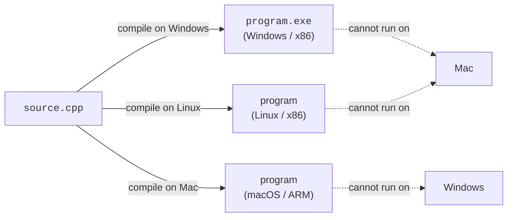
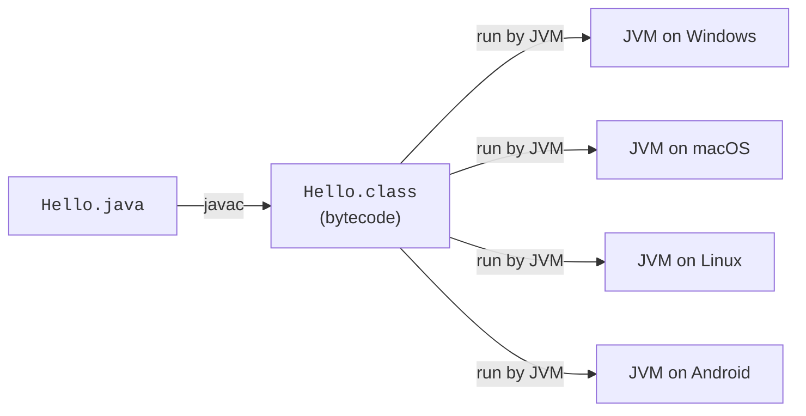
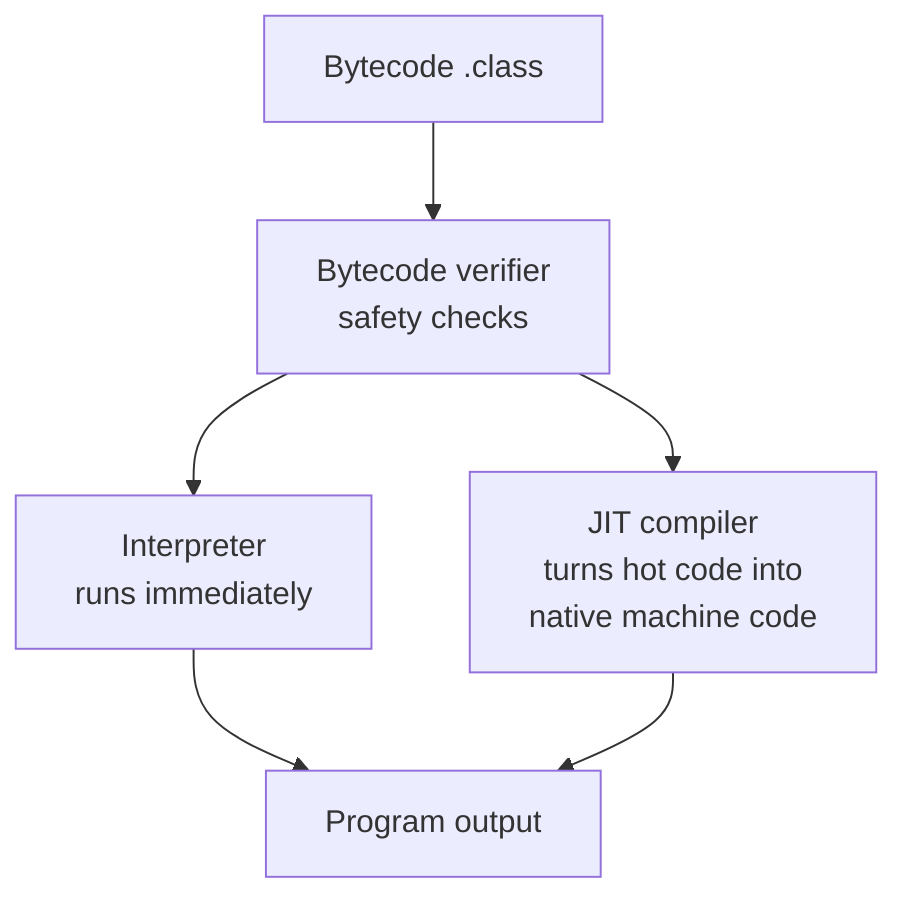

"Write once, run anywhere" was the headline slogan, but it was held
up by one very specific technical idea: instead of compiling your
program to **machine code** (the language one particular CPU
understands), Java compiles your program to **bytecode** (the
language a fictional *virtual* CPU understands). Then on each real
machine, a small program called the **Java Virtual Machine** reads
that bytecode and executes it.

This single shift solved the portability problem that had haunted
C++.

<svg
  viewBox="0 0 640 230"
  role="img"
  aria-label="A source page becomes one strand of identical bytecode beads that fans out and flows, unchanged, into three very different machines — write once, run anywhere"
  style={{ display: "block", width: "100%", maxWidth: "640px", height: "auto", margin: "2.5rem auto" }}
>
  <g style={{ color: "var(--ds-blue-500)" }} fill="currentColor">
    <polygon points="90,60 150,60 166,76 166,170 90,170" fillOpacity="0.15" />
    <polygon points="150,60 166,76 150,76" fillOpacity="0.35" />
    <rect x="104" y="92" width="44" height="7" rx="3" fillOpacity="0.55" />
    <rect x="104" y="108" width="36" height="7" rx="3" fillOpacity="0.55" />
    <rect x="104" y="124" width="48" height="7" rx="3" fillOpacity="0.55" />
    <circle cx="196" cy="115" r="6" />
    <circle cx="216" cy="115" r="6" />
    <circle cx="236" cy="115" r="6" />
    <circle cx="256" cy="115" r="6" />
    <circle cx="276" cy="115" r="6" />
    <circle cx="296" cy="115" r="6" />
    <circle cx="336" cy="96" r="6" />
    <circle cx="362" cy="78" r="6" />
    <circle cx="388" cy="64" r="6" />
    <circle cx="340" cy="115" r="6" />
    <circle cx="368" cy="115" r="6" />
    <circle cx="396" cy="115" r="6" />
    <circle cx="336" cy="134" r="6" />
    <circle cx="362" cy="152" r="6" />
    <circle cx="388" cy="166" r="6" />
  </g>
  <g style={{ color: "var(--ds-green-500)" }} fill="currentColor">
    <rect x="422" y="40" width="10" height="48" rx="5" />
    <rect x="422" y="96" width="10" height="38" rx="5" />
    <rect x="422" y="152" width="10" height="36" rx="5" />
  </g>
  <g fill="currentColor" opacity="0.18">
    <rect x="438" y="36" width="110" height="56" rx="10" />
    <polygon points="438,98 548,92 548,140 438,134" />
    <rect x="438" y="148" width="110" height="44" rx="22" />
  </g>
  <g fill="currentColor" opacity="0.3">
    <rect x="492" y="46" width="8" height="36" rx="3" />
    <rect x="508" y="46" width="8" height="36" rx="3" />
    <rect x="524" y="46" width="8" height="36" rx="3" />
    <circle cx="506" cy="116" r="7" />
    <circle cx="528" cy="116" r="7" />
    <polygon points="498,182 508,162 518,182" />
    <polygon points="518,182 528,162 538,182" />
  </g>
  <g style={{ color: "var(--ds-blue-500)" }} fill="currentColor">
    <circle cx="464" cy="64" r="6" />
    <circle cx="464" cy="116" r="6" />
    <circle cx="464" cy="170" r="6" />
  </g>
</svg>

## The old picture: compile per platform

In C or C++, when you finish writing your source code, you run a
compiler. The compiler produces a file of **machine code** —
instructions a specific CPU on a specific operating system can
execute directly. If you want your program to run somewhere else, you
have to compile it again, on (and for) that target.



Three platforms, three builds, three sets of tests. Multiply by
twenty platforms and you can see the problem.

## The Java picture: compile once

In Java, when you finish writing your source code, you also run a
compiler — `javac`. But `javac` does **not** produce machine code for
your CPU. It produces **bytecode**, stored in `.class` files.
Bytecode is the language of a made-up CPU called the **JVM**.

To actually run the program, you start the JVM on your machine. The
JVM reads the bytecode and executes it.



Same `Hello.class`, every platform. The machine-specific magic lives
inside the JVM. Sun's job (and now Oracle's) is to provide a JVM for
every platform that matters. Your job is to ship one `.class` file
(or one `.jar`, which is a zipped bundle of `.class` files).

## What does bytecode look like?

You will almost never read bytecode by hand, but it is worth knowing
it is not magic. It looks a little like a very simple, very regular
assembly language. For example, this Java method:

```java
int add(int a, int b) {
    return a + b;
}
```

compiles to bytecode that looks (very roughly) like:

```text
iload_1    // push parameter a onto the stack
iload_2    // push parameter b onto the stack
iadd       // pop two ints, push their sum
ireturn    // return the top of the stack
```

The JVM is, conceptually, a *stack machine* that knows how to execute
instructions like these. We will return to this in detail in the
"How Programs Execute" chapter.

## Why this design was so powerful

Three big benefits flow from the bytecode idea:

1. **Portability.** As long as a JVM exists for a platform, your
   program runs there — unchanged.
2. **Safety.** The JVM checks the bytecode before running it
   ("bytecode verification"). It can refuse to run code that, for
   example, tries to access memory it shouldn't. That makes Java
   safer to download from strangers.
3. **Performance over time.** Modern JVMs watch your program as it
   runs and, after a few seconds, *recompile* the hot parts of your
   bytecode to native machine code on the fly — a technique called
   **Just-In-Time (JIT) compilation**. So Java is often nearly as
   fast as C++, while still being portable.



## A small but real demonstration

Let's actually do this. The code block below is a complete Java
program. When you run it, the editor sends your `.java` source to
`javac`, gets back bytecode, and runs that bytecode in a JVM in your
browser. **The exact same `.class` file would run identically on a
Linux server in a data center.**

<CodeBlock
  adapter="java"
  files={[
    {
      filename: "main.java",
      starterCode: `public class Main {
  public static void main(String[] args) {
    System.out.println("Hello from the JVM!");
    System.out.println("Java version: " + System.getProperty("java.version"));
    System.out.println("OS reported by JVM: " + System.getProperty("os.name"));
  }
}
`,
    },
  ]}
/>

Try it. Look at the `os.name` line. The JVM is honestly reporting the
"operating system" it thinks it is running on. The point is that
*your code did not have to know that*. The JVM took care of the
platform-specific details.

<MultipleChoice
  markdown={`What does \`javac\` actually produce?

- A native executable for your operating system
  > That is what a C++ compiler produces.
- An interpreted text file
  > Bytecode is binary, not text.
- [o] A \`.class\` file containing JVM bytecode
  > \`javac\` translates Java source to bytecode for the JVM.
- An image of the source code
  > No, it's binary instructions for the JVM.`}
/>

<MultipleChoice
  markdown={`Why is the same Java \`.class\` file able to run on Windows, Mac, and Linux?

- Because the \`.class\` file contains separate code for each platform
  > It contains a single set of bytecode instructions.
- [o] Because each platform has its own JVM that knows how to execute bytecode
  > The platform-specific work is done by the JVM, not by your program.
- Because operating systems can directly execute bytecode
  > They cannot — bytecode is not native machine code.
- Because Java is interpreted in the browser
  > Browsers do not run server-side Java code.`}
/>

## "Anywhere" really means "anywhere there is a JVM"

It is worth being precise. Java does not run *literally* anywhere.
It runs anywhere there is a JVM implementation. In practice that
means: nearly every server operating system, every desktop OS,
Android (a customized JVM), and increasingly, embedded systems and
even web browsers (via projects like CheerpJ, which is what powers
the code blocks on this site).

The next page is about that JVM in more detail — not the deep
internals, but the *vision* behind it, because the JVM is one of the
greatest pieces of engineering in computing history and you should
know what it does *for* you before you ever start to fight with it.
