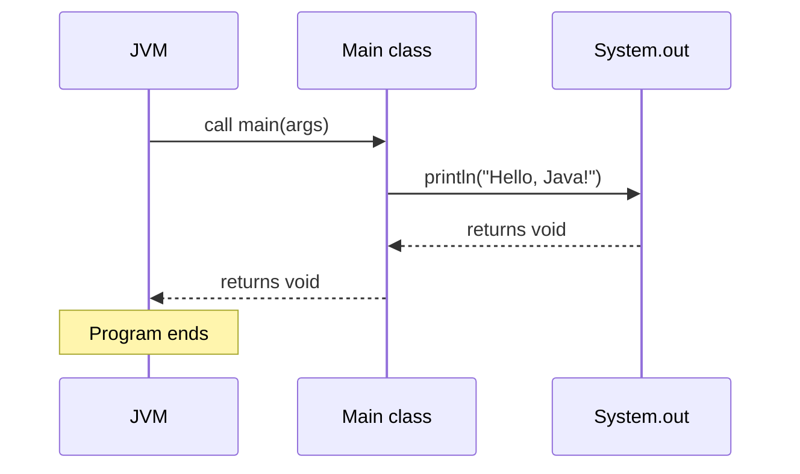

It is time to write Java for real. We will take the tiniest possible
useful program and explain *every single piece of it*. By the end of
this page, no Java program should ever look intimidating again, only
larger.

<svg
  viewBox="0 0 640 240"
  role="img"
  aria-label="A building of faint rooms with exactly one green door at street level, a dotted path walking in, and the first room already lit — main(), the single entrance where every Java program begins"
  style={{ display: "block", width: "100%", maxWidth: "560px", height: "auto", margin: "2.5rem auto" }}
>
  <g fill="currentColor" opacity="0.07">
    <rect x="200" y="40" width="240" height="170" rx="14" />
  </g>
  <g fill="currentColor" opacity="0.07">
    <rect x="216" y="56" width="100" height="60" rx="6" />
    <rect x="330" y="56" width="94" height="60" rx="6" />
    <rect x="330" y="130" width="94" height="64" rx="6" />
  </g>
  <g style={{ color: "var(--ds-blue-500)" }} fill="currentColor">
    <rect x="216" y="130" width="100" height="64" rx="6" fillOpacity="0.14" />
  </g>
  <g style={{ color: "var(--ds-green-500)" }} fill="currentColor">
    <rect x="304" y="166" width="32" height="44" rx="8" />
  </g>
  <g style={{ color: "var(--ds-white)" }} fill="currentColor">
    <circle cx="328" cy="190" r="2.5" fillOpacity="0.9" />
  </g>
  <g fill="currentColor" opacity="0.35">
    <circle cx="130" cy="226" r="3" />
    <circle cx="170" cy="224" r="3" />
    <circle cx="210" cy="222" r="3" />
    <circle cx="250" cy="220" r="3" />
    <circle cx="285" cy="216" r="3" />
  </g>
  <g style={{ color: "var(--ds-blue-500)" }} fill="currentColor">
    <circle cx="320" cy="150" r="3" fillOpacity="0.5" />
    <circle cx="300" cy="140" r="3" fillOpacity="0.5" />
    <circle cx="274" cy="152" r="3" fillOpacity="0.5" />
    <circle cx="250" cy="164" r="5" fillOpacity="0.8" />
  </g>
  <g fill="currentColor" opacity="0.12">
    <rect x="352" y="70" width="18" height="18" rx="4" />
    <rect x="384" y="70" width="18" height="18" rx="4" />
    <rect x="240" y="70" width="18" height="18" rx="4" />
  </g>
  <g fill="currentColor" opacity="0.15">
    <rect x="100" y="228" width="440" height="4" rx="2" />
  </g>
</svg>

## The program

<CodeBlock
  adapter="java"
  files={[
    {
      filename: "main.java",
      starterCode: `public class Main {
  public static void main(String[] args) { System.out.println("Hello, Java!"); }
}
`,
    },
  ]}
/>

Run it. You should see `Hello, Java!` in the output area. Now, let
us pull this program apart.

## Line by line

### `public class Main {`

Every Java program lives inside a **class**. A class is a kind of
"file" — a named container for code. We will spend an entire chapter
on classes soon. For now, all you need to know is that **there is no
such thing as a "free-standing" function in Java**. Every method
belongs to some class.

- `public` — this class is visible to any other code.
- `class` — the keyword that declares a class.
- `Main` — the *name* of the class. By convention class names use
  PascalCase (capital letter for every word).
- `{` — opens the body of the class.

> By convention, the file is named exactly `Main.java`. Java is
> picky about this: a `public class Main` *must* live in a file
> called `Main.java`. CheerpJ in your browser tolerates this in the
> single-file code blocks, but it is the rule for real projects.

### `public static void main(String[] args) {`

This is the **entry point** of the program — the very first method
the JVM calls when you run your program. Every Java program needs
exactly one method that looks (almost) exactly like this.

Break it down:

- `public` — callable from anywhere (including by the JVM).
- `static` — belongs to the class itself, not to an instance. This
  matters because the JVM needs to call `main` *before* it has
  built any objects. (More on this in the classes chapter.)
- `void` — returns nothing. When the method ends, the program ends.
- `main` — the special name the JVM looks for.
- `(String[] args)` — accepts an array of strings; the command-line
  arguments. In our browser environment this is empty, but on a real
  computer running `java Main hello world`, `args` would be
  `["hello", "world"]`.

### `System.out.println("Hello, Java!");`

This is the only line that *does* anything. It prints text.

- `System` — a class from the Java standard library. It exposes
  things related to the running program.
- `out` — a field of `System` that is the standard output (the
  console).
- `println` — a method on `out` that prints its argument followed by
  a newline.
- `"Hello, Java!"` — a **string literal** — a value of type `String`.
- `;` — the semicolon that ends every statement in Java.

### The closing braces

Every `{` needs a matching `}`. The first close brace ends `main`;
the second ends the class. Indentation is just for humans;
Java does not care about whitespace. But you very much should.

## A picture of what runs

The JVM started, found `Main.main`, called it, and `main` made one
call into `System.out.println`. Then it ended. That's it.

## Try changing things

Real understanding comes from breaking things on purpose. Try each
of the following in the code block above, and predict what will
happen *before* you click Run.

1. Change `println` to `print` (no `ln`). The newline disappears.
2. Add a second `println` line. Both lines print.
3. Add `System.out.println(5 + 3);` — Java prints `8`. You can
   print numbers, not just strings.
4. Delete the semicolon at the end of any statement. Java will
   refuse to compile and tell you what is wrong.
5. Rename `main` to `start`. The JVM cannot find `main` and refuses
   to run.

This is the most important habit of all: **break things and watch
the error message**. Java's compiler is wordy but rarely cryptic.

<MultipleChoice
  markdown={`What is the role of the \`main\` method in a Java program?

- It is the only method that may print to the screen
  > Any method can print.
- [o] It is the method called automatically by the JVM when the program starts
  > \`main\` is the agreed-upon entry point.
- It is required to be called \`Main\` like the class
  > It must be called \`main\` (lowercase), regardless of the class name.
- It is optional — Java programs without a \`main\` method still run
  > A program with no \`main\` cannot start.`}
/>

<MultipleChoice
  markdown={`Why does \`main\` have to be declared \`static\`?

- Because static methods are faster
  > Static-vs-instance has nothing to do with speed here.
- Because \`static\` means the same as \`public\`
  > They mean different things.
- [o] Because the JVM needs to call \`main\` before any object of the class has been constructed
  > \`static\` means "belongs to the class itself," so it can be called without an instance.
- Because \`static\` is required for every method in Java
  > Most methods are *not* static.`}
/>

## Multi-file Java: a sneak peek

Every "real" Java program is spread across many files — usually one
class per file. The code block component supports this. Here is the
same greeting, split across two files:

<CodeBlock
  adapter="java"
  entryFilename="Main.java"
  files={[
    {
      filename: "Main.java",
      starterCode: `public class Main {
  public static void main(String[] args) {
    Greeter g = new Greeter("Java");
    g.greet();
  }
}
`,
    },
    {
      filename: "Greeter.java",
      starterCode: `public class Greeter {
  private final String name;

  public Greeter(String name) { this.name = name; }

  public void greet() { System.out.println("Hello, " + name + "!"); }
}
`,
    },
  ]}
/>

Do not worry yet about what `new`, `private final`, or `this` mean.
The point is: **`Main` no longer does the work itself. It creates a
`Greeter` object and asks the greeter to do it.** That is the seed
of object-oriented programming, and we will plant it properly in a
few pages.

## A small challenge

<ChallengeCard
  adapter="java"
  title="Print a name card"
  instructions={`Write a program that prints exactly these three lines:

\`\`\`
Name: Ada Lovelace
Year: 1815
Role: First programmer
\`\`\``}
  entryFilename="Main.java"
  files={[
    {
      filename: "Main.java",
      starterCode: `public class Main {
  public static void main(String[] args) {
    // TODO: print the three lines exactly
  }
}
`,
      solutionCode: `public class Main {
  public static void main(String[] args) {
    System.out.println("Name: Ada Lovelace");
    System.out.println("Year: 1815");
    System.out.println("Role: First programmer");
  }
}
`,
    },
  ]}
  tests={[
    {
      id: "name-card",
      name: "Prints the expected name card",
      expect: {
        stdoutLines: [
          "Name: Ada Lovelace",
          "Year: 1815",
          "Role: First programmer",
        ],
        stdoutLinesExact: true,
      },
    },
  ]}
/>

You now own the basic structure of every Java program you will ever
write. The next page is about what happens when you write `int x =
5;` — the heart of how a program holds onto data.
