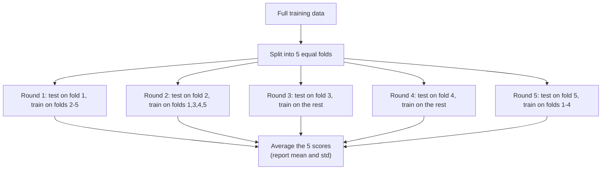
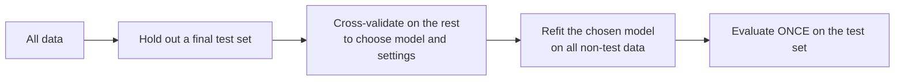

The train/test split taught us to evaluate on held-out data. But it has a
quiet weakness: the score you get depends on *which* rows happened to land
in the test set. Shuffle differently and the number changes. On small
datasets that wobble can be large enough to make you pick the wrong model.
**Cross-validation** fixes this by not betting everything on a single split.

<svg
  viewBox="0 0 640 210"
  role="img"
  aria-label="Five rows of segmented bars; in each row the single yellow held-out segment slides one position along, so every segment takes a turn as the test set — k-fold cross-validation"
  style={{ display: "block", width: "100%", maxWidth: "640px", height: "auto", margin: "2.5rem auto" }}
>
  <g style={{ color: "var(--ds-blue-500)" }} fill="currentColor">
    <rect x="192" y="30" width="84" height="18" rx="6" fillOpacity="0.25" />
    <rect x="284" y="30" width="84" height="18" rx="6" fillOpacity="0.25" />
    <rect x="376" y="30" width="84" height="18" rx="6" fillOpacity="0.25" />
    <rect x="468" y="30" width="84" height="18" rx="6" fillOpacity="0.25" />
    <rect x="100" y="62" width="84" height="18" rx="6" fillOpacity="0.25" />
    <rect x="284" y="62" width="84" height="18" rx="6" fillOpacity="0.25" />
    <rect x="376" y="62" width="84" height="18" rx="6" fillOpacity="0.25" />
    <rect x="468" y="62" width="84" height="18" rx="6" fillOpacity="0.25" />
    <rect x="100" y="94" width="84" height="18" rx="6" fillOpacity="0.25" />
    <rect x="192" y="94" width="84" height="18" rx="6" fillOpacity="0.25" />
    <rect x="376" y="94" width="84" height="18" rx="6" fillOpacity="0.25" />
    <rect x="468" y="94" width="84" height="18" rx="6" fillOpacity="0.25" />
    <rect x="100" y="126" width="84" height="18" rx="6" fillOpacity="0.25" />
    <rect x="192" y="126" width="84" height="18" rx="6" fillOpacity="0.25" />
    <rect x="284" y="126" width="84" height="18" rx="6" fillOpacity="0.25" />
    <rect x="468" y="126" width="84" height="18" rx="6" fillOpacity="0.25" />
    <rect x="100" y="158" width="84" height="18" rx="6" fillOpacity="0.25" />
    <rect x="192" y="158" width="84" height="18" rx="6" fillOpacity="0.25" />
    <rect x="284" y="158" width="84" height="18" rx="6" fillOpacity="0.25" />
    <rect x="376" y="158" width="84" height="18" rx="6" fillOpacity="0.25" />
  </g>
  <g style={{ color: "var(--ds-yellow-500)" }} fill="currentColor">
    <rect x="100" y="30" width="84" height="18" rx="6" fillOpacity="0.9" />
    <rect x="192" y="62" width="84" height="18" rx="6" fillOpacity="0.9" />
    <rect x="284" y="94" width="84" height="18" rx="6" fillOpacity="0.9" />
    <rect x="376" y="126" width="84" height="18" rx="6" fillOpacity="0.9" />
    <rect x="468" y="158" width="84" height="18" rx="6" fillOpacity="0.9" />
  </g>
</svg>

## The problem: one split is one roll of the dice

Let us prove the wobble is real. We will evaluate the *same* model on the
*same* data, changing only the random seed of the split.

<CodeBlock
  adapter="python"
  files={[
    {
      filename: "main.py",
      starterCode: `import numpy as np
from sklearn.datasets import load_wine
from sklearn.model_selection import train_test_split
from sklearn.linear_model import LogisticRegression

X, y = load_wine(return_X_y=True)

scores = []
for seed in range(20):
    X_tr, X_te, y_tr, y_te = train_test_split(
        X, y, test_size=0.3, random_state=seed, stratify=y
    )
    model = LogisticRegression(max_iter=5000)
    model.fit(X_tr, y_tr)
    scores.append(model.score(X_te, y_te))

scores = np.array(scores)
print(f"Lowest  test accuracy: {scores.min():.3f}")
print(f"Highest test accuracy: {scores.max():.3f}")
print(f"Spread (max - min):    {scores.max() - scores.min():.3f}")
print(f"Std deviation:         {scores.std():.3f}")
`,
    },
  ]}
/>

Nothing changed but the luck of the draw, yet the accuracy swings by several
percentage points. If you had run *one* split and reported its number as
"the" accuracy, you might have been several points too optimistic or too
pessimistic — and you would never have known. Which split is the "true"
one? None of them. The truth is somewhere in the middle, and a single split
cannot tell you where.

<Callout type="warn" title="A single split hides its own uncertainty">
One train/test split gives you a point estimate with no error bars. With a
few hundred rows, that estimate can easily be off by several points. Model
comparisons made on a single split are notoriously unreliable.
</Callout>

## The fix: k-fold cross-validation

Instead of one split, make several and average. **K-fold cross-validation**
divides the data into `k` equal parts ("folds"). It then runs `k` rounds: in
each round, one fold is the test set and the other `k-1` folds are the
training set. Every row gets to be in the test set exactly once.

The average of the `k` scores is your performance estimate, and their
spread tells you how uncertain it is. Because every row is used for testing
once and for training `k-1` times, you squeeze far more signal out of a
small dataset than a single split allows.

## `cross_val_score`: one line to do it all

scikit-learn wraps the whole procedure in a single function.

<CodeBlock
  adapter="python"
  files={[
    {
      filename: "main.py",
      starterCode: `import numpy as np
from sklearn.datasets import load_wine
from sklearn.linear_model import LogisticRegression
from sklearn.model_selection import cross_val_score

X, y = load_wine(return_X_y=True)
model = LogisticRegression(max_iter=5000)

scores = cross_val_score(model, X, y, cv=5)

print("Score from each of the 5 folds:")
print(np.round(scores, 3))
print(f"\\nMean accuracy: {scores.mean():.3f}")
print(f"Std deviation: {scores.std():.3f}")
print(f"Report it as: {scores.mean():.3f} plus or minus {scores.std():.3f}")
`,
    },
  ]}
/>

That mean is a far more trustworthy estimate than any single split, and the
standard deviation is the error bar you were missing. The right way to
report a cross-validated result is *mean plus or minus standard deviation* —
never a single bare number pretending to be exact.

<Callout type="info" title="Stratification comes free for classifiers">
When you pass a classifier to `cross_val_score`, scikit-learn uses
**stratified** k-fold by default, preserving each class's proportion in
every fold. You get the benefit of `stratify=y` automatically. For explicit
control, pass `cv=StratifiedKFold(n_splits=5, shuffle=True, random_state=0)`.
</Callout>

## Choosing `k`

`k=5` and `k=10` are the standard choices. The tradeoff:

- **Larger `k`** → each training set is bigger (closer to using all the
  data), so the estimate has less bias, but you train more times (slower)
  and the folds overlap more.
- **Smaller `k`** → faster, but each training set is smaller, so the
  estimate can be slightly pessimistic.

The extreme case `k = n` (one row per fold) is **leave-one-out**
cross-validation. It uses almost all the data for every fit but requires `n`
fits and can be noisy. For most work, 5 or 10 folds is the sweet spot.

## The leakage trap CV makes obvious

Here is a subtle and dangerous mistake. If you scale your features using the
whole dataset *before* cross-validating, every fold's "test" portion has
already influenced the scaler — information has leaked from test to train,
and your CV score is optimistic. The fix is to put preprocessing **inside**
the cross-validation, so it is re-fit from scratch on each fold's training
data. A `Pipeline` does this automatically.

<CodeBlock
  adapter="python"
  files={[
    {
      filename: "main.py",
      starterCode: `import numpy as np
from sklearn.datasets import load_breast_cancer
from sklearn.preprocessing import StandardScaler
from sklearn.neighbors import KNeighborsClassifier
from sklearn.pipeline import make_pipeline
from sklearn.model_selection import cross_val_score

X, y = load_breast_cancer(return_X_y=True)

# Bundle scaling + model so scaling is re-fit on each fold's training rows.
pipe = make_pipeline(StandardScaler(), KNeighborsClassifier(n_neighbors=5))

scores = cross_val_score(pipe, X, y, cv=5)
print("Leak-free CV accuracy per fold:", np.round(scores, 3))
print(f"Mean: {scores.mean():.3f} plus or minus {scores.std():.3f}")
`,
    },
  ]}
/>

Because the `StandardScaler` lives inside the pipeline, each fold scales
using only its own training portion. The cross-validation now faithfully
mimics what happens at deployment, where you must scale new data using
statistics learned in the past. We will build pipelines properly in their
own chapter — for now, the lesson is: **anything that learns from data
belongs inside the cross-validation loop.**

<Callout type="danger" title="Preprocess inside, not before">
Fitting a scaler, imputer, or feature selector on the full dataset before
cross-validating leaks the test folds and inflates your score. Wrap
preprocessing and model together in a `Pipeline` so every fold is honest.
</Callout>

## Cross-validation does not replace the test set

A common confusion: "If I cross-validate, do I still need a test set?" For
the most rigorous estimate, **yes**. Here is the reasoning. You typically
use cross-validation to *choose* things — which model, which
hyperparameters. The moment you select the option with the best CV score,
that score is slightly optimistic, because you picked the winner of a
contest with some luck in it. A final, untouched test set gives you one
clean number after all the choosing is done.

Cross-validation is for *making decisions* with a stable signal. The test
set is for the *final, honest report* after the decisions are made.

## When cross-validation needs care

The plain k-fold shuffle assumes rows are independent and interchangeable —
the same assumption the random split makes, and it fails in the same places:

- **Time series.** Use `TimeSeriesSplit`, which always trains on the past
  and tests on the future, never the reverse.
- **Grouped data** (repeated patients, users, devices). Use `GroupKFold` so
  all of a group's rows stay together in the same fold; otherwise the model
  recognizes the individual across folds and your score is fantasy.

<Callout type="warn" title="Independence again">
If a random train/test split would cheat on your data, so will plain k-fold.
Match the splitter to the structure of your problem: `TimeSeriesSplit` for
time, `GroupKFold` for grouped data.
</Callout>

## Common misconceptions

- **"Cross-validation prevents overfitting."** It does not change how a
  model fits — it *measures* generalization more reliably so you can *detect*
  overfitting and choose better. The fixing is still up to you.
- **"More folds is always better."** Beyond 10, you pay a lot of compute for
  diminishing returns, and leave-one-out can be noisy.
- **"The CV mean is the exact production accuracy."** It is a better
  estimate than a single split, but still an estimate with a standard
  deviation. Report the spread.
- **"I can cross-validate, then keep tweaking until the CV score is great."**
  Tune too obsessively against the CV score and you start overfitting *it*.
  That is why a final held-out test set exists.

## Real-world applications

Cross-validation is the default evaluation protocol in nearly every applied
ML project and every Kaggle competition. When a paper claims a model is
better, the credible ones back it with cross-validated scores and standard
deviations, not a single lucky split. Whenever data is scarce — medical
studies, niche business problems — cross-validation is what lets a few
hundred rows yield a trustworthy estimate.

## Your turn

<ChallengeCard
  adapter="python"
  title="Cross-validate a pipeline"
  category="model evaluation · cross-validation"
  estimatedTime="~6 min"
  instructions={`Using the breast cancer dataset (\`X\`, \`y\` provided):

1. Build a pipeline \`pipe\` with \`make_pipeline(StandardScaler(),
   LogisticRegression(max_iter=5000))\`.
2. Run **10-fold** cross-validation with \`cross_val_score\`, storing the
   array of fold scores in \`cv_scores\`.
3. Store the mean in \`mean_score\` and the standard deviation in
   \`std_score\`.

The tests check that \`cv_scores\` has 10 entries, that \`mean_score\`
matches \`cv_scores.mean()\`, and that the mean is a strong accuracy
(above 0.9) — which it should be for this dataset.`}
  files={[
    {
      filename: "main.py",
      initCode: `from sklearn.datasets import load_breast_cancer
from sklearn.preprocessing import StandardScaler
from sklearn.linear_model import LogisticRegression
from sklearn.pipeline import make_pipeline
from sklearn.model_selection import cross_val_score

X, y = load_breast_cancer(return_X_y=True)`,
      starterCode: `pipe = None
cv_scores = None
mean_score = None
std_score = None

print(cv_scores)
print(mean_score, std_score)
`,
      solutionCode: `pipe = make_pipeline(StandardScaler(), LogisticRegression(max_iter=5000))
cv_scores = cross_val_score(pipe, X, y, cv=10)
mean_score = cv_scores.mean()
std_score = cv_scores.std()

print(cv_scores)
print(mean_score, std_score)
`,
    },
  ]}
  tests={[
    {
      id: "ten_folds",
      name: "cv_scores has 10 fold scores",
      description: "10-fold cross-validation",
      code: `assert cv_scores is not None and len(cv_scores) == 10, f"Got {None if cv_scores is None else len(cv_scores)}"`,
    },
    {
      id: "mean_matches",
      name: "mean_score equals the mean of cv_scores",
      description: "Consistency check",
      code: `import numpy as np
assert abs(mean_score - cv_scores.mean()) < 1e-9`,
    },
    {
      id: "strong",
      name: "Mean accuracy is above 0.90",
      description: "A scaled logistic model does well here",
      code: `assert mean_score > 0.90, f"Mean was only {mean_score:.3f}"`,
    },
  ]}
/>

## Check your understanding

<MultipleChoice
  markdown={`What is the main problem with evaluating a model on a single train/test split, especially on a small dataset?

- It is slower than cross-validation
  > A single train/test split is actually faster than cross-validation, which requires training the model k times. Speed is an advantage of single splits, not a problem.
- It always overestimates accuracy
  > A single split can go either way — it can be optimistic or pessimistic depending on which rows land in the test set. The problem is that you cannot know which, and there is no error bar to warn you.
- [o] The score depends on which rows happened to land in the test set, so it is a noisy estimate with no error bar
  > A single split is one roll of the dice; reshuffle and the number moves. Cross-validation averages many splits to stabilize the estimate.
- It cannot be used with classifiers
  > A single train/test split works perfectly well with classifiers. The limitation is statistical — high variance due to depending on one particular split — not a compatibility issue.

The weakness is variance in the estimate, not speed or a fixed direction of bias.`}
/>

<MultipleChoice
  markdown={`In 5-fold cross-validation, how many times is each row used for **testing**?

- Five times
  > Each row is used for *training* in four of the five rounds, not testing. Testing happens in exactly one round — the one where the row's fold is held out.
- Zero times
  > Every row is tested exactly once. The defining property of k-fold cross-validation is that every row participates in a test fold in exactly one of the k rounds.
- [o] Exactly once — each row sits in the test fold in exactly one of the five rounds
  > Each fold serves as the test set once, so every row is tested a single time and used for training in the other four rounds.
- It depends on the random seed
  > The number of times each row is used for testing is always exactly one in k-fold cross-validation, regardless of how the folds were assigned. The seed can affect *which* fold a row lands in, but not *how many* times it is tested.

This is what lets cross-validation use all the data for both training and testing.`}
/>

<MultipleChoice
  markdown={`Why should preprocessing like \`StandardScaler\` be placed *inside* a \`Pipeline\` that is cross-validated, rather than applied to the whole dataset first?

- It runs faster inside a pipeline
  > A pipeline does not make preprocessing faster; it adds a small overhead. The reason to use a pipeline is correctness — preventing data leakage — not speed.
- Pipelines are required by \`cross_val_score\`
  > \`cross_val_score\` works with any estimator, not just pipelines. Pipelines are recommended to prevent leakage, not because they are technically required.
- [o] So the scaler is re-fit on each fold's training portion only, preventing information from the test fold leaking into training
  > Scaling on the full dataset lets every test fold influence the statistics, inflating the score. A pipeline re-fits preprocessing per fold, keeping each estimate honest.
- It changes the number of folds
  > Wrapping a scaler in a pipeline has no effect on the number of folds used in cross-validation; that is controlled by the \`cv\` parameter passed to \`cross_val_score\`.

The point is leakage prevention: anything that learns from data must be re-fit within each fold.`}
/>

<MultipleChoice
  markdown={`After using cross-validation to choose your model and hyperparameters, why keep a separate untouched test set?

- Because cross-validation cannot score classifiers
  > Cross-validation works with classifiers by default — \`cross_val_score\` even uses stratified folds for them. The reason to keep a test set is to have a final unbiased estimate, not because CV cannot score classifiers.
- [o] Because selecting the option with the best CV score makes that score slightly optimistic; a final untouched test set gives one clean, unbiased number
  > Picking the winner of a noisy contest favors lucky candidates, so the winning CV score is a bit inflated. The held-out test set reports performance after all choices are locked in.
- Because the test set trains the final model
  > The test set is never used for training — it is held out until final evaluation. The final model is trained on all the non-test data, typically after choices are locked in using cross-validation.
- Because cross-validation uses the test set internally
  > Cross-validation operates only on the non-test portion of the data. The test set is kept completely separate so it remains an unbiased final checkpoint.

CV is for decision-making with a stable signal; the test set is for the final honest report.`}
/>

<MultipleChoice
  markdown={`You are predicting next month's revenue from monthly history. Why is plain k-fold cross-validation inappropriate?

- k-fold cannot be used for regression
  > k-fold cross-validation works fine with regression tasks, including revenue prediction. The problem here is the temporal ordering of rows, not the regression target.
- [o] The data is ordered in time; plain k-fold would train on future months to predict past ones, which is impossible in reality — use \`TimeSeriesSplit\`
  > Shuffled folds let the model peek at the future. Time-aware splitting trains on the past and tests on later periods, matching real use.
- k-fold requires at least 100 folds for time series
  > There is no minimum fold requirement for time series, and \`TimeSeriesSplit\` typically uses far fewer folds (5 or 10) — the same range as regular k-fold. The issue is ordering, not fold count.
- Revenue data cannot be cross-validated
  > Revenue forecasting can absolutely be cross-validated; the key is using \`TimeSeriesSplit\` to respect the temporal order so the model never trains on future data to predict the past.

Match the splitter to the data's structure; temporal data needs time-ordered folds.`}
/>
