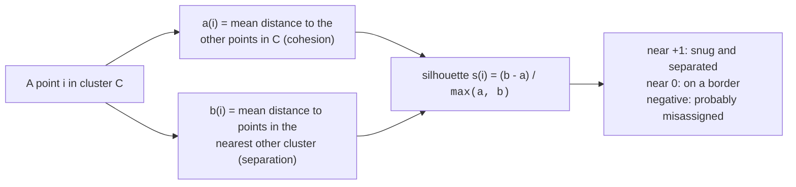

Supervised models have it easy: there is a true label, so you can measure
how often you match it. Clustering has no such luxury. It is **unsupervised**
— you handed the algorithm data with no labels and asked it to invent
groups. So when it hands back clusters, the unsettling question is: *good
compared to what?* This chapter is about the honest answers, the most useful
metric (the **silhouette score**), and the discipline of not letting a
single number decide for you.

<svg
  viewBox="0 0 640 200"
  role="img"
  aria-label="One highlighted dot floats between a blue cluster and a green cluster, a short dotted trail tying it to its own group and a long one stretching to the neighbor — the silhouette score measures exactly that gap"
  style={{ display: "block", width: "100%", maxWidth: "640px", height: "auto", margin: "2.5rem auto" }}
>
  <g style={{ color: "var(--ds-blue-500)" }} fill="currentColor">
    <circle cx="140" cy="80" r="8" />
    <circle cx="180" cy="60" r="8" />
    <circle cx="200" cy="110" r="8" />
    <circle cx="150" cy="130" r="8" />
  </g>
  <g style={{ color: "var(--ds-green-500)" }} fill="currentColor">
    <circle cx="460" cy="90" r="8" />
    <circle cx="500" cy="70" r="8" />
    <circle cx="520" cy="120" r="8" />
    <circle cx="470" cy="140" r="8" />
  </g>
  <g style={{ color: "var(--ds-blue-500)" }} fill="currentColor">
    <circle cx="268" cy="99" r="3" fillOpacity="0.45" />
    <circle cx="236" cy="98" r="3" fillOpacity="0.45" />
    <circle cx="204" cy="97" r="3" fillOpacity="0.45" />
  </g>
  <g fill="currentColor" opacity="0.25">
    <circle cx="340" cy="101" r="3" />
    <circle cx="378" cy="102" r="3" />
    <circle cx="416" cy="103" r="3" />
    <circle cx="452" cy="104" r="3" />
  </g>
  <g style={{ color: "var(--ds-yellow-500)" }} fill="currentColor">
    <circle cx="300" cy="100" r="17" fillOpacity="0.25" />
  </g>
  <g style={{ color: "var(--ds-blue-500)" }} fill="currentColor">
    <circle cx="300" cy="100" r="8" />
  </g>
</svg>

## Why this is genuinely hard

With no ground truth, "correct" clustering is not even well-defined. The
same points can be grouped several reasonable ways depending on what you
care about. Customers could cluster by spending, by age, by region — none is
objectively *the* answer. So cluster evaluation splits into two situations:

- **No labels at all (the usual case).** You judge clusters by their
  *geometry*: are points in the same cluster close together, and far from
  other clusters? These are called **internal** metrics. The silhouette
  score is the workhorse.
- **You secretly have labels (rare, e.g. a benchmark).** You can compare the
  clusters to the known groups with **external** metrics like the adjusted
  Rand index. Useful for research, seldom available in real problems.

<Callout type="info" title="Internal vs external, in a sentence">
Internal metrics ask "are these clusters geometrically tight and
well-separated?" using only the data. External metrics ask "do these
clusters match a known ground truth?" and need labels you usually do not
have. The silhouette score is internal.
</Callout>

## The silhouette score

The silhouette score captures a simple, intuitive idea: a point is
well-clustered if it is **close to its own cluster** and **far from the
nearest other cluster**. For each point `i`:

Formally, with `a(i)` the average distance from point `i` to the other
points in its own cluster, and `b(i)` the average distance to the points of
the *nearest* other cluster:

$$
s(i) = \frac{b(i) - a(i)}{\max\lbrace\,a(i),\ b(i)\,\rbrace}
$$

- **What it measures.** Per point, how much better it fits its own cluster
  than the nearest alternative, scaled to lie between −1 and +1.
- **s(i) near +1** — the point is much closer to its own cluster than to any
  other: a confident, clean assignment.
- **s(i) near 0** — the point sits on the boundary between two clusters; it
  could plausibly belong to either.
- **s(i) negative** — the point is, on average, closer to a *different*
  cluster than its own: it was probably assigned to the wrong group.

The overall **silhouette score** is just the mean of `s(i)` across all
points — one number summarizing how cleanly separated the whole clustering
is.

<CodeBlock
  adapter="python"
  files={[
    {
      filename: "main.py",
      starterCode: `from sklearn.datasets import make_blobs
from sklearn.cluster import KMeans
from sklearn.metrics import silhouette_score

# Three well-separated blobs.
X, _ = make_blobs(n_samples=300, centers=3, cluster_std=0.7, random_state=0)

km = KMeans(n_clusters=3, n_init=10, random_state=0)
labels = km.fit_predict(X)

score = silhouette_score(X, labels)
print(f"Silhouette score: {score:.3f}")
print("Closer to 1 means tighter, better-separated clusters.")
`,
    },
  ]}
/>

For clean, well-separated blobs the score is high — close to the structure's
natural quality. Note the metric used only `X` and the predicted `labels`;
it never needed a true answer.

## Using the silhouette score to choose `k`

The most practical use of the silhouette score is picking the number of
clusters. Try several values of `k`, score each, and let the data vote.

<CodeBlock
  adapter="python"
  files={[
    {
      filename: "main.py",
      starterCode: `import matplotlib.pyplot as plt
from sklearn.datasets import make_blobs
from sklearn.cluster import KMeans
from sklearn.metrics import silhouette_score

X, _ = make_blobs(n_samples=300, centers=4, cluster_std=0.7, random_state=0)

ks = range(2, 9)
scores = []
for k in ks:
    labels = KMeans(n_clusters=k, n_init=10, random_state=0).fit_predict(X)
    scores.append(silhouette_score(X, labels))

best_k = list(ks)[scores.index(max(scores))]

plt.figure(figsize=(8, 5))
plt.plot(list(ks), scores, "o-", color="#4f8ef7")
plt.axvline(best_k, color="#f59e0b", linestyle="--", label=f"best k = {best_k}")
plt.xlabel("Number of clusters k")
plt.ylabel("Silhouette score")
plt.title("Higher is better — the peak suggests the natural number of clusters")
plt.legend()
plt.show()

print("Silhouette picked k =", best_k, "(the data was built with 4 blobs)")
`,
    },
  ]}
/>

The silhouette score peaks at the number of clusters the data actually has.
Unlike the elbow method (which eyeballs a bend in the inertia curve), the
silhouette gives a concrete number to compare, so the choice is less
subjective.

## The per-point silhouette plot

Averaging hides detail. The classic **silhouette plot** shows every point's
`s(i)`, grouped by cluster, so you can spot a cluster full of borderline or
negative points even when the average looks fine.

<CodeBlock
  adapter="python"
  files={[
    {
      filename: "main.py",
      starterCode: `import numpy as np
import matplotlib.pyplot as plt
from sklearn.datasets import make_blobs
from sklearn.cluster import KMeans
from sklearn.metrics import silhouette_samples, silhouette_score

X, _ = make_blobs(n_samples=300, centers=3, cluster_std=0.9, random_state=0)
labels = KMeans(n_clusters=3, n_init=10, random_state=0).fit_predict(X)

sample_sil = silhouette_samples(X, labels)
avg = silhouette_score(X, labels)

plt.figure(figsize=(8, 5))
y_lower = 0
colors = ["#4f8ef7", "#34d399", "#f59e0b"]
for c in range(3):
    vals = np.sort(sample_sil[labels == c])
    y_upper = y_lower + len(vals)
    plt.fill_betweenx(np.arange(y_lower, y_upper), 0, vals, color=colors[c], alpha=0.8)
    plt.text(-0.05, y_lower + len(vals) / 2, str(c))
    y_lower = y_upper
plt.axvline(avg, color="red", linestyle="--", label=f"average = {avg:.2f}")
plt.xlabel("Silhouette value s(i)")
plt.ylabel("Points, grouped by cluster")
plt.title("Per-point silhouette plot")
plt.legend(loc="lower right")
plt.show()
`,
    },
  ]}
/>

Wide, tall "knives" that mostly clear the red average line are healthy
clusters. A cluster whose bars are short, or that dips below zero, is a
warning that those points do not really belong together — something the
single average score would have quietly absorbed.

## The trap: a better score is not a "more correct" clustering

Here is the most important caution in this chapter. The silhouette score
rewards **compact, round, well-separated** clusters. When the true structure
is *not* shaped like that, the metric can confidently prefer the wrong
answer.

<CodeBlock
  adapter="python"
  files={[
    {
      filename: "main.py",
      starterCode: `from sklearn.datasets import make_moons
from sklearn.cluster import KMeans
from sklearn.metrics import silhouette_score

# Two interleaving crescents — the "true" grouping is the two moons.
X, y_true = make_moons(n_samples=300, noise=0.05, random_state=0)

# K-Means imposes two round clusters (it cannot bend around a crescent).
kmeans_labels = KMeans(n_clusters=2, n_init=10, random_state=0).fit_predict(X)

print(f"Silhouette of K-Means round clusters: {silhouette_score(X, kmeans_labels):.3f}")
print(f"Silhouette of the TRUE crescent labels: {silhouette_score(X, y_true):.3f}")
print()
print("The geometrically 'wrong' round split scores HIGHER than the")
print("correct crescents — because silhouette prizes round, compact shapes.")
`,
    },
  ]}
/>

The round clustering that is *wrong* for this data scores **higher** than
the crescents that are *right*. If you trusted the silhouette score blindly,
it would lead you straight to the worse clustering. The metric is measuring
geometry, not truth.

<Callout type="danger" title="A metric measures geometry, not meaning">
A higher silhouette score means "rounder, more separated clusters," which is
only the same as "better" when the real structure happens to be round and
separated. For elongated, nested, or irregular structure, the silhouette can
reward the wrong answer. Never let it overrule what you know about the
problem.
</Callout>

## What the silhouette score does *not* tell you

- **Whether the clusters are meaningful.** It is pure geometry. Clusters can
  be tight and well-separated yet correspond to nothing you care about.
- **The right algorithm or shape.** It implicitly favors convex, round
  clusters (like K-Means produces), so comparing a density-based clustering
  to K-Means by silhouette alone is unfair to the former.
- **Anything about a single point's importance.** A high average can hide a
  cluster of borderline points — always glance at the per-point plot.
- **Causation or business value.** That a clean cluster exists says nothing
  about whether acting on it is profitable or wise.

## When external metrics apply

If you happen to have true labels (a benchmark, a labeled sample), you can
score how well clusters recover them with the **adjusted Rand index**, which
is 1.0 for a perfect match and about 0.0 for random labeling — and, crucially,
does not care what you *name* the clusters, only how points are grouped
together.

<CodeBlock
  adapter="python"
  files={[
    {
      filename: "main.py",
      starterCode: `from sklearn.datasets import make_blobs
from sklearn.cluster import KMeans
from sklearn.metrics import adjusted_rand_score

X, y_true = make_blobs(n_samples=300, centers=3, cluster_std=0.7, random_state=0)
labels = KMeans(n_clusters=3, n_init=10, random_state=0).fit_predict(X)

# Cluster IDs are arbitrary (cluster "0" need not equal true group "0"),
# but the adjusted Rand index ignores the labeling and compares groupings.
print(f"Adjusted Rand index vs true groups: {adjusted_rand_score(y_true, labels):.3f}")
`,
    },
  ]}
/>

A score near 1.0 means the discovered clusters line up almost perfectly with
the true groups, regardless of how the cluster numbers were assigned. But
remember: in real unsupervised work you usually do not have `y_true` — if
you did, you might not be clustering at all.

## Common misconceptions

- **"Higher silhouette always means a better clustering."** Only when the
  true structure is round and separated. It can prefer wrong groupings on
  curved or nested data.
- **"The silhouette score tells me the right number of clusters."** It
  *suggests* one, and often a good one — but on ambiguous data several `k`
  values can score similarly, and the metric cannot know your purpose.
- **"A good score means the clusters are meaningful."** Geometry is not
  meaning. Validate clusters against domain knowledge and downstream use.
- **"Cluster numbers are meaningful labels."** They are arbitrary; cluster
  "0" in one run can be cluster "2" in another. Compare *groupings*, not IDs.

## Real-world applications

Marketing teams cluster customers and then check whether the segments are
*actionable*, not just tight — a beautiful silhouette is useless if the
segments cannot be targeted differently. Biologists cluster gene-expression
profiles and validate against known pathways. In every case the metric is a
flashlight, not a judge: it helps you find structure and compare options,
but a human decides whether the structure means anything.

## Your turn

<ChallengeCard
  adapter="python"
  title="Pick k with the silhouette score"
  category="model evaluation · clustering"
  estimatedTime="~7 min"
  instructions={`A dataset \`X\` is provided (it was generated with several blobs).

1. For each \`k\` in \`range(2, 8)\`, fit
   \`KMeans(n_clusters=k, n_init=10, random_state=0)\` and compute the
   \`silhouette_score\` of its labels.
2. Collect the scores, in order, into a list called \`sil_scores\`.
3. Set \`best_k\` to the \`k\` with the highest silhouette score.

The tests check that \`sil_scores\` has 6 entries, that every score is in the
valid range from -1 to 1, and that \`best_k\` is the k with the highest
silhouette score. (Worth noticing: the winning k here need not equal the 5
blobs the data was generated with — a live reminder that the silhouette
optimizes geometry, not the "true" count.)`}
  files={[
    {
      filename: "main.py",
      initCode: `from sklearn.datasets import make_blobs
from sklearn.cluster import KMeans
from sklearn.metrics import silhouette_score

X, _ = make_blobs(n_samples=400, centers=5, cluster_std=0.6, random_state=42)
candidate_ks = list(range(2, 8))`,
      starterCode: `sil_scores = []

# TODO: for each k in candidate_ks, fit KMeans and append its silhouette score

best_k = None
print("scores:", sil_scores)
print("best_k:", best_k)
`,
      solutionCode: `sil_scores = []
for k in candidate_ks:
    labels = KMeans(n_clusters=k, n_init=10, random_state=0).fit_predict(X)
    sil_scores.append(silhouette_score(X, labels))

best_k = candidate_ks[sil_scores.index(max(sil_scores))]
print("scores:", sil_scores)
print("best_k:", best_k)
`,
    },
  ]}
  tests={[
    {
      id: "len",
      name: "Six scores, one per k",
      description: "k from 2 to 7",
      code: `assert len(sil_scores) == 6, f"Expected 6 scores, got {len(sil_scores)}"`,
    },
    {
      id: "range",
      name: "Every silhouette score is within [-1, 1]",
      description: "Valid silhouette range",
      code: `assert all(-1.0 <= s <= 1.0 for s in sil_scores), f"Out-of-range score in {sil_scores}"`,
    },
    {
      id: "best",
      name: "best_k matches the highest-scoring k",
      description: "best_k is the argmax of the silhouette scores",
      code: `expected = candidate_ks[sil_scores.index(max(sil_scores))]
assert best_k == expected, f"best_k {best_k} != argmax {expected}"`,
    },
  ]}
/>

## Check your understanding

<MultipleChoice
  markdown={`Why is evaluating a clustering fundamentally harder than evaluating a classifier?

- Clustering algorithms are slower
  > Speed has nothing to do with the difficulty of evaluation; the challenge is the absence of ground-truth labels, not the runtime of the algorithm.
- [o] Clustering is unsupervised — there is no ground-truth label to compare against, so "correct" is not even well-defined
  > Without labels you cannot count correct answers. You fall back on geometric quality (internal metrics) or, rarely, a known ground truth (external metrics).
- Classifiers never make mistakes
  > Classifiers make mistakes too, but they can be measured precisely because there is a known correct label for every example. That label is exactly what clustering lacks.
- Clustering cannot be measured at all
  > Clustering can be measured — with internal metrics like the silhouette score and, when labels exist, external metrics like the adjusted Rand index. The challenge is that there is no single ground truth, not that measurement is impossible.

The absence of a true answer is exactly what makes cluster evaluation subtle.`}
/>

<MultipleChoice
  markdown={`What does a point's silhouette value close to **+1** indicate?

- The point is on the boundary between two clusters
  > A borderline point would have a silhouette value near 0, not near +1. A value close to +1 indicates the point is firmly inside its cluster, far from the boundary.
- [o] The point is much closer to its own cluster than to the nearest other cluster — a clean, confident assignment
  > A silhouette near +1 means high cohesion and high separation: tightly within its own cluster and far from the next one.
- The point was assigned to the wrong cluster
  > A misassigned point would have a negative silhouette value, meaning it is closer on average to another cluster than to its own. A value near +1 is the opposite: a very confident, correct-looking assignment.
- The clustering used too many clusters
  > The silhouette value of a single point says nothing about whether too many clusters were used; it only measures how well that specific point fits its assigned cluster relative to the next-nearest cluster.

Values near +1 are good, near 0 are borderline, and negative suggests a likely misassignment.`}
/>

<MultipleChoice
  markdown={`A negative silhouette value for a point most likely means:

- The point is a perfect cluster center
  > A cluster center would be surrounded by members of its own cluster and far from other clusters, giving it a silhouette value near +1, not a negative one.
- [o] The point is, on average, closer to a different cluster than to its own — it was probably assigned to the wrong group
  > A negative s(i) means the nearest other cluster is closer than the point's own, a sign the assignment is poor.
- The silhouette score was computed incorrectly
  > A negative silhouette is a valid, meaningful result — it signals a likely misassignment, not a computation error. The formula is well-defined and negative values are an expected output for poorly placed points.
- The point has no neighbors
  > The silhouette score is computed using all other points in the same cluster and all points in the nearest other cluster; it is not affected by whether a point has immediate neighbors.

Negative silhouette values flag points that seem to belong elsewhere.`}
/>

<MultipleChoice
  markdown={`On two interleaving crescent-shaped clusters, K-Means's round split scored a **higher** silhouette than the true crescents. What is the lesson?

- The silhouette score was buggy
  > The silhouette score computed correctly — it gave a high score to the round split because the metric genuinely rewards compact, well-separated spherical clusters, which is what K-Means produced even though those clusters are wrong for this data.
- The crescents are not really clusters
  > The two crescents are the true structure in the data, as confirmed by knowing how the data was generated. The silhouette simply cannot reward curved, interleaving shapes.
- [o] The silhouette score rewards round, compact, separated clusters, so it can prefer a geometrically wrong grouping when the true structure is not round
  > Silhouette measures geometry, not correctness. For elongated or nested shapes a "better" silhouette can mean a worse clustering — domain knowledge must override it.
- K-Means is always the best clustering method
  > K-Means performs well on round, globular clusters but struggles with non-convex shapes like crescents or rings. This example shows exactly the opposite: K-Means scored well on the silhouette while missing the true structure.

A higher internal score is not the same as a more correct or meaningful clustering.`}
/>

<MultipleChoice
  markdown={`You want to choose the number of clusters \`k\`. How is the silhouette score typically used for this?

- Fit one k and trust it
  > Fitting a single k gives no basis for comparison. Without trying multiple values you cannot know whether a different k would score higher, so you cannot make an informed choice.
- [o] Try several values of k, compute the silhouette score for each, and favor the k with the highest score (sanity-checked against domain sense)
  > Sweeping k and comparing silhouette scores gives a concrete, less subjective signal than eyeballing an elbow — though the final call should still make sense for the problem.
- Pick the k with the lowest score
  > A lower silhouette score means less cohesion and separation, which is worse. The goal is to maximize the score — higher is better — so the k with the lowest score would be the poorest choice.
- The silhouette score cannot inform the choice of k
  > Comparing silhouette scores across different values of k is one of its most common and practical uses, and it gives a more objective signal than the elbow method.

Comparing scores across candidate k values is the silhouette's most common practical use.`}
/>

<MultipleChoice
  markdown={`Your clustering has a high average silhouette score. What should you still check before trusting it?

- Nothing — a high average is conclusive
  > A high average can hide a cluster full of borderline or negative silhouette values, and a geometrically tight clustering may have no meaningful business interpretation. The average is a starting point, not a verdict.
- [o] The per-point silhouette plot and whether the clusters are meaningful for your problem, since a high average can hide borderline clusters and says nothing about real-world value
  > Averages hide detail and geometry is not meaning. Inspect per-point silhouettes and validate the clusters against domain knowledge and intended use.
- That the cluster ID numbers are sorted
  > Cluster ID numbers are arbitrary labels with no inherent order or meaning. Checking whether they are sorted would tell you nothing useful about the quality of the clustering.
- That every cluster has exactly the same size
  > Meaningful clusters often differ in size — there is no requirement that clusters be balanced. Imposing equal sizes would distort the natural groupings in the data.

A strong average is a good sign, not a verdict; per-cluster detail and domain validation still matter.`}
/>
