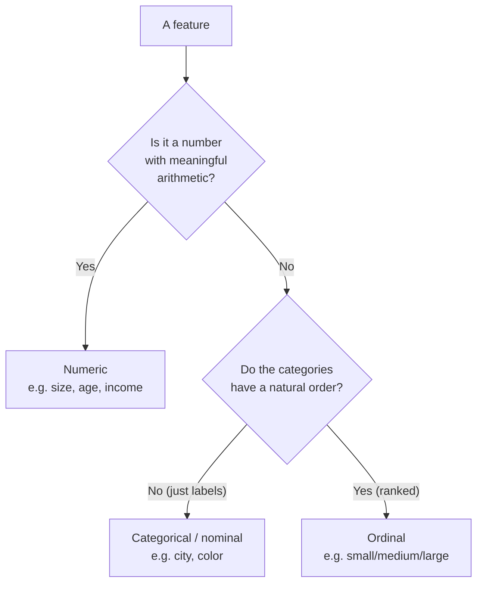

You have now seen the same four-line shape several times: load data into `X`
and `y`, split, fit, evaluate. It is time to slow down and ask what `X` and
`y` actually *are*, because almost every modeling decision — what algorithm
to use, what task you are even solving — flows directly from how your data
is shaped into these two objects.

The good news is that the structure is simple and universal. Once you can
look at any table and confidently say "these columns are the features, this
column is the target," you can frame essentially any supervised problem.
That framing is the skill this page builds.

## The two pieces every model needs

A supervised machine learning model learns to map *inputs* to *outputs*. We
give those two roles standard names and standard variable conventions that
you will see in every scikit-learn example, every textbook, and every page
of this course:

- **`X` — the feature matrix.** A 2-D table of *inputs*. Each **row** is one
  example (also called a *sample* or *observation*); each **column** is one
  *feature* (also called a *variable*, *attribute*, or *predictor*). `X` is
  capitalized because it is a matrix (two dimensions).
- **`y` — the target.** A 1-D list of *answers*, one per row of `X`. It is the
  thing you want the model to predict. `y` is lowercase because it is a
  vector (one dimension).

The single most important alignment rule: **row `i` of `X` and entry `i` of
`y` describe the same example.** The features in the first row of `X` belong
to the answer in the first slot of `y`. If that correspondence ever breaks,
your model learns nonsense — so we always split `X` and `y` *together*, never
separately.

In one labeled dataset, the rows of the feature matrix `X` line up one-for-one
with the entries of the target `y`:

| `X` — feature matrix (one row per example) | `y` — target |
| --- | --- |
| row 1: features of example 1 | answer 1 |
| row 2: features of example 2 | answer 2 |
| row 3: features of example 3 | answer 3 |

Read the table across, not down: each row of `X` lines up with one entry of
`y` — they describe the same example. Columns of `X` are features; the single
column `y` is what we predict. Hold this picture in mind and the abstract
letters become concrete.

<Callout type="info" title="Why these exact letters?">
The convention comes from the math: a model is a function `y = f(X)`, just
like the `y = f(x)` you saw in algebra. `X` is capital because it is a whole
matrix of inputs (many rows, many columns); `y` is lowercase because it is a
single column of outputs. You do not have to use these names — Python does
not care — but everyone does, so following the convention makes your code
instantly readable to others.
</Callout>

## A concrete example: from a table to X and y

Abstractions are slippery, so let us anchor them in a real little table.
Imagine a handful of houses we want to price. Each house has a size, a
number of bedrooms, an age, and a neighborhood; the thing we want to predict
is its price.

We will build this table as a small pandas DataFrame and look at it.

<CodeBlock
  adapter="python"
  initCode={`import pandas as pd

houses = pd.DataFrame({
    "size_sqft":    [800, 1200, 1500, 1000, 2000, 1350],
    "bedrooms":     [1, 2, 3, 2, 4, 3],
    "age_years":    [40, 15, 8, 22, 3, 12],
    "neighborhood": ["downtown", "suburb", "suburb", "downtown", "rural", "suburb"],
    "price":        [320000, 410000, 480000, 350000, 520000, 445000],
})`}
  starterCode={`# 'houses' is provided above. Take a look at the whole table.
print(houses)
print()
print("Shape of the full table:", houses.shape, "(rows, columns)")
`}
/>

Six houses, five columns. Now comes the central act of framing a supervised
problem: deciding which columns are *inputs* (features) and which column is
the *output* (target). Here we want to predict `price` from everything else,
so `price` becomes `y` and the other four columns become `X`.

<CodeBlock
  adapter="python"
  initCode={`import pandas as pd

houses = pd.DataFrame({
    "size_sqft":    [800, 1200, 1500, 1000, 2000, 1350],
    "bedrooms":     [1, 2, 3, 2, 4, 3],
    "age_years":    [40, 15, 8, 22, 3, 12],
    "neighborhood": ["downtown", "suburb", "suburb", "downtown", "rural", "suburb"],
    "price":        [320000, 410000, 480000, 350000, 520000, 445000],
})`}
  starterCode={`# The target: the column we want to predict.
y = houses["price"]

# The features: everything we are allowed to use as input.
X = houses.drop(columns=["price"])

print("X (features) has shape:", X.shape, "-> 6 rows, 4 feature columns")
print("y (target)  has shape:", y.shape, "-> 6 answers, one per row")
print()
print("Feature columns:", list(X.columns))
print("Target name:    ", y.name)
`}
/>

That is the entire idea. `X.drop(columns=["price"])` keeps every input
column; `houses["price"]` pulls out the one answer column. The shapes confirm
the structure: `X` is `(6, 4)` — six examples, four features each — and `y` is
`(6,)` — six answers. Notice `X` and `y` still have the *same number of
rows*, six, which is what keeps row `i` aligned with answer `i`.

<Callout type="warn" title="The most common framing bug">
Never leave the target inside `X`. If `price` were still a column of `X`, the
model could "predict" price by simply copying it — perfect training accuracy,
zero real skill. Worse, you could not use the model at all, because at
prediction time you would not *have* the price (predicting it is the whole
point). Always remove the target from the feature matrix. This is one
flavor of *data leakage*, a trap the preprocessing chapters return to.
</Callout>

## Reading X.shape

`X.shape` is the first thing experienced practitioners check after building a
feature matrix, because it answers two questions at once: *how many examples
do I have* (rows) and *how many features describe each one* (columns).

<CodeBlock
  adapter="python"
  starterCode={`from sklearn.datasets import load_iris

X, y = load_iris(return_X_y=True)

n_samples, n_features = X.shape
print("X.shape:", X.shape)
print("Number of samples (rows):  ", n_samples)
print("Number of features (cols): ", n_features)
print("y.shape:", y.shape, "-> one target per sample")
`}
/>

Whether `X` is a pandas DataFrame or a plain NumPy array, scikit-learn reads
it the same way: rows are samples, columns are features. The shape is always
`(n_samples, n_features)`. Internalize that ordering — rows first, features
second — and you will rarely be confused about what an array of data
represents.

<Callout type="tip" title="A sanity check you should run every time">
After building `X` and `y`, confirm `X.shape[0] == len(y)`. If the number of
rows in `X` does not equal the number of answers in `y`, something is
misaligned and scikit-learn will (rightly) refuse to fit. Making this check a
reflex catches a whole category of bugs before they start.
</Callout>

### X is always 2-D, even with a single feature

A subtle but extremely common stumbling block: scikit-learn expects `X` to be
**two-dimensional** — a matrix — *even when you have only one feature*. A flat
1-D list of values is not a valid feature matrix; it must be shaped as "one
column," which is a 2-D array with a single column. The target `y`, by
contrast, is 1-D. Mixing these up produces one of the most frequent beginner
errors.

<CodeBlock
  adapter="python"
  starterCode={`import numpy as np

# Five examples, ONE feature each. A flat list is 1-D -- NOT a valid X.
one_feature_flat = np.array([1.0, 2.0, 3.0, 4.0, 5.0])
print("Flat array shape:", one_feature_flat.shape, "(1-D -> not a valid X)")

# Reshape to a column: 5 rows, 1 feature. THIS is a valid feature matrix.
X = one_feature_flat.reshape(-1, 1)
print("Reshaped X shape:", X.shape, "(2-D: 5 samples, 1 feature)")

# The target stays 1-D: one answer per row.
y = np.array([2.0, 4.0, 6.0, 8.0, 10.0])
print("Target y shape:  ", y.shape, "(1-D: one answer per sample)")
print()
print("X is 2-D?", X.ndim == 2, " | y is 1-D?", y.ndim == 1)
`}
/>

The rule of thumb is simple: **`X` has two dimensions (samples by features),
`y` has one (samples).** When you have a single feature, `reshape(-1, 1)`
turns a flat array into the required column shape — the `-1` means "infer the
number of rows," and the `1` means "one column." A DataFrame avoids this trap
naturally, because selecting columns with double brackets (`df[["col"]]`)
already returns a 2-D structure.

<Callout type="danger" title="The error message you will eventually see">
If you pass a 1-D array where scikit-learn wants `X`, you will get an error
like *"Expected 2D array, got 1D array instead... Reshape your data using
array.reshape(-1, 1)."* When you see it, the fix is exactly what it says:
your feature matrix is flat and needs to be shaped into columns. Now you know
*why* — `X` is fundamentally a 2-D table.
</Callout>

### Selecting features by name, not by position

One more practical habit. Because the target is defined by *meaning*, not
*location*, you should select columns by **name**, never by assuming the
target is the first or last column. Names are self-documenting and survive
column reordering; positions silently break the moment someone rearranges the
table. Here are the idioms you will use constantly.

<CodeBlock
  adapter="python"
  initCode={`import pandas as pd

df = pd.DataFrame({
    "feature_a": [1, 2, 3, 4],
    "label":     [0, 1, 0, 1],
    "feature_b": [9, 8, 7, 6],
    "feature_c": [3, 1, 4, 1],
})`}
  starterCode={`# The target may sit anywhere -- here 'label' is the SECOND column.
# Select it by NAME, never by position.
y = df["label"]

# Build X by dropping the target (keeps all other columns, any order):
X_drop = df.drop(columns=["label"])

# ...or by explicitly listing the feature columns you want:
X_explicit = df[["feature_a", "feature_b", "feature_c"]]

print("Target selected by name:", list(y))
print("X via drop, columns:   ", list(X_drop.columns))
print("X via explicit list:   ", list(X_explicit.columns))
print("Same feature set?      ", list(X_drop.columns) == list(X_explicit.columns))
`}
/>

Both idioms — `drop(columns=[...])` to remove the target, or `df[[...]]` to
list the features explicitly — are common and correct. Use `drop` when "every
column except the target" is what you want; use the explicit list when you
want precise control over *which* features enter the model (useful once you
start selecting features deliberately, as the *feature engineering* chapter
explores).

## A quick check

<MultipleChoice
  markdown={`In the feature matrix \`X\`, what do the **rows** and **columns** represent?

- Rows are features; columns are samples
  > The convention is the opposite: each row is one example (sample), and each column is one measured attribute (feature). \`X.shape\` returns \`(n_samples, n_features)\`.
- Rows and columns both represent features
  > Only the columns represent features. Each row represents a single example (sample), containing one value per feature in that row.
- [o] Rows are samples (individual examples); columns are features (the measured attributes)
  > scikit-learn always reads \`X\` as \`(n_samples, n_features)\`: one row per example, one column per feature. The ordering rows-then-features is universal.
- Rows are the target values; columns are the predictions
  > Target values live in the separate 1-D vector \`y\`, not in the rows of \`X\`. Predictions are produced by \`model.predict()\` and are not stored inside \`X\` either.

The shape is always (n_samples, n_features) — examples down the rows, features across the columns.`}
/>

## Types of features

Not all features are alike, and the *kind* of each feature shapes how you
must prepare it before a model can use it. Three types cover most of what you
will meet.

**Numeric (quantitative) features** are plain numbers where arithmetic and
ordering both make sense: `size_sqft`, `age_years`, temperature, income.
"Bigger" and "smaller" are meaningful, and the gap between 10 and 20 equals
the gap between 20 and 30. Most algorithms consume numeric features directly,
though many work better when the numbers are put on a comparable scale —
which is what the *preprocessing* chapter is about.

**Categorical (nominal) features** are labels with no inherent order:
`neighborhood` (downtown, suburb, rural), color, country, product category.
There is no sense in which "suburb" is greater than "rural." Models need
numbers, not strings, so categorical features must be **encoded** — turned
into numbers in a way that does *not* invent a false order. The
*encoding categorical features* chapter covers how (one-hot encoding and
friends).

**Ordinal features** are categories that *do* have a meaningful order, but
where the spacing between them is not necessarily equal: a `size` of
small/medium/large, an education level, a survey rating of
poor/fair/good/excellent. The order matters (large > medium > small) but you
cannot assume "large minus medium" equals "medium minus small." Ordinals sit
between numeric and categorical and are encoded with their order preserved.

<Callout type="danger" title="The classic encoding mistake">
A tempting but wrong move is to encode a *nominal* category as 1, 2, 3 —
mapping downtown to 1, suburb to 2, rural to 3. This secretly tells the model
that rural (3) is "greater than" downtown (1) and that suburb is exactly
halfway between, none of which is true. The model will dutifully act on that
fiction. Nominal categories need an encoding (like one-hot) that introduces
**no** false ordering. We devote a full page to doing this correctly.
</Callout>

## Types of targets — and the task they imply

Here is the payoff for all this care: **the type of your target `y`
determines what kind of machine learning problem you are solving.** This is
one of the most useful diagnostics in the whole field, and it takes only a
glance at `y`.

- **Continuous target** (a number on a scale — price, temperature, sales) →
  you are doing **regression**. The model predicts a quantity.
- **Categorical target** (a class label — spam/not-spam, the species of a
  flower, which of five products) → you are doing **classification**. The
  model predicts a category.
- **No target at all** (you have `X` but no `y`) → you are doing
  **unsupervised learning**. With no answers to predict, the model instead
  looks for structure in `X` itself, such as natural groupings.

So before choosing any algorithm, look at `y`. A column of dollar amounts
points you at regression; a column of labels points you at classification;
the *absence* of a `y` points you at unsupervised methods. The very next two
pages — *supervised vs. unsupervised* and *regression, classification, and
clustering* — are built entirely on this distinction, so make sure it feels
solid.

<Callout type="info" title="The boundary can be a judgment call">
Sometimes the target's type is a *modeling choice*, not a fact. A 1-to-5 star
rating could be treated as a number (regression) or as five ordered
categories (classification). House prices bucketed into "low / medium / high"
turn a regression into a classification. Part of framing a problem is
deciding which view serves your actual goal — and there is often no single
right answer, only tradeoffs you will learn to weigh.
</Callout>

## Common misconceptions

- **"More features always means a better model."** Not so. Irrelevant or
  redundant features add noise and can *hurt* performance — a problem the
  *feature engineering* page tackles head-on. Quality and relevance beat raw
  count.
- **"The target has to be the last column."** Position is irrelevant; meaning
  is everything. The target is whatever you want to predict, wherever it sits
  in the table. You select it by name, not by location.
- **"`X` must be a NumPy array."** A pandas DataFrame works just as well, and
  is often better because the column names survive — which makes encoding and
  interpretation far easier. scikit-learn accepts both.
- **"Categorical features can be dropped into a model as strings."** Almost
  all scikit-learn estimators require numeric input. Categories must be
  encoded into numbers first; handing a model raw strings will raise an
  error.

## Real-world applications

Framing data as `X` and `y` is the universal first step of every supervised
project, and the *types* involved tell you immediately what you are dealing
with:

- A **bank** predicting loan default frames each applicant as a row of
  features (income, history, amount) with a categorical target
  (default / no default) → classification.
- A **retailer** forecasting next month's sales builds features from season,
  promotions, and history with a continuous target (units sold) →
  regression.
- A **hospital** estimating length of stay uses patient features with a
  continuous target (days) → regression — or buckets it into short / medium /
  long → classification, depending on how the result will be used.
- A **streaming service** with no labels at all groups viewers by behavior
  using only `X` → unsupervised clustering.

In each case the practitioner's first move is identical: identify the
features, identify (or note the absence of) the target, check that the rows
line up. Everything downstream depends on getting this right.

## Your turn

The challenge gives you a small table of patients and asks you to perform the
fundamental split: build `X` from the feature columns and `y` from the
target column, correctly aligned. This is the single most common operation in
all of supervised machine learning, and the rest of the course assumes you
can do it without thinking.

<ChallengeCard
  adapter="python"
  title="Split a table into features X and target y"
  category="foundations · features and targets"
  estimatedTime="~6 min"
  instructions={`A small DataFrame \`patients\` is provided. Each row is one
patient. We want to predict whether each patient has the condition — the
\`has_condition\` column (1 = yes, 0 = no) — from the other columns.

1. Build the **target** \`y\` from the \`has_condition\` column of
   \`patients\`.
2. Build the **feature matrix** \`X\` from all the *other* columns (everything
   except \`has_condition\`). Hint: \`patients.drop(columns=[...])\`.
3. Store the number of feature columns in \`n_features\` (use \`X.shape\`).

The hidden tests check that \`y\` is the right column, that \`X\` excludes the
target, that the rows of \`X\` and \`y\` stay aligned, and that \`n_features\`
is correct.`}
  initCode={`import pandas as pd

patients = pd.DataFrame({
    "age":           [45, 60, 33, 52, 70, 41],
    "resting_bp":    [120, 140, 110, 135, 150, 118],
    "cholesterol":   [200, 260, 180, 240, 300, 210],
    "max_heartrate": [170, 150, 185, 160, 130, 175],
    "has_condition": [0, 1, 0, 1, 1, 0],
})`}
  starterCode={`# 'patients' is provided above (6 patients, 5 columns).

# 1. Target: the column we want to predict.
y = None

# 2. Features: everything except the target.
X = None

# 3. How many feature columns are there?
n_features = None

print("X shape:", None if X is None else X.shape)
print("y length:", None if y is None else len(y))
print("n_features:", n_features)
`}
  solutionCode={`y = patients["has_condition"]

X = patients.drop(columns=["has_condition"])

n_features = X.shape[1]

print("X shape:", X.shape)
print("y length:", len(y))
print("n_features:", n_features)
`}
  tests={[
    {
      id: "y_is_target",
      name: "y is the has_condition column",
      description: "Target pulled from the right column",
      code: `assert list(y) == [0, 1, 0, 1, 1, 0], f"y should be the has_condition column, got {list(y)}"`,
    },
    {
      id: "x_excludes_target",
      name: "X excludes the target column",
      description: "has_condition is not a feature",
      code: `assert "has_condition" not in list(X.columns), "The target 'has_condition' must not be left inside X."`,
    },
    {
      id: "x_columns",
      name: "X has the four feature columns",
      description: "All non-target columns kept",
      code: `assert list(X.columns) == ["age", "resting_bp", "cholesterol", "max_heartrate"], f"Unexpected feature columns: {list(X.columns)}"`,
    },
    {
      id: "rows_aligned",
      name: "X and y have the same number of rows",
      description: "Row i of X aligns with answer i of y",
      code: `assert X.shape[0] == len(y) == 6, f"X rows ({X.shape[0]}) and y length ({len(y)}) must both be 6 and equal."`,
    },
    {
      id: "n_features",
      name: "n_features is 4",
      description: "Four feature columns counted",
      code: `assert n_features == 4, f"Expected 4 feature columns, got {n_features}"`,
    },
  ]}
/>

## Check your understanding

<MultipleChoice
  markdown={`You have a table where each row is a customer and one column, \`churned\`, marks whether they left (1) or stayed (0). You want to predict churn from the other columns. How should \`X\` and \`y\` be built?

- \`X\` is the \`churned\` column; \`y\` is everything else
  > The target (what you want to predict) goes into \`y\`, and the features (inputs used to make the prediction) go into \`X\`. Here \`churned\` is the target, so it belongs in \`y\`.
- \`X\` and \`y\` both include the \`churned\` column
  > The target column must be removed from \`X\`. Leaving it in allows the model to trivially copy it during training, producing falsely perfect performance and a model that is useless at prediction time.
- [o] \`y\` is the \`churned\` column; \`X\` is all the other columns, with \`churned\` removed
  > The target is what you predict (\`churned\`), so it becomes \`y\`. The features are the remaining columns, and the target must be dropped from \`X\` so the model cannot trivially copy it.
- \`X\` is the first column only; \`y\` is the last column only
  > The target is identified by meaning (what you want to predict), not by its position in the table. Using positional assumptions will silently break whenever columns are reordered.

The target goes into \`y\`; all other columns form \`X\`, and the target is never left inside \`X\`.`}
/>

<MultipleChoice
  markdown={`\`neighborhood\` takes the values "downtown", "suburb", and "rural". Why is encoding it as downtown=1, suburb=2, rural=3 a mistake?

- Because scikit-learn cannot store integers
  > scikit-learn works with integer-encoded data all the time. The problem is not the data type but the meaning those integers imply — a false ordering of categories that have no natural order.
- Because the numbers are too large for the model
  > The magnitude of the numbers (1, 2, 3) is not the issue. The problem is that any integer encoding of nominal categories secretly introduces a false ordering relationship between them.
- [o] Because it invents a false order and spacing — implying rural (3) is "greater than" downtown (1) and that suburb is exactly halfway — none of which is true for an unordered category
  > These are nominal categories with no natural ranking. Integer-coding them fabricates an order the model will act on. An order-free encoding such as one-hot is needed.
- Because categorical features should be deleted, not encoded
  > Deleting categorical features throws away potentially useful information. The correct approach is to encode them in a way that does not introduce a false ordering, such as one-hot encoding.

Nominal categories must be encoded without introducing a fake ordering.`}
/>

<MultipleChoice
  markdown={`A model's target \`y\` is a column of house prices in dollars (continuous numbers). What type of machine learning task is this?

- Classification, because houses come in categories
  > Houses themselves may be thought of informally as "types," but the target here is a continuous dollar amount, not a category label. A continuous numeric target indicates regression.
- Clustering, because we are grouping houses
  > Clustering is an unsupervised task with no target \`y\`. Here a labeled numeric target (price) is provided, making this a supervised regression problem.
- [o] Regression, because the target is a continuous numeric quantity
  > A continuous numeric target means the model predicts a number on a scale — that is regression. A categorical target would mean classification instead.
- Unsupervised learning, because prices vary
  > Unsupervised learning is used when there is no target column at all. Here a labeled numeric target (price) is provided, which makes this supervised regression, not unsupervised learning.

The *type of the target* tells you the task: continuous number means regression.`}
/>

<MultipleChoice
  markdown={`What does \`X.shape\` of \`(150, 4)\` tell you?

- 150 features describing 4 samples
  > In scikit-learn, the shape convention is \`(n_samples, n_features)\`: the first number is the number of rows (samples), the second is the number of columns (features). So 150 is the sample count, not the feature count.
- 150 target values and 4 predictions
  > Target values belong in the separate vector \`y\`, not in \`X\`. \`X.shape = (150, 4)\` tells you there are 150 samples and 4 features, with no information about predictions.
- [o] 150 samples (rows), each described by 4 features (columns)
  > \`shape\` is always \`(n_samples, n_features)\`: the first number is how many examples you have, the second is how many features describe each one.
- A 150-by-4 image
  > An image would require additional context about pixel layout and color channels. \`X.shape = (150, 4)\` describes a tabular feature matrix with 150 rows and 4 feature columns.

Shape is read rows-first: 150 examples, 4 features each.`}
/>

<MultipleChoice
  markdown={`Which statement about features is correct?

- Adding more feature columns always improves the model
  > Irrelevant or redundant features add noise and can degrade a model's performance — a phenomenon sometimes called the "curse of dimensionality." More features is only beneficial when those features carry genuine signal.
- The target must always be the final column of the table
  > The target is identified by name and meaning, not by its position. You select it explicitly (e.g., \`df["target_col"]\`), so it can reside anywhere in the table.
- [o] Irrelevant or redundant features can add noise and hurt performance, so relevance matters more than sheer count
  > Quality beats quantity. Useless features dilute the signal and can degrade a model — selecting good features is its own skill, covered in the feature engineering chapter.
- A pandas DataFrame cannot be used as \`X\`; only NumPy arrays work
  > scikit-learn accepts both pandas DataFrames and NumPy arrays as input for \`X\`. DataFrames are often preferred because their column names make encoding and interpretation easier.

More features is not automatically better, and \`X\` may be a DataFrame or an array.`}
/>
