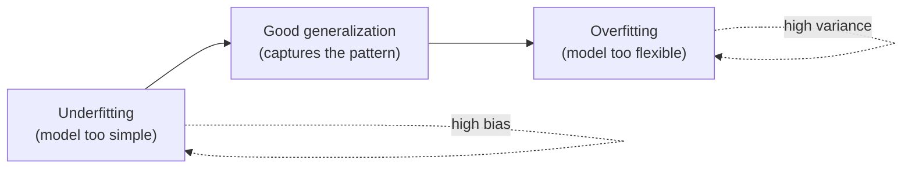

A model's job is not to describe the data it was trained on. Its job is to
work on data it has **never seen**. That ability — to perform well on new,
unseen examples — is called **generalization**, and it is the entire point
of machine learning. Everything in this chapter is about the two ways
generalization fails, how to recognize them, and what to do about them.

## What generalization really means

When you train a model, you show it examples and it adjusts itself to
explain them. But the training examples are just a finite *sample* drawn
from some larger reality. The pattern you actually care about lives in that
reality, not in your particular sample. A model that generalizes has
captured the underlying pattern. A model that fails to generalize has
latched onto quirks of the sample that will not repeat.

The two failure modes sit on opposite ends of a single dial — **model
complexity**. Turn it too low and the model is too rigid to capture the
pattern (**underfitting**). Turn it too high and the model is flexible
enough to memorize noise (**overfitting**). The art is finding the middle.

<Callout type="info" title="A one-sentence definition">
Generalization is the gap between how well a model does on data it trained
on and how well it does on data it did not. A small gap, at a good level of
performance, is the goal.
</Callout>

## Seeing both failures with one example

The cleanest way to build intuition is to watch a model fit a curve. We
will generate data from a gently wiggling true function, add a little
noise, and then fit polynomials of increasing flexibility. A degree-1
polynomial is a straight line (very rigid). A degree-15 polynomial can bend
almost anywhere (very flexible).

<CodeBlock
  adapter="python"
  starterCode={`import numpy as np
import matplotlib.pyplot as plt
from sklearn.preprocessing import PolynomialFeatures
from sklearn.linear_model import LinearRegression
from sklearn.pipeline import make_pipeline

# A known "true" pattern, plus noise. The model only sees the noisy dots.
rng = np.random.default_rng(0)

def true_function(x):
    return np.sin(1.5 * x)

x = np.sort(rng.uniform(0, 4, 30))
y = true_function(x) + rng.normal(0, 0.25, x.size)
X = x.reshape(-1, 1)

grid = np.linspace(0, 4, 300).reshape(-1, 1)

fig, axes = plt.subplots(1, 3, figsize=(13, 4))
for ax, degree, label in zip(axes, [1, 4, 15], ["Underfit", "Good fit", "Overfit"]):
    model = make_pipeline(PolynomialFeatures(degree), LinearRegression())
    model.fit(X, y)
    ax.scatter(x, y, s=18, color="#4f8ef7", label="training data")
    ax.plot(
        grid, true_function(grid.ravel()), "--", color="#34d399", label="true pattern"
    )
    ax.plot(grid, model.predict(grid), color="#f59e0b", label="model")
    ax.set_title(f"{label} (degree {degree})")
    ax.set_ylim(-2, 2)
axes[0].legend(fontsize=8)
plt.tight_layout()
plt.show()
`}
/>

Look at the three panels:

- **Degree 1 (underfit).** The straight line is too rigid to follow the
  curve. It is wrong in a *systematic* way — consistently above the data in
  some regions, below it in others. This is **high bias**.
- **Degree 4 (good fit).** The curve tracks the true green pattern closely
  without chasing individual dots. This generalizes.
- **Degree 15 (overfit).** The wild orange curve passes through nearly
  every training dot — including the noisy ones — and lurches violently
  between them. It has memorized the sample, not the pattern. This is
  **high variance**.

<Callout type="warn" title="Overfitting looks like success on the training data">
The degree-15 model has the *lowest* error on the training points — it
nearly touches every one. If training error were your scorecard, you would
pick the worst model. This is exactly why we hold data back.
</Callout>

## The complexity–error curve

Let us quantify what the eye just saw. We will sweep the polynomial degree
from rigid to flexible and, at each step, measure error on the training
data and on a held-out test set.

<CodeBlock
  adapter="python"
  starterCode={`import numpy as np
import matplotlib.pyplot as plt
from sklearn.preprocessing import PolynomialFeatures
from sklearn.linear_model import LinearRegression
from sklearn.pipeline import make_pipeline
from sklearn.model_selection import train_test_split
from sklearn.metrics import mean_squared_error

rng = np.random.default_rng(0)
x = np.sort(rng.uniform(0, 4, 80))
y = np.sin(1.5 * x) + rng.normal(0, 0.25, x.size)
X = x.reshape(-1, 1)

X_train, X_test, y_train, y_test = train_test_split(X, y, test_size=0.4, random_state=0)

degrees = range(1, 16)
train_err, test_err = [], []
for d in degrees:
    model = make_pipeline(PolynomialFeatures(d), LinearRegression())
    model.fit(X_train, y_train)
    train_err.append(mean_squared_error(y_train, model.predict(X_train)))
    test_err.append(mean_squared_error(y_test, model.predict(X_test)))

plt.figure(figsize=(8, 5))
plt.plot(list(degrees), train_err, "o-", color="#4f8ef7", label="training error")
plt.plot(list(degrees), test_err, "o-", color="#f59e0b", label="test error")
plt.xlabel("Model complexity (polynomial degree)")
plt.ylabel("Mean squared error")
plt.title("Training error keeps dropping; test error is U-shaped")
plt.ylim(0, 1.0)
plt.legend()
plt.show()

best = list(degrees)[int(np.argmin(test_err))]
print("Lowest test error at degree:", best)
`}
/>

This plot is one of the most important pictures in all of machine learning.
Notice the two curves behave completely differently:

- **Training error (blue) falls monotonically.** More flexibility always
  lets the model fit the training data better. Training error alone can
  *never* warn you about overfitting — it only ever improves.
- **Test error (orange) is U-shaped.** It drops as the model gains enough
  flexibility to capture the real pattern, bottoms out at the sweet spot,
  then rises as the model starts fitting noise.

The bottom of the U is the model you want. To the left of it you are
underfitting; to the right you are overfitting.

<Callout type="danger" title="The single most useful diagnostic">
**Compare training performance to test performance.** A small gap with good
scores means you are generalizing. A large gap (great on train, poor on
test) means overfitting. Both scores poor and close together means
underfitting. You cannot diagnose either failure from the training score
alone.
</Callout>

## The same dial on a different model

Polynomial degree is one complexity dial; every model family has its own.
For a decision tree, the dial is `max_depth`. Watch the identical pattern
emerge.

<CodeBlock
  adapter="python"
  starterCode={`import matplotlib.pyplot as plt
from sklearn.datasets import load_breast_cancer
from sklearn.model_selection import train_test_split
from sklearn.tree import DecisionTreeClassifier

X, y = load_breast_cancer(return_X_y=True)
X_train, X_test, y_train, y_test = train_test_split(
    X, y, test_size=0.3, random_state=0, stratify=y
)

depths = range(1, 16)
train_acc, test_acc = [], []
for d in depths:
    tree = DecisionTreeClassifier(max_depth=d, random_state=0)
    tree.fit(X_train, y_train)
    train_acc.append(tree.score(X_train, y_train))
    test_acc.append(tree.score(X_test, y_test))

plt.figure(figsize=(8, 5))
plt.plot(list(depths), train_acc, "o-", color="#4f8ef7", label="training accuracy")
plt.plot(list(depths), test_acc, "o-", color="#f59e0b", label="test accuracy")
plt.xlabel("Model complexity (max tree depth)")
plt.ylabel("Accuracy")
plt.title("Training accuracy races to 1.0; test accuracy plateaus then dips")
plt.legend()
plt.show()
`}
/>

Different algorithm, same story. As the tree is allowed to grow deeper, its
training accuracy climbs toward a perfect `1.0` while its test accuracy
rises, flattens, and then sags. Deep trees memorize; shallow trees
generalize but may be too simple. The right depth lives in between.

## Underfitting: the quieter failure

Overfitting gets all the attention because it is dramatic, but underfitting
is just as real and easier to miss. An underfit model is **too simple to
capture the pattern**, so it is wrong even on the training data. Symptoms:

- Training score is mediocre (not just test score).
- Training and test scores are similar — there is no gap to chase.
- Adding more training data does not help; the model lacks the capacity to
  use it.

The fix for underfitting is the opposite of the fix for overfitting: give
the model **more** capacity (a higher-degree polynomial, a deeper tree,
more/better features) rather than less.

<Callout type="tip" title="A quick mental flowchart">
Poor on training **and** test, scores close → **underfitting** (add
capacity or better features). Great on training, much worse on test →
**overfitting** (reduce capacity, regularize, or get more data). Good on
both, small gap → you are done.
</Callout>

## How to fight overfitting

When you have diagnosed overfitting, the toolbox is:

1. **Use a simpler model** — fewer features, lower degree, shallower tree,
   stronger regularization (e.g. a smaller `C` in `LogisticRegression`).
2. **Get more training data.** With enough examples, the noise averages out
   and even a flexible model struggles to memorize it.
3. **Regularize.** Penalize complexity directly (ridge/lasso for linear
   models, `max_depth`/`min_samples_leaf` for trees).
4. **Hold out and cross-validate honestly** so you actually notice the gap
   instead of celebrating the training score.

We will not chase every knob here — later chapters cover regularization and
cross-validation. The goal of this page is the *diagnosis*: knowing what
overfitting and underfitting look like, and that the test set is how you
tell them apart.

## Common misconceptions

- **"A model that scores 100% is the best model."** On training data, a
  perfect score is usually a symptom of overfitting, not excellence.
- **"Overfitting means the model is too big."** Not exactly — it means the
  model is too flexible *relative to the amount and cleanliness of the
  data*. The same model can overfit a tiny dataset and generalize on a
  large one.
- **"If test error is higher than training error, something is broken."** A
  small gap is normal and expected — the model has a slight home-field
  advantage on data it trained on. Only a *large* gap signals trouble.
- **"More features always help."** Each extra feature is another dimension
  in which the model can memorize noise. Irrelevant features make
  overfitting easier, not harder.

## Real-world applications

This is not academic. A credit-scoring model that overfits its historical
applicants will approve the wrong people next quarter. A medical model that
memorizes the quirks of one hospital's scanner will fail at the hospital
across town. A demand forecaster that underfits will miss every seasonal
swing. Teams that win in production are the ones that obsessively measure
the train–test gap before shipping.

## Your turn

<ChallengeCard
  adapter="python"
  title="Find the overfitting threshold"
  category="generalization · model complexity"
  estimatedTime="~7 min"
  instructions={`You are given a noisy 1-D regression dataset already split into
train and test sets (\`X_train, X_test, y_train, y_test\`).

For each polynomial degree in \`degrees = range(1, 11)\`:
1. Build \`make_pipeline(PolynomialFeatures(degree), LinearRegression())\`.
2. Fit it on the training set.
3. Record the **test** mean squared error in a list called \`test_errors\`
   (same order as \`degrees\`).

Then set \`best_degree\` to the degree with the lowest test error.

The tests check that \`test_errors\` has 10 entries and that \`best_degree\`
is the argmin (it should land between 3 and 6, not at 1 and not at 10).`}
  initCode={`import numpy as np
from sklearn.preprocessing import PolynomialFeatures
from sklearn.linear_model import LinearRegression
from sklearn.pipeline import make_pipeline
from sklearn.model_selection import train_test_split
from sklearn.metrics import mean_squared_error

rng = np.random.default_rng(7)
x = np.sort(rng.uniform(0, 4, 80))
y = np.sin(1.5 * x) + rng.normal(0, 0.25, x.size)
X = x.reshape(-1, 1)
X_train, X_test, y_train, y_test = train_test_split(X, y, test_size=0.4, random_state=7)
degrees = range(1, 11)`}
  starterCode={`test_errors = []

# TODO: loop over degrees, fit, record test MSE

best_degree = None
print("test_errors:", test_errors)
print("best_degree:", best_degree)
`}
  solutionCode={`test_errors = []
for degree in degrees:
    model = make_pipeline(PolynomialFeatures(degree), LinearRegression())
    model.fit(X_train, y_train)
    test_errors.append(mean_squared_error(y_test, model.predict(X_test)))

best_degree = list(degrees)[int(np.argmin(test_errors))]
print("test_errors:", test_errors)
print("best_degree:", best_degree)
`}
  tests={[
    {
      id: "len",
      name: "test_errors has 10 entries",
      description: "One per degree",
      code: `assert len(test_errors) == 10, f"Expected 10, got {len(test_errors)}"`,
    },
    {
      id: "argmin",
      name: "best_degree is the lowest-test-error degree",
      description: "It must match the argmin of test_errors",
      code: `import numpy as np
expected = list(range(1, 11))[int(np.argmin(test_errors))]
assert best_degree == expected, f"best_degree {best_degree} != argmin {expected}"`,
    },
    {
      id: "sweet_spot",
      name: "The sweet spot is in the middle, not at an extreme",
      description: "Neither the most rigid nor the most flexible model wins",
      code: `assert 2 <= best_degree <= 7, f"Unexpected best_degree {best_degree}"`,
    },
  ]}
/>

## Check your understanding

<MultipleChoice
  markdown={`As you increase a model's complexity, what happens to its error on the **training** data?

- It rises steadily
  > Training error does not rise with complexity; a more flexible model always has at least as much capacity to fit the training points, so it can only stay the same or improve on that data.
- It is U-shaped, falling then rising
  > The U-shape is the behavior of *test* error, not training error. Training error decreases monotonically as complexity grows because a more flexible model can always fit the training data at least as well.
- [o] It tends to fall continuously — more flexibility always lets the model fit the training data better
  > Training error decreases monotonically with complexity, which is exactly why it cannot, on its own, warn you about overfitting.
- It stays perfectly flat
  > Training error does not stay flat; as complexity increases the model has more capacity to fit (and eventually memorize) the training examples, so the error can only stay the same or decrease.

Because training error only improves with complexity, you need a separate held-out signal to detect overfitting.`}
/>

<MultipleChoice
  markdown={`A model scores 0.99 on training data and 0.78 on test data. What is happening?

- Underfitting
  > Underfitting shows up as *both* training and test scores being low and close together — the model is too simple to capture the pattern at all. A training score of 0.99 rules out underfitting.
- [o] Overfitting — the large gap between strong training and weaker test performance is its signature
  > A big train-minus-test gap means the model captured noise specific to the training sample. Trust the 0.78 and reduce complexity or add data.
- The model generalizes perfectly
  > A model that generalizes well shows a *small* gap between training and test scores, not a 21-point difference. The large gap here is a strong signal that the model memorized training-specific noise.
- The test set must be broken
  > A lower test score than training score is normal and expected; only a *large* gap signals overfitting. The pattern here — near-perfect training, noticeably lower test — is the classic overfitting signature, not a data problem.

The pattern "great on train, much worse on test" is the textbook definition of overfitting.`}
/>

<MultipleChoice
  markdown={`A model scores 0.71 on training data and 0.70 on test data. Which description fits best?

- Overfitting
  > Overfitting shows up as a large gap between a high training score and a lower test score — the model memorizes training data but fails to generalize. When both scores are similarly mediocre, the model is too simple, not too flexible.
- [o] Likely underfitting — both scores are mediocre and close together, suggesting the model is too simple to capture the pattern
  > When training and test scores are both low and nearly equal, there is no gap to blame on memorization; the model lacks the capacity to learn the pattern.
- Perfect generalization, nothing to improve
  > Perfect generalization means the model performs well on both training and test data with a small gap. Scores of 0.71 and 0.70 are mediocre — the model is underperforming, not succeeding.
- Data leakage
  > Data leakage typically causes the test score to be unrealistically high (close to the inflated training score), not both scores to be uniformly mediocre. The pattern here points to underfitting, not leakage.

Low-and-equal scores point to a model that is too rigid, not too flexible.`}
/>

<MultipleChoice
  markdown={`Which change would you try **first** to reduce overfitting in a decision tree?

- Increase \`max_depth\`
  > Increasing depth makes the tree *more* flexible, which would worsen overfitting by allowing it to carve out even finer regions around individual training points.
- Add more irrelevant features
  > Irrelevant features give the tree more dimensions to memorize noise, making overfitting worse, not better.
- [o] Decrease \`max_depth\` (or otherwise constrain the tree), making the model simpler
  > Limiting depth reduces the tree's flexibility so it can no longer carve out tiny regions around individual noisy points.
- Train on the test set as well
  > Training on the test set destroys it as an honest evaluation benchmark and does not reduce overfitting — it just hides it. The test set must remain untouched until final evaluation.

Overfitting is fought by reducing capacity, adding data, or regularizing — not by adding flexibility.`}
/>

<MultipleChoice
  markdown={`Why is "the model achieved 100% accuracy on the training data" usually a warning sign rather than good news?

- Because 100% accuracy is mathematically impossible
  > A perfect score on training data is mathematically possible and very common with sufficiently flexible models — for example, an unconstrained decision tree routinely reaches 100% training accuracy by memorizing each row.
- [o] Because a perfect training score often means the model memorized the training data, including its noise, and will likely generalize poorly
  > Perfectly fitting the training set, noise and all, is the hallmark of overfitting. The honest signal is the held-out test score.
- Because scikit-learn caps accuracy at 99%
  > scikit-learn does not cap accuracy; a model genuinely achieving 100% on training data will be reported as 1.0. The concern is what that score means, not whether it is technically possible.
- Because it always means the labels are wrong
  > Wrong labels would typically hurt training accuracy, not produce a perfect score. A perfect training score usually signals memorization by an overly flexible model, not label errors.

A flawless training score should prompt you to check the test score, not to celebrate.`}
/>

<MultipleChoice
  markdown={`Underfitting and overfitting are best described as:

- Two unrelated bugs
  > They are not bugs — they are structural properties of model complexity. Understanding that they live on opposite ends of one dial is precisely what lets you diagnose and fix them.
- The same thing under different names
  > Underfitting and overfitting are opposites: one is caused by too little model capacity and the other by too much. The fixes are also opposite — more complexity for underfitting, less for overfitting.
- [o] Opposite ends of the model-complexity dial — too simple versus too flexible — with good generalization in between
  > They are the two ways the complexity dial can be mis-set. Underfitting is too little capacity; overfitting is too much.
- Problems that only occur in deep learning
  > Underfitting and overfitting appear in every machine learning algorithm — linear models, decision trees, KNN, and others — not just deep learning. The examples on this page use polynomial regression and decision trees.

Seeing them as one dial with a sweet spot in the middle is the key mental model.`}
/>
