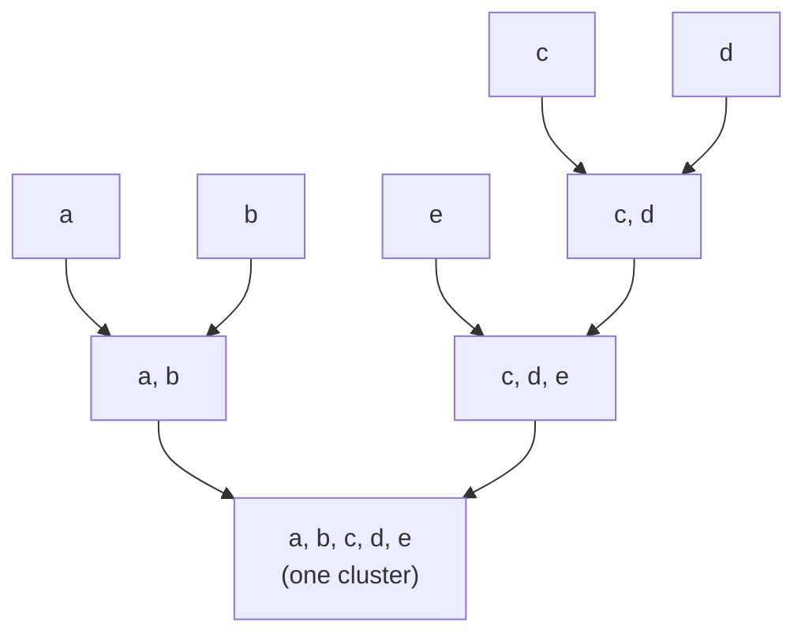
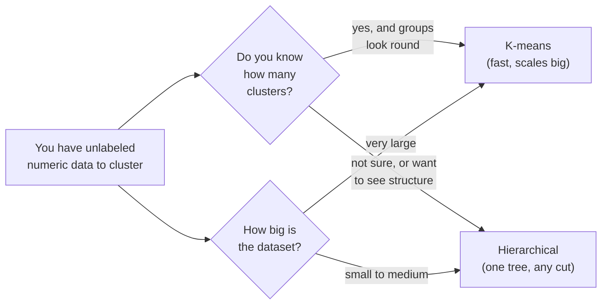

K-means asked you to make an awkward promise before you had even seen the
results: *how many clusters do you want?* You had to commit to `k`, then
hope the elbow agreed. **Hierarchical clustering** refuses to make you
choose so early. Instead of producing one flat partition, it builds an
entire **tree of clusters** — from "every point is its own cluster" all the
way up to "everything is one big cluster" — and lets you decide *afterward*
where to slice it.

That tree, drawn as a diagram called a **dendrogram**, is the real prize.
It does not just tell you the groups; it shows you which groups are tight,
which are loose, which two clusters are most similar, and how the whole
dataset nests together at every level of granularity. For many problems
that picture is worth more than any single set of labels.

This page assumes you have met clustering on the **K-Means Clustering**
page. We will lean on the same instincts — distance, "similar things belong
together," standardize before you measure distance — and add a new one:
*structure*.

<Callout type="info" title="Same family, different philosophy">
K-means and hierarchical clustering are both unsupervised and both
distance-based, but they think differently. K-means starts with `k` centers
and shuffles points around them. Hierarchical clustering never places
centers at all — it grows a tree by repeatedly fusing the two closest
clusters. Neither is "better"; they answer slightly different questions and
fail in different ways.
</Callout>

## The problem it solves

Real groupings are often **nested**, not flat. Think about how you would
organize animals: at a coarse level, mammals vs birds vs fish. Zoom in and
mammals split into primates, carnivores, rodents. Zoom further and
carnivores split into cats and dogs. There is no single "correct" number of
groups — it depends on how closely you want to look. A flat method like
k-means forces you to pick one zoom level. Hierarchical clustering captures
*all* of them at once.

So the question hierarchical clustering answers is broader than k-means's:
not just "what are the `k` groups?" but **"how do these points relate to
one another at every level of similarity, from individuals up to the whole
dataset?"**

Where you see this in the wild:

- **Taxonomy and phylogenetics.** Building evolutionary trees from genetic
  distances is hierarchical clustering by another name.
- **Customer or product hierarchies.** Coarse segments that split into
  finer sub-segments, all from one tree.
- **Document organization.** Topics that nest into subtopics.
- **Exploratory analysis on small data.** When you have a few dozen items
  and want to *see* their relationships before committing to anything, a
  dendrogram is often the single most informative plot you can make.

## The intuition: start apart, merge the closest, repeat

The most common form is **agglomerative** — a fancy word for "bottom-up,
by merging." (There is also a top-down "divisive" variant, but
agglomerative is what you will use and what scikit-learn provides.) The
recipe is almost embarrassingly simple:

1. **Start with every point as its own cluster.** With 20 points, you begin
   with 20 clusters of size one.
2. **Find the two closest clusters** and merge them into a single cluster.
3. **Repeat:** again find the two closest clusters (now including the merged
   one) and fuse them.
4. **Stop** when everything has been merged into one cluster at the top.

Each merge reduces the cluster count by exactly one, so after `n - 1`
merges you have gone from `n` singletons to one giant cluster. Along the
way you recorded *every* intermediate grouping. That recorded sequence of
merges **is** the tree.

Read that diagram bottom-up, the way the algorithm builds it. First `a` and
`b` are closest, so they merge. Separately `c` and `d` merge. Then `e`
joins the `{c, d}` cluster because it is closer to them than to `{a, b}`.
Finally the two remaining clusters fuse at the top. Every fork is a merge,
and the *height* at which two branches join tells you how far apart those
clusters were when they merged — the key to reading the real thing.

<Callout type="tip" title="The big idea: height encodes distance">
In a dendrogram, the vertical position of each merge is the distance
between the two clusters that fused there. Low merges joined very similar
things; high merges joined things that were quite different. So the tree is
not just a grouping — it is a *map of similarity*, with the y-axis as the
ruler.
</Callout>

## Clustering blobs with `AgglomerativeClustering`

If you just want flat labels — "put these points into `k` groups" —
scikit-learn's `AgglomerativeClustering` builds the tree internally and
cuts it for you at the `k` you ask for. The interface mirrors k-means, but
notice there is **no `n_init`**: the algorithm is deterministic, with no
random starts to retry.

<CodeBlock
  adapter="python"
  starterCode={`import numpy as np
from sklearn.datasets import make_blobs
from sklearn.cluster import AgglomerativeClustering
from sklearn.preprocessing import StandardScaler

# 300 points in 4 blobs. As always in clustering, we keep only X.
X, _ = make_blobs(n_samples=300, centers=4, cluster_std=0.70, random_state=0)

# Distance-based, so standardize first (same reasoning as k-means).
X_scaled = StandardScaler().fit_transform(X)

# Build the tree and cut it into 4 clusters.
agg = AgglomerativeClustering(n_clusters=4)
labels = agg.fit_predict(X_scaled)

values, counts = np.unique(labels, return_counts=True)
print("Cluster labels found:", values)
print("Points per cluster:  ", counts)
print("Total points:        ", counts.sum())
`}
/>

On clean blobs this gives essentially the same answer k-means would — four
sensible groups. The difference is what is happening underneath: there are
no centroids and no iteration toward them. The model fused points and
sub-clusters until only four remained, then handed you the result of
cutting the tree at that level.

<Callout type="info" title="No random_state, no n_init — and why">
Agglomerative clustering is **deterministic**: given the same data and the
same linkage rule, it always produces the same tree. There is no random
initialization to get unlucky with, so there is nothing to restart. That is
one genuine advantage over k-means — you never wonder whether a different
seed would have changed your clusters.
</Callout>

## Seeing the tree: a dendrogram on a small sample

The flat labels are useful, but they hide the structure that makes
hierarchical clustering special. To *see* the tree we draw a dendrogram,
and for that we use SciPy, whose `linkage` and `dendrogram` functions are
the standard tools.

A dendrogram of 300 points is an unreadable smear, so we plot a **small
sample** — about 18 points — where every leaf and merge is legible. This is
not a limitation of the method; it is just good visualization. You read the
*shape* on a small or summarized sample, then apply the method at full
scale for the labels.

<CodeBlock
  adapter="python"
  starterCode={`import matplotlib.pyplot as plt
from sklearn.datasets import make_blobs
from sklearn.preprocessing import StandardScaler
from scipy.cluster.hierarchy import dendrogram, linkage

# A SMALL sample so the tree is readable: 18 points in 3 blobs.
X, _ = make_blobs(n_samples=18, centers=3, cluster_std=0.60, random_state=0)
X_scaled = StandardScaler().fit_transform(X)

# linkage() runs agglomerative merging and records the whole tree.
Z = linkage(X_scaled, method="ward")

plt.figure(figsize=(9, 4))
dendrogram(Z)
plt.title("Dendrogram (ward linkage) — read the merges bottom to top")
plt.xlabel("point index")
plt.ylabel("merge distance (height)")
plt.show()
`}
/>

Spend a moment reading it, because this picture is the whole point:

- **The leaves at the bottom** are the 18 individual points, each starting
  as its own cluster.
- **Each upside-down U** is a merge. The two branches under it are the
  clusters that fused; the **height** of the U is how far apart they were.
- **Short merges near the bottom** join very similar points — these are your
  tight, confident sub-clusters.
- **The tall merges near the top** join groups that are quite different.
  See those one or two big vertical jumps? They are where the three real
  blobs finally get stitched together, and the large gap before them is the
  visual signature of "there are about three real clusters here."

<Callout type="tip" title="Choose k by where the tree has the biggest gap">
To pick the number of clusters from a dendrogram, imagine a horizontal line
sliding down from the top. Cut where you cross the **tallest vertical
stretch with no merges** — the biggest jump in merge distance. Cutting
there separates groups that were very far apart while keeping together
groups that were close. On the plot above, that long gap before the final
merges points squarely at three clusters.
</Callout>

### Cutting the tree at any level you like

The dendrogram makes hierarchical clustering's superpower concrete: **one
tree gives you every `k` at once.** You do not refit anything to change the
number of clusters — you just slide the cut line. SciPy's `fcluster` does
exactly this.

<CodeBlock
  adapter="python"
  starterCode={`import numpy as np
from sklearn.datasets import make_blobs
from sklearn.preprocessing import StandardScaler
from scipy.cluster.hierarchy import linkage, fcluster

X, _ = make_blobs(n_samples=18, centers=3, cluster_std=0.60, random_state=0)
X_scaled = StandardScaler().fit_transform(X)

# Build the tree ONCE.
Z = linkage(X_scaled, method="ward")

# Now cut it at several different k values — no refitting needed.
for k in [2, 3, 4, 5]:
    labels = fcluster(Z, t=k, criterion="maxclust")
    sizes = np.bincount(labels)[1:]   # fcluster labels start at 1
    print(f"Cut into k={k}:  cluster sizes = {sorted(sizes, reverse=True)}")
`}
/>

The same tree yields 2, 3, 4, or 5 clusters depending only on where you
slice. With k-means you would have had to rerun the algorithm from scratch
for each `k`. Here the expensive part — building the tree — happens once,
and exploring different granularities is free.

## Linkage: what "distance between two clusters" even means

There is a subtlety we glossed over. "Merge the two closest clusters" is
clear when clusters are single points. But once a cluster contains many
points, what is the distance *between two clusters*? There are several
reasonable definitions, and the choice — called the **linkage** — changes
the shape of the tree. The three you will meet most:

- **Ward** (the default and usually the safe first choice). Merges the two
  clusters that increase the total within-cluster variance the least. It
  favors compact, roughly equal-sized, spherical clusters — much like
  k-means in spirit. Use it as your default for numeric data.
- **Complete (maximum) linkage.** Distance between clusters is the distance
  between their two *farthest* points. This is cautious about merging — a
  cluster only joins another if *all* its members are reasonably close —
  so it produces compact clusters but can break up clusters that have any
  spread.
- **Average linkage.** Distance is the average over all pairs of points,
  one from each cluster. A middle ground between complete and the more
  permissive single linkage.

(There is a fourth, **single linkage** — nearest pair of points — which can
chain clusters together through stepping-stone points. It is occasionally
useful for elongated shapes but notoriously prone to "chaining" stray
points into one giant cluster, so reach for it deliberately, not by
default.)

<CodeBlock
  adapter="python"
  starterCode={`import numpy as np
from sklearn.datasets import make_blobs
from sklearn.cluster import AgglomerativeClustering
from sklearn.preprocessing import StandardScaler

X, _ = make_blobs(n_samples=300, centers=4, cluster_std=0.70, random_state=0)
X_scaled = StandardScaler().fit_transform(X)

# Same data, same k — only the linkage rule changes.
for link in ["ward", "complete", "average"]:
    agg = AgglomerativeClustering(n_clusters=4, linkage=link)
    labels = agg.fit_predict(X_scaled)
    sizes = np.bincount(labels)
    print(f"linkage={link:9s}  cluster sizes = {sorted(sizes, reverse=True)}")
`}
/>

On tidy, well-separated blobs all three linkages agree. The differences
surface on messier data: complete linkage insists on tight clusters,
average sits in between, and ward keeps things balanced. When a clustering
looks odd, switching the linkage is one of the first knobs to try.

<Callout type="warn" title="Linkage choice changes your answer">
There is no universally correct linkage — it encodes an *assumption* about
what a cluster should look like. Ward and complete both prefer compact
clusters; single linkage can string distant points into one long chain.
Picking a linkage is a modeling decision, not a default to ignore. When in
doubt, start with **ward** for numeric data, look at the dendrogram, and
try an alternative if the structure seems wrong.
</Callout>

## Building a full dendrogram from the scikit-learn model

You often want both worlds: scikit-learn's flat labels *and* the
dendrogram. scikit-learn can compute the full tree if you ask it to
(`distance_threshold=0`, `n_clusters=None`, `compute_distances=True`), after
which the merge information lives in `model.children_` and
`model.distances_`. SciPy's `dendrogram` can draw that directly once we pack
it into the linkage-matrix format SciPy expects. This helper is worth
keeping around.

<CodeBlock
  adapter="python"
  starterCode={`import numpy as np
import matplotlib.pyplot as plt
from sklearn.datasets import make_blobs
from sklearn.cluster import AgglomerativeClustering
from sklearn.preprocessing import StandardScaler
from scipy.cluster.hierarchy import dendrogram

def plot_dendrogram_from_model(model, **kwargs):
    # Count how many original points sit under each merged node.
    counts = np.zeros(model.children_.shape[0])
    n = len(model.labels_)
    for i, merge in enumerate(model.children_):
        total = 0
        for child in merge:
            total += 1 if child < n else counts[child - n]
        counts[i] = total
    # SciPy's linkage matrix: [child1, child2, distance, sample_count].
    Z = np.column_stack([model.children_, model.distances_, counts]).astype(float)
    dendrogram(Z, **kwargs)

X, _ = make_blobs(n_samples=18, centers=3, cluster_std=0.60, random_state=0)
X_scaled = StandardScaler().fit_transform(X)

# Ask the model to build the FULL tree (no cut), keeping all distances.
model = AgglomerativeClustering(
    n_clusters=None, distance_threshold=0, compute_distances=True
)
model.fit(X_scaled)

plt.figure(figsize=(9, 4))
plot_dendrogram_from_model(model)
plt.title("Full dendrogram from a scikit-learn AgglomerativeClustering model")
plt.xlabel("point index")
plt.ylabel("merge distance")
plt.show()
`}
/>

Now you can get scikit-learn's labels for any `k` and visualize the same
tree they came from — the best of both libraries.

## Hierarchical vs k-means: a direct comparison

These two methods are the classic pairing in introductory clustering, and
knowing when to pick which is a practical skill.

| | K-means | Hierarchical (agglomerative) |
|---|---|---|
| Must choose `k` upfront? | Yes | No — cut the tree afterward |
| Randomness | Yes (needs `n_init`) | No — deterministic |
| Speed / scale | Fast, scales to millions | Slow, struggles past a few thousand points |
| Output | Flat labels + centroids | A full tree (dendrogram) you can cut anywhere |
| Cluster shape | Round / spherical only | Depends on linkage; still distance-based |
| Best for | Large data, known-ish `k` | Exploring structure, small data, nested groups |

<Callout type="danger" title="Hierarchical clustering does not scale">
The honest cost of all that structure is **speed and memory**. Naive
agglomerative clustering compares every pair of points, which grows
roughly with the *square* (or worse) of the number of points. A few
thousand points is comfortable; tens of thousands is painful; hundreds of
thousands is usually out of the question. When your data is large, k-means
(or its mini-batch variant) is the practical choice, and you can still draw
a dendrogram on a representative *sample* to understand the structure.
</Callout>

## When to use hierarchical clustering — and when not to

**Reach for it when:**

- You do not know `k` and want the data to suggest it — slide the cut down
  the tree to the biggest gap.
- The structure is plausibly **nested** (taxonomies, sub-segments,
  topic/subtopic hierarchies).
- The dataset is **small to medium** and you value a clear visual map of
  relationships over raw speed.
- You want a *deterministic* result you can reproduce exactly, with no seed
  to worry about.

**Avoid it when:**

- The dataset is **large** — it will be slow and memory-hungry. Use k-means
  and dendrogram a sample instead.
- You need to assign **brand-new points** to clusters after fitting.
  K-means can do this instantly (find the nearest centroid); plain
  agglomerative clustering has no centroids and no natural "predict for a
  new point," so you would refit.
- The clusters are highly non-convex *and* you are using ward or complete
  linkage — those still prefer compact shapes, so they share k-means's
  blind spot for crescents and rings. (Single linkage or density methods
  like DBSCAN handle those better.)

<Callout type="info" title="A note on judging the result">
Hierarchical clustering, like k-means, gives you groups without telling you
whether they are *good*. The dendrogram's gaps are a strong visual hint,
but to put a number on cluster quality — how separated and cohesive the
clusters are — you use metrics like the **silhouette score**. We keep that
deep dive on the **Evaluating Clusters** page rather than repeating it here;
the same metrics apply no matter which clustering algorithm produced the
labels.
</Callout>

## Common misconceptions

- **"Hierarchical clustering avoids choosing `k`."** It avoids choosing `k`
  *before* fitting. To get actual flat labels you still pick a cut level —
  the tree just lets you do it afterward, with the dendrogram as a guide.
- **"The dendrogram's left-to-right order means something."** The horizontal
  ordering of leaves is partly cosmetic (chosen to avoid crossing
  branches). Only the **vertical** structure — what merges with what, and at
  what height — carries meaning.
- **"It is always better than k-means because it shows more."** It shows
  more but costs far more. On large data, hierarchical clustering is simply
  impractical, and k-means wins on speed and the ability to label new
  points.
- **"Linkage is a minor technical detail."** Linkage encodes what you think
  a cluster *is*. Changing it from ward to single can completely reshape the
  result. It is a real modeling choice.
- **"You can skip standardizing because there are no centroids."** No — it
  is still a distance-based method. Unscaled features let the
  largest-magnitude feature dominate every distance, exactly as in k-means.
  Standardize first.

## Your turn

<ChallengeCard
  adapter="python"
  title="Build the tree, cut it, and count the clusters"
  category="unsupervised learning · hierarchical clustering"
  estimatedTime="~7 min"
  instructions={`You are given \`X\`: 150 unlabeled points forming 3 blobs
(the true labels are hidden, as in real clustering).

1. Standardize \`X\` with \`StandardScaler\` into \`X_scaled\` — hierarchical
   clustering is distance-based, so features must be on a comparable scale.
2. Fit \`AgglomerativeClustering\` with \`n_clusters=3\` and \`linkage="ward"\`
   on \`X_scaled\`. Store the per-point labels in \`labels\` (use
   \`fit_predict\`).
3. Store the number of distinct clusters found in \`n_found\`.
4. Store the size of the LARGEST cluster (its point count) in
   \`largest_cluster\`. Hint: \`np.bincount(labels)\` gives the count per
   label; take its \`max()\`.

The hidden tests check that you standardized the data, found exactly 3
clusters, labeled all 150 points, and that the largest cluster size is
consistent with the data.`}
  initCode={`import numpy as np
from sklearn.datasets import make_blobs
from sklearn.cluster import AgglomerativeClustering
from sklearn.preprocessing import StandardScaler

# 3 blobs of unequal size. Only X is exposed (no labels).
X, _ = make_blobs(
    n_samples=[70, 50, 30], centers=None,
    cluster_std=0.7, random_state=0
)`}
  starterCode={`# 1. Standardize the features
X_scaled = None

# 2. Fit AgglomerativeClustering (n_clusters=3, linkage="ward") and get labels
labels = None

# 3. How many distinct clusters were found?
n_found = None

# 4. Size of the largest cluster
largest_cluster = None

print("clusters found:", n_found)
print("largest cluster size:", largest_cluster)
`}
  solutionCode={`# 1. Standardize the features
X_scaled = StandardScaler().fit_transform(X)

# 2. Fit AgglomerativeClustering and get per-point labels
agg = AgglomerativeClustering(n_clusters=3, linkage="ward")
labels = agg.fit_predict(X_scaled)

# 3. Number of distinct clusters
n_found = len(np.unique(labels))

# 4. Largest cluster size
largest_cluster = int(np.bincount(labels).max())

print("clusters found:", n_found)
print("largest cluster size:", largest_cluster)
`}
  tests={[
    {
      id: "scaled_shape",
      name: "X_scaled has the right shape",
      description: "Scaling preserves the 150x2 shape",
      code: `import numpy as np
assert X_scaled is not None, "X_scaled is still None"
assert np.asarray(X_scaled).shape == (150, 2), f"Expected (150, 2), got {np.asarray(X_scaled).shape}"`,
    },
    {
      id: "is_standardized",
      name: "Features were standardized",
      description: "Each column has mean ~0 and std ~1",
      code: `import numpy as np
m = np.asarray(X_scaled).mean(axis=0)
s = np.asarray(X_scaled).std(axis=0)
assert np.allclose(m, 0, atol=1e-6), f"Column means not ~0: {m}"
assert np.allclose(s, 1, atol=1e-6), f"Column stds not ~1: {s}"`,
    },
    {
      id: "three_clusters",
      name: "Exactly 3 clusters were found",
      description: "n_found equals 3",
      code: `assert n_found == 3, f"Expected 3 clusters, got {n_found}"`,
    },
    {
      id: "all_points_labeled",
      name: "Every point got a label",
      description: "labels has one entry per point",
      code: `import numpy as np
assert labels is not None, "labels is still None"
assert len(labels) == 150, f"Expected 150 labels, got {len(labels)}"`,
    },
    {
      id: "largest_size",
      name: "Largest cluster size is valid",
      description: "It is the max bincount and no bigger than 150",
      code: `import numpy as np
expected = int(np.bincount(labels).max())
assert largest_cluster == expected, f"Expected largest cluster {expected}, got {largest_cluster}"
assert 0 < largest_cluster <= 150, f"Largest cluster out of range: {largest_cluster}"`,
    },
  ]}
/>

## Check your understanding

<MultipleChoice
  markdown={`In **agglomerative** hierarchical clustering, how does the process begin?

- With \`k\` randomly placed cluster centers
- With every point already assigned to one of \`k\` groups
- [o] With every individual point as its own separate cluster, which are then merged two at a time
  > Agglomerative means bottom-up: each point starts alone, and the two closest clusters are repeatedly fused until one cluster remains. No centers and no preset \`k\` are involved at the start.
- With the two farthest points forming the first cluster

The method builds upward from singletons by merging, recording the full tree along the way.`}
/>

<MultipleChoice
  markdown={`In a dendrogram, what does the **height** at which two branches merge represent?

- The number of points in the resulting cluster
- [o] The distance between the two clusters at the moment they were merged — higher means they were more different
  > The y-axis is the merge distance. Short, low merges join very similar clusters; tall merges join clusters that were far apart, which is why a large gap before the top suggests a natural number of clusters.
- The order in which the points were loaded
- The variance of a single point

Reading the vertical heights is how you interpret similarity and decide where to cut the tree.`}
/>

<MultipleChoice
  markdown={`What is a genuine advantage of hierarchical clustering over k-means?

- It always runs faster on very large datasets
- It guarantees spherical clusters
- [o] You do not have to commit to the number of clusters before fitting — one tree can be cut at any level to yield different numbers of clusters
  > Building the tree once lets you explore every \`k\` by sliding the cut, and it is deterministic with no random restarts. K-means, by contrast, fixes \`k\` upfront and must be rerun for each new value.
- It can label brand-new points instantly without refitting

Its flexibility about \`k\` and its deterministic tree are the real selling points; speed is not one of them.`}
/>

<MultipleChoice
  markdown={`Your dataset has roughly 500,000 points. Why is plain agglomerative hierarchical clustering usually a poor choice here?

- It cannot handle numeric features
- It requires labels to run
- [o] Its time and memory cost grows roughly with the square of the number of points, so hundreds of thousands of points become impractically slow and memory-hungry
  > Comparing all pairs of clusters scales quadratically (or worse), which is fine for a few thousand points but prohibitive at half a million. K-means scales far better; you can still dendrogram a representative sample.
- Dendrograms can only display exactly 10 points

Hierarchical clustering trades scalability for structure, so very large data calls for k-means instead.`}
/>

<MultipleChoice
  markdown={`Before running hierarchical clustering on features measured in different units (e.g. age in years and income in dollars), why should you standardize them first?

- Standardizing is only needed for k-means, not hierarchical clustering
- It converts the labels into numbers
- [o] Hierarchical clustering merges clusters based on distance, and without standardizing, the feature with the largest numeric range dominates every distance — so you scale to give each feature an equal say
  > Like k-means, agglomerative clustering is distance-based even though it has no centroids. Unscaled features let the biggest-magnitude column drive the merges, so standardizing first keeps the comparison fair.
- Standardizing guarantees the clusters will be perfectly spherical

Any distance-based clustering method needs comparably scaled features, which is why standardizing comes first.`}
/>
