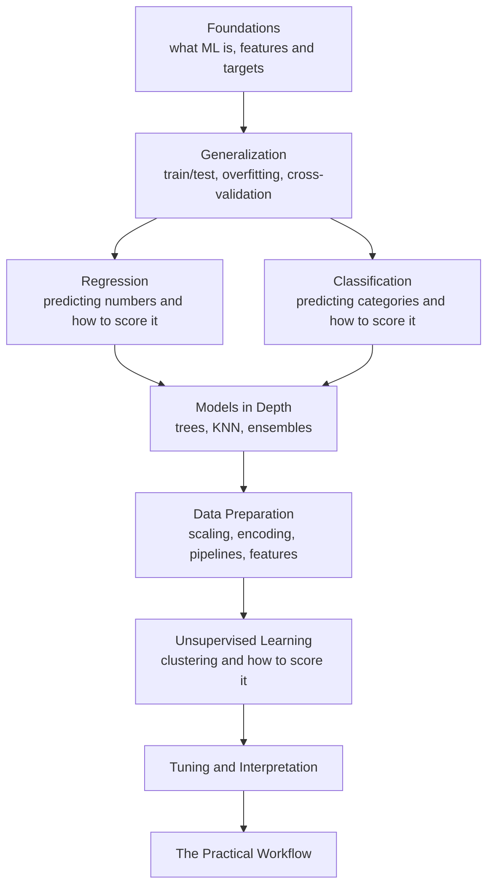

Welcome to **Machine Learning with scikit-learn**. This course is for the
person who can already load a CSV into Pandas, draw a histogram, run a
t-test, and describe what a dataset contains — but who keeps hearing the
phrase "machine learning" and wants to understand what it *actually is*,
not just which function to call.

This is not an API reference. You can always look up the arguments to
`RandomForestClassifier`. What you cannot google in the moment is
**judgment**: whether your model is actually any good, whether it will
work on data it has never seen, whether the metric you are celebrating is
quietly lying to you. That judgment is the real subject of this course.

<svg
  viewBox="0 0 640 200"
  role="img"
  aria-label="A layered sunrise dome rising over a baseline while small blue and green data dots arc overhead like first light — the start of the journey from raw data to judgment"
  style={{ display: "block", width: "100%", maxWidth: "640px", height: "auto", margin: "2.5rem auto" }}
>
  <g style={{ color: "var(--ds-blue-500)" }} fill="currentColor">
    <path d="M170 168 A150 150 0 0 1 470 168 Z" fillOpacity="0.07" />
    <path d="M215 168 A105 105 0 0 1 425 168 Z" fillOpacity="0.13" />
  </g>
  <g style={{ color: "var(--ds-yellow-500)" }} fill="currentColor">
    <path d="M258 168 A62 62 0 0 1 382 168 Z" fillOpacity="0.25" />
    <path d="M290 168 A30 30 0 0 1 350 168 Z" />
  </g>
  <g fill="currentColor" opacity="0.3">
    <rect x="60" y="168" width="520" height="4" rx="2" />
  </g>
  <g style={{ color: "var(--ds-blue-500)" }} fill="currentColor">
    <circle cx="209" cy="104" r="4.5" fillOpacity="0.55" />
    <circle cx="320" cy="40" r="4.5" fillOpacity="0.55" />
    <circle cx="431" cy="104" r="4.5" fillOpacity="0.55" />
  </g>
  <g style={{ color: "var(--ds-green-500)" }} fill="currentColor">
    <circle cx="256" cy="58" r="4.5" fillOpacity="0.7" />
    <circle cx="384" cy="58" r="4.5" fillOpacity="0.7" />
  </g>
</svg>

<Callout type="info" title="No setup required">
Every code block on every page runs a full Python environment right here in
your browser. There is nothing to install and no notebook to launch. Edit
the code, press **Run**, and the output appears beneath the editor. The
same goes for the challenge cards — write a solution, press **Check
Answer**, and see which tests pass.
</Callout>

## Who this course is for

You will feel at home here if most of these describe you:

- You are comfortable writing Python: functions, loops, lists, dictionaries.
- You have used Pandas to load, filter, group, and summarize data.
- You have drawn a few charts and can read a scatter plot.
- You know what a mean, a standard deviation, and a correlation are.
- You have run a hypothesis test, even if the details are fuzzy.

You do **not** need:

- Any prior machine learning experience.
- Linear algebra or calculus beyond a vague memory of slopes and lines.
- A powerful computer, a GPU, or a cloud account.

<Callout type="warn" title="This is a foundations course, on purpose">
We focus on the classical, interpretable workhorses of machine learning:
linear models, trees, nearest neighbors, ensembles, and clustering — all
through scikit-learn. We deliberately **do not** cover deep learning,
neural networks, or large language models. Those are wonderful topics, but
they make no sense until the foundations below are second nature. Master
these first and the rest of the field becomes far easier to learn.
</Callout>

## What you will be able to do

By the end you will be able to:

- Frame a real problem as a machine learning task — and recognize when it
  is *not* one.
- Split data correctly so your evaluation reflects reality.
- Train regression, classification, and clustering models in a few lines.
- Choose and **interpret** the right evaluation metric — and explain what
  it does *not* tell you.
- Diagnose overfitting and underfitting, and reason about the
  bias–variance tradeoff.
- Build leak-free preprocessing with `Pipeline` and `ColumnTransformer`.
- Tune models with cross-validation instead of fooling yourself.
- Explain *why* a model made a prediction.

## How the course is organized

Notice that **generalization** sits right after the foundations and
everything flows out of it. That ordering is intentional. The single most
important idea in machine learning is not any particular algorithm — it is
whether a model works on data it has never seen. We establish that idea
early and return to it on nearly every page.

## A taste of what is coming

Here is a complete machine learning program. It loads a famous tiny
dataset of iris flowers, trains a model to tell three species apart from
their petal and sepal measurements, and reports how often it is right on
flowers it was never trained on. Press **Run**.

<CodeBlock
  adapter="python"
  files={[
    {
      filename: "main.py",
      starterCode: `from sklearn.datasets import load_iris
from sklearn.model_selection import train_test_split
from sklearn.neighbors import KNeighborsClassifier

# Load 150 flowers: 4 measurements each, 3 species.
X, y = load_iris(return_X_y=True)

# Hold out 30% of the flowers so we can test on data the model never saw.
X_train, X_test, y_train, y_test = train_test_split(X, y, test_size=0.3, random_state=0)

# Train a model and measure accuracy on the held-out flowers.
model = KNeighborsClassifier(n_neighbors=5)
model.fit(X_train, y_train)

accuracy = model.score(X_test, y_test)
print(f"Correct on {accuracy:.0%} of flowers the model had never seen.")
`,
    },
  ]}
/>

Five lines of real modeling, and a result you can trust because it was
measured on held-out data. You do not yet need to understand every line —
that is what the next thirty pages are for. But notice the shape already:
**load data, split it, train, evaluate on what was held out**. That shape
never changes. Every model in this course, from a one-line linear
regression to a hundred-tree random forest, follows it.

## How the interactive widgets work

You will meet three kinds of widget:

1. **Executable code blocks** — like the one above. Edit and re-run them as
   much as you like; experimentation is the point.
2. **Challenge cards** — small problems with hidden tests. You write the
   solution and press **Check Answer** to see which tests pass.
3. **Multiple-choice questions** — quick conceptual checks with an
   explanation for *every* option, right or wrong.

<Callout type="info" title="Each code block starts fresh">
Variables you define in one code block are **not** carried into the next
one, even on the same page. When a block needs setup from an earlier one,
we either repeat it or provide it for you. This keeps every example
self-contained and re-runnable in any order.
</Callout>

## A note on philosophy

Most machine learning tutorials are a parade of model names: import this,
call `.fit()`, admire the accuracy, move on. You finish with a vocabulary
but no understanding, and the first time a model misbehaves you have no
idea why.

We take the slower, more durable path. For every concept we ask the same
questions: **What problem does this solve? Why does it exist? When should
you reach for it — and when should you not? What do people get wrong about
it?** Algorithms are tools, and tools only make sense once you understand
the job they were built for.

Let us start at the very beginning: what *is* machine learning, really?

<Callout type="tip" title="How to use this course">
Run every code block. Then change something — a number, a column, a model
— and predict what will happen before you press **Run** again. The gap
between what you expected and what you got is where the learning happens.
</Callout>
