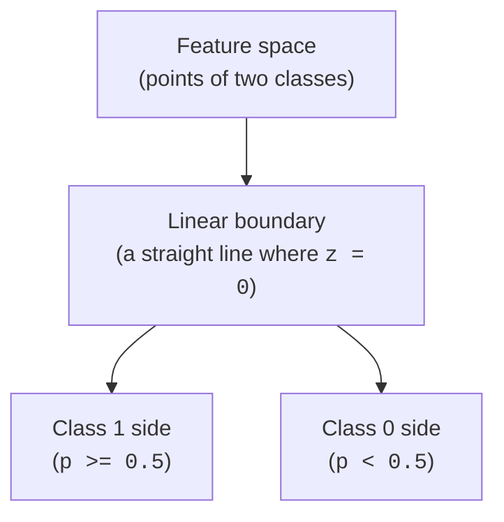

Let us clear up the most confusing name in machine learning before we do
anything else. **Logistic regression is a classification algorithm.** It
predicts *categories* — spam or not, malignant or benign, will-churn or
will-stay — not numbers. The word "regression" in its name is a historical
accident about the math under the hood, and it trips up nearly every
newcomer. Whenever you see "logistic regression," think **classifier**.

With that settled: logistic regression is to classification what linear
regression is to predicting numbers — the simple, fast, interpretable
baseline you reach for first and that everything fancier has to beat. It is
probably the single most widely deployed classifier in the world.

<Callout type="danger" title="The one misconception to kill on sight">
**Logistic regression does NOT predict a continuous number, and it is not a
flavor of linear regression for regression tasks.** It predicts a **class**.
The "regression" in the name refers to the linear score it computes
internally, which it then squashes into a probability and converts to a
class. If you take away one thing from this page, take this: logistic
regression is a *classification* algorithm.
</Callout>

<Callout type="info" title="Where this sits">
The four-move workflow is unchanged — **load, split, train, evaluate** — and
this is still a `.fit()` / `.predict()` estimator like the ones in **Your
First Model, End to End**. What is new is *how* it makes a decision and the
extra `.predict_proba()` method for probabilities. If linear regression's
coefficients are fresh in your mind, you are well set up: logistic
regression reuses the same weighted-sum idea.
</Callout>

## The problem it solves

You want a yes-or-no answer, and ideally a *confidence* with it. Is this
transaction fraudulent? Will this patient's tumor turn out malignant? Will
this user click? A bare label ("fraud") is useful, but a **probability**
("87% chance of fraud") is far more useful — it lets you rank cases, set
thresholds, and decide how much to trust each call.

Linear regression cannot do this directly. Its straight line runs off to
plus and minus infinity, so it happily predicts -0.3 or 1.8 — nonsense as a
probability, which must live between 0 and 1. Logistic regression is the fix:
it keeps linear regression's interpretable weighted-sum core but **bends the
output into the 0-to-1 range** so it reads as a genuine probability.

## The intuition: linear score, then a squash

Logistic regression works in three steps. Hold this pipeline in your head and
the whole algorithm follows:

**Features → linear score `z` → sigmoid squash → probability `p` → threshold at 0.5 → class 1 or class 0**

**Step 1 — a linear score.** Exactly like linear regression, the model
computes a weighted sum of the features plus a constant:
`z = intercept + w1*x1 + w2*x2 + ...`. This `z` can be any number, from
hugely negative to hugely positive. A large positive `z` leans toward
"yes"; a large negative `z` leans toward "no."

**Step 2 — squash with the sigmoid.** We feed `z` through the **sigmoid**
function, `p = 1 / (1 + e^-z)`. The sigmoid is an S-shaped curve that takes
any number and gently maps it into the open interval (0, 1). Very negative
`z` maps near 0, very positive `z` near 1, and `z = 0` maps to exactly 0.5.
Now the output is a legitimate probability.

**Step 3 — threshold into a class.** A probability is not yet a decision. We
apply a **threshold**, by default 0.5: if `p >= 0.5` predict class 1,
otherwise class 0. That is the difference between `.predict_proba()` (gives
you `p`) and `.predict()` (gives you the class after thresholding).

<Callout type="tip" title="Meet the sigmoid">
The sigmoid is the heart of the model: an S-curve that turns an unbounded
score into a 0-to-1 probability. It is steep in the middle (small changes in
the score move the probability a lot near 0.5) and flat at the extremes (once
the model is very confident, more evidence barely moves the probability).
That shape is exactly what we want from a confidence: decisive in the
ambiguous middle, saturating when the answer is clear.
</Callout>

Let us actually look at the sigmoid so the S-shape is concrete.

<CodeBlock
  adapter="python"
  starterCode={`import numpy as np
import matplotlib.pyplot as plt

# The sigmoid: squashes any real number into (0, 1).
z = np.linspace(-8, 8, 200)
p = 1 / (1 + np.exp(-z))

plt.figure(figsize=(6, 4))
plt.plot(z, p, linewidth=2)
plt.axhline(0.5, color="gray", linestyle="--", label="threshold = 0.5")
plt.axvline(0.0, color="gray", linestyle=":", alpha=0.7)
plt.xlabel("linear score z")
plt.ylabel("probability p")
plt.title("The sigmoid turns a score into a probability")
plt.legend()
plt.show()

print("z = -5  -> p =", round(1 / (1 + np.exp(5)), 3))
print("z =  0  -> p =", round(1 / (1 + np.exp(0)), 3))
print("z =  5  -> p =", round(1 / (1 + np.exp(-5)), 3))
`}
/>

See how `z = 0` lands exactly on `p = 0.5` (the threshold line), and how the
curve flattens toward 0 and 1 at the edges. The point where `z = 0` — and
therefore `p = 0.5` — is the **decision boundary**: on one side the model
predicts class 1, on the other class 0.

## The decision boundary is a straight line

Because the score `z` is a *linear* combination of the features, the place
where `z = 0` (the boundary between the two classes) is a straight line in
2D, a flat plane in 3D, a hyperplane in general. This is the defining trait
of logistic regression: **it carves the feature space with a single
straight cut.** That makes it simple and interpretable, and it is also its
main limitation, as we will see.

## Logistic regression in practice: breast cancer

Time to train one. The `load_breast_cancer` dataset has 569 tumors, each
described by 30 measurements (radius, texture, smoothness, and so on). The
target is binary: **0 = malignant, 1 = benign**. We will predict which from
the measurements.

<CodeBlock
  adapter="python"
  starterCode={`from sklearn.datasets import load_breast_cancer
from sklearn.model_selection import train_test_split
from sklearn.linear_model import LogisticRegression

# 0 = malignant, 1 = benign
data = load_breast_cancer()
X, y = data.data, data.target
print("Classes:", dict(zip([0, 1], data.target_names)))

X_train, X_test, y_train, y_test = train_test_split(
    X, y, test_size=0.25, random_state=0, stratify=y
)

# max_iter=1000 gives the optimizer room to converge on this data.
model = LogisticRegression(max_iter=1000)
model.fit(X_train, y_train)

print("Test accuracy:", round(model.score(X_test, y_test), 3))
`}
/>

Around 94% accuracy from a model that is, at heart, a single weighted sum
passed through an S-curve. That is the appeal: cheap, fast, and remarkably
strong on data where a straight boundary roughly separates the classes.

<Callout type="info" title="Why max_iter=1000?">
Logistic regression finds its coefficients by iterative optimization. On
some datasets the default iteration budget is too small and you get a
"failed to converge" warning. Passing `max_iter=1000` simply gives the
optimizer more steps. It does not change the model — it just lets the fit
finish settling. (Scaling the features, covered in the data-prep chapter,
also helps it converge faster.)
</Callout>

## `.predict()` versus `.predict_proba()`

This is the part worth slowing down for, because the *probability* is often
the whole reason to use logistic regression. `.predict()` gives you the
class. `.predict_proba()` gives you the probability behind that class — the
model's confidence.

<CodeBlock
  adapter="python"
  starterCode={`from sklearn.datasets import load_breast_cancer
from sklearn.model_selection import train_test_split
from sklearn.linear_model import LogisticRegression

data = load_breast_cancer()
X, y = data.data, data.target
X_train, X_test, y_train, y_test = train_test_split(
    X, y, test_size=0.25, random_state=0, stratify=y
)
model = LogisticRegression(max_iter=1000)
model.fit(X_train, y_train)

# Hard class labels for the first 5 test tumors.
classes = model.predict(X_test[:5])

# Probabilities: one column per class, each ROW sums to 1.
probs = model.predict_proba(X_test[:5])

print("classes_ order:", model.classes_, "(col 0 = malignant, col 1 = benign)")
print()
print("P(malignant)  P(benign)   predicted   actual")
for prob, cls, actual in zip(probs, classes, y_test[:5]):
    print(f"   {prob[0]:.3f}        {prob[1]:.3f}        {cls}          {actual}")
`}
/>

A few things to read off that table. `predict_proba` returns **one column
per class**, in the order shown by `model.classes_`, and **each row sums to
1** (the probabilities of all classes must add up). The predicted class is
simply the column with the higher probability — that is, applying the 0.5
threshold to the class-1 probability.

<Callout type="tip" title="predict is just predict_proba plus a threshold">
For binary logistic regression, `model.predict(X)` is *exactly*
`model.predict_proba(X)[:, 1] >= 0.5`. The class is the probability after
thresholding. This means you can change the cutoff yourself: if missing a
malignant tumor is far worse than a false alarm, you might predict
"malignant" whenever its probability exceeds, say, 0.3 instead of 0.5 —
trading more false alarms for fewer misses. Choosing that threshold well —
using precision, recall, and ROC curves — is a core skill the course's
classification-evaluation material covers in depth.
</Callout>

Let us make the threshold idea tangible by moving it ourselves.

<CodeBlock
  adapter="python"
  starterCode={`import numpy as np
from sklearn.datasets import load_breast_cancer
from sklearn.model_selection import train_test_split
from sklearn.linear_model import LogisticRegression

data = load_breast_cancer()
X, y = data.data, data.target
X_train, X_test, y_train, y_test = train_test_split(
    X, y, test_size=0.25, random_state=0, stratify=y
)
model = LogisticRegression(max_iter=1000)
model.fit(X_train, y_train)

# Probability of the POSITIVE class (class 1 = benign) for every test tumor.
p_benign = model.predict_proba(X_test)[:, 1]

# Apply different thresholds ourselves and count how many are called "benign".
for t in [0.3, 0.5, 0.7]:
    called_benign = int((p_benign >= t).sum())
    print(f"threshold {t}: {called_benign} of {len(p_benign)} tumors called benign")

# The default 0.5 threshold reproduces model.predict exactly.
default = (p_benign >= 0.5).astype(int)
print("Matches model.predict():", np.array_equal(default, model.predict(X_test)))
`}
/>

Raise the threshold and the model becomes more reluctant to say "benign";
lower it and it says "benign" more freely. Same model, same probabilities —
only the cutoff moved. The probability is the model's real output; the
threshold is a *decision* you control.

## Coefficients: log-odds, kept intuitive

Like linear regression, a fitted logistic regression stores its learning in
`coef_` and `intercept_`. The interpretation is slightly less direct,
because the coefficients act on the *score* `z`, not on the probability
itself. Keep it intuitive:

- A **positive** coefficient means: as that feature increases, the score
  `z` rises, which pushes the probability of class 1 **up**.
- A **negative** coefficient pushes the probability of class 1 **down**.
- A coefficient near **zero** means that feature barely moves the decision.

<CodeBlock
  adapter="python"
  starterCode={`from sklearn.datasets import load_breast_cancer
from sklearn.model_selection import train_test_split
from sklearn.linear_model import LogisticRegression

data = load_breast_cancer()
X, y = data.data, data.target
X_train, X_test, y_train, y_test = train_test_split(
    X, y, test_size=0.25, random_state=0, stratify=y
)
model = LogisticRegression(max_iter=1000)
model.fit(X_train, y_train)

coefs = list(zip(data.feature_names, model.coef_[0]))

# The features that most push the prediction toward each class.
coefs.sort(key=lambda pair: pair[1])
print("Most toward class 0 (malignant):")
for name, c in coefs[:3]:
    print(f"  {name:24s} {c:+.3f}")
print("Most toward class 1 (benign):")
for name, c in coefs[-3:]:
    print(f"  {name:24s} {c:+.3f}")
`}
/>

The precise statement is that each coefficient is the change in the **log-
odds** of class 1 per unit of the feature, but you rarely need that
phrasing day to day. The *sign* tells you the direction of the push and the
*magnitude* tells you the strength — and, just as with linear regression,
magnitudes are only comparable when the features share a scale.

<Callout type="warn" title="Coefficient size depends on feature scale">
The same caution from linear regression applies: a coefficient's magnitude
is tied to its feature's units, so do not read raw coefficient sizes as a
clean importance ranking. Logistic regression also genuinely *benefits* from
scaled features — it converges faster and the coefficients become
comparable. The data-preparation chapter shows how to scale inside a
pipeline so it stays leak-free.
</Callout>

## Multiclass: it is not only for two classes

Logistic regression extends naturally to more than two classes. scikit-learn
handles this for you — on iris (three species) it simply learns a score per
class and picks the highest. The code is identical; only the number of
probability columns changes.

<CodeBlock
  adapter="python"
  starterCode={`from sklearn.datasets import load_iris
from sklearn.model_selection import train_test_split
from sklearn.linear_model import LogisticRegression

X, y = load_iris(return_X_y=True)
X_train, X_test, y_train, y_test = train_test_split(
    X, y, test_size=0.25, random_state=0, stratify=y
)
model = LogisticRegression(max_iter=1000)
model.fit(X_train, y_train)

print("Test accuracy:", round(model.score(X_test, y_test), 3))

# Now predict_proba has THREE columns -- one probability per species.
probs = model.predict_proba(X_test[:3])
print("classes_:", model.classes_)
for row in probs:
    print("  probabilities:", [round(p, 3) for p in row], "-> sum", round(row.sum(), 3))
`}
/>

Each row still sums to 1, now across three classes, and the predicted
species is the column with the largest probability. The mental model is the
same: linear scores, squashed and normalized into probabilities, then the
biggest one wins.

## When to use it — and when not to

<Callout type="success" title="When to reach for logistic regression">
Use it when you want a **fast, interpretable classification baseline**, when
you need **calibrated-ish probabilities** rather than just labels, when the
classes are roughly separable by a straight boundary, or when you must
*explain* which features drive the decision and in which direction. As with
linear regression, it is almost always the right *first* classifier — beat
it before reaching for anything heavier.
</Callout>

The flip side is that its straight-line boundary is also its ceiling.

- **Nonlinear boundaries.** If the classes are separated by a curve or a
  ring rather than a straight line, a single linear cut cannot split them.
  The classic illustration is two interleaving moons or concentric
  circles — logistic regression draws one straight line through them and
  fails. You either engineer nonlinear features or switch to a model that
  bends, like a decision tree, a random forest, or an SVM with a nonlinear
  kernel.
- **Strong feature interactions.** Like linear regression, the basic model
  is additive; effects that depend on combinations of features are not
  captured unless you add interaction terms.
- **Highly correlated features.** Heavy multicollinearity makes individual
  coefficients unstable. Regularization (which scikit-learn applies by
  default) helps, but interpret coefficients cautiously.

Here is the nonlinear failure made visible. `make_moons` produces two
interleaving crescents that no straight line can separate.

<CodeBlock
  adapter="python"
  starterCode={`from sklearn.datasets import make_moons
from sklearn.model_selection import train_test_split
from sklearn.linear_model import LogisticRegression

# Two interleaving crescents -- not linearly separable.
X, y = make_moons(n_samples=300, noise=0.2, random_state=0)
X_train, X_test, y_train, y_test = train_test_split(
    X, y, test_size=0.25, random_state=0
)

model = LogisticRegression(max_iter=1000)
model.fit(X_train, y_train)

print("Logistic regression accuracy on moons:", round(model.score(X_test, y_test), 3))
print("A single straight boundary cannot fully separate two crescents.")
`}
/>

The accuracy is mediocre — not because the model is broken, but because the
problem's true boundary is *curved* and logistic regression can only draw a
*straight* one. That is the assumption talking. On data with a roughly
linear boundary (like the breast cancer set earlier), the very same model
shines.

<Callout type="info" title="Evaluation goes deeper than accuracy">
Accuracy is a fine first headline, but for classification it can badly
mislead — especially with imbalanced classes, where predicting the majority
every time scores high while being useless. Precision, recall, the confusion
matrix, and the ROC curve tell the real story, and the course's
classification-evaluation material gives them full treatment. We are
deliberately not unpacking them here so this page stays about the algorithm,
not the scoring.
</Callout>

## Common misconceptions

- **"Logistic regression predicts a number, like linear regression."** It
  predicts a **class**. It computes a number internally (the score `z`) and
  a probability, but its job is classification. This is the misconception to
  guard against hardest.
- **"The probabilities come straight from a line."** They come from a line
  *passed through the sigmoid*. The sigmoid is what keeps the output in
  (0, 1) and gives the S-shaped, saturating confidence.
- **"The 0.5 threshold is a law of nature."** It is just the default. You
  can and often should move it to trade false positives against false
  negatives, depending on which error is costlier.
- **"It can learn any decision boundary."** Its boundary is strictly
  straight (linear). Curved boundaries require engineered features or a
  different model.
- **"Higher accuracy always means a better classifier."** Not with
  imbalanced classes. A model that ignores the rare class can post high
  accuracy and be worthless — which is why the metrics pages exist.

## Real-world applications

Logistic regression is, quietly, one of the most-deployed models anywhere,
precisely because it is fast, interpretable, and outputs probabilities:

- **Medicine.** Estimating the probability a tumor is malignant, a patient
  will be readmitted, or a treatment will succeed — where clinicians need to
  see *why*, feature by feature.
- **Finance.** Credit scoring and fraud detection lean on it heavily;
  regulators often *require* models whose decisions can be explained, which
  rules out black boxes and favors logistic regression.
- **Marketing and product.** Predicting click-through, conversion, or churn,
  and ranking users by probability so effort goes where it pays.
- **A baseline everywhere.** Before any complex classifier ships, a logistic
  regression sets the bar. If the fancy model cannot beat it, the complexity
  is not earning its keep.

In every case the draw is the same trio: **probabilities, interpretability,
and speed** — a straight-line decision you can read off the coefficients.

## Your turn

<ChallengeCard
  adapter="python"
  title="Train a classifier and read its probabilities"
  category="classification · logistic regression"
  estimatedTime="~7 min"
  instructions={`Build a logistic regression on the breast cancer data and pull
out both a class prediction and a probability.

1. Load the data with \`load_breast_cancer(return_X_y=True)\` into \`X\`
   and \`y\` (0 = malignant, 1 = benign).
2. Split into train/test with **20%** in the test set, \`random_state=42\`,
   and **stratified** on \`y\`. Use \`X_train, X_test, y_train, y_test\`.
3. Create a \`LogisticRegression(max_iter=1000)\` called \`model\` and
   \`.fit()\` it on the **training** data.
4. Store its test accuracy in \`accuracy\` (via \`model.score(...)\`).
5. For the **first test tumor** (\`X_test[:1]\`), store the probability that
   it is **benign** (class 1) in \`p_benign\`. Hint: it is column 1 of
   \`model.predict_proba(X_test[:1])\`.

The hidden tests check the split size, that \`model\` is fitted, that
\`accuracy\` is sensibly high, and that \`p_benign\` is a valid probability
between 0 and 1.`}
  initCode={`from sklearn.datasets import load_breast_cancer
from sklearn.model_selection import train_test_split
from sklearn.linear_model import LogisticRegression`}
  starterCode={`# 1. Load
X, y = None, None

# 2. Split (20% test, random_state=42, stratified)
X_train, X_test, y_train, y_test = None, None, None, None

# 3. Create and fit the model
model = None

# 4. Test accuracy
accuracy = None

# 5. Probability the first test tumor is benign (class 1)
p_benign = None

print("accuracy:", accuracy, "P(benign) for first tumor:", p_benign)
`}
  solutionCode={`# 1. Load
X, y = load_breast_cancer(return_X_y=True)

# 2. Split (20% test, random_state=42, stratified)
X_train, X_test, y_train, y_test = train_test_split(
    X, y, test_size=0.2, random_state=42, stratify=y
)

# 3. Create and fit the model
model = LogisticRegression(max_iter=1000)
model.fit(X_train, y_train)

# 4. Test accuracy
accuracy = model.score(X_test, y_test)

# 5. Probability the first test tumor is benign (class 1)
p_benign = model.predict_proba(X_test[:1])[0, 1]

print("accuracy:", accuracy, "P(benign) for first tumor:", p_benign)
`}
  tests={[
    {
      id: "test_size",
      name: "Test set is 20% of 569 tumors",
      description: "114 tumors held out",
      code: `assert X_test.shape[0] == 114, f"Expected 114 test tumors, got {X_test.shape[0]}"`,
    },
    {
      id: "model_fitted",
      name: "model is a fitted LogisticRegression",
      description: "The estimator was trained",
      code: `from sklearn.linear_model import LogisticRegression
assert isinstance(model, LogisticRegression), "model should be a LogisticRegression"
assert hasattr(model, "coef_"), "model does not appear to be fitted (call .fit first)"`,
    },
    {
      id: "accuracy_high",
      name: "Test accuracy is high",
      description: "A correct model scores well above chance",
      code: `assert accuracy is not None, "accuracy is still None"
assert accuracy > 0.85, f"Expected accuracy above 0.85, got {accuracy}"`,
    },
    {
      id: "valid_probability",
      name: "p_benign is a valid probability",
      description: "Between 0 and 1",
      code: `assert p_benign is not None, "p_benign is still None"
assert 0.0 <= p_benign <= 1.0, f"Expected a probability in [0, 1], got {p_benign}"`,
    },
  ]}
/>

## Check your understanding

<MultipleChoice
  markdown={`Despite its name, what kind of task is logistic regression built for?

- [o] Classification — predicting a category (and a probability), such as malignant versus benign
  > The "regression" in the name refers to the linear score it computes internally; the model's output is a class. It is a classification algorithm.
- Predicting a continuous number, like linear regression
  > Logistic regression predicts a discrete class (and a probability), not a continuous number. That is the job of linear regression. The "regression" in its name refers to the internal linear score, not the type of output.
- Clustering unlabeled data into groups
  > Clustering is an unsupervised task that groups data without labels. Logistic regression is a supervised classifier — it requires labeled training examples and produces a class prediction for new inputs.
- Reducing the number of features in a dataset
  > Dimensionality reduction is a separate task (handled by methods like PCA). Logistic regression uses all features provided to it in order to make class predictions.

The internal linear score is squashed into a probability and thresholded into a class label.`}
/>

<MultipleChoice
  markdown={`What is the role of the sigmoid function in logistic regression?

- It removes outliers before fitting
  > The sigmoid function does not touch the training data or remove outliers. Outlier handling, if needed, is a data preprocessing step done before fitting the model.
- [o] It squashes the unbounded linear score into a probability between 0 and 1
  > The linear score can be any real number, but a probability must be in (0, 1). The S-shaped sigmoid maps any score into that range so the output reads as a probability.
- It selects which features to keep
  > Feature selection is a separate preprocessing step. The sigmoid function operates on the output of the linear score computation — it maps a single number to a probability — and plays no role in deciding which features to use.
- It computes the accuracy of the model
  > Accuracy is computed by comparing predictions to true labels during evaluation. The sigmoid is part of the model's forward pass — it converts the score to a probability — not part of the evaluation step.

The sigmoid is the step that turns a raw score into a usable confidence.`}
/>

<MultipleChoice
  markdown={`For a binary logistic regression, how does \`model.predict(X)\` relate to \`model.predict_proba(X)\`?

- They are unrelated methods that can disagree
  > They are directly related: \`predict\` is exactly \`predict_proba\` plus a threshold. They can never disagree — the class returned by \`predict\` is always the class with the highest probability from \`predict_proba\`.
- \`predict\` ignores probabilities and uses the raw features
  > \`predict\` does not bypass the probability step. It calls the same underlying computation as \`predict_proba\` and then applies a 0.5 threshold to the class-1 probability to produce a hard label.
- [o] \`predict\` applies a threshold (default 0.5) to the class-1 probability from \`predict_proba\`
  > The class is just the probability after thresholding: predict returns class 1 when the class-1 probability is at least 0.5, and class 0 otherwise.
- \`predict_proba\` rounds the output of \`predict\`
  > The direction is reversed: \`predict\` is derived from \`predict_proba\`, not the other way around. \`predict_proba\` returns the raw probabilities; \`predict\` applies a threshold to those probabilities to yield hard class labels.

Because of this, you can move the threshold yourself to trade false positives against false negatives.`}
/>

<MultipleChoice
  markdown={`Why does logistic regression struggle on data shaped like two interleaving moons (\`make_moons\`)?

- The dataset is too small to fit
  > \`make_moons\` by default produces hundreds of points, and logistic regression fits quickly on data that size. The poor accuracy is not due to insufficient data but to the model's fundamental limitation: a single straight decision boundary.
- Logistic regression cannot output probabilities
  > Logistic regression always produces probabilities via \`predict_proba\` — that is one of its core features. The problem here is the shape of the boundary, not the ability to output probabilities.
- \`make_moons\` produces continuous targets, not classes
  > \`make_moons\` produces binary class labels (0 and 1), making it a classification problem that logistic regression can handle. The difficulty is geometric: the two classes are not linearly separable.
- [o] Its decision boundary is a straight line, but the true boundary between the crescents is curved
  > Logistic regression separates classes with a single linear boundary. When the classes are separated by a curve, one straight cut cannot split them, so accuracy suffers.

The remedy is engineered nonlinear features or a model that can bend its boundary.`}
/>

<MultipleChoice
  markdown={`A feature has a large **positive** coefficient in a fitted logistic regression (target: class 1 = benign). What does that imply, intuitively?

- The feature is measured in the wrong units
  > The units of measurement do not determine the sign or meaning of a coefficient. A large positive coefficient means the feature pushes the prediction toward class 1, regardless of the units used.
- Increasing that feature lowers the probability of class 1
  > A *negative* coefficient would lower the class-1 probability as the feature increases. A large *positive* coefficient has the opposite effect: it raises the linear score and thus raises the class-1 probability through the sigmoid.
- [o] Increasing that feature raises the linear score, pushing the predicted probability of class 1 (benign) upward
  > A positive coefficient increases the score \`z\` as the feature grows, and a higher \`z\` maps to a higher class-1 probability through the sigmoid. The sign gives the direction of the push.
- The model has overfit the training data
  > Coefficient size is not a sign of overfitting. Overfitting is diagnosed by comparing training and test performance. A large positive coefficient simply means that feature strongly pushes the model toward predicting class 1.

Coefficient sign gives direction; magnitude gives strength, but only comparably when features share a scale.`}
/>
