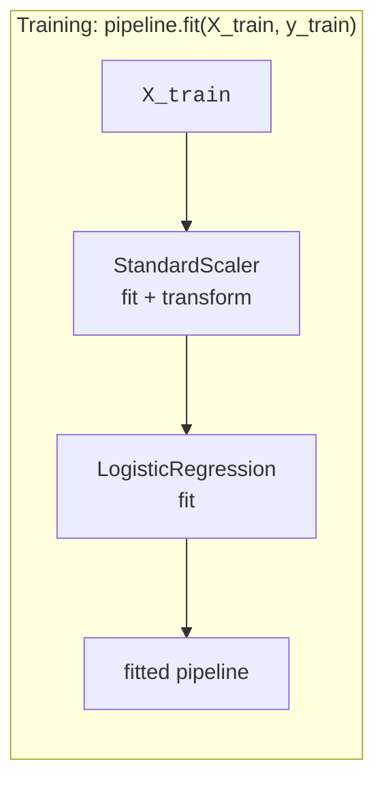
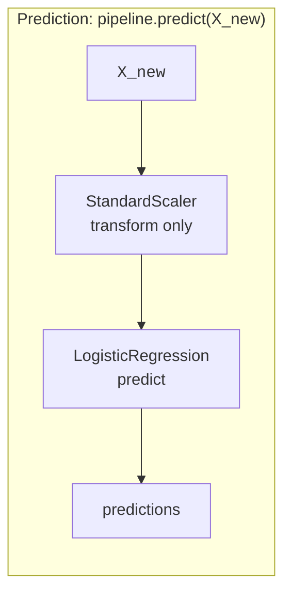
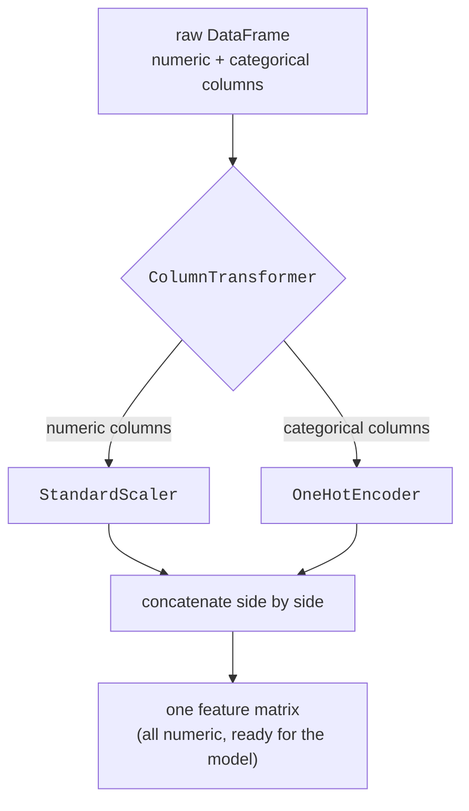

By now you have met two preprocessing steps — scaling numbers and encoding
categories — and one ironclad rule: **fit preprocessing on the training set
only, then apply it to everything else.** You have also seen how easy it is
to break that rule by accident. A misplaced `fit_transform`, a `pd.get_dummies`
called separately on train and test, a scaler quietly fit on all the data —
each leaks the test set and inflates your score.

This page introduces the tools that make doing it right *easier* than doing
it wrong: `Pipeline`, which chains preprocessing and a model into a single
estimator, and `ColumnTransformer`, which applies different preprocessing to
different columns. Together they turn a fragile, multi-step ritual into one
object you `fit` once. This is not a convenience feature — it is how
professional scikit-learn code stays correct.

<svg
  viewBox="0 0 640 210"
  role="img"
  aria-label="A trail of blue data dots threads through three translucent rings wrapped in one faint capsule and emerges as a single green prediction — a pipeline chains every step into one object you fit once"
  style={{ display: "block", width: "100%", maxWidth: "640px", height: "auto", margin: "2.5rem auto" }}
>
  <g fill="currentColor" opacity="0.06">
    <rect x="140" y="48" width="364" height="114" rx="34" />
  </g>
  <g style={{ color: "var(--ds-yellow-500)" }} fill="currentColor">
    <path fillRule="evenodd" d="M158 105 a42 42 0 1 0 84 0 a42 42 0 1 0 -84 0 M170 105 a30 30 0 1 0 60 0 a30 30 0 1 0 -60 0" fillOpacity="0.5" />
  </g>
  <g style={{ color: "var(--ds-green-500)" }} fill="currentColor">
    <path fillRule="evenodd" d="M278 105 a42 42 0 1 0 84 0 a42 42 0 1 0 -84 0 M290 105 a30 30 0 1 0 60 0 a30 30 0 1 0 -60 0" fillOpacity="0.5" />
  </g>
  <g style={{ color: "var(--ds-blue-500)" }} fill="currentColor">
    <path fillRule="evenodd" d="M398 105 a42 42 0 1 0 84 0 a42 42 0 1 0 -84 0 M410 105 a30 30 0 1 0 60 0 a30 30 0 1 0 -60 0" fillOpacity="0.5" />
  </g>
  <g style={{ color: "var(--ds-blue-500)" }} fill="currentColor">
    <circle cx="60" cy="105" r="5" />
    <circle cx="84" cy="105" r="5" fillOpacity="0.75" />
    <circle cx="108" cy="105" r="5" fillOpacity="0.55" />
    <circle cx="132" cy="105" r="5" fillOpacity="0.4" />
    <circle cx="200" cy="105" r="5" fillOpacity="0.5" />
    <circle cx="320" cy="105" r="5" fillOpacity="0.5" />
    <circle cx="440" cy="105" r="5" fillOpacity="0.5" />
    <circle cx="520" cy="105" r="5" fillOpacity="0.5" />
  </g>
  <g style={{ color: "var(--ds-green-500)" }} fill="currentColor">
    <circle cx="570" cy="105" r="11" />
  </g>
</svg>

## The problem: preprocessing and modeling are easy to desynchronize

Without pipelines, a realistic workflow looks like a chain of manual steps
you must perform in the right order, on the right data, every time:

1. Split into train and test.
2. Fit a scaler on the training features, transform train, transform test.
3. Fit an encoder on the training categories, transform train, transform
   test.
4. Glue the scaled numbers and encoded categories back together.
5. Fit the model on the training matrix.
6. Repeat steps 2–4 *exactly* on any new data before predicting.

Every one of those steps is a chance to leak the test set (fit on the wrong
data), to forget a transform, or to apply transforms in a different order at
predict time than at training time. And it gets worse: when you later use
**cross-validation** (its own page), the data is split into folds many
times, and the preprocessing must be re-fit *fresh inside every fold*. Doing
that by hand is so tedious that people skip it — and silently leak.

<Callout type="warn" title="Manual preprocessing is where leaks live">
The bug is rarely in the model. It is almost always in the preprocessing:
something was fit on data it should not have seen, or the test set was
transformed with statistics it should not have known. The more manual steps
between your raw data and your model, the more places a leak can hide.
</Callout>

## Pipeline: one estimator, one fit, no leaks

A `Pipeline` chains a sequence of steps — any number of transformers
followed by a final estimator (a model) — into a single object that behaves
exactly like a model. You build it from a list of `(name, step)` pairs:

```python
Pipeline([
    ("scaler", StandardScaler()),
    ("model",  LogisticRegression(max_iter=1000)),
])
```

When you call `.fit(X_train, y_train)` on this pipeline, it does the right
thing automatically: it fits the scaler on `X_train`, transforms `X_train`,
and feeds the result to the model's `fit`. When you call `.predict(X_test)`,
it transforms `X_test` with the *already-fitted* scaler (no re-fitting) and
passes that to the model's `predict`. The fit-on-train / transform-both rule
is enforced by construction — you cannot accidentally fit a step on the test
set, because you never touch the steps individually.





Notice the asymmetry in those two diagrams: during **training** the scaler
both *fits and transforms*; during **prediction** it only *transforms*,
reusing what it learned. That is precisely the discipline you would have to
remember by hand — and the pipeline never forgets it.

Here is the simplest possible pipeline, end to end:

<CodeBlock
  adapter="python"
  files={[
    {
      filename: "main.py",
      starterCode: `from sklearn.datasets import load_wine
from sklearn.model_selection import train_test_split
from sklearn.preprocessing import StandardScaler
from sklearn.linear_model import LogisticRegression
from sklearn.pipeline import Pipeline

X, y = load_wine(return_X_y=True)
X_train, X_test, y_train, y_test = train_test_split(
    X, y, test_size=0.3, random_state=0, stratify=y
)

# One object: scale, then classify.
pipe = Pipeline(
    [
        ("scaler", StandardScaler()),
        ("model", LogisticRegression(max_iter=1000)),
    ]
)

# One fit. The scaler is fit on X_train only, then the model on the scaled X_train.
pipe.fit(X_train, y_train)

# One score. X_test is scaled with the TRAINING scaler, then classified.
print(f"Pipeline test accuracy: {pipe.score(X_test, y_test):.3f}")
`,
    },
  ]}
/>

The scaling happens inside the pipeline, fit on the training data only, and
applied consistently to the test data — and you never wrote a single
`scaler.fit` or `scaler.transform` call. The leak is impossible to commit
here, and the code is shorter to boot.

<Callout type="tip" title="A pipeline IS an estimator">
Anywhere scikit-learn expects a model — `train_test_split` workflows,
`cross_val_score`, `GridSearchCV` — you can hand it a whole `Pipeline`. It
exposes the same `.fit`, `.predict`, and `.score` methods. From the outside
it is a model; on the inside it is your entire preprocessing-plus-model
recipe. This is the key that makes leak-free cross-validation effortless,
as the next section explains.
</Callout>

### make_pipeline: the same thing, names for free

If you do not care to name the steps, `make_pipeline` builds the identical
object and names each step after its class automatically:

<CodeBlock
  adapter="python"
  files={[
    {
      filename: "main.py",
      starterCode: `from sklearn.datasets import load_wine
from sklearn.model_selection import train_test_split
from sklearn.preprocessing import StandardScaler
from sklearn.linear_model import LogisticRegression
from sklearn.pipeline import make_pipeline

X, y = load_wine(return_X_y=True)
X_train, X_test, y_train, y_test = train_test_split(
    X, y, test_size=0.3, random_state=0, stratify=y
)

# Equivalent to Pipeline([("standardscaler", ...), ("logisticregression", ...)]).
pipe = make_pipeline(StandardScaler(), LogisticRegression(max_iter=1000))
pipe.fit(X_train, y_train)

print("Auto-generated step names:", list(pipe.named_steps))
print(f"Test accuracy: {pipe.score(X_test, y_test):.3f}")
`,
    },
  ]}
/>

## Why the pipeline prevents leakage in cross-validation

This is the reason pipelines matter most, so it deserves its own moment.
Cross-validation (covered fully on its own page) repeatedly splits the data
into a training portion and a held-out portion, scoring on each. If your
scaler was fit once on the whole dataset *before* cross-validation, then in
every fold the "held-out" portion was already seen by the scaler — a leak,
repeated in every fold, quietly inflating the average.

When you cross-validate a **pipeline**, scikit-learn re-fits the *entire*
pipeline — scaler, encoder, and all — separately inside each fold, using
only that fold's training portion. The held-out portion of each fold is
never seen by any preprocessing step until it is scored. The leak becomes
structurally impossible.

<CodeBlock
  adapter="python"
  files={[
    {
      filename: "main.py",
      starterCode: `from sklearn.datasets import load_wine
from sklearn.model_selection import cross_val_score
from sklearn.preprocessing import StandardScaler
from sklearn.linear_model import LogisticRegression
from sklearn.pipeline import make_pipeline

X, y = load_wine(return_X_y=True)

# Passing the whole pipeline to cross_val_score re-fits the scaler INSIDE
# each fold, on that fold's training data only. No leakage, automatically.
pipe = make_pipeline(StandardScaler(), LogisticRegression(max_iter=1000))
scores = cross_val_score(pipe, X, y, cv=5)

print("Per-fold accuracy:", scores.round(3))
print(f"Mean accuracy:     {scores.mean():.3f}")
`,
    },
  ]}
/>

Hand `cross_val_score` a bare model with pre-scaled data and you leak; hand
it a pipeline and you do not. Same number of lines, opposite correctness.
This is the single strongest argument for building pipelines as a default
habit rather than an afterthought.

<Callout type="danger" title="Cross-validating without a pipeline silently leaks">
If you scale or encode the full dataset and *then* run cross-validation on
the transformed data, every fold's validation rows already influenced the
preprocessing. The reported score is optimistic. Wrapping preprocessing and
model in a `Pipeline` and cross-validating *that* is the standard,
leak-proof way — and it is why this page comes before the cross-validation
page in spirit even when you read them in the other order.
</Callout>

## ColumnTransformer: different transforms for different columns

Real datasets are not all numeric or all categorical — they are *mixed*.
You want to `StandardScaler` the numeric columns and `OneHotEncoder` the
categorical ones, in the same dataset, at the same time. A single `Pipeline`
step applies one transform to *all* the columns it receives, which is not
what you want here.

`ColumnTransformer` solves this. You give it a list of
`(name, transformer, columns)` triples, and it routes each group of columns
to its own transformer, then concatenates the results side by side.



Let us build a realistic mixed dataset inline and assemble the full thing:
a `ColumnTransformer` for preprocessing feeding a `LogisticRegression`, all
wrapped in one `Pipeline`.

<CodeBlock
  adapter="python"
  files={[
    {
      filename: "main.py",
      initCode: `import numpy as np
import pandas as pd

# A tiny, realistic "customer" table: two numeric, two categorical columns,
# plus a binary target (did the customer upgrade?).
rng = np.random.default_rng(0)
n = 40
df = pd.DataFrame({
    "age":    rng.integers(18, 70, n),
    "income": rng.integers(20000, 90000, n),
    "city":   rng.choice(["NY", "LA", "SF"], n),
    "plan":   rng.choice(["free", "pro"], n),
})
# The target depends on both a numeric and a categorical feature.
df["upgraded"] = ((df["income"] > 50000) | (df["plan"] == "pro")).astype(int)`,
      starterCode: `from sklearn.compose import ColumnTransformer
from sklearn.preprocessing import StandardScaler, OneHotEncoder
from sklearn.linear_model import LogisticRegression
from sklearn.pipeline import Pipeline
from sklearn.model_selection import train_test_split

# Separate the columns by type.
numeric_cols = ["age", "income"]
categorical_cols = ["city", "plan"]

X = df[numeric_cols + categorical_cols]
y = df["upgraded"]

# Route each column group to its own transformer.
preprocess = ColumnTransformer(
    [
        ("num", StandardScaler(), numeric_cols),
        (
            "cat",
            OneHotEncoder(handle_unknown="ignore", sparse_output=False),
            categorical_cols,
        ),
    ]
)

# Stack preprocessing + model into ONE pipeline.
pipe = Pipeline(
    [
        ("prep", preprocess),
        ("clf", LogisticRegression(max_iter=1000)),
    ]
)

X_train, X_test, y_train, y_test = train_test_split(
    X, y, test_size=0.3, random_state=0, stratify=y
)
pipe.fit(X_train, y_train)

print(f"Test accuracy: {pipe.score(X_test, y_test):.3f}")
`,
    },
  ]}
/>

One `pipe.fit(X_train, y_train)` call: it scaled `age` and `income`, one-hot
encoded `city` and `plan`, glued the columns together, and trained the
classifier — each preprocessing step fit on the training data only. You
handed it a raw mixed DataFrame and got a trained model, with leakage ruled
out by construction.

### Seeing the columns the model actually receives

It is worth peeking at what comes out of the `ColumnTransformer`, because
the model never sees your original columns — it sees the transformed ones.

<CodeBlock
  adapter="python"
  files={[
    {
      filename: "main.py",
      initCode: `import numpy as np
import pandas as pd
rng = np.random.default_rng(0)
n = 40
df = pd.DataFrame({
    "age":    rng.integers(18, 70, n),
    "income": rng.integers(20000, 90000, n),
    "city":   rng.choice(["NY", "LA", "SF"], n),
    "plan":   rng.choice(["free", "pro"], n),
})`,
      starterCode: `from sklearn.compose import ColumnTransformer
from sklearn.preprocessing import StandardScaler, OneHotEncoder

numeric_cols = ["age", "income"]
categorical_cols = ["city", "plan"]

preprocess = ColumnTransformer(
    [
        ("num", StandardScaler(), numeric_cols),
        (
            "cat",
            OneHotEncoder(handle_unknown="ignore", sparse_output=False),
            categorical_cols,
        ),
    ]
)

transformed = preprocess.fit_transform(df[numeric_cols + categorical_cols])

print("Original columns:", numeric_cols + categorical_cols)
print("After transform, the model sees these columns:")
print(preprocess.get_feature_names_out())
print("Shape:", transformed.shape, "(2 scaled numeric + one-hot of city and plan)")
`,
    },
  ]}
/>

The two numeric columns stay as two columns (now scaled), while `city` and
`plan` expand into one 0/1 column per category. The `num__` and `cat__`
prefixes tell you which transformer produced each column.

<Callout type="info" title="remainder: what happens to columns you did not list">
By default, `ColumnTransformer` **drops** any column you did not assign to a
transformer (`remainder="drop"`). If you want to keep unlisted columns
untouched and pass them straight through, use
`ColumnTransformer([...], remainder="passthrough")`. Being explicit here
prevents the silent surprise of a column vanishing — list every column you
intend to use.
</Callout>

<Callout type="tip" title="make_column_transformer for brevity">
Just as `make_pipeline` auto-names pipeline steps, `make_column_transformer`
builds a `ColumnTransformer` from bare `(transformer, columns)` pairs and
names each block for you. Use whichever reads more clearly to you; they
produce equivalent objects.
</Callout>

## The whole recipe travels as one object

Because the pipeline *is* an estimator, the complete preprocessing-plus-model
recipe moves around as a single thing. You can pass it to a train/test
workflow, to `cross_val_score`, or (with a small grid) to `GridSearchCV` for
tuning — all covered on their own pages — and the preprocessing rides along,
re-fit correctly in each context. You predict on brand-new raw data by
calling `.predict` on the same object, and it applies the identical scaling
and encoding it learned at training time.

<CodeBlock
  adapter="python"
  files={[
    {
      filename: "main.py",
      initCode: `import numpy as np
import pandas as pd
rng = np.random.default_rng(0)
n = 40
df = pd.DataFrame({
    "age":    rng.integers(18, 70, n),
    "income": rng.integers(20000, 90000, n),
    "city":   rng.choice(["NY", "LA", "SF"], n),
    "plan":   rng.choice(["free", "pro"], n),
})
df["upgraded"] = ((df["income"] > 50000) | (df["plan"] == "pro")).astype(int)`,
      starterCode: `from sklearn.compose import ColumnTransformer
from sklearn.preprocessing import StandardScaler, OneHotEncoder
from sklearn.linear_model import LogisticRegression
from sklearn.pipeline import Pipeline

numeric_cols = ["age", "income"]
categorical_cols = ["city", "plan"]
X = df[numeric_cols + categorical_cols]
y = df["upgraded"]

pipe = Pipeline(
    [
        (
            "prep",
            ColumnTransformer(
                [
                    ("num", StandardScaler(), numeric_cols),
                    (
                        "cat",
                        OneHotEncoder(handle_unknown="ignore", sparse_output=False),
                        categorical_cols,
                    ),
                ]
            ),
        ),
        ("clf", LogisticRegression(max_iter=1000)),
    ]
)
pipe.fit(X, y)

# Brand-new raw records: the pipeline scales and encodes them automatically.
new_customers = pd.DataFrame(
    {
        "age": [25, 55],
        "income": [80000, 30000],
        "city": ["NY", "Tokyo"],  # 'Tokyo' was never seen -> handled by handle_unknown
        "plan": ["free", "pro"],
    }
)
print("Predictions for new customers:", pipe.predict(new_customers))
`,
    },
  ]}
/>

The new batch included `Tokyo`, a city the encoder never saw at training
time. Because the encoder was created with `handle_unknown="ignore"`, the
pipeline handled it gracefully instead of crashing — the exact robustness the
encoding page described, now happening automatically inside the pipeline.

## When NOT to reach for a pipeline (and misconceptions)

Pipelines are a strong default, but a few honest notes:

- **Pure exploration.** When you are poking at data interactively to *see*
  what a transform does, calling a transformer directly is fine and often
  clearer. Reach for a pipeline once you are training and evaluating a model
  you will trust.
- **Steps that are not fit-then-transform.** A pipeline composes
  scikit-learn transformers (objects with `fit`/`transform`). One-off
  cleaning that does not learn anything from the data — dropping a column,
  parsing a date string — can happen *before* the pipeline; it does not leak
  because it learns nothing. (Engineering features *with* a fit step,
  however, belongs inside.)
- **Misconception: a pipeline is just tidier code.** Tidiness is a bonus;
  the real payoff is *correctness*. A pipeline makes leak-free preprocessing
  the default behavior, especially under cross-validation. That is a
  safety property, not a style preference.
- **Misconception: pipelines change the model.** They do not. A pipeline
  produces the *same* result as doing every step correctly by hand — it just
  makes "correctly" automatic. If a pipeline scores differently from your
  manual code, your manual code almost certainly had a leak.

<Callout type="info" title="Common misconception: 'I'll just preprocess once up front'">
Preprocessing the entire dataset once, before any splitting or
cross-validation, is the very thing that leaks. Preprocessing must be re-fit
on each training portion. A pipeline does this for you in every split; doing
it by hand across many folds is so error-prone that the pipeline is the
right answer in practice.
</Callout>

## Real-world applications

Pipelines are the backbone of production scikit-learn:

- **Tabular prediction at companies** — churn, fraud, credit, demand — almost
  always ships as a single `Pipeline` of `ColumnTransformer` plus a model, so
  the same preprocessing that trained the model also runs at prediction time,
  with no drift between the two.
- **Reproducibility and handoff.** One object captures the entire recipe, so
  a teammate (or a future you) can load it, call `.predict`, and get exactly
  the training-time behavior — no separate, undocumented preprocessing script
  to forget.
- **Honest model selection.** Because the whole pipeline cross-validates
  without leaking, comparisons between models and preprocessing choices are
  fair. That is the foundation the tuning page builds on.

The shape to remember: **raw columns → ColumnTransformer (scale numeric,
encode categorical) → model — all inside one Pipeline you fit once.**

## Your turn

<ChallengeCard
  adapter="python"
  title="Assemble a full ColumnTransformer + Pipeline"
  category="pipelines · columntransformer · leak-free"
  estimatedTime="~9 min"
  instructions={`A mixed DataFrame is provided as \`df\` with numeric columns
\`hours\` and \`prior_score\`, a categorical column \`subject\`, and a binary
target column \`passed\`. The features are already separated for you into
\`X\` (the four feature columns) and \`y\` (the target).

1. Build a \`ColumnTransformer\` named \`preprocess\` with two blocks:
   - a \`StandardScaler\` applied to \`numeric_cols\` (\`["hours", "prior_score"]\`),
   - a \`OneHotEncoder(handle_unknown="ignore", sparse_output=False)\` applied
     to \`categorical_cols\` (\`["subject"]\`).
2. Build a \`Pipeline\` named \`pipe\` with two steps: \`("prep", preprocess)\`
   then \`("clf", LogisticRegression(max_iter=1000))\`.
3. Fit \`pipe\` on \`X_train\`, \`y_train\` (the split is done for you).
4. Store the pipeline's test accuracy (via \`.score\`) in \`test_acc\`.

The tests check that \`pipe\` is a fitted \`Pipeline\` whose final step
is a \`LogisticRegression\`, that its preprocessing step is a
\`ColumnTransformer\`, that the transformer outputs the right number of columns
(2 scaled numeric + one column per distinct subject), and that \`test_acc\` is
a sensible accuracy between 0 and 1.`}
  files={[
    {
      filename: "main.py",
      initCode: `import numpy as np
import pandas as pd
from sklearn.compose import ColumnTransformer
from sklearn.preprocessing import StandardScaler, OneHotEncoder
from sklearn.linear_model import LogisticRegression
from sklearn.pipeline import Pipeline
from sklearn.model_selection import train_test_split

rng = np.random.default_rng(0)
n = 60
df = pd.DataFrame({
    "hours":       rng.integers(0, 12, n),
    "prior_score": rng.integers(40, 100, n),
    "subject":     rng.choice(["math", "history", "art"], n),
})
df["passed"] = ((df["hours"] + df["prior_score"] / 10) > 9).astype(int)

numeric_cols = ["hours", "prior_score"]
categorical_cols = ["subject"]
X = df[numeric_cols + categorical_cols]
y = df["passed"]
X_train, X_test, y_train, y_test = train_test_split(
    X, y, test_size=0.3, random_state=0, stratify=y
)`,
      starterCode: `# 1. ColumnTransformer: scale numeric, one-hot encode categorical.
preprocess = None

# 2. Pipeline: preprocessing -> LogisticRegression.
pipe = None

# 3. Fit the pipeline on the training data.

# 4. Record the test accuracy.
test_acc = None

print("test accuracy:", test_acc)
`,
      solutionCode: `preprocess = ColumnTransformer(
    [
        ("num", StandardScaler(), numeric_cols),
        (
            "cat",
            OneHotEncoder(handle_unknown="ignore", sparse_output=False),
            categorical_cols,
        ),
    ]
)

pipe = Pipeline(
    [
        ("prep", preprocess),
        ("clf", LogisticRegression(max_iter=1000)),
    ]
)

pipe.fit(X_train, y_train)

test_acc = pipe.score(X_test, y_test)

print("test accuracy:", test_acc)
`,
    },
  ]}
  tests={[
    {
      id: "is_pipeline",
      name: "pipe is a Pipeline ending in LogisticRegression",
      description: "The final step is the classifier",
      code: `from sklearn.pipeline import Pipeline
from sklearn.linear_model import LogisticRegression
assert isinstance(pipe, Pipeline), f"pipe should be a Pipeline, got {type(pipe)}"
assert isinstance(pipe.steps[-1][1], LogisticRegression), "The last pipeline step should be a LogisticRegression"`,
    },
    {
      id: "has_ct",
      name: "Preprocessing step is a ColumnTransformer",
      description: "The first step routes columns to scaler and encoder",
      code: `from sklearn.compose import ColumnTransformer
assert isinstance(pipe.steps[0][1], ColumnTransformer), "The first pipeline step should be a ColumnTransformer"`,
    },
    {
      id: "is_fitted",
      name: "Pipeline is fitted",
      description: "Calling predict works after fit",
      code: `preds = pipe.predict(X_test)
assert len(preds) == len(X_test), f"Expected {len(X_test)} predictions, got {len(preds)}"`,
    },
    {
      id: "n_features_out",
      name: "Transformer outputs the right number of columns",
      description: "2 scaled numeric + one column per distinct subject",
      code: `ct = pipe.steps[0][1]
n_expected = 2 + df["subject"].nunique()
out_cols = ct.transform(X_train).shape[1]
assert out_cols == n_expected, f"Expected {n_expected} transformed columns, got {out_cols}"`,
    },
    {
      id: "acc_range",
      name: "Test accuracy is a valid fraction",
      description: "Between 0 and 1",
      code: `assert test_acc is not None, "test_acc is still None"
assert 0.0 <= test_acc <= 1.0, f"Accuracy should be in [0, 1], got {test_acc}"`,
    },
  ]}
/>

## Check your understanding

<MultipleChoice
  markdown={`What does a \`Pipeline\` chain together?

- Only several preprocessing transformers, with no model
  > A pipeline *can* end in a model; its defining shape is zero or more transformers followed by a final estimator.
- [o] A sequence of transformers followed by a final estimator (a model), exposed as a single object with one \`.fit\` and one \`.predict\`
  > Bundling preprocessing steps and the model into one estimator is exactly what lets you fit and predict in a single call without touching the steps individually.
- Two separate models whose predictions are averaged
  > Averaging models is ensembling; a pipeline composes steps in sequence, it does not combine model predictions.
- Multiple datasets concatenated into one
  > A pipeline composes processing steps, not datasets; concatenating columns is what \`ColumnTransformer\` does internally.

The point of the single-object design is that the whole recipe behaves like one model everywhere scikit-learn expects a model.`}
/>

<MultipleChoice
  markdown={`Why does wrapping preprocessing and a model in a \`Pipeline\` prevent data leakage during cross-validation?

- It shuffles the data more thoroughly before each fold
  > Shuffling is unrelated to leakage; the issue is *which data* the preprocessing is fit on.
- It scales the entire dataset once before any splitting
  > Scaling the entire dataset up front is exactly the leak a pipeline avoids — the held-out rows would influence the scaling.
- [o] It re-fits every preprocessing step inside each fold using only that fold's training portion, so the held-out rows never influence the preprocessing
  > Because the whole pipeline is re-fit per fold on training data only, each fold's validation rows stay genuinely unseen until scoring.
- It removes the test set from cross-validation entirely
  > Cross-validation still evaluates on held-out portions; the pipeline just ensures those portions did not leak into preprocessing.

Re-fitting preprocessing fresh in each fold is the mechanism that keeps the validation rows truly held out.`}
/>

<MultipleChoice
  markdown={`What problem does \`ColumnTransformer\` solve that a single \`Pipeline\` step cannot?

- It makes the model train faster
  > Routing columns does not speed up training; it is about applying *different* transforms to *different* columns.
- It removes the need to split the data
  > Splitting is still required; \`ColumnTransformer\` only handles applying transforms to column subsets.
- [o] It applies different transformers to different columns — for example, scaling numeric columns while one-hot encoding categorical columns in the same dataset
  > A single pipeline step transforms all columns the same way, whereas mixed data needs distinct transforms per column type, which is exactly what \`ColumnTransformer\` routes.
- It guarantees the model reaches 100% accuracy
  > No transformer can guarantee perfect accuracy; \`ColumnTransformer\` only organizes preprocessing by column.

Mixed numeric-and-categorical data is the canonical case: numbers get scaled, categories get encoded, side by side.`}
/>

<MultipleChoice
  markdown={`When you call \`pipeline.predict(X_new)\` on a fitted pipeline containing a \`StandardScaler\`, what does the scaler do?

- It re-fits on \`X_new\` to compute fresh statistics
  > Re-fitting on new data at predict time would leak and would change the scaling the model was trained for; the scaler must reuse its training statistics.
- [o] It transforms \`X_new\` using the mean and standard deviation it learned during \`fit\`, without re-fitting
  > Reusing the statistics learned at training time is what keeps prediction consistent with training and free of leakage.
- It is skipped entirely at predict time
  > The scaler is essential at predict time — the model expects scaled inputs, so \`X_new\` must be transformed the same way as the training data.
- It returns the raw \`X_new\` unchanged
  > Returning raw values would feed the model unscaled inputs, breaking the consistency between training and prediction.

During prediction the scaler only transforms; it fits only once, during training.`}
/>

<MultipleChoice
  markdown={`In \`ColumnTransformer([...])\`, what happens by default to a column you did not assign to any transformer?

- It is passed through to the model unchanged
  > Passing unlisted columns through is the \`remainder="passthrough"\` behavior, not the default.
- It raises an error
  > Unlisted columns do not cause an error; they are silently handled by the \`remainder\` setting.
- [o] It is dropped, because the default is \`remainder="drop"\`
  > Any column not routed to a transformer is removed by default, so listing every column you intend to use prevents one silently disappearing.
- It is automatically one-hot encoded
  > \`ColumnTransformer\` never guesses a transform; unlisted columns are dropped unless you set \`remainder="passthrough"\`.

To keep unlisted columns, set \`remainder="passthrough"\`; otherwise they are dropped.`}
/>

<MultipleChoice
  markdown={`A teammate scales and one-hot encodes the **entire** dataset, then passes the transformed arrays to \`cross_val_score\` with a bare \`LogisticRegression\`. What is the consequence?

- The code will not run because \`cross_val_score\` requires a pipeline
  > \`cross_val_score\` accepts a bare model and pre-transformed data; it runs fine, which is what makes the leak easy to miss.
- Nothing — preprocessing the whole dataset first is the recommended approach
  > Preprocessing the whole dataset first is precisely the leak; the recommended approach is to wrap preprocessing and model in a pipeline and cross-validate that.
- [o] Each fold's validation rows already influenced the scaling and encoding, so the reported cross-validation score is optimistically biased
  > Because the preprocessing saw every row before folding, the held-out rows in each fold were not truly unseen, inflating the average score.
- The model will underfit and score near zero
  > Leakage inflates scores rather than deflating them; the result looks too good, not too bad.

Fitting preprocessing once on all the data leaks the validation rows into every fold; the fix is to cross-validate the whole pipeline instead.`}
/>
