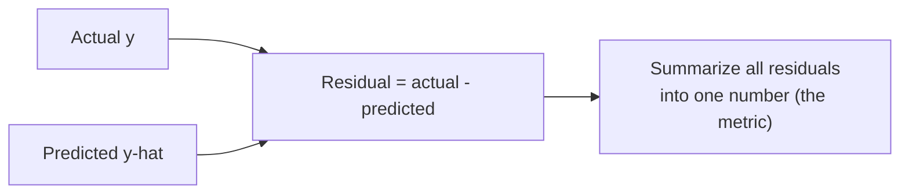

A regression model outputs numbers, so evaluating it means measuring the
gap between predicted numbers and true numbers. That sounds simple, but
"how wrong is the model?" has several different honest answers, and they can
disagree about which of two models is better. This chapter is about
understanding each metric deeply enough to choose the right one — and to
know what it is quietly *not* telling you.

<svg
  viewBox="0 0 640 220"
  role="img"
  aria-label="Blue residual lollipops rise and dip around a zero line while one large red miss carries a translucent square drawn on it — squared-error metrics punish big misses disproportionately"
  style={{ display: "block", width: "100%", maxWidth: "640px", height: "auto", margin: "2.5rem auto" }}
>
  <g fill="currentColor" opacity="0.3">
    <rect x="60" y="110" width="520" height="4" rx="2" />
  </g>
  <g style={{ color: "var(--ds-blue-500)" }} fill="currentColor">
    <rect x="98" y="82" width="4" height="28" rx="2" fillOpacity="0.5" />
    <circle cx="100" cy="82" r="6" />
    <rect x="158" y="114" width="4" height="20" rx="2" fillOpacity="0.5" />
    <circle cx="160" cy="134" r="6" />
    <rect x="218" y="74" width="4" height="36" rx="2" fillOpacity="0.5" />
    <circle cx="220" cy="74" r="6" />
    <rect x="278" y="114" width="4" height="32" rx="2" fillOpacity="0.5" />
    <circle cx="280" cy="146" r="6" />
    <rect x="338" y="88" width="4" height="22" rx="2" fillOpacity="0.5" />
    <circle cx="340" cy="88" r="6" />
    <rect x="398" y="114" width="4" height="24" rx="2" fillOpacity="0.5" />
    <circle cx="400" cy="138" r="6" />
    <rect x="518" y="92" width="4" height="18" rx="2" fillOpacity="0.5" />
    <circle cx="520" cy="92" r="6" />
  </g>
  <g style={{ color: "var(--ds-red-500)" }} fill="currentColor">
    <rect x="464" y="114" width="78" height="78" rx="8" fillOpacity="0.12" />
    <rect x="458" y="114" width="4" height="78" rx="2" fillOpacity="0.6" />
    <circle cx="460" cy="192" r="8" />
  </g>
</svg>

## Residuals: the raw material

Every regression metric is built from **residuals** — the differences
between actual and predicted values, one per example.

A residual of `+3` means the model undershot by 3; `-3` means it overshot by
3. A perfect model has all residuals equal to zero. The metrics below are
just different ways to boil a whole vector of residuals down to a single
score — and the *way* you summarize them encodes what you care about.

<CodeBlock
  adapter="python"
  files={[
    {
      filename: "main.py",
      starterCode: `import numpy as np
from sklearn.datasets import load_diabetes
from sklearn.model_selection import train_test_split
from sklearn.linear_model import LinearRegression

X, y = load_diabetes(return_X_y=True)
X_train, X_test, y_train, y_test = train_test_split(X, y, test_size=0.3, random_state=0)

model = LinearRegression().fit(X_train, y_train)
y_pred = model.predict(X_test)

residuals = y_test - y_pred
print("First five actuals:   ", np.round(y_test[:5], 1))
print("First five predicted: ", np.round(y_pred[:5], 1))
print("First five residuals: ", np.round(residuals[:5], 1))
`,
    },
  ]}
/>

## MAE — Mean Absolute Error

**What it measures.** The average size of the errors, ignoring their
direction: take the absolute value of each residual and average them.

$$
\text{MAE} = \frac{1}{n}\sum_{i=1}^{n} \lvert y_i - \hat{y}_i \rvert
$$

- **Units:** the same as the target. If you are predicting house prices in
  dollars, MAE is in dollars. "On average we are off by about 4,300
  dollars" — that is an MAE, and it is wonderfully interpretable.
- **What it does *not* measure:** it does not care whether your errors are a
  few huge misses or many small ones. A model that is off by 10 on every
  one of 10 houses and a model that is perfect on 9 and off by 100 on one
  both have the same total absolute error.
- **Robust to outliers:** because errors are not squared, one giant miss
  does not dominate. MAE treats a 100-dollar error as exactly ten times a
  10-dollar error — no more, no less.

<CodeBlock
  adapter="python"
  files={[
    {
      filename: "main.py",
      initCode: `import numpy as np
from sklearn.datasets import load_diabetes
from sklearn.model_selection import train_test_split
from sklearn.linear_model import LinearRegression
X, y = load_diabetes(return_X_y=True)
X_train, X_test, y_train, y_test = train_test_split(X, y, test_size=0.3, random_state=0)
model = LinearRegression().fit(X_train, y_train)
y_pred = model.predict(X_test)`,
      starterCode: `from sklearn.metrics import mean_absolute_error

mae = mean_absolute_error(y_test, y_pred)
print(f"MAE: {mae:.1f}")
print(
    "Interpretation: on average the prediction is off by about",
    f"{mae:.0f} units of the target.",
)
`,
    },
  ]}
/>

## MSE — Mean Squared Error

**What it measures.** The average of the *squared* residuals.

$$
\text{MSE} = \frac{1}{n}\sum_{i=1}^{n} (y_i - \hat{y}_i)^2
$$

Squaring has two big consequences:

- **Large errors are punished disproportionately.** An error of 10
  contributes 100; an error of 20 contributes 400 — four times as much for
  twice the miss. MSE *hates* big misses. If a single catastrophic
  prediction is much worse for you than several mediocre ones, MSE encodes
  that preference.
- **The units are squared and meaningless.** If the target is in dollars,
  MSE is in "dollars squared," which no one can interpret. You cannot tell a
  stakeholder "our error is 19 million dollars-squared." This is why MSE is
  great for *optimizing* and *comparing* but poor for *reporting*.

<Callout type="info" title="Why squared error is everywhere under the hood">
`LinearRegression` literally minimizes MSE — it finds the line with the
smallest sum of squared residuals. Squaring is also mathematically
convenient (smooth, differentiable). So MSE is the quantity many models
optimize, even when you report something more readable.
</Callout>

## RMSE — Root Mean Squared Error

**What it measures.** The square root of MSE. Taking the root undoes the
squaring of the *units*, so RMSE is back in the target's units — but it
keeps MSE's heavy penalty on large errors.

$$
\text{RMSE} = \sqrt{\text{MSE}} = \sqrt{\frac{1}{n}\sum_{i=1}^{n} (y_i - \hat{y}_i)^2}
$$

RMSE is the best of both worlds for many problems: interpretable units
(like MAE) *and* sensitivity to big misses (like MSE). A useful fact: **RMSE
is always greater than or equal to MAE**, and the gap between them grows
when errors are uneven. If RMSE is much larger than MAE, you have a few
outlier predictions doing a lot of damage.

<CodeBlock
  adapter="python"
  files={[
    {
      filename: "main.py",
      initCode: `import numpy as np
from sklearn.datasets import load_diabetes
from sklearn.model_selection import train_test_split
from sklearn.linear_model import LinearRegression
X, y = load_diabetes(return_X_y=True)
X_train, X_test, y_train, y_test = train_test_split(X, y, test_size=0.3, random_state=0)
model = LinearRegression().fit(X_train, y_train)
y_pred = model.predict(X_test)`,
      starterCode: `from sklearn.metrics import (
    mean_absolute_error,
    mean_squared_error,
    root_mean_squared_error,
)

mae = mean_absolute_error(y_test, y_pred)
mse = mean_squared_error(y_test, y_pred)
rmse = root_mean_squared_error(y_test, y_pred)  # same as mse ** 0.5

print(f"MAE : {mae:.1f}   (typical error size)")
print(f"MSE : {mse:.1f}   (squared units, hard to read)")
print(f"RMSE: {rmse:.1f}   (target units, punishes big misses)")
print(f"\\nRMSE >= MAE is always true here: {rmse >= mae}")
print(f"The RMSE/MAE gap hints at how uneven the errors are: {rmse / mae:.2f}x")
`,
    },
  ]}
/>

### Seeing how an outlier splits MAE from RMSE

The clearest way to feel the difference is to inject one terrible
prediction and watch each metric react.

<CodeBlock
  adapter="python"
  files={[
    {
      filename: "main.py",
      starterCode: `import numpy as np
from sklearn.metrics import mean_absolute_error, root_mean_squared_error

# Ten near-perfect predictions...
actual = np.array([10, 12, 14, 11, 13, 15, 9, 12, 14, 13], dtype=float)
good_pred = actual + np.array([0.5, -0.4, 0.3, -0.2, 0.4, -0.5, 0.1, -0.3, 0.2, -0.1])

# ...then the same, but one prediction is catastrophically off.
bad_pred = good_pred.copy()
bad_pred[5] += 30  # one huge miss

for label, pred in [("All small errors", good_pred), ("One big outlier", bad_pred)]:
    mae = mean_absolute_error(actual, pred)
    rmse = root_mean_squared_error(actual, pred)
    print(f"{label:18s} -> MAE {mae:5.2f} | RMSE {rmse:5.2f} | ratio {rmse / mae:.2f}x")
`,
    },
  ]}
/>

One outlier barely moves MAE but sends RMSE soaring. **That is the whole
choice in a nutshell:** if rare large errors are especially costly (a wildly
wrong medical dose, a hugely mispriced trade), prefer RMSE because it
screams about them. If all errors hurt in proportion to their size and you
do not want a few outliers to dominate the score, prefer MAE.

## R² — the coefficient of determination

MAE, MSE, and RMSE tell you the error in the target's units, but they cannot
tell you whether that error is *good*. Is an RMSE of 50 impressive? It
depends entirely on the scale and spread of the target. **R²** answers a
different, scale-free question: *how much better is my model than just
predicting the average every time?*

$$
R^2 = 1 - \frac{\sum_i (y_i - \hat{y}_i)^2}{\sum_i (y_i - \bar{y})^2}
$$

The numerator is your model's squared error; the denominator is the squared
error of a dumb baseline that always predicts the mean. So:

- **R² = 1.0** — perfect predictions, zero error.
- **R² = 0.0** — your model is no better than always guessing the mean.
- **R² < 0** — your model is *worse* than guessing the mean. Yes, R² can be
  negative, and on a bad model with a held-out test set it sometimes is.

<CodeBlock
  adapter="python"
  files={[
    {
      filename: "main.py",
      starterCode: `import numpy as np
from sklearn.datasets import load_diabetes
from sklearn.model_selection import train_test_split
from sklearn.linear_model import LinearRegression
from sklearn.dummy import DummyRegressor
from sklearn.metrics import r2_score

X, y = load_diabetes(return_X_y=True)
X_train, X_test, y_train, y_test = train_test_split(X, y, test_size=0.3, random_state=0)

# The real model
model = LinearRegression().fit(X_train, y_train)
print(f"LinearRegression R2: {r2_score(y_test, model.predict(X_test)):.3f}")

# The "always predict the mean" baseline -> R2 is ~0 by construction
dummy = DummyRegressor(strategy="mean").fit(X_train, y_train)
print(f"Mean baseline   R2: {r2_score(y_test, dummy.predict(X_test)):.3f}")

# A deliberately terrible model -> negative R2
silly = np.full_like(y_test, y_train.min(), dtype=float)
print(f"Always-minimum  R2: {r2_score(y_test, silly):.3f}")
`,
    },
  ]}
/>

<Callout type="danger" title="R² is NOT accuracy, and NOT a percentage of correct predictions">
The single most common R² mistake is reading "R² = 0.85" as "the model is
85% accurate" or "right 85% of the time." It means nothing of the sort. R²
is the *fraction of the target's variance that the model explains* relative
to a mean baseline. A model can have R² = 0.85 and still be off by a large,
business-critical amount on every single prediction.
</Callout>

### What R² does *not* tell you

- **Not the size of the error.** Two datasets with very different RMSE can
  have the same R², because R² is relative to each dataset's own variance.
  Always report an absolute metric (MAE or RMSE) *alongside* R².
- **Not whether the model is appropriate.** A high R² can come from
  overfitting, from a lurking outlier inflating the variance, or from a
  nonlinear pattern that the model happens to partly capture. Look at a
  residual plot, not just the number.
- **Not comparable across different datasets.** R² depends on how spread out
  the target is. A "low" R² on an intrinsically noisy problem can represent
  a better model than a "high" R² on an easy one.

### Residual plots: the picture every R² hides

A residual plot — residuals versus predictions — reveals problems that no
single number can. For a good linear model, residuals should scatter
randomly around zero with no pattern.

<CodeBlock
  adapter="python"
  files={[
    {
      filename: "main.py",
      starterCode: `import numpy as np
import matplotlib.pyplot as plt
from sklearn.datasets import load_diabetes
from sklearn.model_selection import train_test_split
from sklearn.linear_model import LinearRegression

X, y = load_diabetes(return_X_y=True)
X_train, X_test, y_train, y_test = train_test_split(X, y, test_size=0.3, random_state=0)
model = LinearRegression().fit(X_train, y_train)
y_pred = model.predict(X_test)
residuals = y_test - y_pred

plt.figure(figsize=(8, 5))
plt.scatter(y_pred, residuals, color="#4f8ef7", alpha=0.7)
plt.axhline(0, color="#f59e0b", linewidth=2)
plt.xlabel("Predicted value")
plt.ylabel("Residual (actual - predicted)")
plt.title("Residual plot: look for a shapeless cloud around zero")
plt.show()
`,
    },
  ]}
/>

If you see a funnel (errors grow with the prediction), a curve (the model
missed a nonlinear pattern), or a few points stranded far from the rest
(outliers), the metric alone would never have warned you. Always look.

## Putting them side by side

| Metric | Units | Punishes big errors extra? | Robust to outliers? | Interpretable alone? |
| --- | --- | --- | --- | --- |
| MAE | target units | No | Yes | Yes |
| MSE | target units squared | Yes (heavily) | No | No |
| RMSE | target units | Yes | No | Yes |
| R² | none (ratio) | via squared error | No | Only vs a mean baseline |

A solid default is to **report RMSE (or MAE) for the error size and R² for
the context**, and to glance at a residual plot before trusting any of them.

<Callout type="tip" title="A practical reporting recipe">
"Our model predicts charges with an RMSE of about 4,300 dollars (MAE 3,100),
explaining roughly 78% of the variance (R² = 0.78)." That one sentence gives
the error size, the outlier sensitivity, and the context — far more honest
than any single number.
</Callout>

## Common misconceptions

- **"Lower MSE is always a better model."** Only on the *same* data. MSE
  drops as you overfit the training set; compare on held-out data, and
  remember its units are not interpretable.
- **"R² of 0.9 means 90% correct."** No — see the callout above. R² is
  explained variance, not accuracy.
- **"A negative R² is a bug."** It is a legitimate signal that your model is
  worse than predicting the mean — usually a sign of severe overfitting or a
  mismatched model.
- **"RMSE and MAE rank models the same way."** Usually, but not when
  outliers are involved. RMSE can prefer a model that avoids big misses
  while MAE prefers one with a lower typical error. Choose based on what
  costs you more.

## Real-world applications

A delivery-time predictor might optimize MAE because every minute of error
annoys a customer equally. A power-grid load forecaster cares enormously
about rare large misses (blackouts) and so leans on RMSE. A scientist
reporting how well a variable is explained reaches for R². The metric is not
a formality — it is a statement about which mistakes you are willing to
tolerate.

## Your turn

<ChallengeCard
  adapter="python"
  title="Score a regression model three ways"
  category="model evaluation · regression metrics"
  estimatedTime="~7 min"
  instructions={`A \`LinearRegression\` is already fit on the diabetes training set,
and \`y_test\` / \`y_pred\` are available.

Compute and store:
1. \`mae\` — the mean absolute error,
2. \`rmse\` — the root mean squared error (use \`root_mean_squared_error\`
   or \`mean_squared_error(...) ** 0.5\`),
3. \`r2\` — the R² score,

all comparing \`y_test\` to \`y_pred\`.

The tests verify each value, confirm \`rmse >= mae\` (always true), and
confirm \`r2\` is between 0 and 1 for this model.`}
  files={[
    {
      filename: "main.py",
      initCode: `import numpy as np
from sklearn.datasets import load_diabetes
from sklearn.model_selection import train_test_split
from sklearn.linear_model import LinearRegression
from sklearn.metrics import mean_absolute_error, mean_squared_error, root_mean_squared_error, r2_score

X, y = load_diabetes(return_X_y=True)
X_train, X_test, y_train, y_test = train_test_split(X, y, test_size=0.3, random_state=0)
model = LinearRegression().fit(X_train, y_train)
y_pred = model.predict(X_test)`,
      starterCode: `mae = None
rmse = None
r2 = None

print("MAE:", mae)
print("RMSE:", rmse)
print("R2:", r2)
`,
      solutionCode: `mae = mean_absolute_error(y_test, y_pred)
rmse = root_mean_squared_error(y_test, y_pred)
r2 = r2_score(y_test, y_pred)

print("MAE:", mae)
print("RMSE:", rmse)
print("R2:", r2)
`,
    },
  ]}
  tests={[
    {
      id: "mae_ok",
      name: "MAE is correct",
      description: "Matches sklearn's mean_absolute_error",
      code: `from sklearn.metrics import mean_absolute_error
assert mae is not None and abs(mae - mean_absolute_error(y_test, y_pred)) < 1e-6`,
    },
    {
      id: "rmse_ok",
      name: "RMSE is correct and >= MAE",
      description: "Root of mean squared error, never below MAE",
      code: `from sklearn.metrics import root_mean_squared_error
assert rmse is not None and abs(rmse - root_mean_squared_error(y_test, y_pred)) < 1e-6
assert rmse >= mae, "RMSE should never be smaller than MAE"`,
    },
    {
      id: "r2_ok",
      name: "R² is correct and in (0, 1) here",
      description: "This model beats the mean baseline but is not perfect",
      code: `from sklearn.metrics import r2_score
assert r2 is not None and abs(r2 - r2_score(y_test, y_pred)) < 1e-6
assert 0 < r2 < 1, f"Expected 0 < R2 < 1, got {r2}"`,
    },
  ]}
/>

## Check your understanding

<MultipleChoice
  markdown={`What is the key practical advantage of **RMSE** over **MSE** for reporting results?

- RMSE is always smaller, so it looks better
  > RMSE is always larger than or equal to MSE when MSE is less than 1 but larger when MSE exceeds 1, so the claim about direction is not universally true. The actual advantage is that RMSE restores interpretable units by taking the square root.
- RMSE ignores outliers entirely
  > RMSE does not ignore outliers; it is more sensitive to them than MAE because it inherits MSE's squaring of residuals. The advantage over MSE is interpretable units, not outlier robustness.
- [o] RMSE is in the same units as the target, making it interpretable, while MSE is in squared units that no one can read
  > Taking the square root returns the metric to the target's units (e.g. dollars instead of dollars-squared) while preserving the heavy penalty on large errors.
- RMSE cannot be computed for held-out data
  > RMSE can be computed on any set of actual and predicted values, including held-out test data. There is no restriction on which split it is applied to.

Both react the same way to errors; RMSE just restores interpretable units.`}
/>

<MultipleChoice
  markdown={`You compare two models. Model A has MAE 5, RMSE 6. Model B has MAE 5, RMSE 15. What does the difference most likely indicate?

- Model B is better because RMSE is higher
  > A higher RMSE indicates larger errors, not better performance. Since RMSE heavily penalizes large misses (through squaring), a much higher RMSE means Model B has worse outlier predictions.
- The models are identical
  > The identical MAE means their typical error size is the same, but the dramatically different RMSE values reveal that Model B has much larger individual errors — the models are not equivalent.
- [o] Model B has a few large outlier errors; its typical error is the same, but big misses inflate its RMSE far above its MAE
  > A large RMSE-to-MAE gap signals that a handful of big errors dominate the squared term. If large misses are costly, prefer Model A.
- Model B has lower variance
  > A much larger RMSE relative to MAE is the signature of high variance in the errors — a few very large misses — not lower variance. Model B has more unevenly distributed errors.

Equal MAE but much larger RMSE points straight at outlier predictions.`}
/>

<MultipleChoice
  markdown={`A regression model reports R² = 0.85. Which interpretation is correct?

- The model is correct on 85% of predictions
  > R² does not count correct predictions; it is not an accuracy rate. It measures the fraction of the target's variance the model accounts for, relative to a mean baseline.
- Predictions are within 85% of the true values
  > R² does not describe how close individual predictions are to the true values in percentage terms. It is a scale-free ratio of explained variance to total variance.
- [o] The model explains about 85% of the variance in the target, relative to a baseline that always predicts the mean
  > R² is explained variance versus a mean baseline — not an accuracy rate and not a percentage error on individual predictions.
- The model has 85% precision
  > Precision is a classification metric (TP / (TP + FP)); it does not apply to regression. R² is a regression metric measuring explained variance relative to a mean baseline.

R² is a scale-free measure of variance explained, not a count of correct answers.`}
/>

<MultipleChoice
  markdown={`On a held-out test set, a model produces R² = -0.20. What does this mean?

- The calculation is invalid; R² cannot be negative
  > R² can be negative. When a model's squared error on the test set exceeds that of the constant-mean baseline, R² is negative — a legitimate and informative result, not a calculation error.
- The model is 20% accurate
  > R² is not an accuracy percentage and a value of -0.20 does not mean 20% accuracy. It means the model's squared error is 20% worse than just always predicting the mean.
- [o] The model performs worse than simply predicting the mean of the target — a red flag, often from overfitting or a mismatched model
  > R² below 0 means the model's squared error exceeds that of the mean baseline. It is a legitimate, informative warning, not a bug.
- The model explains 20% of the variance
  > A negative R² does not mean the model explains 20% of the variance; it means the model's errors are worse than the trivial mean-prediction baseline. Explaining 20% of variance would give R² = 0.20, not -0.20.

A negative R² is a meaningful signal that the model is actively unhelpful.`}
/>

<MultipleChoice
  markdown={`Why should you report an absolute metric (MAE or RMSE) **alongside** R² rather than R² alone?

- Because R² is always wrong
  > R² is a valid and useful metric — it is not always wrong. The reason to pair it with an absolute metric is that R² is scale-free and hides the actual magnitude of errors.
- [o] Because R² is scale-free and says nothing about the actual size of the errors; the same R² can correspond to tiny or huge errors depending on the target's spread
  > R² gives context relative to a baseline but hides the magnitude of mistakes. Pairing it with MAE or RMSE reports both "how good relative to baseline" and "how large in real units."
- Because MAE and R² are identical
  > MAE and R² measure different things: MAE is an absolute error in target units, while R² is a dimensionless ratio comparing model error to a mean baseline. They are not the same.
- Because R² cannot be computed without RMSE
  > R² is computed directly from the actual and predicted values using their squared differences; it does not require RMSE as an intermediate step.

R² answers "better than baseline?" while MAE/RMSE answer "how big are the errors?" — you usually want both.`}
/>

<MultipleChoice
  markdown={`When is **MAE** generally preferable to **RMSE** as your error metric?

- When you want big mistakes to dominate the score
  > Wanting large errors to dominate is exactly the argument for RMSE, not MAE. RMSE's squaring amplifies big misses, while MAE treats each error in proportion to its size.
- When the target has no units
  > Both MAE and RMSE are in the same units as the target; neither applies specially to unitless targets. The choice between them is about how you want to weight large versus small errors.
- [o] When all errors should count in proportion to their size and you do not want a few outliers to dominate the metric
  > MAE weights every error linearly, so rare huge misses do not overwhelm it. Choose MAE when outliers should not single-handedly drive your evaluation.
- When you are minimizing squared error during training
  > Training optimization and evaluation metrics are independent choices. Minimizing squared error during training is common (it is what \`LinearRegression\` does), but you can still report MAE for evaluation regardless of the training objective.

MAE is the robust, proportional choice; RMSE is the choice when large errors are especially costly.`}
/>
