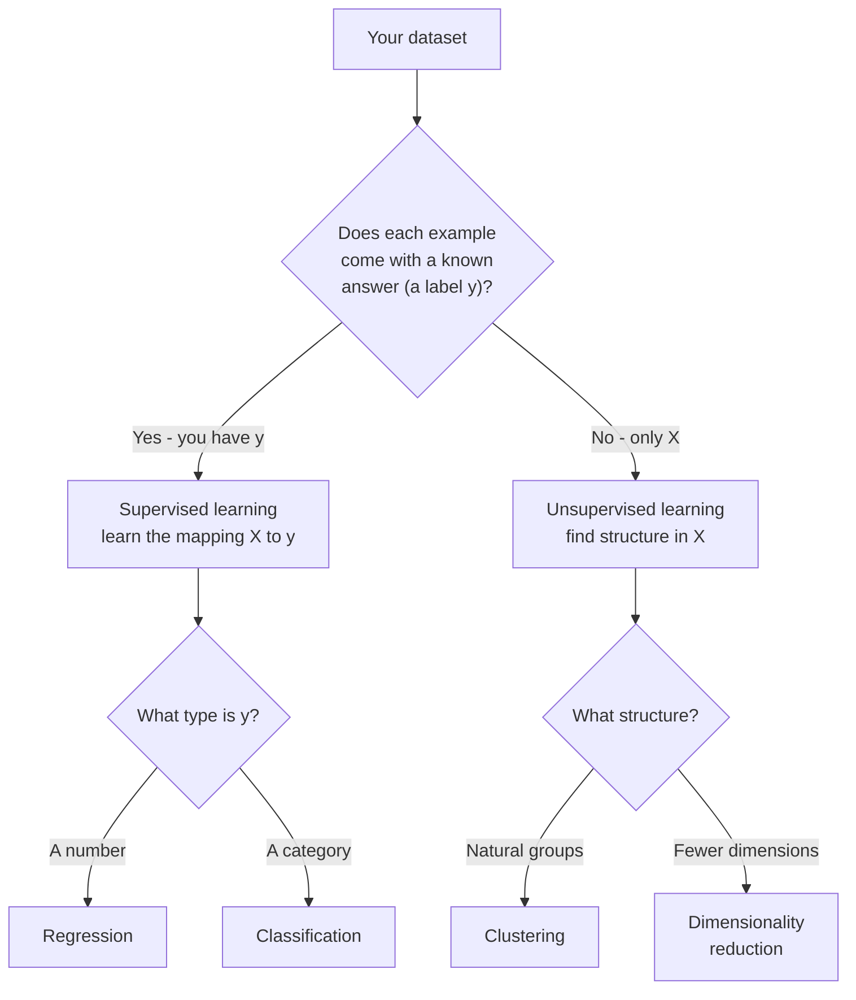

On the last page you learned that the *type* of your target `y` tells you
what kind of problem you have. The very first fork in that decision is also
the biggest one in all of machine learning, and it hinges on a single
question: **do you have answers to learn from, or not?**

If your data comes with labels — a known answer attached to each example —
you are in **supervised** learning. If it does not — you have inputs but no
answers — you are in **unsupervised** learning. These two worlds use
different algorithms, ask different questions, and are even evaluated in
completely different ways. Knowing which one you are in is the first thing
to settle on any project, so this page makes the line crisp.

## The deciding question: is there a y?

Picture the difference with a teacher analogy, because the names come
straight from it.

**Supervised learning is learning with an answer key.** A teacher (the
labels) tells the model the right answer for every training example. The
model's job is to learn the mapping well enough to answer *new* questions
where the key is hidden. You had a `y`, and you are predicting it.

**Unsupervised learning is learning without an answer key.** There is no
teacher and no `y` — only the raw examples `X`. With nothing to predict, the
model instead looks for *structure*: which examples are similar, which form
natural groups, how the data is organized. You are not predicting a known
answer; you are *discovering* what is there.

That tree is worth memorizing — it organizes most of classical machine
learning. The top split is supervised vs. unsupervised (do you have `y`?).
Each branch then splits again: supervised into regression vs. classification
by the *type* of `y`, and unsupervised into clustering vs. dimensionality
reduction by the *kind of structure* you seek. The next page zooms into the
three task types at the leaves; this page is about the trunk.

<Callout type="info" title="The label is the dividing line">
Everything flows from one fact: the presence or absence of labels. A
labeled dataset (features *and* answers) enables supervised learning. An
unlabeled dataset (features only) calls for unsupervised learning. When you
size up a new problem, your very first question should be: *do I have labels,
and are they the thing I actually want to predict?*
</Callout>

## Supervised learning: learning a mapping X to y

In supervised learning the model learns a function from inputs to a known
output: `y = f(X)`. You show it examples *with* their answers, it learns the
relationship, and then it predicts answers for inputs it has never seen. This
is the setting of every example so far in the course — iris species, wine
classes, house prices — because supervised learning is the most common and
most directly useful kind.

Supervised learning splits in two by the type of `y`:

- **Regression** predicts a *continuous number* (price, temperature, demand).
- **Classification** predicts a *category* (spam or not, which species, which
  of five products).

Here is a compact supervised example. We train a `LogisticRegression`
classifier on the iris flowers — a supervised task, because every training
flower comes labeled with its true species — and then *score* it on held-out
flowers. The crucial detail: we pass both `X` and `y` to `fit`, because
supervised learning needs the answers to learn from.

<CodeBlock
  adapter="python"
  starterCode={`from sklearn.datasets import load_iris
from sklearn.model_selection import train_test_split
from sklearn.linear_model import LogisticRegression

# SUPERVISED: we have features X *and* labels y (the species).
X, y = load_iris(return_X_y=True)
print("We have labels. First few:", y[:8], "(species 0, 1, 2)")

X_train, X_test, y_train, y_test = train_test_split(X, y, test_size=0.3, random_state=0)

# Note: fit receives BOTH X and y -- the answers are the teacher.
model = LogisticRegression(max_iter=1000)
model.fit(X_train, y_train)

# Because we have true labels for the test set, we can score accuracy.
accuracy = model.score(X_test, y_test)
print(f"Accuracy on held-out flowers: {accuracy:.0%}")
`}
/>

Two signatures mark this as supervised. First, `fit(X_train, y_train)`
receives the answers. Second, we can compute an *accuracy*, because we have
the true `y_test` to compare predictions against. Both are only possible
because labels exist.

<Callout type="tip" title="How to recognize supervised code at a glance">
If you see `fit(X, y)` — two arguments, features *and* a target — it is
supervised. If you can later compute a metric like accuracy or error by
comparing predictions to known answers, it is supervised. The presence of `y`
on both ends (training and evaluation) is the tell.
</Callout>

## Unsupervised learning: finding structure with no y

Now remove the answer key. In unsupervised learning you have only `X`, and
the model's job is to reveal structure that was already latent in the data.
The most common form is **clustering**: grouping examples so that members of
a group are similar to each other and different from other groups — without
anyone ever telling the model what the "right" groups are.

We will cluster synthetic data made of three natural blobs of points.
Critically, although `make_blobs` *can* hand back the true blob labels, we
**throw them away** and never give them to the model. `KMeans` sees only the
point coordinates `X` and must discover the groupings on its own.

<CodeBlock
  adapter="python"
  starterCode={`from sklearn.datasets import make_blobs
from sklearn.cluster import KMeans

# UNSUPERVISED: we generate points but DISCARD the true labels.
X, _ = make_blobs(n_samples=150, centers=3, random_state=0)
print("We have only X (coordinates). Shape:", X.shape, "-- no y given to the model.")

# KMeans receives ONLY X. No labels, no answers.
model = KMeans(n_clusters=3, n_init=10, random_state=0)
model.fit(X)

# It assigns each point to a discovered group. These labels were INVENTED
# by the algorithm, not given to it.
labels = model.labels_
print("Discovered group for the first 10 points:", labels[:10])
`}
/>

Look at how different the call is. `fit(X)` takes **one** argument — there is
no `y` to pass. The `labels` that come out were *created* by the algorithm
("these points belong together"), not learned from any answer key. The model
found three groups because we asked for three and the data genuinely
clustered into three; it had no idea what those groups "mean."

<Callout type="warn" title="Cluster labels are arbitrary names, not the truth">
A clustering algorithm's group numbers (0, 1, 2) are just *labels for groups
it invented*. They have no fixed meaning and might come out as 0, 1, 2 on one
run and 2, 0, 1 on another — the grouping is the same, only the numbering
differs. You cannot compute "accuracy" the way you do in supervised
learning, because there is no ground-truth answer key to compare against.
Evaluating clusters needs entirely different tools — covered in the
*evaluating clusters* chapter.
</Callout>

## Seeing them side by side

Putting the two calls next to each other makes the distinction unmistakable.
Same library, same `fit` method — but one gets answers and one does not.

<CodeBlock
  adapter="python"
  starterCode={`from sklearn.datasets import load_iris, make_blobs
from sklearn.linear_model import LogisticRegression
from sklearn.cluster import KMeans

# --- SUPERVISED: features AND labels ---
Xs, ys = load_iris(return_X_y=True)
sup = LogisticRegression(max_iter=1000)
sup.fit(Xs, ys)  # <-- two arguments: X and y
print("Supervised  : fit(X, y)  -- learns mapping to a KNOWN target")
print("              can predict the labeled answer for new data")

print()

# --- UNSUPERVISED: features ONLY ---
Xu, _ = make_blobs(n_samples=60, centers=3, random_state=0)
unsup = KMeans(n_clusters=3, n_init=10, random_state=0)
unsup.fit(Xu)  # <-- one argument: X only
print("Unsupervised: fit(X)     -- discovers STRUCTURE, no target given")
print("              groups data; no ground-truth answer to score against")
`}
/>

The signature difference — `fit(X, y)` versus `fit(X)` — is the entire idea
in one line of code. If the algorithm needs answers, it is supervised. If it
works on features alone, it is unsupervised.

<Callout type="info" title="A brief word on dimensionality reduction">
Clustering is the headline unsupervised task, but it is not the only one.
**Dimensionality reduction** is another: it takes data with many features and
compresses it into far fewer, while preserving as much of the important
structure as possible. It is used to visualize high-dimensional data in 2-D
and to denoise or simplify inputs before modeling. We mention it here only so
the map is complete; it has its place in the broader unsupervised family
alongside clustering.
</Callout>

## The hidden reason this distinction matters: labels are expensive

There is a practical force lurking behind the supervised/unsupervised
divide that the textbook framing often skips: **labels cost money and time to
obtain.** Features are frequently cheap — every click, transaction, or sensor
reading is logged automatically. But the *answer* attached to each example
often has to be supplied by a human: a doctor must read each scan, a reviewer
must mark each email as spam, an analyst must confirm each transaction was
fraud. That labeling effort can dwarf every other cost in a project.

This is why the choice is not purely "which question am I asking?" but also
"what data can I realistically get?" You might *want* a supervised model, yet
have only a mountain of unlabeled data and no budget to label it. In that
situation, unsupervised methods let you extract value *now* — finding
structure, surfacing anomalies, organizing the data — while you decide
whether labeling is worth it.

<Callout type="tip" title="A useful middle ground: semi-supervised learning">
Reality is not always all-or-nothing. Sometimes you can afford to label a
*small* fraction of your data but not all of it. **Semi-supervised learning**
combines a little labeled data with a lot of unlabeled data, using the
structure in the unlabeled portion to make the few labels go further. You do
not need the details now — just know that the labeled/unlabeled split is a
spectrum, not a hard wall, and that labeling effort is often the real
constraint that decides which approach is feasible.
</Callout>

## Two worlds, two ways to evaluate

To cement how differently these two settings behave, look at evaluation side
by side in code. The supervised model can be scored against known answers; the
clustering result *cannot* — there is simply no `y_true` to compare to. The
contrast in what is even *possible* is the clearest way to feel the divide.

<CodeBlock
  adapter="python"
  starterCode={`from sklearn.datasets import load_iris, make_blobs
from sklearn.linear_model import LogisticRegression
from sklearn.cluster import KMeans
from sklearn.metrics import silhouette_score

# --- SUPERVISED: known answers -> we can compute ACCURACY ---
Xs, ys = load_iris(return_X_y=True)
clf = LogisticRegression(max_iter=1000).fit(Xs, ys)
accuracy = clf.score(Xs, ys)  # compares predictions to KNOWN labels
print("Supervised   -> accuracy is well-defined:", round(accuracy, 3))

# --- UNSUPERVISED: no answers -> accuracy is IMPOSSIBLE ---
Xu, _ = make_blobs(n_samples=150, centers=3, random_state=0)
km = KMeans(n_clusters=3, n_init=10, random_state=0).fit(Xu)
# There is no y_true here. We can only measure INTERNAL quality, e.g.
# how tight and well-separated the discovered groups are.
sil = silhouette_score(Xu, km.labels_)
print("Unsupervised -> no accuracy; use a structure score instead:", round(sil, 3))
`}
/>

The supervised side reports accuracy because there are true labels to check
against. The unsupervised side has no such luxury, so it falls back on an
*internal* measure — here the silhouette score, which rewards tight,
well-separated groups without needing any ground truth. You do not need to
understand the silhouette score yet (the *evaluating clusters* chapter handles
it); the point is simply that **the two settings demand entirely different
evaluation toolkits**, a direct consequence of one having answers and the
other not.

<Callout type="warn" title="Do not import supervised habits wholesale">
Coming from supervised learning, it is tempting to expect a single "score" for
everything. Unsupervised learning breaks that expectation: there is no one
number that says a clustering is "right," because rightness is not even
defined without labels. Judging unsupervised results leans on internal
measures *and* human judgment about whether the structure is useful — a very
different mindset from chasing a test-set accuracy.
</Callout>

## A quick check

<MultipleChoice
  markdown={`What single fact most fundamentally separates supervised from unsupervised learning?

- Supervised learning uses scikit-learn; unsupervised learning does not
- Supervised learning is for numbers; unsupervised learning is for text
- [o] Supervised learning has labeled answers (a target \`y\`) to learn from; unsupervised learning has only features \`X\` and must find structure without answers
  > The dividing line is the presence or absence of labels. With a known target you learn a mapping (supervised); with no target you discover structure (unsupervised).
- Supervised learning is always more accurate

Labels in, supervised; no labels, unsupervised — that is the whole distinction.`}
/>

## When each is appropriate

**Reach for supervised learning when** you have a clear, specific answer you
want to predict, *and* you have historical examples where that answer is
known. Predicting whether a customer will churn? If you have past customers
labeled "churned" or "stayed," that is supervised. Forecasting next quarter's
revenue from past quarters? Supervised. The hallmark is a well-defined target
plus labeled history to learn from.

**Reach for unsupervised learning when** you have no labels — or when your
question is exploratory rather than predictive. You are not asking "what is
the answer for this example?" but "what natural structure exists in my data?"
Segmenting customers into groups when you have *no* pre-defined segments?
Unsupervised. Exploring a fresh dataset to see whether it falls into natural
clusters before you even know what to predict? Unsupervised.

<Callout type="success" title="A practical sequence">
The two are often used together, in order. Faced with a brand-new dataset and
no labels, you might *first* run unsupervised clustering to understand its
structure and generate hypotheses. *Then*, once you have labels (perhaps by
having experts label a sample), you switch to supervised learning to build a
predictive model. Exploration first, prediction second.
</Callout>

## Why you cannot "just score" unsupervised learning

This trips up almost everyone coming from supervised learning, so it is worth
stating plainly. In supervised learning, evaluation is conceptually simple:
the model predicts, you compare to the known answers, you compute accuracy or
error. The answer key makes scoring straightforward.

In unsupervised learning there *is no answer key*. If a clustering algorithm
splits your customers into four groups, there is no "true" grouping written
down anywhere to check it against — the whole reason you clustered is that you
did not know the groups. So "accuracy" is undefined. Instead, unsupervised
methods are judged by internal measures — how *tight* and *well-separated* the
discovered groups are — and, ultimately, by whether the structure is *useful*
to a human. The *evaluating clusters* chapter develops this carefully; for
now, just absorb that **supervised and unsupervised learning are evaluated in
fundamentally different ways**, and you cannot port accuracy across the line.

<Callout type="danger" title="The most common cross-over mistake">
Do not try to compute supervised metrics (accuracy, precision, error) on a
pure clustering result as if the invented cluster numbers were predictions of
some true label. Without ground truth, those numbers are meaningless. If you
*do* happen to have true labels lying around, you are no longer doing pure
unsupervised learning — and you might reconsider whether a supervised
approach fits your goal better.
</Callout>

## Common misconceptions

- **"Unsupervised learning is just supervised learning without the labels
  filled in."** No — the *goal* is different. Supervised learning predicts a
  known answer; unsupervised learning discovers unknown structure. They are
  not two settings of one task; they answer different questions.
- **"Unsupervised learning needs no human judgment."** The opposite is often
  true. With no answer key, deciding whether the discovered structure is
  *meaningful* — and how many clusters to even ask for — leans heavily on
  domain knowledge and human interpretation.
- **"More clusters always means a better clustering."** Push the count high
  enough and every point becomes its own group — technically "tight," utterly
  useless. Choosing a sensible number of clusters is a real and subtle
  decision, not a maximization.
- **"Supervised is better than unsupervised."** Neither is better; they solve
  different problems. The right choice is dictated by whether you have labels
  and what question you are asking, not by a ranking.

## Real-world applications

**Supervised** powers most of the predictive systems you interact with daily:
spam filters (labeled spam / not-spam), medical diagnosis from labeled scans,
credit scoring from labeled defaults, demand forecasting from labeled
historical sales, image recognition from labeled photos. Wherever there is a
specific answer to predict and labeled history to learn from, supervised
learning is the workhorse.

**Unsupervised** shines in discovery and exploration: customer segmentation
(grouping shoppers with no predefined segments), anomaly detection (flagging
points that fit no normal group, useful in fraud and equipment monitoring),
organizing large document or image collections by similarity, and compressing
high-dimensional data for visualization. Wherever you want to understand the
shape of data you do not yet have labels for, unsupervised learning leads.

## Your turn

The challenge below tests the judgment this whole page builds: given a
described situation, decide whether it calls for supervised or unsupervised
learning by asking the one deciding question — *is there a labeled target to
predict?*

<ChallengeCard
  adapter="python"
  title="Supervised or unsupervised?"
  category="foundations · supervised vs unsupervised"
  estimatedTime="~6 min"
  instructions={`For each scenario, decide whether it is a **supervised** or
**unsupervised** learning problem, using the deciding question: does each
example come with a known label/answer you want to predict?

Fill in the dictionary \`answers\` so each scenario key maps to either the
string \`"supervised"\` or the string \`"unsupervised"\`:

1. \`"predict_house_price"\` — predict a house's sale price using a dataset of
   past houses where the actual sale price is known for each.
2. \`"segment_customers"\` — group shoppers into segments when you have NO
   predefined segments, only their purchase behavior.
3. \`"classify_email_spam"\` — label new emails as spam or not, trained on
   emails already labeled spam / not-spam.
4. \`"group_news_articles"\` — organize a pile of unlabeled news articles into
   natural topic groups discovered from the text.
5. \`"diagnose_from_labeled_scans"\` — predict a diagnosis from medical images
   that experts have already labeled with the correct diagnosis.

The hidden tests check each individual answer.`}
  initCode={``}
  starterCode={`answers = {
    "predict_house_price": None,  # "supervised" or "unsupervised"
    "segment_customers": None,
    "classify_email_spam": None,
    "group_news_articles": None,
    "diagnose_from_labeled_scans": None,
}

print(answers)
`}
  solutionCode={`answers = {
    "predict_house_price": "supervised",
    "segment_customers": "unsupervised",
    "classify_email_spam": "supervised",
    "group_news_articles": "unsupervised",
    "diagnose_from_labeled_scans": "supervised",
}

print(answers)
`}
  tests={[
    {
      id: "house_price",
      name: "Known prices make it supervised",
      description: "A known numeric target to predict",
      code: `assert answers["predict_house_price"] == "supervised", "Known sale prices are labels -> supervised (regression)."`,
    },
    {
      id: "segment",
      name: "No predefined segments is unsupervised",
      description: "Discovering groups with no labels",
      code: `assert answers["segment_customers"] == "unsupervised", "No predefined segments -> discover structure -> unsupervised (clustering)."`,
    },
    {
      id: "spam",
      name: "Labeled emails make it supervised",
      description: "A known spam / not-spam target",
      code: `assert answers["classify_email_spam"] == "supervised", "Emails labeled spam/not-spam are a known target -> supervised (classification)."`,
    },
    {
      id: "articles",
      name: "Unlabeled articles are unsupervised",
      description: "Finding topic groups with no labels",
      code: `assert answers["group_news_articles"] == "unsupervised", "Unlabeled articles grouped by discovered topics -> unsupervised (clustering)."`,
    },
    {
      id: "scans",
      name: "Labeled scans make it supervised",
      description: "A known diagnosis target",
      code: `assert answers["diagnose_from_labeled_scans"] == "supervised", "Expert-labeled diagnoses are a known target -> supervised (classification)."`,
    },
  ]}
/>

## Check your understanding

<MultipleChoice
  markdown={`In scikit-learn, which call signature signals a **supervised** algorithm?

- \`fit(X)\` — features only
- \`fit()\` — no arguments at all
- [o] \`fit(X, y)\` — features and a target, because supervised learning needs the answers to learn the mapping
  > Supervised \`fit\` takes both the feature matrix and the target. Passing \`y\` is exactly what lets the model learn the input-to-output relationship.
- \`fit(y)\` — the target only

The two-argument \`fit(X, y)\` is the hallmark of supervised learning; \`fit(X)\` alone is unsupervised.`}
/>

<MultipleChoice
  markdown={`You have a dataset of shoppers' purchase histories but **no** predefined customer segments, and you want to discover natural groups. What kind of learning is this?

- Supervised regression, because purchases are numbers
- Supervised classification, because shoppers belong to types
- [o] Unsupervised learning (clustering), because there are no labels — you are discovering structure, not predicting a known answer
  > With no target labels and a goal of finding natural groups, this is unsupervised clustering. There is no answer key to predict against.
- It is not a machine learning problem at all

No labels plus a goal of finding groups points squarely at unsupervised clustering.`}
/>

<MultipleChoice
  markdown={`Why can't you compute ordinary "accuracy" for a pure clustering result?

- Because clustering algorithms are too slow to evaluate
- Because accuracy only works for regression, not for groups
- [o] Because there is no ground-truth answer key — the cluster numbers were invented by the algorithm, so there is nothing "correct" to compare them against
  > Accuracy compares predictions to known answers. In unsupervised learning there are no known answers, so accuracy is undefined; clusters are judged by other measures entirely.
- Because clusters always achieve 100% accuracy by definition

Without ground-truth labels there is nothing to score predictions against, so accuracy does not apply.`}
/>

<MultipleChoice
  markdown={`A team has a large set of customer records and wants to (a) first understand whether the data falls into natural groups, then (b) later predict churn once they have labels. Which sequence of approaches fits?

- Supervised first to explore, then unsupervised to predict
- Unsupervised for both steps, since labels are never needed
- [o] Unsupervised first to discover structure with no labels, then supervised to predict churn once labels are available
  > Exploration with no labels is unsupervised; predicting a known target (churn) once labels exist is supervised. Using them in this order is a common, sensible workflow.
- Neither approach applies to customer data

Explore structure without labels (unsupervised), then predict a known target with labels (supervised).`}
/>

<MultipleChoice
  markdown={`Which statement is **true** about the relationship between supervised and unsupervised learning?

- Unsupervised learning is just supervised learning with the labels hidden, solving the same task
- Supervised learning is always the better choice when both are possible
- [o] They solve fundamentally different problems — predicting a known answer versus discovering unknown structure — and are evaluated in completely different ways
  > Supervised and unsupervised learning answer different questions and use different evaluation methods. Neither is universally "better"; the right one depends on whether you have labels and what you are asking.
- Both always require a target column \`y\` to function

They are different tasks with different goals and different evaluation, not two versions of the same thing.`}
/>
