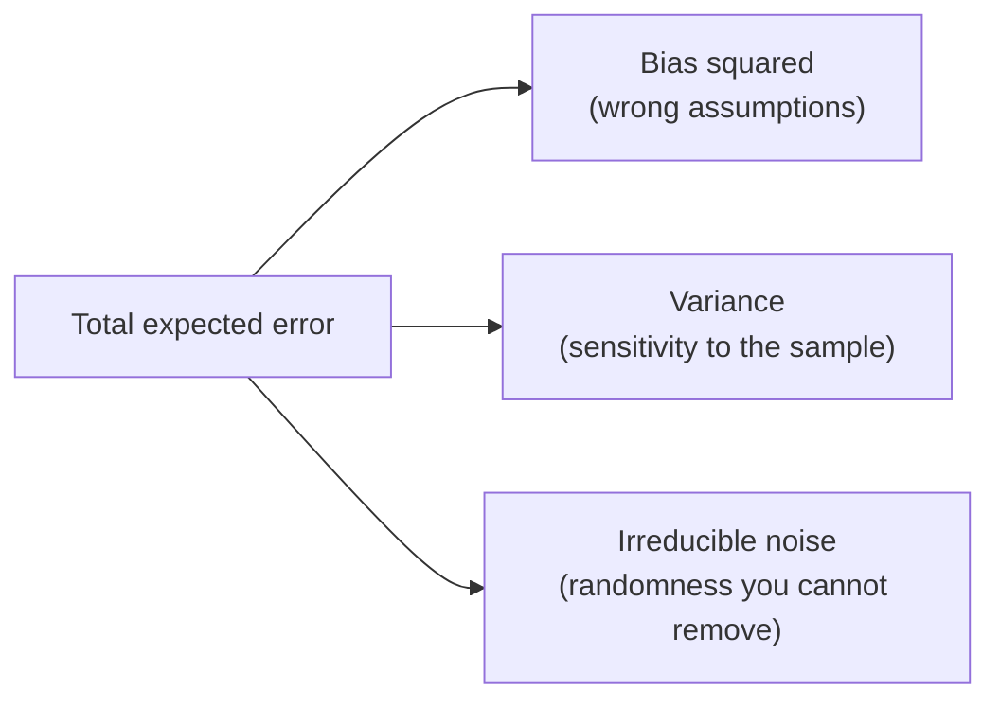

In the last chapter we saw overfitting and underfitting as two ends of a
complexity dial. This chapter gives them their proper names — **variance**
and **bias** — and explains the deep reason you cannot simply eliminate
both at once. Understanding this tradeoff is what separates someone who can
*run* models from someone who can *reason* about them.

## Error has parts

When a model makes mistakes on new data, that error comes from three
sources that add together:

- **Bias** is error from the model's assumptions being too simple for the
  truth. A straight-line model trying to fit a curve has high bias: no
  matter what data you feed it, it is systematically wrong in the same way.
- **Variance** is error from the model being too sensitive to the
  particular training sample. A super-flexible model will fit a completely
  different shape if you hand it a slightly different batch of data.
- **Irreducible noise** is the randomness baked into the problem itself —
  measurement error, genuine unpredictability. No model can remove it, so
  it sets a floor on how good any model can be.

Written compactly, the expected error of a model at a point decomposes into
exactly these three pieces:

$$
\mathbb{E}\big[(y - \hat{f}(x))^2\big] = \underbrace{\text{Bias}\,[\hat{f}(x)]^2}_{\text{too simple}} + \underbrace{\text{Var}\,[\hat{f}(x)]}_{\text{too sensitive}} + \underbrace{\sigma^2}_{\text{irreducible}}
$$

You control the first two. The whole game is trading them off.

<Callout type="info" title="Bias and variance, in one breath">
**Bias** = how far off the model is on average. **Variance** = how much the
model jumps around when the training data changes. Underfitting is mostly
bias; overfitting is mostly variance.
</Callout>

## The dartboard picture

The classic way to feel bias and variance is to imagine throwing darts at a
bullseye. Each dart is the model's prediction; the bullseye is the truth.

<CodeBlock
  adapter="python"
  starterCode={`import numpy as np
import matplotlib.pyplot as plt

rng = np.random.default_rng(1)
fig, axes = plt.subplots(2, 2, figsize=(8, 8))
settings = [
    ("Low bias, low variance", (0.0, 0.0), 0.06),
    ("Low bias, high variance", (0.0, 0.0), 0.22),
    ("High bias, low variance", (0.45, 0.35), 0.06),
    ("High bias, high variance", (0.45, 0.35), 0.22),
]
for ax, (title, center, spread) in zip(axes.ravel(), settings):
    for r, c in [(1.0, "#e2e8f0"), (0.66, "#cbd5e1"), (0.33, "#f59e0b")]:
        ax.add_patch(plt.Circle((0, 0), r, color=c, zorder=0))
    pts = rng.normal(center, spread, size=(20, 2))
    ax.scatter(pts[:, 0], pts[:, 1], color="#1e293b", s=25, zorder=2)
    ax.set_xlim(-1.2, 1.2)
    ax.set_ylim(-1.2, 1.2)
    ax.set_aspect("equal")
    ax.set_xticks([])
    ax.set_yticks([])
    ax.set_title(title, fontsize=10)
plt.tight_layout()
plt.show()
`}
/>

- **Low bias, low variance** (top-left): darts cluster tightly on the
  bullseye. This is the dream — and usually unattainable because of
  irreducible noise.
- **High bias, low variance** (bottom-left): darts cluster tightly but
  *off-center*. Consistent, consistently wrong. This is underfitting.
- **Low bias, high variance** (top-right): darts center on the bullseye on
  *average*, but scatter wildly. Any single throw could be far off. This is
  overfitting.
- **High bias, high variance** (bottom-right): the worst of both.

The deep insight: a tight cluster is not good if it is in the wrong place,
and being right on average is not good if any individual prediction could
be anywhere.

## Watching variance with your own eyes

Variance is about how much a model changes when the training data changes.
Let us make that literal: draw many different small training sets from the
same true function, fit a model on each, and overlay all the fitted curves.
A high-variance model produces a chaotic spaghetti of curves; a
low-variance model produces nearly the same curve every time.

<CodeBlock
  adapter="python"
  starterCode={`import numpy as np
import matplotlib.pyplot as plt
from sklearn.preprocessing import PolynomialFeatures
from sklearn.linear_model import LinearRegression
from sklearn.pipeline import make_pipeline

rng = np.random.default_rng(0)

def true_function(x):
    return np.sin(1.5 * x)

grid = np.linspace(0, 4, 200).reshape(-1, 1)

fig, axes = plt.subplots(1, 2, figsize=(13, 5))
for ax, degree, label in zip(
    axes, [1, 15], ["Degree 1 (high bias)", "Degree 15 (high variance)"]
):
    preds = []
    for _ in range(40):
        x = np.sort(rng.uniform(0, 4, 20))
        y = true_function(x) + rng.normal(0, 0.25, x.size)
        model = make_pipeline(PolynomialFeatures(degree), LinearRegression())
        model.fit(x.reshape(-1, 1), y)
        p = model.predict(grid)
        preds.append(p)
        ax.plot(grid, p, color="#94a3b8", alpha=0.25, linewidth=1)
    ax.plot(
        grid,
        np.mean(preds, axis=0),
        color="#f59e0b",
        linewidth=2.5,
        label="average model",
    )
    ax.plot(
        grid,
        true_function(grid.ravel()),
        "--",
        color="#34d399",
        linewidth=2,
        label="truth",
    )
    ax.set_title(label)
    ax.set_ylim(-2.5, 2.5)
    ax.legend(fontsize=9)
plt.tight_layout()
plt.show()
`}
/>

The left panel (degree 1) shows gray lines that barely move — **low
variance** — but their average (orange) cannot follow the green truth —
**high bias**. The right panel (degree 15) shows gray lines thrashing all
over the place — **high variance** — even though their average tracks the
truth reasonably well — **low bias**. Same data, opposite failure modes.

<Callout type="warn" title="Why you cannot just have both">
Make a model more flexible and you lower its bias (it can match more
shapes) but raise its variance (it reacts more to each sample's noise). Make
it simpler and you do the reverse. Pushing one down tends to push the other
up — that is the *tradeoff*. The goal is not zero bias or zero variance, but
the lowest **total** error.
</Callout>

## How the tradeoff connects to everything else

This single idea reframes much of the course:

- **Underfitting = high bias.** The model is too simple. Fix by adding
  capacity or better features.
- **Overfitting = high variance.** The model is too sensitive. Fix by
  simplifying, regularizing, or adding data.
- **Regularization** is a dial that deliberately adds a little bias to buy a
  large reduction in variance.
- **Ensembles** like random forests are a variance-reduction machine:
  averaging many high-variance trees cancels out their individual jitter
  while keeping their low bias. That is *why* a forest usually beats a
  single deep tree.

| Model | Bias / variance | Result |
| --- | --- | --- |
| Too simple | High bias, low variance | Underfitting |
| Too flexible | Low bias, high variance | Overfitting |
| Average many flexible models | Keeps low bias, cuts variance | Ensembles win |

## More data changes the picture

Here is a hopeful fact: **variance shrinks as you add training data.** With
more examples, the noise averages out, so a flexible model is pulled back
toward the true pattern instead of chasing individual points. Bias, by
contrast, is a property of the model family — more data will not fix a
straight line trying to be a curve.

This gives a practical rule of thumb: if you are overfitting (high
variance) and can get more data, do it. If you are underfitting (high
bias), more of the same data will not help — you need a richer model or
better features.

<Callout type="tip" title="Diagnose before you treat">
More data cures variance, not bias. A more complex model cures bias, not
variance. Diagnosing *which* problem you have (via the train–test gap from
the previous chapter) tells you which lever to pull. Pulling the wrong one
wastes effort.
</Callout>

## Common misconceptions

- **"Low variance is always good."** Not if it comes with high bias — a
  model that confidently gives the same wrong answer every time has low
  variance and is useless.
- **"You should minimize bias."** You should minimize *total* error. A bit
  of bias (via regularization) is often worth it for a big cut in variance.
- **"Bias here means social/ethical bias."** In this context bias is a
  statistical term about model assumptions. It is unrelated to fairness bias
  (though models can have both kinds — do not confuse them).
- **"Ensembles reduce bias."** Bagging and forests mainly reduce *variance*.
  Lowering bias is the job of boosting or of using a more expressive base
  model.

## Real-world applications

A weather model that is consistently 5 degrees too high has bias; one whose
forecast swings wildly with tiny changes in inputs has variance. A
recommendation system trained on too few users will overfit their quirks
(variance); one using only a coarse "popular items" rule will miss
individual taste (bias). Every modeling decision — how complex, how
regularized, how much data — is implicitly a choice on this tradeoff.

## Your turn

<ChallengeCard
  adapter="python"
  title="Measure variance directly"
  category="bias–variance · model behavior"
  estimatedTime="~7 min"
  instructions={`You will estimate the **variance** of two models by retraining each
on many random training sets and measuring how much their prediction at a
single fixed point bounces around.

A helper \`make_dataset()\` returns a fresh noisy \`(X, y)\` each call. The
fixed evaluation point is \`x_star\` (shape (1, 1)).

For each model in turn (a degree-1 pipeline = \`simple\`, a degree-15
pipeline = \`flexible\`):
1. Refit it on 60 fresh datasets from \`make_dataset()\`.
2. Collect its scalar prediction at \`x_star\` each time.
3. Store the **variance** of those 60 predictions: \`var_simple\` for the
   degree-1 model and \`var_flexible\` for the degree-15 model
   (use \`np.var(...)\`).

The tests check both variances are computed and that
\`var_flexible > var_simple\` — the flexible model is far less stable.`}
  initCode={`import numpy as np
from sklearn.preprocessing import PolynomialFeatures
from sklearn.linear_model import LinearRegression
from sklearn.pipeline import make_pipeline

rng = np.random.default_rng(3)
def make_dataset():
    x = np.sort(rng.uniform(0, 4, 25))
    y = np.sin(1.5 * x) + rng.normal(0, 0.25, x.size)
    return x.reshape(-1, 1), y

x_star = np.array([[2.0]])
simple = make_pipeline(PolynomialFeatures(1), LinearRegression())
flexible = make_pipeline(PolynomialFeatures(15), LinearRegression())`}
  starterCode={`var_simple = None
var_flexible = None

# TODO: refit each model on 60 fresh datasets, collect predictions at x_star,
# then take the variance of each model's 60 predictions.

print("var_simple:", var_simple)
print("var_flexible:", var_flexible)
`}
  solutionCode={`def variance_at_point(model):
    preds = []
    for _ in range(60):
        X, y = make_dataset()
        model.fit(X, y)
        preds.append(model.predict(x_star)[0])
    return float(np.var(preds))

var_simple = variance_at_point(simple)
var_flexible = variance_at_point(flexible)

print("var_simple:", var_simple)
print("var_flexible:", var_flexible)
`}
  tests={[
    {
      id: "computed",
      name: "Both variances are computed",
      description: "Neither is left as None",
      code: `assert var_simple is not None and var_flexible is not None`,
    },
    {
      id: "nonneg",
      name: "Variances are valid (non-negative)",
      description: "Variance can't be negative",
      code: `assert var_simple >= 0 and var_flexible >= 0`,
    },
    {
      id: "ordering",
      name: "The flexible model has higher variance",
      description: "Degree-15 predictions bounce far more than degree-1",
      code: `assert var_flexible > var_simple, f"Expected flexible > simple, got {var_flexible} vs {var_simple}"`,
    },
  ]}
/>

## Check your understanding

<MultipleChoice
  markdown={`In bias–variance terms, what does **bias** measure?

- How much predictions change when the training data changes
  > That is the definition of variance, not bias. Bias measures systematic error from the model's assumptions; variance measures how much the model fluctuates across different training samples.
- The amount of random noise in the labels
  > Noise in the labels is irreducible error — the third component of the bias-variance decomposition. Bias is a property of the model's assumptions, not of the data's noise level.
- [o] How far the model's predictions are from the truth *on average*, due to overly simple assumptions
  > Bias is systematic error from the model family being too rigid to represent the true pattern — it is wrong in the same direction regardless of the sample.
- The number of features in the model
  > The number of features is one factor that can influence bias (too few informative features may increase bias), but bias itself is the statistical concept of systematic error from overly simple assumptions — not a count of features.

Bias is the "consistently off-target" part of error; variance is the "scattered" part.`}
/>

<MultipleChoice
  markdown={`A model whose predictions swing dramatically when you retrain it on a slightly different sample has:

- High bias
  > High bias means the model is systematically wrong in the same direction regardless of which training sample it sees — it is consistently off-target, not sensitive to the particular sample. The described behavior (swinging with sample changes) is the definition of high variance.
- [o] High variance
  > Sensitivity to the particular training sample is the definition of variance. Such a model is likely overfitting.
- Zero irreducible error
  > Irreducible error is the noise baked into the problem that no model can eliminate. It is unrelated to whether a model has high or low variance; the two are independent components of total error.
- Perfect generalization
  > A model whose predictions swing dramatically with different training samples is not generalizing well — it is overfitting to each particular sample. Perfect generalization would require stable predictions across samples.

High variance is the statistical name for the instability behind overfitting.`}
/>

<MultipleChoice
  markdown={`Why is it usually impossible to drive both bias and variance to zero by adjusting model complexity?

- Because scikit-learn limits model complexity
  > scikit-learn imposes no such limit; you can build arbitrarily complex models. The tradeoff is a mathematical property of how bias and variance respond to model flexibility, not a software constraint.
- [o] Because increasing complexity lowers bias but raises variance, and decreasing it does the reverse — they trade off
  > Moving the complexity dial pushes one component down while pushing the other up, so you optimize their sum rather than eliminating both.
- Because variance is always larger than bias
  > There is no general rule that variance is always larger than bias. Their relative sizes depend on the model and data. The tradeoff is about how adjusting complexity tends to move them in opposite directions, not about their absolute magnitudes.
- Because more data removes bias
  > More data reduces variance (a flexible model has less room to memorize noise with more examples) but does little for bias, which is determined by the model family's flexibility. Bias is not removed by collecting more data.

The tradeoff means the target is minimum *total* error, not zero of either part.`}
/>

<MultipleChoice
  markdown={`You are clearly overfitting (high variance) and can collect more labeled data. What should you expect?

- More data will increase variance
  > More training data reduces variance, not increases it. With more examples the noise averages out and a flexible model is pulled away from memorizing individual points toward the true underlying pattern.
- [o] More data typically reduces variance, pulling a flexible model back toward the true pattern
  > Additional examples let the noise average out, so the flexible model stops chasing individual points and its predictions stabilize.
- More data will fix bias but not variance
  > More data addresses variance, not bias. Bias is a property of the model family's assumptions — a linear model fitting a curved relationship has high bias regardless of how much data is provided.
- Nothing changes with more data
  > More labeled data reliably reduces variance by making the model less sensitive to any particular training set. This is one of the most consistent and actionable insights from the bias-variance framework.

More data is the classic remedy for variance; it does little for bias.`}
/>

<MultipleChoice
  markdown={`Why does a random forest usually outperform a single deep decision tree?

- It has higher bias than a single tree
  > A random forest has similar or lower bias than a single deep tree, since its individual trees are just as flexible. The forest's advantage is lower variance, not higher bias.
- It uses fewer features
  > A random forest considers a random subset of features at each split, but across all trees it uses all features. The total number of features available is the same; the restriction is per split, not overall.
- [o] Averaging many high-variance trees cancels out their individual noise, cutting variance while keeping the low bias of deep trees
  > Bagging is fundamentally a variance-reduction technique: independent errors of many trees partially cancel when averaged.
- It is guaranteed to reach zero error
  > No model can guarantee zero error due to irreducible noise in the data. A random forest reduces variance but cannot eliminate the inherent unpredictability in the problem.

Ensembles win mainly by reducing variance, which is why they tame the overfitting of individual deep trees.`}
/>
