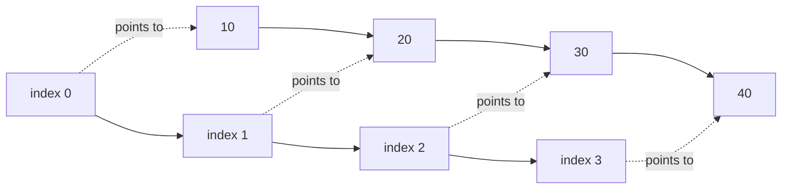

Arrays are the first data structure most programmers meet: a sequence of values stored side by side. In modern C++, the array you will use most is `std::vector<T>` because it grows dynamically while keeping fast O(1) indexing.

<svg
  viewBox="0 0 640 180"
  role="img"
  aria-label="A full vector of four cells grows along a dotted arrow into a container with doubled capacity — old elements copied over, a green element just pushed, and empty slots held in reserve"
  style={{ display: "block", width: "100%", maxWidth: "640px", height: "auto", margin: "2.5rem auto" }}
>
  <g style={{ color: "var(--ds-blue-500)" }} fill="currentColor">
    <rect x="60" y="80" width="120" height="48" rx="12" fillOpacity="0.12" />
    <rect x="68" y="88" width="24" height="32" rx="6" />
    <rect x="94" y="88" width="24" height="32" rx="6" fillOpacity="0.75" />
    <rect x="120" y="88" width="24" height="32" rx="6" />
    <rect x="146" y="88" width="24" height="32" rx="6" fillOpacity="0.75" />
  </g>
  <g fill="currentColor" opacity="0.3">
    <circle cx="202" cy="104" r="3" />
    <circle cx="222" cy="104" r="3" />
    <circle cx="242" cy="104" r="3" />
    <polygon points="254,96 254,112 266,104" />
  </g>
  <g style={{ color: "var(--ds-blue-500)" }} fill="currentColor">
    <rect x="290" y="72" width="292" height="64" rx="14" fillOpacity="0.1" />
    <rect x="300" y="86" width="30" height="36" rx="7" />
    <rect x="333" y="86" width="30" height="36" rx="7" fillOpacity="0.75" />
    <rect x="366" y="86" width="30" height="36" rx="7" />
    <rect x="399" y="86" width="30" height="36" rx="7" fillOpacity="0.75" />
  </g>
  <g style={{ color: "var(--ds-green-500)" }} fill="currentColor">
    <circle cx="447" cy="34" r="6" fillOpacity="0.5" />
    <circle cx="447" cy="50" r="3" fillOpacity="0.4" />
    <circle cx="447" cy="62" r="3" fillOpacity="0.4" />
    <circle cx="447" cy="74" r="3" fillOpacity="0.4" />
    <rect x="432" y="86" width="30" height="36" rx="7" />
  </g>
  <g fill="currentColor" opacity="0.08">
    <rect x="465" y="86" width="30" height="36" rx="7" />
    <rect x="498" y="86" width="30" height="36" rx="7" />
    <rect x="531" y="86" width="30" height="36" rx="7" />
  </g>
</svg>

## C-style arrays

A C-style array such as `int a[5]` has a fixed size known at compile time. It is compact and fast, but it loses size information easily because it **decays to a pointer** when passed to many functions.

<CodeBlock
  adapter="cpp"
  files={[
    {
      filename: "main.cpp",
      starterCode: `#include <iostream>

void print_first(int *values) { std::cout << values[0] << "\\n"; }

int main() {
  int scores[5] = {10, 20, 30, 40, 50};
  print_first(scores);
  std::cout << "sizeof array: " << sizeof(scores) << " bytes\\n";
  return 0;
}
`,
    },
  ]}
/>

You almost never want raw arrays for DSA practice because `std::array` and `std::vector` are safer and more expressive.

## `std::array<T, N>`

`std::array` is a fixed-size array wrapper. It preserves the size, supports range-for loops, and behaves like a normal value object.

<CodeBlock
  adapter="cpp"
  files={[
    {
      filename: "main.cpp",
      starterCode: `#include <array>
#include <iostream>

int main() {
  std::array<int, 4> levels = {3, 1, 4, 1};
  std::cout << "size: " << levels.size() << "\\n";
  for (int x : levels) {
    std::cout << x << " ";
  }
  std::cout << "\\n";
  return 0;
}
`,
    },
  ]}
/>

## `std::vector<T>`: the workhorse

`std::vector` is a dynamic array. It stores elements contiguously like an array, but it can allocate a larger block and move elements when it needs more capacity.

<CodeBlock
  adapter="cpp"
  files={[
    {
      filename: "main.cpp",
      starterCode: `#include <iostream>
#include <vector>

int main() {
  std::vector<int> points = {10, 20, 30};
  points.push_back(40);
  points.pop_back();
  points.push_back(99);

  std::cout << "size: " << points.size() << "\\n";
  std::cout << "capacity: " << points.capacity() << "\\n";
  std::cout << "first: " << points.front() << "\\n";
  std::cout << "last: " << points.back() << "\\n";
  std::cout << "index 1: " << points[1] << "\\n";
  std::cout << "checked index 2: " << points.at(2) << "\\n";
  return 0;
}
`,
    },
  ]}
/>

Use `operator[]` when you know the index is valid. Use `.at()` when you want bounds checking and an exception on invalid access.

## Contiguous memory layout

A vector keeps values next to each other in memory. That makes iteration cache-friendly: when the CPU loads one element, nearby elements are likely pulled into cache too.

<CodeBlock
  adapter="cpp"
  files={[
    {
      filename: "main.cpp",
      starterCode: `#include <iostream>
#include <vector>

int main() {
  std::vector<int> xs = {10, 20, 30, 40};
  std::cout << &xs[0] << "\\n";
  std::cout << &xs[1] << "\\n";
  std::cout << &xs[2] << "\\n";
  return 0;
}
`,
    },
  ]}
/>

The printed addresses should increase by `sizeof(int)` each time in a normal implementation.

## Iteration patterns

Index-based loops are useful when you need positions. Range-for loops are clean when you only need values. Iterators are the common language of STL algorithms.

<CodeBlock
  adapter="cpp"
  files={[
    {
      filename: "main.cpp",
      starterCode: `#include <iostream>
#include <vector>

int main() {
  std::vector<int> xs = {4, 8, 15, 16, 23, 42};

  for (std::size_t i = 0; i < xs.size(); ++i) {
    std::cout << i << ":" << xs[i] << " ";
  }
  std::cout << "\\n";

  for (int x : xs) {
    std::cout << x << " ";
  }
  std::cout << "\\n";

  for (auto it = xs.begin(); it != xs.end(); ++it) {
    std::cout << *it << " ";
  }
  std::cout << "\\n";
  return 0;
}
`,
    },
  ]}
/>

## Resizing, capacity, and amortized push

`size()` is how many elements are currently stored. `capacity()` is how many elements fit before reallocation. When capacity is full, a vector usually grows by allocating a larger buffer, often about double the old capacity.

<CodeBlock
  adapter="cpp"
  files={[
    {
      filename: "main.cpp",
      starterCode: `#include <iostream>
#include <vector>

int main() {
  std::vector<int> values;
  std::size_t previous = values.capacity();
  for (int i = 0; i < 20; ++i) {
    values.push_back(i);
    if (values.capacity() != previous) {
      previous = values.capacity();
      std::cout << "size=" << values.size() << " capacity=" << values.capacity()
                << "\\n";
    }
  }
  return 0;
}
`,
    },
  ]}
/>

That rare reallocation is why `push_back` is O(1) **amortized**, as discussed in the complexity page.

## Timing one million pushes

Browser timing is noisy, but this shows how to measure a sequence of pushes with `<chrono>`.

<CodeBlock
  adapter="cpp"
  files={[
    {
      filename: "main.cpp",
      starterCode: `#include <chrono>
#include <iostream>
#include <vector>

int main() {
  std::vector<int> values;
  auto start = std::chrono::high_resolution_clock::now();
  for (int i = 0; i < 1000000; ++i) {
    values.push_back(i);
  }
  auto stop = std::chrono::high_resolution_clock::now();
  auto ms = std::chrono::duration_cast<std::chrono::milliseconds>(stop - start)
                .count();
  std::cout << "pushed " << values.size() << " values in about " << ms
            << " ms\\n";
  return 0;
}
`,
    },
  ]}
/>

## 2D vectors

A matrix is often represented as `std::vector<std::vector<int>>`: a vector of rows, where each row is another vector.

<CodeBlock
  adapter="cpp"
  files={[
    {
      filename: "main.cpp",
      starterCode: `#include <iostream>
#include <vector>

int main() {
  std::vector<std::vector<int>> grid = {{1, 2, 3}, {4, 5, 6}, {7, 8, 9}};

  int diagonal = 0;
  for (std::size_t r = 0; r < grid.size(); ++r) {
    diagonal += grid[r][r];
  }
  std::cout << "diagonal sum: " << diagonal << "\\n";
  return 0;
}
`,
    },
  ]}
/>

<Callout type="success" title="Vector operation costs">

| Operation | Complexity | Why |
| --- | --- | --- |
| `v[i]`, `v.at(i)` | O(1) | Direct address calculation |
| `push_back` | O(1) amortized | Rare reallocations are spread over many pushes |
| insert in middle | O(n) | Elements after the position shift right |
| erase from middle | O(n) | Elements after the position shift left |

</Callout>

## Practice: reverse a vector in-place

<ChallengeCard
  adapter="cpp"
  title="Reverse a vector in-place"
  instructions={`Implement \`reverseInPlace\` without using \`std::reverse\`. Swap from both ends until the pointers meet.`}
  files={[
    {
      filename: "main.cpp",
      starterCode: `#include <iostream>
#include <vector>

void reverseInPlace(std::vector<int> &values) {
  // your code here
}

int main() {
  std::vector<int> values = {1, 2, 3, 4, 5};
  reverseInPlace(values);
  for (int x : values) {
    std::cout << x << "\\n";
  }
  return 0;
}
`,
      solutionCode: `#include <iostream>
#include <vector>

void reverseInPlace(std::vector<int> &values) {
  std::size_t left = 0;
  std::size_t right = values.empty() ? 0 : values.size() - 1;
  while (left < right) {
    int temp = values[left];
    values[left] = values[right];
    values[right] = temp;
    ++left;
    --right;
  }
}

int main() {
  std::vector<int> values = {1, 2, 3, 4, 5};
  reverseInPlace(values);
  for (int x : values) {
    std::cout << x << "\\n";
  }
  return 0;
}
`,
    },
  ]}
  tests={[{ id: "reverse", name: "Reverses the vector", expect: { stdoutLines: ["5", "4", "3", "2", "1"], stdoutLinesExact: true } }]}
/>

## Practice: second-largest value

<ChallengeCard
  adapter="cpp"
  title="Find the second-largest value"
  instructions={`Implement \`secondLargest\` in one pass without sorting. Keep the best value and the runner-up as you scan.`}
  files={[
    {
      filename: "main.cpp",
      starterCode: `#include <iostream>
#include <limits>
#include <vector>

int secondLargest(const std::vector<int> &values) {
  // your code here
}

int main() {
  std::vector<int> values = {17, 42, 5, 42, 30, 99, 18};
  std::cout << secondLargest(values) << "\\n";
  return 0;
}
`,
      solutionCode: `#include <iostream>
#include <limits>
#include <vector>

int secondLargest(const std::vector<int> &values) {
  int best = std::numeric_limits<int>::min();
  int runner = std::numeric_limits<int>::min();
  for (int x : values) {
    if (x > best) {
      runner = best;
      best = x;
    } else if (x < best && x > runner) {
      runner = x;
    }
  }
  return runner;
}

int main() {
  std::vector<int> values = {17, 42, 5, 42, 30, 99, 18};
  std::cout << secondLargest(values) << "\\n";
  return 0;
}
`,
    },
  ]}
  tests={[{ id: "second", name: "Finds runner-up", expect: { stdoutEquals: "42" } }]}
/>

## Check your understanding

<MultipleChoice
  markdown={`Why does iterating through a \`std::vector<int>\` often run faster than iterating through a linked list with the same number of integers?

- [o] The vector stores elements contiguously, which improves cache locality.
  > Nearby values are likely loaded into CPU cache together.
- A vector changes every operation to O(log n).
  > Vector iteration is O(n), but constants are often smaller.
- A linked list cannot store integers.
  > Linked lists can store integers; their node layout is the issue.
- A vector never reallocates memory.
  > Vectors can reallocate when they grow beyond capacity.`}
/>

<MultipleChoice
  markdown={`For most DSA problems, why should you usually try \`std::vector\` before \`std::list\`?

- \`std::list\` has O(1) random access.
  > It does not. Random access in a list requires walking nodes.
- [o] \`std::vector\` has compact storage, O(1) indexing, and excellent iteration performance.
  > These properties make it the default sequence container.
- \`std::vector\` can only store primitive types.
  > It can store objects too.
- \`std::list\` is always asymptotically slower for every operation.
  > Some list operations are O(1), but they are less commonly the bottleneck.`}
/>

<MultipleChoice
  markdown={`What is the main behavioral difference between \`v.at(i)\` and \`v[i]\` for a \`std::vector\`?

- \`v.at(i)\` is always O(n), while \`v[i]\` is O(1).
  > Both are constant-time access in normal use.
- \`v[i]\` checks bounds and throws if invalid.
  > That describes \`at\`, not \`operator[]\`.
- [o] \`v.at(i)\` performs bounds checking and throws an exception when \`i\` is invalid.
  > \`operator[]\` has undefined behavior for an invalid index.
- \`v.at(i)\` inserts a new element if \`i\` is too large.
  > It does not insert; it reports an error.`}
/>
