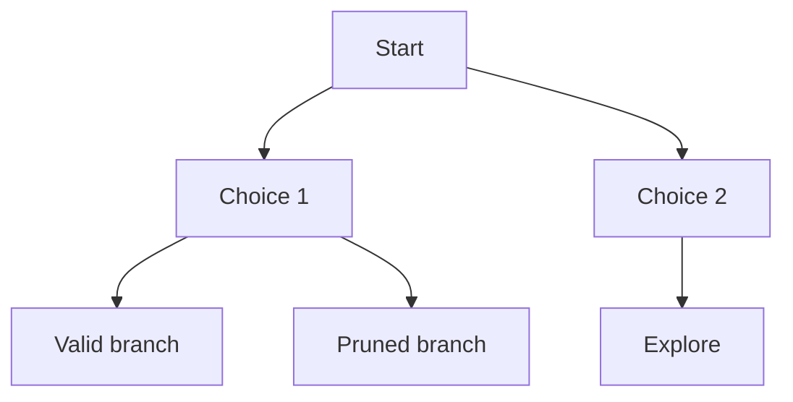
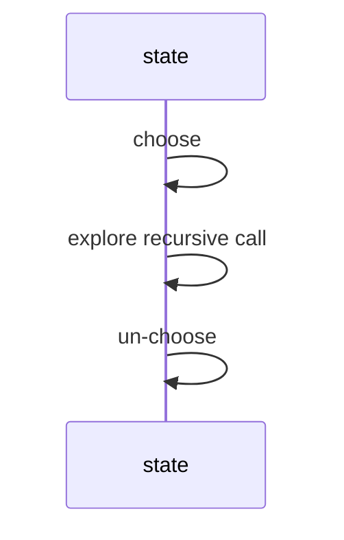

Backtracking builds a solution incrementally and abandons a candidate as soon as it cannot become valid. The template is **choose → explore → un-choose**.

<Callout type="info" title="Backtracking is disciplined recursion">
Recursion calls itself; backtracking also deliberately undoes choices and prunes impossible branches.
</Callout>

## Permutations

<CodeBlock adapter="cpp" starterCode={`#include <iostream>
#include <vector>
void permute(std::vector<int>& a, int idx) {
    if (idx == (int)a.size()) {
        for (int x : a) std::cout << x;
        std::cout << "\n";
        return;
    }
    for (int i = idx; i < (int)a.size(); i++) {
        std::swap(a[idx], a[i]);
        permute(a, idx + 1);
        std::swap(a[idx], a[i]);
    }
}
int main() {
    std::vector<int> a = {1, 2, 3};
    permute(a, 0);
    return 0;
}
`} />

## Subsets

Include/exclude recursion visits both decisions for each element.

<CodeBlock adapter="cpp" starterCode={`#include <iostream>
#include <vector>
void dfs(const std::vector<int>& nums, int i, std::vector<int>& cur) {
    if (i == (int)nums.size()) {
        std::cout << cur.size() << "\n";
        return;
    }
    dfs(nums, i + 1, cur);
    cur.push_back(nums[i]);
    dfs(nums, i + 1, cur);
    cur.pop_back();
}
int main() {
    std::vector<int> cur;
    dfs({1, 2, 3}, 0, cur);
    return 0;
}
`} />

Bitmask iteration is deterministic and iterative.

<CodeBlock adapter="cpp" starterCode={`#include <iostream>
#include <vector>
int main() {
    std::vector<int> nums = {1, 2, 3};
    for (int mask = 0; mask < (1 << (int)nums.size()); mask++) {
        std::cout << "[";
        bool first = true;
        for (int i = 0; i < (int)nums.size(); i++) if (mask & (1 << i)) {
            if (!first) std::cout << ",";
            first = false;
            std::cout << nums[i];
        }
        std::cout << "]\n";
    }
    return 0;
}
`} />

## N-Queens

Place one queen per row. Columns and diagonals prune invalid placements.

<CodeBlock adapter="cpp" starterCode={`#include <iostream>
#include <string>
#include <vector>
void solve(int r, int n, std::vector<std::string>& board, std::vector<int>& col, std::vector<int>& d1, std::vector<int>& d2, int& count) {
    if (r == n) { count++; return; }
    for (int c = 0; c < n; c++) {
        if (col[c] || d1[r - c + n] || d2[r + c]) continue;
        board[r][c] = 'Q'; col[c] = d1[r - c + n] = d2[r + c] = 1;
        solve(r + 1, n, board, col, d1, d2, count);
        board[r][c] = '.'; col[c] = d1[r - c + n] = d2[r + c] = 0;
    }
}
int main() {
    int n = 4, count = 0;
    std::vector<std::string> board(n, std::string(n, '.'));
    std::vector<int> col(n), d1(2 * n), d2(2 * n);
    solve(0, n, board, col, d1, d2, count);
    std::cout << count << "\n";
    return 0;
}
`} />

## Sudoku solver

Try digits 1 through 9 in the next empty cell, recurse, then undo if it fails.

<CodeBlock adapter="cpp" starterCode={`#include <iostream>
#include <vector>
bool ok(const std::vector<std::vector<char>>& b, int r, int c, char ch) {
    for (int i = 0; i < 9; i++) if (b[r][i] == ch || b[i][c] == ch) return false;
    int sr = r / 3 * 3, sc = c / 3 * 3;
    for (int i = 0; i < 3; i++) for (int j = 0; j < 3; j++) if (b[sr + i][sc + j] == ch) return false;
    return true;
}
bool solve(std::vector<std::vector<char>>& b) {
    for (int r = 0; r < 9; r++) for (int c = 0; c < 9; c++) if (b[r][c] == '.') {
        for (char ch = '1'; ch <= '9'; ch++) if (ok(b, r, c, ch)) {
            b[r][c] = ch;
            if (solve(b)) return true;
            b[r][c] = '.';
        }
        return false;
    }
    return true;
}
int main() {
    std::vector<std::vector<char>> b(9, std::vector<char>(9, '.'));
    std::cout << std::boolalpha << solve(b) << "\n";
    return 0;
}
`} />

## Word search

Mark a cell visited, search neighbors, then unmark it.

<CodeBlock adapter="cpp" starterCode={`#include <iostream>
#include <string>
#include <vector>
bool dfs(std::vector<std::vector<char>>& b, const std::string& w, int r, int c, int k) {
    if (k == (int)w.size()) return true;
    if (r < 0 || c < 0 || r >= (int)b.size() || c >= (int)b[0].size() || b[r][c] != w[k]) return false;
    char saved = b[r][c];
    b[r][c] = '#';
    bool found = dfs(b, w, r + 1, c, k + 1) || dfs(b, w, r - 1, c, k + 1) || dfs(b, w, r, c + 1, k + 1) || dfs(b, w, r, c - 1, k + 1);
    b[r][c] = saved;
    return found;
}
bool exist(std::vector<std::vector<char>>& b, const std::string& w) {
    for (int r = 0; r < (int)b.size(); r++) for (int c = 0; c < (int)b[0].size(); c++) if (dfs(b, w, r, c, 0)) return true;
    return false;
}
int main() {
    std::vector<std::vector<char>> b = {{'A','B','C','E'}, {'S','F','C','S'}, {'A','D','E','E'}};
    std::cout << std::boolalpha << exist(b, "ABCCED") << "\n";
    return 0;
}
`} />

## Pruning techniques

Check constraints before recursing, reject partial states early, and try promising branches first. Backtracking differs from plain recursion because it explicitly manages partial choices and undoes them.

<ChallengeCard adapter="cpp" title="Generate all subsets" instructions={`Implement \`std::vector<std::vector<int>> subsets(const std::vector<int>& nums)\`. Use deterministic bitmask order from 0 to 2^n-1 so stdout matches exactly.`} starterCode={`#include <iostream>
#include <vector>
std::vector<std::vector<int>> subsets(const std::vector<int>& nums) { return {}; }
void print(const std::vector<int>& v) { std::cout << "["; for (int i = 0; i < (int)v.size(); i++) { if (i) std::cout << ","; std::cout << v[i]; } std::cout << "]\n"; }
int main() { auto ans = subsets({1,2,3}); std::cout << ans.size() << "\n"; for (auto& v : ans) print(v); return 0; }
`} solutionCode={`#include <iostream>
#include <vector>
std::vector<std::vector<int>> subsets(const std::vector<int>& nums) {
    std::vector<std::vector<int>> ans;
    for (int mask = 0; mask < (1 << (int)nums.size()); mask++) {
        std::vector<int> cur;
        for (int i = 0; i < (int)nums.size(); i++) if (mask & (1 << i)) cur.push_back(nums[i]);
        ans.push_back(cur);
    }
    return ans;
}
void print(const std::vector<int>& v) { std::cout << "["; for (int i = 0; i < (int)v.size(); i++) { if (i) std::cout << ","; std::cout << v[i]; } std::cout << "]\n"; }
int main() { auto ans = subsets({1,2,3}); std::cout << ans.size() << "\n"; for (auto& v : ans) print(v); return 0; }
`} tests={[{ id: "subsets", name: "Bitmask subsets", expect: { stdoutLines: ["8", "[]", "[1]", "[2]", "[1,2]", "[3]", "[1,3]", "[2,3]", "[1,2,3]"], stdoutLinesExact: true } }]} />

<ChallengeCard adapter="cpp" title="N-Queens count" instructions={`Implement \`int countNQueens(int n)\`. The driver prints counts for n=1..6.`} starterCode={`#include <iostream>
#include <vector>
int countNQueens(int n) { return 0; }
int main() { for (int n = 1; n <= 6; n++) std::cout << countNQueens(n) << "\n"; return 0; }
`} solutionCode={`#include <iostream>
#include <vector>
void dfs(int r, int n, std::vector<int>& col, std::vector<int>& d1, std::vector<int>& d2, int& ans) {
    if (r == n) { ans++; return; }
    for (int c = 0; c < n; c++) if (!col[c] && !d1[r - c + n] && !d2[r + c]) {
        col[c] = d1[r - c + n] = d2[r + c] = 1;
        dfs(r + 1, n, col, d1, d2, ans);
        col[c] = d1[r - c + n] = d2[r + c] = 0;
    }
}
int countNQueens(int n) { int ans = 0; std::vector<int> col(n), d1(2*n), d2(2*n); dfs(0, n, col, d1, d2, ans); return ans; }
int main() { for (int n = 1; n <= 6; n++) std::cout << countNQueens(n) << "\n"; return 0; }
`} tests={[{ id: "queens", name: "Counts n queens", expect: { stdoutLines: ["1", "0", "0", "2", "10", "4"], stdoutLinesExact: true } }]} />

<ChallengeCard adapter="cpp" title="Word search" instructions={`Implement \`bool exist(std::vector<std::vector<char>>& board, const std::string& word)\`.`} starterCode={`#include <iostream>
#include <string>
#include <vector>
bool exist(std::vector<std::vector<char>>& board, const std::string& word) { return false; }
int main() { std::vector<std::vector<char>> b = {{'A','B','C','E'}, {'S','F','C','S'}, {'A','D','E','E'}}; std::cout << std::boolalpha << exist(b, "ABCCED") << "\n"; std::cout << std::boolalpha << exist(b, "ABCB") << "\n"; return 0; }
`} solutionCode={`#include <iostream>
#include <string>
#include <vector>
bool dfs(std::vector<std::vector<char>>& b, const std::string& w, int r, int c, int k) { if (k == (int)w.size()) return true; if (r < 0 || c < 0 || r >= (int)b.size() || c >= (int)b[0].size() || b[r][c] != w[k]) return false; char old = b[r][c]; b[r][c] = '#'; bool ok = dfs(b,w,r+1,c,k+1)||dfs(b,w,r-1,c,k+1)||dfs(b,w,r,c+1,k+1)||dfs(b,w,r,c-1,k+1); b[r][c] = old; return ok; }
bool exist(std::vector<std::vector<char>>& board, const std::string& word) { for (int r = 0; r < (int)board.size(); r++) for (int c = 0; c < (int)board[0].size(); c++) if (dfs(board, word, r, c, 0)) return true; return false; }
int main() { std::vector<std::vector<char>> b = {{'A','B','C','E'}, {'S','F','C','S'}, {'A','D','E','E'}}; std::cout << std::boolalpha << exist(b, "ABCCED") << "\n"; std::cout << std::boolalpha << exist(b, "ABCB") << "\n"; return 0; }
`} tests={[{ id: "word", name: "Finds words", expect: { stdoutLines: ["true", "false"], stdoutLinesExact: true } }]} />

<MultipleChoice markdown={`What is the classic backtracking pattern?

- Sort -> scan -> stop.
  > Greedy style.
- [o] Choose -> explore -> un-choose.
- Hash -> lookup -> return.
  > Not the core pattern.
- Push all nodes into a queue.
  > BFS style.`} />

<MultipleChoice markdown={`What is pruning?

- [o] Rejecting a partial solution before exploring all descendants.
- Printing every solution twice.
  > No.
- Removing all recursion.
  > No.
- Sorting output only.
  > Not pruning.`} />

<MultipleChoice markdown={`Why unmark a grid cell in word search?

- [o] Other paths may need to use it later.
- To sort the board.
  > No.
- To make DFS iterative.
  > No.
- To avoid including headers.
  > No.`} />
