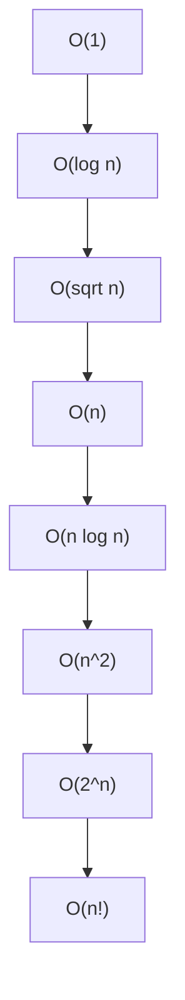
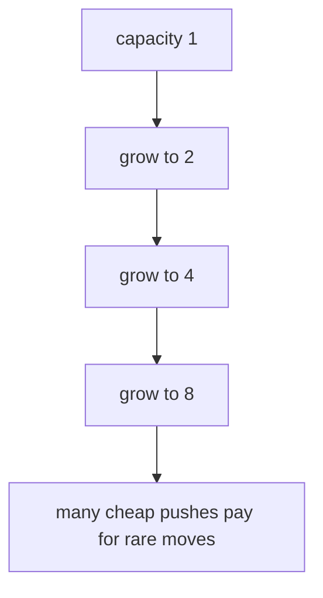

Algorithms are not judged only by whether they work. They are judged by how their resource usage grows. Hardware changes constants; asymptotic growth explains what happens when input size becomes huge.

## Why we care

On ten items, almost any correct solution feels instant. On ten million items, an O(n^2) loop can be impossible while an O(n log n) solution still finishes.

<CodeBlock
  adapter="cpp"
  starterCode={`#include <iostream>

int main() {
  for (int n : {10, 100, 1000, 10000}) {
    std::cout << "n=" << n << " linear=" << n << " quadratic=" << 1LL * n * n
              << "\\n";
  }
  return 0;
}
`}
/>

<Callout type="info" title="Complexity is about growth">
Big-O ignores machine speed and focuses on how work changes as input size grows. Constants still matter in real systems, but growth rate decides what is possible at scale.
</Callout>

## Big-O, Big-Ω, and Big-Θ

Let `f(n)` be the work your algorithm does and `g(n)` be a comparison function such as `n`, `n log n`, or `n^2`.

| Notation | Meaning | Intuition |
| --- | --- | --- |
| Big-O | Upper bound | Grows no faster than this, up to constants. |
| Big-Ω | Lower bound | Grows at least this fast, up to constants. |
| Big-Θ | Tight bound | Both an upper and lower bound. |

Formally, `f(n) = O(g(n))` if there exist constants `c` and `n0` such that `f(n) <= c*g(n)` for all `n >= n0`.

<CodeBlock
  adapter="cpp"
  starterCode={`#include <iostream>
#include <vector>

int sum(const std::vector<int> &xs) {
  int total = 0;
  for (int x : xs)
    total += x;
  return total;
}

int main() {
  std::vector<int> xs = {1, 2, 3, 4, 5};
  std::cout << sum(xs) << "\\n";
  return 0;
}
`}
/>

The `sum` function is Θ(n): it must inspect every element, and it does constant work per element.

## Growth rates hierarchy

| Complexity | Example |
| --- | --- |
| O(1) | Read `v[0]` |
| O(log n) | Binary search |
| O(sqrt n) | Trial division up to `sqrt(n)` |
| O(n) | Scan a vector |
| O(n log n) | Comparison sorting |
| O(n^2) | Check every pair |
| O(2^n) | Try every subset |
| O(n!) | Try every permutation |

<CodeBlock
  adapter="cpp"
  starterCode={`#include <chrono>
#include <iostream>

int main() {
  volatile long long sink = 0;
  for (int n : {10000, 100000, 1000000}) {
    auto start = std::chrono::high_resolution_clock::now();
    for (int i = 0; i < n; ++i)
      sink += i;
    auto stop = std::chrono::high_resolution_clock::now();
    auto micros =
        std::chrono::duration_cast<std::chrono::microseconds>(stop - start)
            .count();
    std::cout << "n=" << n << " took about " << micros << " microseconds\\n";
  }
  return 0;
}
`}
/>

Timing small programs is noisy, especially in a browser sandbox, but measurement is useful when paired with complexity analysis.

## Reading loops and binary search

A single loop over `n` items is usually O(n). A nested loop over all pairs is usually O(n^2). Binary search is O(log n) because each comparison halves the remaining search space.

A pair-counting loop runs `n(n - 1) / 2` times, which is Θ(n^2).

## Amortized analysis

Some operations are occasionally expensive but cheap on average over a sequence. `std::vector::push_back` is the classic example: most pushes write one element, but when capacity is full, the vector allocates a larger array and moves existing elements.

The doubling argument: if capacity doubles, each element is moved only a small number of times across many insertions. The total work for `n` pushes is O(n), so each push is O(1) **amortized**.

<CodeBlock
  adapter="cpp"
  starterCode={`#include <iostream>
#include <vector>

int main() {
  std::vector<int> v;
  std::size_t last = v.capacity();
  for (int i = 0; i < 20; ++i) {
    v.push_back(i);
    if (v.capacity() != last) {
      last = v.capacity();
      std::cout << "size " << v.size() << " capacity " << v.capacity() << "\\n";
    }
  }
  return 0;
}
`}
/>

## Common pitfalls

**Ignoring constants:** O(100n) and O(n) are the same asymptotic class, but constants can matter for realistic inputs.

**Over-emphasizing constants:** if `n` can become large, an O(n^2) design usually loses to O(n log n), even when the quadratic code is short.

**Confusing worst, average, and best case:** linear search is O(1) in the best case when the first item matches, but O(n) in the worst case when the item is last or missing.

<Callout type="warn" title="Best case is rarely enough">
When a problem asks for complexity, state which case you mean. Interviews and algorithm textbooks often default to worst-case unless otherwise specified.
</Callout>

## Practice: counting pairs and duplicates

<ChallengeCard
  adapter="cpp"
  title="Count target-sum pairs"
  instructions={`Implement \`int countPairs(const std::vector<int>& v, int target)\` to count pairs \`(i, j)\` where \`i < j\` and \`v[i] + v[j] == target\`.

Use the straightforward O(n^2) nested-loop version for this challenge. Later, you will learn how a hash map can reduce this idea to O(n).`}
  starterCode={`#include <iostream>
#include <vector>

int countPairs(const std::vector<int> &v, int target) {
  // your code here
}

int main() {
  std::vector<int> v = {1, 5, 7, -1, 5};
  std::cout << countPairs(v, 6) << "\\n";
  return 0;
}
`}
  solutionCode={`#include <iostream>
#include <vector>

int countPairs(const std::vector<int> &v, int target) {
  int count = 0;
  for (std::size_t i = 0; i < v.size(); ++i) {
    for (std::size_t j = i + 1; j < v.size(); ++j) {
      if (v[i] + v[j] == target)
        ++count;
    }
  }
  return count;
}

int main() {
  std::vector<int> v = {1, 5, 7, -1, 5};
  std::cout << countPairs(v, 6) << "\\n";
  return 0;
}
`}
  tests={[{ id: "count_pairs", name: "Counts all matching pairs", expect: { stdoutEquals: "3" } }]}
/>

<ChallengeCard
  adapter="cpp"
  title="Detect a duplicate"
  instructions={`Implement \`bool hasDuplicate(const std::vector<int>& v)\` so it returns true if any value appears at least twice.

A naive O(n^2) solution is accepted here. If you already know \`std::unordered_set\`, that gives an O(n) average-time approach.`}
  starterCode={`#include <iostream>
#include <vector>

bool hasDuplicate(const std::vector<int> &v) {
  // your code here
}

int main() {
  std::vector<int> a = {4, 2, 9, 4};
  std::vector<int> b = {1, 2, 3, 5};
  std::cout << hasDuplicate(a) << "\\n";
  std::cout << hasDuplicate(b) << "\\n";
  return 0;
}
`}
  solutionCode={`#include <iostream>
#include <vector>

bool hasDuplicate(const std::vector<int> &v) {
  for (std::size_t i = 0; i < v.size(); ++i) {
    for (std::size_t j = i + 1; j < v.size(); ++j) {
      if (v[i] == v[j])
        return true;
    }
  }
  return false;
}

int main() {
  std::vector<int> a = {4, 2, 9, 4};
  std::vector<int> b = {1, 2, 3, 5};
  std::cout << hasDuplicate(a) << "\\n";
  std::cout << hasDuplicate(b) << "\\n";
  return 0;
}
`}
  tests={[{ id: "duplicate_outputs", name: "Detects duplicate and non-duplicate vectors", expect: { stdoutLines: ["1", "0"], stdoutLinesExact: true } }]}
/>

## Test your knowledge

<MultipleChoice
  markdown={`Which complexity grows more slowly for large \`n\`: O(n log n) or O(n^2)?

- [o] O(n log n) grows more slowly
  > \`n log n\` grows more slowly than \`n^2\` as \`n\` becomes large.
- O(n^2) is asymptotically faster
  > Quadratic growth eventually dominates \`n log n\`.
- They are the same because both contain \`n\`
  > The extra factors matter.
- It depends only on the programming language
  > Language affects constants, not the asymptotic comparison.`}
/>

<MultipleChoice
  markdown={`What is the time complexity of binary search on a sorted array of length \`n\`?

- O(1)
  > It usually takes more than one comparison.
- [o] O(log n)
  > Each comparison halves the remaining search space.
- O(n)
  > That describes a linear scan.
- O(n^2)
  > Binary search has no nested scan over pairs.`}
/>

<MultipleChoice
  markdown={`What does amortized O(1) mean for \`std::vector::push_back\`?

- Every single call always performs exactly one machine instruction
  > Individual calls vary, and complexity is not measured in exact instructions.
- Every call is worst-case O(1), even when the vector reallocates
  > Reallocation can move existing elements, so one call can be O(n).
- [o] A sequence of many pushes has constant average cost per push, even though occasional pushes are expensive
  > Reallocations are spread across many cheap insertions.
- It means pushing is O(log n) but written differently
  > Amortized O(1) and O(log n) are different claims.`}
/>

<MultipleChoice
  markdown={`For a fixed input size \`n = 10\`, is an O(n!) algorithm always slower than an O(2^n) algorithm?

- [o] No; asymptotic notation describes growth, and constants/implementation details can dominate at one fixed input size
  > O(n!) grows faster eventually, but Big-O alone does not guarantee runtime for one fixed small input.
- Yes; Big-O gives exact runtimes for every \`n\`
  > Big-O is not an exact stopwatch.
- Yes; Big-O rankings give exact runtime order at \`n = 10\`
  > Big-O rankings describe eventual growth, not exact runtime order for one fixed input size.
- No; O(n!) is always faster than O(2^n)
  > Factorial growth eventually exceeds exponential growth.`}
/>
<Callout type="success" title="Key idea">Complexity analysis helps you predict scalability before you write thousands of lines of code.</Callout>
