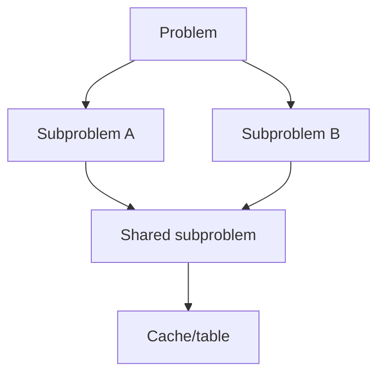
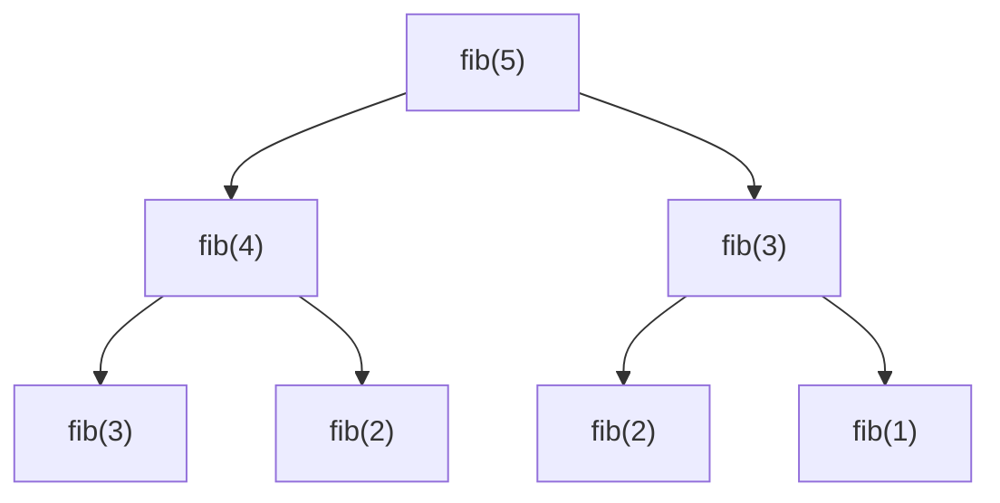
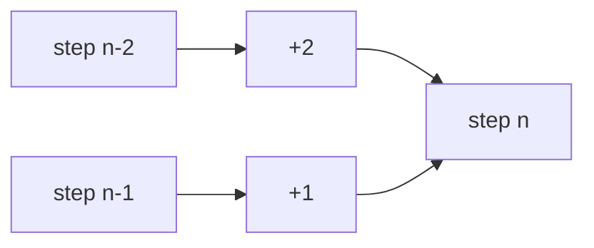
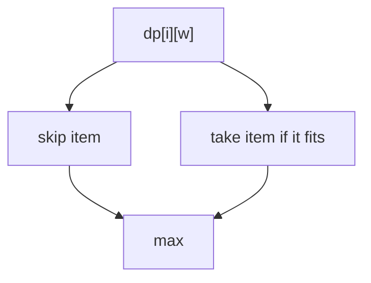
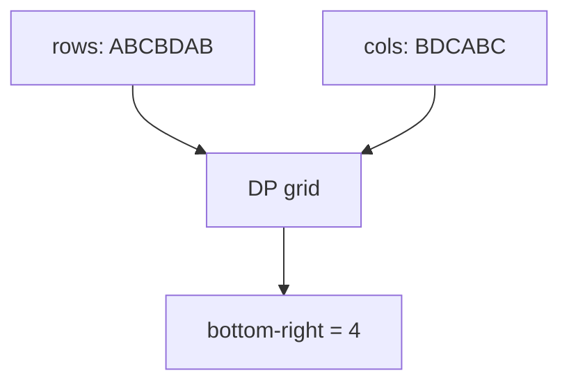

Dynamic programming solves problems by combining answers to **overlapping subproblems** with **optimal substructure**. It is the next step after recursion: the Fibonacci tree in `recursion.mdx` repeats calls; DP stores those answers.

## Mindset

Top-down **memoization** is recursion plus a cache. Bottom-up **tabulation** fills a table from base cases upward.

<Callout type="info" title="Define the state first">
Before coding, say exactly what `dp[i]` or `dp[i][j]` means. The transition usually follows naturally.
</Callout>

## Fibonacci

Naive recursion is exponential because it repeats work.

<CodeBlock adapter="cpp" initialCode={`#include <iostream>
int fib(int n) {
    if (n <= 1) return n;
    return fib(n - 1) + fib(n - 2);
}
int main() {
    for (int i = 0; i <= 7; i++) std::cout << fib(i) << " ";
    std::cout << "\n";
    return 0;
}
`} />

<CodeBlock adapter="cpp" initialCode={`#include <iostream>
#include <vector>
int fibMemo(int n, std::vector<int>& memo) {
    if (n <= 1) return n;
    if (memo[n] != -1) return memo[n];
    return memo[n] = fibMemo(n - 1, memo) + fibMemo(n - 2, memo);
}
int main() {
    std::vector<int> memo(11, -1);
    std::cout << fibMemo(10, memo) << "\n";
    return 0;
}
`} />

<CodeBlock adapter="cpp" initialCode={`#include <iostream>
#include <vector>
int fibTab(int n) {
    if (n <= 1) return n;
    std::vector<int> dp(n + 1);
    dp[1] = 1;
    for (int i = 2; i <= n; i++) dp[i] = dp[i - 1] + dp[i - 2];
    return dp[n];
}
int main() {
    std::cout << fibTab(10) << "\n";
    return 0;
}
`} />

<CodeBlock adapter="cpp" initialCode={`#include <iostream>
int fibSpace(int n) {
    if (n <= 1) return n;
    int a = 0, b = 1;
    for (int i = 2; i <= n; i++) {
        int c = a + b;
        a = b;
        b = c;
    }
    return b;
}
int main() {
    std::cout << fibSpace(10) << "\n";
    return 0;
}
`} />

## Climbing stairs

If you may climb 1 or 2 steps, `f(n) = f(n-1) + f(n-2)` because the last move comes from one of those states.

<CodeBlock adapter="cpp" initialCode={`#include <iostream>
int climbStairs(int n) {
    if (n <= 2) return n;
    int a = 1, b = 2;
    for (int i = 3; i <= n; i++) {
        int c = a + b;
        a = b;
        b = c;
    }
    return b;
}
int main() {
    for (int n : {1, 2, 3, 5}) std::cout << climbStairs(n) << "\n";
    return 0;
}
`} />

## Coin change: min coins

Let `dp[a]` be the minimum coins for amount `a`; try each coin as the last coin.

<CodeBlock adapter="cpp" initialCode={`#include <algorithm>
#include <iostream>
#include <vector>
int coinChange(const std::vector<int>& coins, int amount) {
    int INF = amount + 1;
    std::vector<int> dp(amount + 1, INF);
    dp[0] = 0;
    for (int a = 1; a <= amount; a++)
        for (int c : coins)
            if (c <= a) dp[a] = std::min(dp[a], dp[a - c] + 1);
    return dp[amount] == INF ? -1 : dp[amount];
}
int main() {
    std::cout << coinChange({1, 3, 4}, 6) << "\n";
    std::cout << coinChange({2}, 3) << "\n";
    return 0;
}
`} />

## 0/1 knapsack

`dp[i][w]` is the best value using the first `i` items and capacity `w`.

| item | weight | value |
| --- | ---: | ---: |
| 0 | 2 | 12 |
| 1 | 1 | 10 |
| 2 | 3 | 20 |
| 3 | 2 | 15 |

<CodeBlock adapter="cpp" initialCode={`#include <algorithm>
#include <iostream>
#include <vector>
int knapsack(int W, const std::vector<int>& wt, const std::vector<int>& val) {
    int n = wt.size();
    std::vector<std::vector<int>> dp(n + 1, std::vector<int>(W + 1));
    for (int i = 1; i <= n; i++)
        for (int w = 0; w <= W; w++) {
            dp[i][w] = dp[i - 1][w];
            if (wt[i - 1] <= w) dp[i][w] = std::max(dp[i][w], val[i - 1] + dp[i - 1][w - wt[i - 1]]);
        }
    return dp[n][W];
}
int main() {
    std::cout << knapsack(5, {2, 1, 3, 2}, {12, 10, 20, 15}) << "\n";
    return 0;
}
`} />

## LCS and LIS

For LCS, `dp[i][j]` is the best length for prefixes `a[0..i)` and `b[0..j)`. Example `ABCBDAB` / `BDCABC` has length 4.

<CodeBlock adapter="cpp" initialCode={`#include <algorithm>
#include <iostream>
#include <string>
#include <vector>
int lcs(const std::string& a, const std::string& b) {
    std::vector<std::vector<int>> dp(a.size() + 1, std::vector<int>(b.size() + 1));
    for (int i = 1; i <= (int)a.size(); i++)
        for (int j = 1; j <= (int)b.size(); j++)
            dp[i][j] = a[i - 1] == b[j - 1] ? 1 + dp[i - 1][j - 1] : std::max(dp[i - 1][j], dp[i][j - 1]);
    return dp[a.size()][b.size()];
}
int main() {
    std::cout << lcs("ABCBDAB", "BDCABC") << "\n";
    return 0;
}
`} />

For LIS, `dp[i]` is the longest increasing subsequence ending at `i`. The O(n log n) patience-sort version is faster, but O(n²) is the clearest DP.

<CodeBlock adapter="cpp" initialCode={`#include <algorithm>
#include <iostream>
#include <vector>
int lis(const std::vector<int>& nums) {
    std::vector<int> dp(nums.size(), 1);
    int best = 0;
    for (int i = 0; i < (int)nums.size(); i++) {
        for (int j = 0; j < i; j++) if (nums[j] < nums[i]) dp[i] = std::max(dp[i], dp[j] + 1);
        best = std::max(best, dp[i]);
    }
    return best;
}
int main() {
    std::cout << lis({10, 9, 2, 5, 3, 7, 101, 18}) << "\n";
    return 0;
}
`} />

## Identifying and optimizing DP

Use DP when you see optimal substructure and overlapping subproblems. Optimize space with rolling arrays when a row only depends on previous rows.

<ChallengeCard adapter="cpp" title="Climbing stairs" instructions={`Implement \`int climbStairs(int n)\` for n=1..45. The driver prints several values.`} initialCode={`#include <iostream>
int climbStairs(int n) { return 0; }
int main() {
    for (int n : {1, 2, 3, 5, 10}) std::cout << climbStairs(n) << "\n";
    return 0;
}
`} solutionCode={`#include <iostream>
int climbStairs(int n) {
    if (n <= 2) return n;
    int a = 1, b = 2;
    for (int i = 3; i <= n; i++) { int c = a + b; a = b; b = c; }
    return b;
}
int main() {
    for (int n : {1, 2, 3, 5, 10}) std::cout << climbStairs(n) << "\n";
    return 0;
}
`} tests={[{ id: "climb", name: "Computes stair counts", expect: { stdoutLines: ["1", "2", "3", "8", "89"], stdoutLinesExact: true } }]} />

<ChallengeCard adapter="cpp" title="Coin change min coins" instructions={`Implement \`int coinChange(std::vector<int> coins, int amount)\`. Return -1 if impossible.`} initialCode={`#include <algorithm>
#include <iostream>
#include <vector>
int coinChange(std::vector<int> coins, int amount) { return 0; }
int main() {
    std::cout << coinChange({1, 2, 5}, 11) << "\n";
    std::cout << coinChange({2}, 3) << "\n";
    std::cout << coinChange({1, 3, 4}, 6) << "\n";
    return 0;
}
`} solutionCode={`#include <algorithm>
#include <iostream>
#include <vector>
int coinChange(std::vector<int> coins, int amount) {
    int INF = amount + 1;
    std::vector<int> dp(amount + 1, INF);
    dp[0] = 0;
    for (int a = 1; a <= amount; a++) for (int c : coins) if (c <= a) dp[a] = std::min(dp[a], dp[a - c] + 1);
    return dp[amount] == INF ? -1 : dp[amount];
}
int main() {
    std::cout << coinChange({1, 2, 5}, 11) << "\n";
    std::cout << coinChange({2}, 3) << "\n";
    std::cout << coinChange({1, 3, 4}, 6) << "\n";
    return 0;
}
`} tests={[{ id: "coins", name: "Minimum coins", expect: { stdoutLines: ["3", "-1", "2"], stdoutLinesExact: true } }]} />

<ChallengeCard adapter="cpp" title="0/1 Knapsack max value" instructions={`Implement \`int knapsack(int W, const std::vector<int>& weights, const std::vector<int>& values)\`.`} initialCode={`#include <algorithm>
#include <iostream>
#include <vector>
int knapsack(int W, const std::vector<int>& weights, const std::vector<int>& values) { return 0; }
int main() {
    std::cout << knapsack(5, {2, 1, 3, 2}, {12, 10, 20, 15}) << "\n";
    return 0;
}
`} solutionCode={`#include <algorithm>
#include <iostream>
#include <vector>
int knapsack(int W, const std::vector<int>& weights, const std::vector<int>& values) {
    std::vector<int> dp(W + 1);
    for (int i = 0; i < (int)weights.size(); i++) for (int w = W; w >= weights[i]; w--) dp[w] = std::max(dp[w], values[i] + dp[w - weights[i]]);
    return dp[W];
}
int main() {
    std::cout << knapsack(5, {2, 1, 3, 2}, {12, 10, 20, 15}) << "\n";
    return 0;
}
`} tests={[{ id: "knapsack", name: "Maximum value", expect: { stdoutEquals: "37" } }]} />

## Check your understanding

<MultipleChoice markdown={`When does DP apply best?

- Every subproblem is unique.
  > That gives little reuse.
- [o] The problem has optimal substructure and overlapping subproblems.
  > Correct.
- The input is always sorted.
  > Sorting is not required.
- Only for graphs.
  > DP appears everywhere.`} />

<MultipleChoice markdown={`What is top-down DP?

- [o] Recursion plus a cache.
  > Correct.
- Iteration without storage.
  > Usually bottom-up uses iteration.
- Sorting by value.
  > That sounds greedy.
- A binary search tree.
  > Not related.`} />

<MultipleChoice markdown={`The standard LCS table for lengths n and m costs:

- O(n + m)
  > It checks pairs of prefixes.
- [o] O(nm)
  > Correct.
- O(log n)
  > No halving.
- O(2^n)
  > DP avoids the exponential recursion.`} />

<MultipleChoice markdown={`Why can Fibonacci use O(1) extra space?

- It has no base case.
  > It has base cases.
- C++ memoizes automatically.
  > It does not.
- [o] Each state needs only the previous two values.
  > Correct.
- It only works for n=10.
  > The dependency pattern is general.`} />
