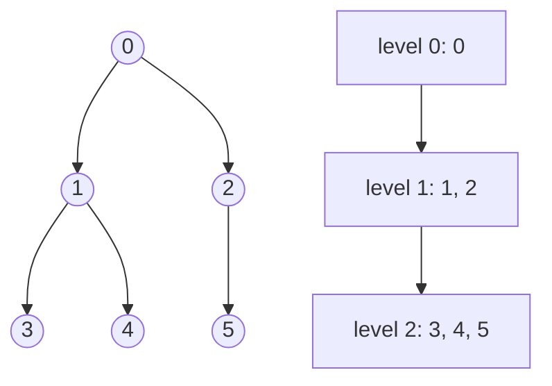
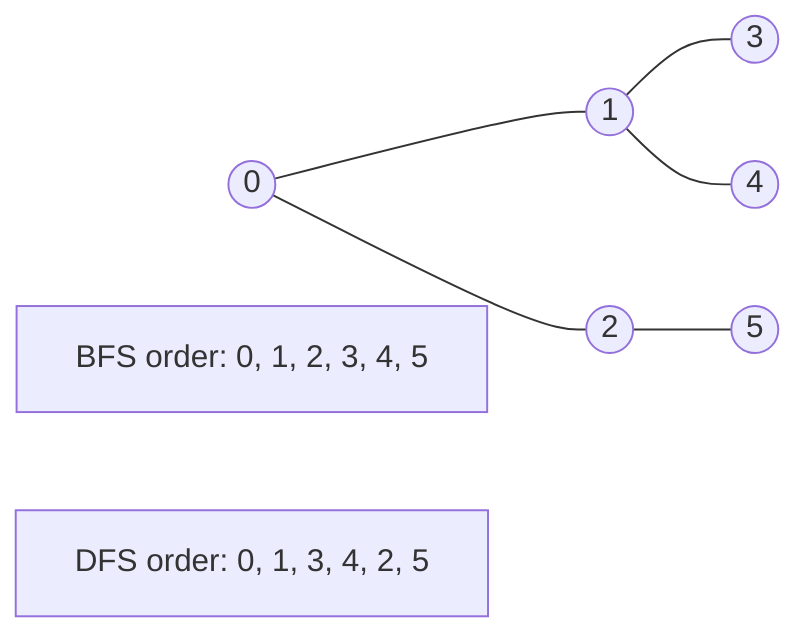
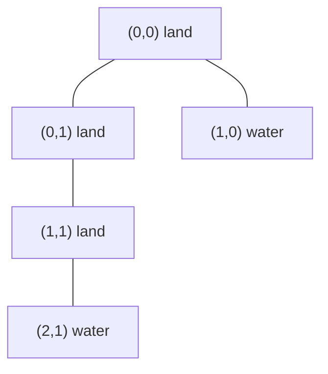

Graph traversal means systematically visiting vertices reachable from a starting point. The two core tools are **breadth-first search (BFS)** and **depth-first search (DFS)**.

## Breadth-first search

BFS explores level by level from a source. It uses a queue: push the source, pop the oldest vertex, then push each unvisited neighbor.

```text
BFS(adj, src):
    mark src visited
    push src into queue
    while queue not empty:
        u = pop front
        visit u
        for each v in adj[u]:
            if v is unvisited:
                mark v visited
                push v
```



Because BFS visits by increasing number of edges, it finds shortest paths in **unweighted** graphs.

<CodeBlock
  adapter="cpp"
  initialCode={`#include <iostream>
#include <queue>
#include <vector>

std::vector<int> bfs(const std::vector<std::vector<int>>& adj, int src) {
    std::vector<int> order;
    std::vector<bool> visited(adj.size(), false);
    std::queue<int> q;

    visited[src] = true;
    q.push(src);

    while (!q.empty()) {
        int u = q.front();
        q.pop();
        order.push_back(u);

        for (int v : adj[u]) {
            if (!visited[v]) {
                visited[v] = true;
                q.push(v);
            }
        }
    }
    return order;
}

int main() {
    std::vector<std::vector<int>> adj = {{1, 2}, {3, 4}, {5}, {}, {}, {}};
    for (int x : bfs(adj, 0)) std::cout << x << " ";
    std::cout << "\\n";
    return 0;
}
`}
/>

## Depth-first search

DFS goes as deep as possible before backtracking. It can be written with recursion or with an explicit stack.

```text
DFS(u):
    mark u visited
    visit u
    for each v in adj[u]:
        if v is unvisited:
            DFS(v)
```

<CodeBlock
  adapter="cpp"
  initialCode={`#include <iostream>
#include <vector>

void dfsRecursive(int u, const std::vector<std::vector<int>>& adj, std::vector<bool>& visited) {
    visited[u] = true;
    std::cout << u << " ";
    for (int v : adj[u]) {
        if (!visited[v]) dfsRecursive(v, adj, visited);
    }
}

int main() {
    std::vector<std::vector<int>> adj = {{1, 2}, {3, 4}, {5}, {}, {}, {}};
    std::vector<bool> visited(adj.size(), false);
    dfsRecursive(0, adj, visited);
    std::cout << "\\n";
    return 0;
}
`}
/>

The iterative version uses a stack. Push neighbors in reverse order if you want the same order as recursive DFS on a normally ordered adjacency list.

<CodeBlock
  adapter="cpp"
  initialCode={`#include <iostream>
#include <stack>
#include <vector>

std::vector<int> dfsIterative(const std::vector<std::vector<int>>& adj, int src) {
    std::vector<int> order;
    std::vector<bool> visited(adj.size(), false);
    std::stack<int> st;
    st.push(src);

    while (!st.empty()) {
        int u = st.top();
        st.pop();
        if (visited[u]) continue;
        visited[u] = true;
        order.push_back(u);

        for (int i = static_cast<int>(adj[u].size()) - 1; i >= 0; i--) {
            int v = adj[u][i];
            if (!visited[v]) st.push(v);
        }
    }
    return order;
}

int main() {
    std::vector<std::vector<int>> adj = {{1, 2}, {3, 4}, {5}, {}, {}, {}};
    for (int x : dfsIterative(adj, 0)) std::cout << x << " ";
    std::cout << "\\n";
    return 0;
}
`}
/>



<Callout type="success" title="Visited is non-negotiable">
Use `vector<bool>` or another visited structure before pushing or recursing into neighbors. Without it, cyclic graphs can loop forever.
</Callout>

## Connected components

To count connected components in an undirected graph, start a BFS or DFS from every unvisited vertex. Each new start discovers one component.

<CodeBlock
  adapter="cpp"
  initialCode={`#include <iostream>
#include <queue>
#include <vector>

int countComponents(const std::vector<std::vector<int>>& adj) {
    int n = static_cast<int>(adj.size());
    std::vector<bool> visited(n, false);
    int components = 0;

    for (int start = 0; start < n; start++) {
        if (visited[start]) continue;
        components++;
        std::queue<int> q;
        visited[start] = true;
        q.push(start);
        while (!q.empty()) {
            int u = q.front();
            q.pop();
            for (int v : adj[u]) {
                if (!visited[v]) {
                    visited[v] = true;
                    q.push(v);
                }
            }
        }
    }
    return components;
}

int main() {
    std::vector<std::vector<int>> adj = {{1}, {0}, {3}, {2}, {}};
    std::cout << countComponents(adj) << "\\n";
    return 0;
}
`}
/>

## Cycle detection

For an undirected graph, DFS tracks the parent. Seeing a visited neighbor that is not the parent means a cycle exists.

<CodeBlock
  adapter="cpp"
  initialCode={`#include <iostream>
#include <vector>

bool dfsCycleUndirected(int u, int parent, const std::vector<std::vector<int>>& adj, std::vector<bool>& visited) {
    visited[u] = true;
    for (int v : adj[u]) {
        if (!visited[v]) {
            if (dfsCycleUndirected(v, u, adj, visited)) return true;
        } else if (v != parent) {
            return true;
        }
    }
    return false;
}

int main() {
    std::vector<std::vector<int>> adj = {{1, 2}, {0, 2}, {0, 1}};
    std::vector<bool> visited(adj.size(), false);
    std::cout << (dfsCycleUndirected(0, -1, adj, visited) ? "cycle" : "acyclic") << "\\n";
    return 0;
}
`}
/>

For a directed graph, use colors: white = unvisited, gray = currently in recursion stack, black = fully processed. Finding an edge to gray means a cycle.

<CodeBlock
  adapter="cpp"
  initialCode={`#include <iostream>
#include <vector>

bool hasDirectedCycleFrom(int u, const std::vector<std::vector<int>>& adj, std::vector<int>& color) {
    color[u] = 1;
    for (int v : adj[u]) {
        if (color[v] == 1) return true;
        if (color[v] == 0 && hasDirectedCycleFrom(v, adj, color)) return true;
    }
    color[u] = 2;
    return false;
}

int main() {
    std::vector<std::vector<int>> adj = {{1}, {2}, {0}};
    std::vector<int> color(adj.size(), 0);
    std::cout << (hasDirectedCycleFrom(0, adj, color) ? "cycle" : "acyclic") << "\\n";
    return 0;
}
`}
/>

## Topological sort

A topological ordering places every directed edge `u -> v` with `u` before `v`. It exists only for DAGs. DFS can produce it by pushing each vertex after all outgoing neighbors finish.

<CodeBlock
  adapter="cpp"
  initialCode={`#include <algorithm>
#include <iostream>
#include <vector>

void dfsTopo(int u, const std::vector<std::vector<int>>& adj, std::vector<bool>& visited, std::vector<int>& order) {
    visited[u] = true;
    for (int v : adj[u]) if (!visited[v]) dfsTopo(v, adj, visited, order);
    order.push_back(u);
}

int main() {
    std::vector<std::vector<int>> adj = {{1, 2}, {3}, {3}, {}};
    std::vector<bool> visited(adj.size(), false);
    std::vector<int> order;
    for (int u = 0; u < static_cast<int>(adj.size()); u++) {
        if (!visited[u]) dfsTopo(u, adj, visited, order);
    }
    std::reverse(order.begin(), order.end());
    for (int x : order) std::cout << x << " ";
    std::cout << "\\n";
    return 0;
}
`}
/>

Kahn's algorithm is the BFS-like alternative: compute in-degrees, repeatedly pop vertices with in-degree 0, and decrement their outgoing neighbors.

## Shortest path in an unweighted graph

BFS can also record distance and parent arrays.

<CodeBlock
  adapter="cpp"
  initialCode={`#include <iostream>
#include <queue>
#include <vector>

int main() {
    std::vector<std::vector<int>> adj = {{1, 2}, {3}, {3}, {4}, {}};
    int src = 0;
    std::vector<int> dist(adj.size(), -1), parent(adj.size(), -1);
    std::queue<int> q;
    dist[src] = 0;
    q.push(src);

    while (!q.empty()) {
        int u = q.front();
        q.pop();
        for (int v : adj[u]) {
            if (dist[v] == -1) {
                dist[v] = dist[u] + 1;
                parent[v] = u;
                q.push(v);
            }
        }
    }

    for (int d : dist) std::cout << d << " ";
    std::cout << "\\n";
    return 0;
}
`}
/>

## Grids as graphs: flood fill and islands

A grid cell can be a vertex. Edges connect up, down, left, and right neighbors.



A number-of-islands solution starts BFS from every unvisited land cell and marks its whole component.

<CodeBlock
  adapter="cpp"
  initialCode={`#include <iostream>
#include <queue>
#include <utility>
#include <vector>

int main() {
    std::vector<std::vector<char>> grid = {
        {'1', '1', '0'},
        {'0', '1', '0'},
        {'1', '0', '1'}
    };
    int rows = static_cast<int>(grid.size());
    int cols = static_cast<int>(grid[0].size());
    int islands = 0;
    std::vector<int> dr = {1, -1, 0, 0};
    std::vector<int> dc = {0, 0, 1, -1};

    for (int r = 0; r < rows; r++) {
        for (int c = 0; c < cols; c++) {
            if (grid[r][c] != '1') continue;
            islands++;
            grid[r][c] = '0';
            std::queue<std::pair<int, int>> q;
            q.push({r, c});
            while (!q.empty()) {
                auto [cr, cc] = q.front();
                q.pop();
                for (int k = 0; k < 4; k++) {
                    int nr = cr + dr[k], nc = cc + dc[k];
                    if (nr < 0 || nr >= rows || nc < 0 || nc >= cols || grid[nr][nc] != '1') continue;
                    grid[nr][nc] = '0';
                    q.push({nr, nc});
                }
            }
        }
    }

    std::cout << islands << "\\n";
    return 0;
}
`}
/>

## Challenge: BFS from source

<ChallengeCard
  adapter="cpp"
  title="BFS from source"
  instructions={`Implement \`bfsOrder\` to return the BFS visit order starting at \`src\`.`}
  initialCode={`#include <iostream>
#include <queue>
#include <vector>

std::vector<int> bfsOrder(const std::vector<std::vector<int>>& adj, int src) {
    // your code here
    return {};
}

int main() {
    std::vector<std::vector<int>> adj = {{1, 2}, {3, 4}, {5}, {}, {}, {}};
    std::vector<int> order = bfsOrder(adj, 0);
    for (int i = 0; i < static_cast<int>(order.size()); i++) {
        if (i) std::cout << " ";
        std::cout << order[i];
    }
    std::cout << "\\n";
    return 0;
}
`}
  solutionCode={`#include <iostream>
#include <queue>
#include <vector>

std::vector<int> bfsOrder(const std::vector<std::vector<int>>& adj, int src) {
    std::vector<int> order;
    std::vector<bool> visited(adj.size(), false);
    std::queue<int> q;
    visited[src] = true;
    q.push(src);
    while (!q.empty()) {
        int u = q.front();
        q.pop();
        order.push_back(u);
        for (int v : adj[u]) {
            if (!visited[v]) {
                visited[v] = true;
                q.push(v);
            }
        }
    }
    return order;
}

int main() {
    std::vector<std::vector<int>> adj = {{1, 2}, {3, 4}, {5}, {}, {}, {}};
    std::vector<int> order = bfsOrder(adj, 0);
    for (int i = 0; i < static_cast<int>(order.size()); i++) {
        if (i) std::cout << " ";
        std::cout << order[i];
    }
    std::cout << "\\n";
    return 0;
}
`}
  tests={[
    {
      id: "bfs-order",
      name: "Visits level by level",
      expect: { stdoutEquals: "0 1 2 3 4 5" },
    },
  ]}
/>

## Challenge: Number of connected components

<ChallengeCard
  adapter="cpp"
  title="Number of connected components"
  instructions={`Implement \`countComponents\` by starting a traversal from every unvisited vertex.`}
  initialCode={`#include <iostream>
#include <queue>
#include <vector>

int countComponents(int n, const std::vector<std::vector<int>>& adj) {
    // your code here
    return 0;
}

int main() {
    int n = 6;
    std::vector<std::vector<int>> adj = {
        {1}, {0}, {3}, {2}, {}, {}
    };
    std::cout << countComponents(n, adj) << "\\n";
    return 0;
}
`}
  solutionCode={`#include <iostream>
#include <queue>
#include <vector>

int countComponents(int n, const std::vector<std::vector<int>>& adj) {
    std::vector<bool> visited(n, false);
    int components = 0;
    for (int start = 0; start < n; start++) {
        if (visited[start]) continue;
        components++;
        std::queue<int> q;
        visited[start] = true;
        q.push(start);
        while (!q.empty()) {
            int u = q.front();
            q.pop();
            for (int v : adj[u]) {
                if (!visited[v]) {
                    visited[v] = true;
                    q.push(v);
                }
            }
        }
    }
    return components;
}

int main() {
    int n = 6;
    std::vector<std::vector<int>> adj = {
        {1}, {0}, {3}, {2}, {}, {}
    };
    std::cout << countComponents(n, adj) << "\\n";
    return 0;
}
`}
  tests={[
    {
      id: "components",
      name: "Counts four components",
      expect: { stdoutEquals: "4" },
    },
  ]}
/>

## Challenge: Number of islands

<ChallengeCard
  adapter="cpp"
  title="Number of islands"
  instructions={`Implement \`numIslands\`. Mutating the grid to mark visited land is allowed.`}
  initialCode={`#include <iostream>
#include <queue>
#include <utility>
#include <vector>

int numIslands(std::vector<std::vector<char>>& grid) {
    // your code here
    return 0;
}

int main() {
    std::vector<std::vector<char>> grid = {
        {'1', '1', '0', '0'},
        {'0', '1', '0', '1'},
        {'1', '0', '0', '1'},
        {'0', '0', '1', '1'}
    };
    std::cout << numIslands(grid) << "\\n";
    return 0;
}
`}
  solutionCode={`#include <iostream>
#include <queue>
#include <utility>
#include <vector>

int numIslands(std::vector<std::vector<char>>& grid) {
    if (grid.empty()) return 0;
    int rows = static_cast<int>(grid.size());
    int cols = static_cast<int>(grid[0].size());
    int islands = 0;
    std::vector<int> dr = {1, -1, 0, 0};
    std::vector<int> dc = {0, 0, 1, -1};

    for (int r = 0; r < rows; r++) {
        for (int c = 0; c < cols; c++) {
            if (grid[r][c] != '1') continue;
            islands++;
            grid[r][c] = '0';
            std::queue<std::pair<int, int>> q;
            q.push({r, c});
            while (!q.empty()) {
                auto [cr, cc] = q.front();
                q.pop();
                for (int k = 0; k < 4; k++) {
                    int nr = cr + dr[k], nc = cc + dc[k];
                    if (nr < 0 || nr >= rows || nc < 0 || nc >= cols || grid[nr][nc] != '1') continue;
                    grid[nr][nc] = '0';
                    q.push({nr, nc});
                }
            }
        }
    }
    return islands;
}

int main() {
    std::vector<std::vector<char>> grid = {
        {'1', '1', '0', '0'},
        {'0', '1', '0', '1'},
        {'1', '0', '0', '1'},
        {'0', '0', '1', '1'}
    };
    std::cout << numIslands(grid) << "\\n";
    return 0;
}
`}
  tests={[
    {
      id: "islands",
      name: "Counts three islands",
      expect: { stdoutEquals: "3" },
    },
  ]}
/>

## Check your understanding

<MultipleChoice
  markdown={`Which data structure is the usual core of BFS?

- [o] Queue
  > BFS processes vertices in first-in, first-out order.
- Stack
  > A stack is the usual core of iterative DFS.
- Binary search tree
  > A BST stores ordered keys, not BFS frontier order.
- Heap
  > A heap is used by algorithms like Dijkstra, not ordinary BFS.

BFS uses a queue so all vertices at distance k are processed before distance k + 1.`}
/>

<MultipleChoice
  markdown={`Which mechanism naturally supports DFS?

- Queue only
  > A queue creates breadth-first behavior.
- [o] Recursion or an explicit stack
  > DFS follows one path deeply, which matches the call stack or a stack container.
- Priority queue only
  > Priority queues order by priority, not depth.
- Hash table only
  > A hash table can store visited vertices but does not drive DFS order.

Recursive DFS is concise; iterative DFS avoids recursion-depth limits.`}
/>

<MultipleChoice
  markdown={`When does BFS find shortest paths from a source?

- In every weighted graph
  > Weighted costs can make a path with fewer edges more expensive.
- Only in complete graphs
  > Completeness is not required.
- [o] In unweighted graphs, where every edge has equal cost
  > BFS minimizes number of edges.
- Only in directed acyclic graphs
  > DAGs can be weighted; BFS is not generally enough there.

Use Dijkstra for non-negative weighted graphs.`}
/>
