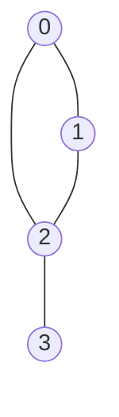
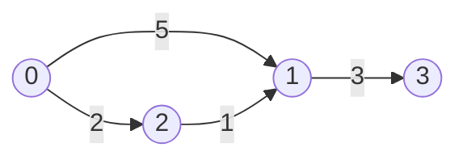
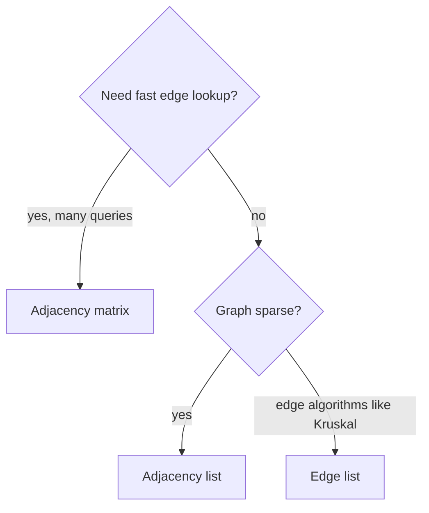

A **graph** is a collection of **vertices** `V` and **edges** `E`. Vertices are the objects; edges are relationships between them. Graphs are the language of networks: social follows, road maps, web links, package dependencies, neural network topology, game maps, and workflow pipelines.

<svg
  viewBox="0 0 640 210"
  role="img"
  aria-label="A constellation of vertices joined by dotted edges of different thicknesses, each run carrying a small weight number — heavier trails of dots marking costlier connections"
  style={{ display: "block", width: "100%", maxWidth: "640px", height: "auto", margin: "2.5rem auto" }}
>
  <g fill="currentColor" opacity="0.3">
    <circle cx="170" cy="55" r="2" />
    <circle cx="270" cy="45" r="2" />
    <circle cx="370" cy="48" r="4.5" />
    <circle cx="470" cy="63" r="4.5" />
    <circle cx="145" cy="85" r="2.5" />
    <circle cx="170" cy="110" r="2.5" />
    <circle cx="195" cy="135" r="2.5" />
    <circle cx="272" cy="161" r="3.5" />
    <circle cx="378" cy="164" r="3.5" />
    <circle cx="348" cy="71" r="3" />
    <circle cx="375" cy="102" r="3" />
    <circle cx="402" cy="134" r="3" />
  </g>
  <g style={{ color: "var(--ds-blue-500)" }} fill="currentColor">
    <circle cx="120" cy="60" r="9" />
    <circle cx="320" cy="40" r="9" />
    <circle cx="520" cy="70" r="9" />
    <circle cx="220" cy="160" r="9" />
    <circle cx="430" cy="165" r="9" />
  </g>
  <g style={{ color: "var(--ds-teal-500)" }} fill="currentColor">
    <circle cx="220" cy="50" r="9" />
    <circle cx="420" cy="55" r="9" />
    <circle cx="325" cy="163" r="9" />
  </g>
  <g style={{ fill: "var(--ds-white)" }} fontFamily="var(--font-mono), ui-monospace, monospace" fontSize="11" fontWeight="700" textAnchor="middle">
    <text x="220" y="54">2</text>
    <text x="420" y="59">7</text>
    <text x="325" y="167">5</text>
  </g>
</svg>

## Graph vocabulary

* **Undirected graph**: an edge `{u, v}` works both ways.
* **Directed graph**: an edge `(u, v)` goes from `u` to `v`.
* **Weighted graph**: each edge carries a cost, distance, latency, or capacity.
* **Unweighted graph**: every edge is treated equally.
* **Cyclic graph**: at least one path loops back to a vertex.
* **Acyclic graph**: no cycles. A directed acyclic graph is called a **DAG**.

This is a small undirected graph. Edge `0-1` also means `1-0`.

This is a directed weighted graph. The arrow and weight both matter.

<Callout type="info" title="Graphs generalize many structures">
A linked list is a graph where each vertex has at most one outgoing edge. A tree is a connected acyclic graph. Once you learn graph thinking, many data structures become special cases.
</Callout>

## The same example in three representations

Use vertices `0, 1, 2, 3` and undirected edges `0-1`, `0-2`, `1-2`, `2-3`.

### Adjacency matrix

An adjacency matrix is a `V × V` table. `matrix[u][v]` tells whether edge `u -> v` exists. It uses **O(V²)** space and supports **O(1)** edge lookup.

<CodeBlock
  adapter="cpp"
  files={[
    {
      filename: "main.cpp",
      starterCode: `#include <iostream>
#include <utility>
#include <vector>

int main() {
  int n = 4;
  std::vector<std::vector<int>> matrix(n, std::vector<int>(n, 0));
  std::vector<std::pair<int, int>> edges = {{0, 1}, {0, 2}, {1, 2}, {2, 3}};

  for (auto [u, v] : edges) {
    matrix[u][v] = 1;
    matrix[v][u] = 1;
  }

  for (const auto &row : matrix) {
    for (int x : row)
      std::cout << x << " ";
    std::cout << "\\n";
  }
  return 0;
}
`,
    },
  ]}
/>

Matrix lookup is great for dense graphs or repeated `hasEdge(u, v)` checks.

### Adjacency list

An adjacency list stores only existing neighbors. It uses **O(V + E)** space, so it is usually best for sparse graphs.

<CodeBlock
  adapter="cpp"
  files={[
    {
      filename: "main.cpp",
      starterCode: `#include <iostream>
#include <utility>
#include <vector>

int main() {
  int n = 4;
  std::vector<std::vector<int>> adj(n);
  std::vector<std::pair<int, int>> edges = {{0, 1}, {0, 2}, {1, 2}, {2, 3}};

  for (auto [u, v] : edges) {
    adj[u].push_back(v);
    adj[v].push_back(u);
  }

  for (int u = 0; u < n; u++) {
    std::cout << u << ":";
    for (int v : adj[u])
      std::cout << " " << v;
    std::cout << "\\n";
  }
  return 0;
}
`,
    },
  ]}
/>

For a weighted graph, store `(neighbor, weight)` pairs.

<CodeBlock
  adapter="cpp"
  files={[
    {
      filename: "main.cpp",
      starterCode: `#include <iostream>
#include <utility>
#include <vector>

int main() {
  int n = 4;
  std::vector<std::vector<std::pair<int, int>>> adj(n);

  auto addDirectedEdge = [&](int u, int v, int w) { adj[u].push_back({v, w}); };

  addDirectedEdge(0, 1, 5);
  addDirectedEdge(0, 2, 2);
  addDirectedEdge(2, 1, 1);
  addDirectedEdge(1, 3, 3);

  for (int u = 0; u < n; u++) {
    std::cout << u << ":";
    for (auto [v, w] : adj[u])
      std::cout << " (" << v << "," << w << ")";
    std::cout << "\\n";
  }
  return 0;
}
`,
    },
  ]}
/>

### Edge list

An edge list stores edges directly. For weighted graphs, use `vector<tuple<int,int,int>>` as `(u, v, w)`. Edge lists are simple and especially useful for **Kruskal's algorithm**.

<CodeBlock
  adapter="cpp"
  files={[
    {
      filename: "main.cpp",
      starterCode: `#include <iostream>
#include <tuple>
#include <vector>

int main() {
  std::vector<std::tuple<int, int, int>> edges = {
      {0, 1, 4}, {0, 2, 1}, {1, 2, 2}, {2, 3, 7}};

  for (auto [u, v, w] : edges) {
    std::cout << u << " -> " << v << " weight " << w << "\\n";
  }
  return 0;
}
`,
    },
  ]}
/>

## Degrees and neighbors

In an undirected graph, the **degree** of a vertex is its number of incident edges. In a directed graph, **out-degree** counts outgoing edges and **in-degree** counts incoming edges.

<CodeBlock
  adapter="cpp"
  files={[
    {
      filename: "main.cpp",
      starterCode: `#include <iostream>
#include <vector>

int main() {
  int n = 4;
  std::vector<std::vector<int>> adj = {{1, 2}, {2}, {0, 3}, {}};

  std::vector<int> indeg(n, 0), outdeg(n, 0);
  for (int u = 0; u < n; u++) {
    outdeg[u] = static_cast<int>(adj[u].size());
    for (int v : adj[u])
      indeg[v]++;
  }

  for (int u = 0; u < n; u++) {
    std::cout << u << " in=" << indeg[u] << " out=" << outdeg[u] << "\\n";
  }
  return 0;
}
`,
    },
  ]}
/>

A graph is **sparse** when `E` is much smaller than `V²`. It is **dense** when the possible edges are mostly present. Sparse graphs usually prefer adjacency lists; dense graphs can justify matrices.

## Challenge: Count edges in an undirected graph from adjacency list

<ChallengeCard
  adapter="cpp"
  title="Count edges in an undirected graph from adjacency list"
  instructions={`Implement \`countEdges\`. In an undirected adjacency list, each edge appears twice, so sum all degrees and divide by 2.`}
  files={[
    {
      filename: "main.cpp",
      starterCode: `#include <iostream>
#include <vector>

int countEdges(const std::vector<std::vector<int>> &adj) {
  // your code here
  return 0;
}

int main() {
  std::vector<std::vector<int>> adj = {{1, 2}, {0, 2}, {0, 1, 3}, {2}};
  std::cout << countEdges(adj) << "\\n";
  return 0;
}
`,
      solutionCode: `#include <iostream>
#include <vector>

int countEdges(const std::vector<std::vector<int>> &adj) {
  int degreeSum = 0;
  for (const auto &neighbors : adj)
    degreeSum += static_cast<int>(neighbors.size());
  return degreeSum / 2;
}

int main() {
  std::vector<std::vector<int>> adj = {{1, 2}, {0, 2}, {0, 1, 3}, {2}};
  std::cout << countEdges(adj) << "\\n";
  return 0;
}
`,
    },
  ]}
  tests={[
    {
      id: "edge-count",
      name: "Counts four undirected edges",
      expect: { stdoutEquals: "4" },
    },
  ]}
/>

## Challenge: Convert adjacency list to adjacency matrix

<ChallengeCard
  adapter="cpp"
  title="Convert adjacency list to adjacency matrix"
  instructions={`Implement \`toMatrix\` so every listed edge \`u -> v\` becomes a 1 in the returned matrix. The driver prints each row with spaces between values.`}
  files={[
    {
      filename: "main.cpp",
      starterCode: `#include <iostream>
#include <vector>

std::vector<std::vector<int>> toMatrix(const std::vector<std::vector<int>> &adj,
                                       int n) {
  // your code here
  return {};
}

int main() {
  std::vector<std::vector<int>> adj = {{1, 2}, {2}, {0}, {1}};
  auto matrix = toMatrix(adj, 4);
  for (const auto &row : matrix) {
    for (int i = 0; i < static_cast<int>(row.size()); i++) {
      if (i)
        std::cout << " ";
      std::cout << row[i];
    }
    std::cout << "\\n";
  }
  return 0;
}
`,
      solutionCode: `#include <iostream>
#include <vector>

std::vector<std::vector<int>> toMatrix(const std::vector<std::vector<int>> &adj,
                                       int n) {
  std::vector<std::vector<int>> matrix(n, std::vector<int>(n, 0));
  for (int u = 0; u < n; u++) {
    for (int v : adj[u])
      matrix[u][v] = 1;
  }
  return matrix;
}

int main() {
  std::vector<std::vector<int>> adj = {{1, 2}, {2}, {0}, {1}};
  auto matrix = toMatrix(adj, 4);
  for (const auto &row : matrix) {
    for (int i = 0; i < static_cast<int>(row.size()); i++) {
      if (i)
        std::cout << " ";
      std::cout << row[i];
    }
    std::cout << "\\n";
  }
  return 0;
}
`,
    },
  ]}
  tests={[
    {
      id: "matrix",
      name: "Builds the expected adjacency matrix",
      expect: {
        stdoutLines: ["0 1 1 0", "0 0 1 0", "1 0 0 0", "0 1 0 0"],
        stdoutLinesExact: true,
      },
    },
  ]}
/>

## Check your understanding

<MultipleChoice
  markdown={`You are storing a graph with one million vertices and only a few million edges. Which representation is usually best?

- Adjacency matrix
  > A matrix needs O(V²) space, which is enormous for one million vertices.
- [o] Adjacency list
  > It stores only existing edges and uses O(V + E) space.
- A sorted array of vertices only
  > Vertices alone do not store connectivity.
- A single stack
  > A stack is a traversal helper, not a graph representation.

Sparse graphs usually favor adjacency lists because they avoid storing absent edges.`}
/>

<MultipleChoice
  markdown={`What is a DAG?

- A graph where every edge has the same weight
  > Equal weights do not imply acyclicity or direction.
- A dense adjacency graph
  > Density describes how many edges exist, not whether cycles exist.
- [o] A directed acyclic graph
  > DAG stands for directed acyclic graph.
- A graph represented only by a matrix
  > Representation does not define whether a graph is a DAG.

DAGs are common in dependency graphs, build systems, and scheduling.`}
/>

<MultipleChoice
  markdown={`How does edge lookup \`hasEdge(u, v)\` compare between an adjacency matrix and an unsorted adjacency list?

- [o] Matrix is O(1); list is O(degree(u))
  > A matrix indexes directly, while a list scans neighbors of u.
- Matrix is O(V²); list is O(1)
  > Matrix construction is O(V²), but lookup is direct.
- Both are always O(1)
  > Lists are not O(1) unless additional indexing is added.
- Both are always O(E)
  > Neither needs to scan all edges for this basic lookup.

Choose representation based on the operations your algorithm performs most often.`}
/>
