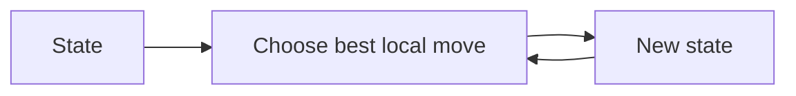
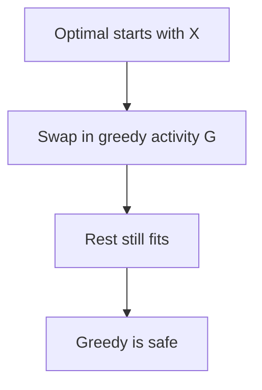
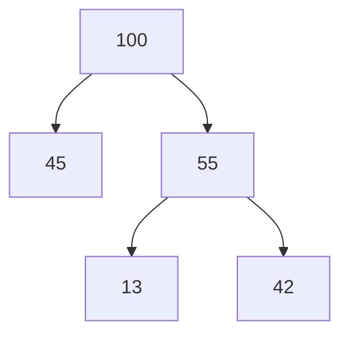

Greedy algorithms make the locally optimal choice at each step, hoping it leads to a global optimum.

Greedy works when local choices are provably safe. Advanced theory connects this to matroids; most proofs use an **exchange argument**.

<Callout type="warn" title="Greedy needs proof">
A local rule that feels right can still fail.
</Callout>

Counterexample: with coins `{1,3,4}` and amount `6`, greedy takes `4+1+1` (3 coins), but optimal is `3+3` (2 coins).

<CodeBlock adapter="cpp" starterCode={`#include <iostream>
#include <vector>
int greedyCoins(std::vector<int> coins, int amount) {
    int count = 0;
    for (int c : coins) while (amount >= c) { amount -= c; count++; }
    return count;
}
int main() {
    std::cout << greedyCoins({4, 3, 1}, 6) << "\n";
    std::cout << "optimal is 2\n";
    return 0;
}
`} />

## Activity selection

Sort by end time and scan.

```mermaid
gantt
    title Activity timeline
    dateFormat X
    axisFormat %s
    A :1, 4
    B :3, 5
    C :crit, 5, 7
    E :crit, 8, 9
```

<CodeBlock adapter="cpp" starterCode={`#include <algorithm>
#include <iostream>
#include <utility>
#include <vector>
int maxActivities(std::vector<std::pair<int,int>> a) {
    std::sort(a.begin(), a.end(),  { return x.second < y.second; });
    int ans = 0, last = -1;
    for (auto [s, e] : a) if (s >= last) { ans++; last = e; }
    return ans;
}
int main() {
    std::cout << maxActivities({{1,4},{3,5},{0,6},{5,7},{8,9},{5,9}}) << "\n";
    return 0;
}
`} />

Exchange proof intuition: if an optimal schedule starts with a later-ending activity, swap in the earliest-ending compatible activity. It leaves at least as much room for the rest.

## Fractional knapsack

Sort by value/weight ratio and take the densest remaining item, possibly fractionally.

<CodeBlock adapter="cpp" starterCode={`#include <algorithm>
#include <iomanip>
#include <iostream>
#include <vector>
struct Item { double weight, value; };
double fractionalKnapsack(double cap, std::vector<Item> items) {
    std::sort(items.begin(), items.end(),  { return a.value / a.weight > b.value / b.weight; });
    double total = 0;
    for (auto it : items) {
        double take = std::min(cap, it.weight);
        total += take * it.value / it.weight;
        cap -= take;
        if (cap == 0) break;
    }
    return total;
}
int main() {
    std::cout << std::fixed << std::setprecision(2) << fractionalKnapsack(50, {{10,60},{20,100},{30,120}}) << "\n";
    return 0;
}
`} />

## Jump game

Track the farthest reachable index.

<CodeBlock adapter="cpp" starterCode={`#include <algorithm>
#include <iostream>
#include <vector>
bool canJump(const std::vector<int>& nums) {
    int far = 0;
    for (int i = 0; i < (int)nums.size(); i++) {
        if (i > far) return false;
        far = std::max(far, i + nums[i]);
    }
    return true;
}
int main() {
    std::cout << std::boolalpha << canJump({2,3,1,1,4}) << "\n" << canJump({3,2,1,0,4}) << "\n";
    return 0;
}
`} />

## Huffman coding

Repeatedly merge the two least frequent nodes using a priority queue. Left/right edges form prefix codes.

<CodeBlock adapter="cpp" starterCode={`#include <functional>
#include <iostream>
#include <queue>
#include <vector>
int huffmanCost(std::vector<int> f) {
    std::priority_queue<int, std::vector<int>, std::greater<int>> pq(f.begin(), f.end());
    int cost = 0;
    while (pq.size() > 1) {
        int a = pq.top(); pq.pop();
        int b = pq.top(); pq.pop();
        cost += a + b;
        pq.push(a + b);
    }
    return cost;
}
int main() {
    std::cout << huffmanCost({5,9,12,13,16,45}) << "\n";
    return 0;
}
`} />

## Minimum platforms

Sort arrivals and departures; sweep with two pointers.

<CodeBlock adapter="cpp" starterCode={`#include <algorithm>
#include <iostream>
#include <vector>
int minPlatforms(std::vector<int> a, std::vector<int> d) {
    std::sort(a.begin(), a.end());
    std::sort(d.begin(), d.end());
    int i = 0, j = 0, cur = 0, best = 0;
    while (i < (int)a.size()) {
        if (a[i] <= d[j]) { cur++; best = std::max(best, cur); i++; }
        else { cur--; j++; }
    }
    return best;
}
int main() {
    std::cout << minPlatforms({900,940,950,1100,1500,1800}, {910,1200,1120,1130,1900,2000}) << "\n";
    return 0;
}
`} />

<CodeBlock adapter="cpp" starterCode={`#include <iostream>
#include <vector>
int canonicalCoins(int amount) {
    int ans = 0;
    for (int c : std::vector<int>{25, 10, 5, 1}) { ans += amount / c; amount %= c; }
    return ans;
}
int main() {
    for (int x : {30, 41, 99}) std::cout << canonicalCoins(x) << "\n";
    return 0;
}
`} />

<ChallengeCard adapter="cpp" title="Activity selection" instructions={`Implement \`int maxActivities(std::vector<std::pair<int,int>> intervals)\` where pair is (start,end).`} starterCode={`#include <algorithm>
#include <iostream>
#include <utility>
#include <vector>
int maxActivities(std::vector<std::pair<int,int>> intervals) { return 0; }
int main() { std::cout << maxActivities({{1,4},{3,5},{0,6},{5,7},{8,9},{5,9}}) << "\n"; return 0; }
`} solutionCode={`#include <algorithm>
#include <iostream>
#include <utility>
#include <vector>
int maxActivities(std::vector<std::pair<int,int>> intervals) {
    std::sort(intervals.begin(), intervals.end(),  { return a.second < b.second; });
    int count = 0, last = -1;
    for (auto [s,e] : intervals) if (s >= last) { count++; last = e; }
    return count;
}
int main() { std::cout << maxActivities({{1,4},{3,5},{0,6},{5,7},{8,9},{5,9}}) << "\n"; return 0; }
`} tests={[{ id: "activities", name: "Counts activities", expect: { stdoutEquals: "3" } }]} />

<ChallengeCard adapter="cpp" title="Jump game — can reach end" instructions={`Implement \`bool canJump(const std::vector<int>& nums)\`.`} starterCode={`#include <iostream>
#include <vector>
bool canJump(const std::vector<int>& nums) { return false; }
int main() { std::cout << std::boolalpha << canJump({2,3,1,1,4}) << "\n" << canJump({3,2,1,0,4}) << "\n" << canJump({0}) << "\n"; return 0; }
`} solutionCode={`#include <algorithm>
#include <iostream>
#include <vector>
bool canJump(const std::vector<int>& nums) { int far = 0; for (int i = 0; i < (int)nums.size(); i++) { if (i > far) return false; far = std::max(far, i + nums[i]); } return true; }
int main() { std::cout << std::boolalpha << canJump({2,3,1,1,4}) << "\n" << canJump({3,2,1,0,4}) << "\n" << canJump({0}) << "\n"; return 0; }
`} tests={[{ id: "jump", name: "Reachability", expect: { stdoutLines: ["true", "false", "true"], stdoutLinesExact: true } }]} />

<ChallengeCard adapter="cpp" title="Minimum coins (when denominations are canonical)" instructions={`Use greedy with coins {1,5,10,25}. Greedy only works for canonical coin systems.`} starterCode={`#include <iostream>
#include <vector>
int minCoinsCanonical(int amount) { return 0; }
int main() { for (int x : {30,41,99}) std::cout << minCoinsCanonical(x) << "\n"; return 0; }
`} solutionCode={`#include <iostream>
#include <vector>
int minCoinsCanonical(int amount) { int ans = 0; for (int c : std::vector<int>{25,10,5,1}) { ans += amount / c; amount %= c; } return ans; }
int main() { for (int x : {30,41,99}) std::cout << minCoinsCanonical(x) << "\n"; return 0; }
`} tests={[{ id: "coins", name: "Canonical coin counts", expect: { stdoutLines: ["2", "4", "9"], stdoutLinesExact: true } }]} />

<MultipleChoice markdown={`What is greedy's core idea?

- Try all answers.
  > Exhaustive search.
- [o] Make the locally best choice repeatedly.
- Cache subproblems.
  > Dynamic programming.
- Always use recursion.
  > Not required.`} />

<MultipleChoice markdown={`Why does {1,3,4} fail for amount 6?

- [o] Greedy takes 4+1+1, but 3+3 is better.
- There is no 1 coin.
  > There is.
- 6 is impossible.
  > It is possible.
- Greedy never works.
  > It works in some systems.`} />

<MultipleChoice markdown={`What does an exchange argument show?

- [o] An optimal solution can be transformed to include the greedy choice.
- The code has no bugs.
  > No.
- The input is sorted.
  > Sorting may be a step.
- The algorithm is recursive.
  > Not necessarily.`} />
