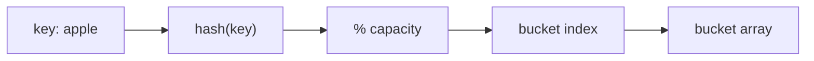
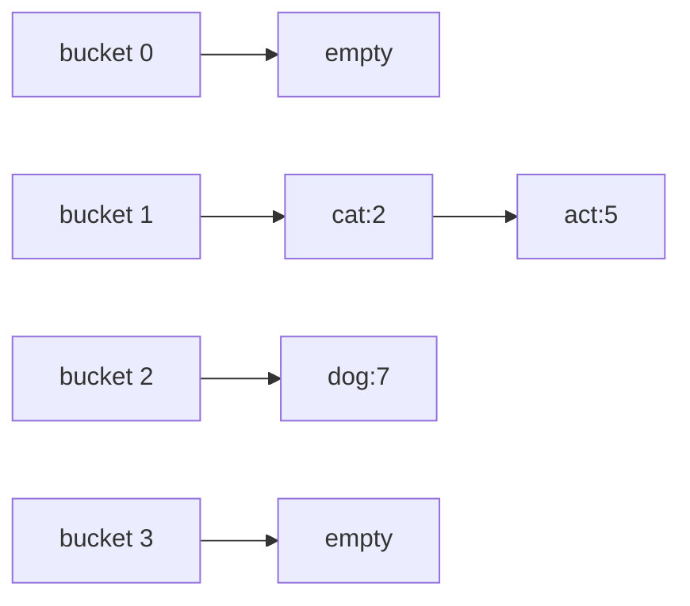
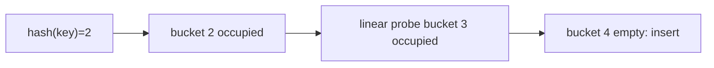
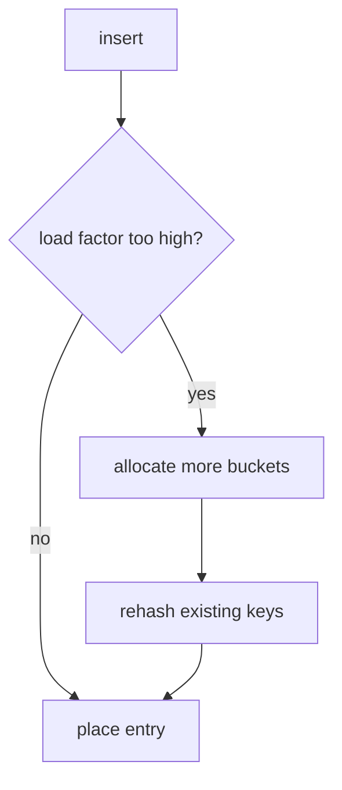

A hash table stores key-value data in an array of buckets. A hash function converts a key into an integer, then the table chooses an index with `hash(key) % capacity`. With a good hash function and a healthy load factor, insert, lookup, and erase are O(1) on average.

## The core idea

<CodeBlock
  adapter="cpp"
  initialCode={`#include <functional>
#include <iostream>
#include <string>

int main() {
    std::string key = "apple";
    std::size_t capacity = 8;
    std::size_t h = std::hash<std::string>{}(key);
    std::cout << "bucket = " << (h % capacity) << "\n";
    return 0;
}
`}
/>

A good hash function is **deterministic**, **fast**, and distributes real inputs **uniformly** across buckets. Poor distribution creates long collision chains or probe runs.

<Callout type="info" title="Average case is conditional">
Hash tables are fast because most buckets stay short. If too many keys collide, operations can degrade from O(1) average to O(n) worst case.
</Callout>

## Collisions: chaining

A collision happens when different keys choose the same bucket. Chaining stores multiple entries at that bucket, commonly as nodes or a small list.

<CodeBlock
  adapter="cpp"
  initialCode={`#include <iostream>
#include <list>
#include <string>
#include <utility>
#include <vector>

int main() {
    std::vector<std::list<std::pair<std::string, int>>> buckets(4);
    buckets[1].push_back({"cat", 2});
    buckets[1].push_back({"act", 5});
    buckets[2].push_back({"dog", 7});

    for (std::size_t i = 0; i < buckets.size(); i++) {
        std::cout << "bucket " << i << ":";
        for (const auto& [key, value] : buckets[i]) std::cout << " " << key << "=" << value;
        std::cout << "\n";
    }
    return 0;
}
`}
/>

## Collisions: open addressing

Open addressing keeps entries in the array itself. If the home bucket is occupied, probing tries another bucket. Linear probing moves one slot at a time; double hashing uses a second hash to choose the step size.

<CodeBlock
  adapter="cpp"
  initialCode={`#include <iostream>
#include <optional>
#include <string>
#include <vector>

int main() {
    std::vector<std::optional<std::string>> table(7);
    auto insert = [&](const std::string& key, std::size_t h) {
        for (std::size_t step = 0; step < table.size(); step++) {
            std::size_t i = (h + step) % table.size();
            if (!table[i]) {
                table[i] = key;
                return;
            }
        }
    };
    insert("ant", 2);
    insert("bat", 2);
    insert("cat", 2);
    for (std::size_t i = 0; i < table.size(); i++) std::cout << i << ":" << (table[i] ? *table[i] : "empty") << "\n";
    return 0;
}
`}
/>

## Load factor and rehashing

Load factor is `size / bucket_count`. When it grows too large, the table allocates more buckets and recomputes every key's bucket using the new capacity.

<CodeBlock
  adapter="cpp"
  initialCode={`#include <iostream>
#include <string>
#include <unordered_map>

int main() {
    std::unordered_map<std::string, int> score;
    score.max_load_factor(0.7f);
    score.reserve(10);
    score["alice"] = 90;
    score["bob"] = 85;
    score["cara"] = 92;
    std::cout << "size = " << score.size() << "\n";
    std::cout << "buckets = " << score.bucket_count() << "\n";
    std::cout << "load = " << score.load_factor() << "\n";
    return 0;
}
`}
/>

## `std::unordered_map` and `std::unordered_set`

`std::unordered_map<K,V>` stores key-value pairs; `std::unordered_set<K>` stores unique keys. Common operations include `operator[]`, `find`, `count`, `insert`, `erase`, and range-for iteration.

<CodeBlock
  adapter="cpp"
  initialCode={`#include <iostream>
#include <string>
#include <unordered_map>
#include <unordered_set>

int main() {
    std::unordered_map<std::string, int> ages;
    ages["Ada"] = 36;
    ages.insert({"Grace", 85});
    ages["Ada"]++;
    if (ages.find("Grace") != ages.end()) std::cout << "Grace found\n";
    std::cout << "Ada count? " << ages.count("Ada") << "\n";
    for (const auto& [name, age] : ages) std::cout << name << " " << age << "\n";
    ages.erase("Grace");

    std::unordered_set<int> seen;
    seen.insert(10);
    std::cout << seen.count(10) << "\n";
    return 0;
}
`}
/>

## `std::map` vs `std::unordered_map`

`std::map` is ordered by key and typically implemented as a red-black tree. `std::unordered_map` is a hash table and has unspecified iteration order.

<CodeBlock
  adapter="cpp"
  initialCode={`#include <iostream>
#include <map>
#include <string>
#include <unordered_map>

int main() {
    std::map<std::string, int> ordered = {{"pear", 2}, {"apple", 5}, {"kiwi", 3}};
    std::unordered_map<std::string, int> hashed = {{"pear", 2}, {"apple", 5}, {"kiwi", 3}};
    std::cout << "map order:\n";
    for (const auto& [k, v] : ordered) std::cout << k << "=" << v << "\n";
    std::cout << "unordered_map order:\n";
    for (const auto& [k, v] : hashed) std::cout << k << "=" << v << "\n";
    return 0;
}
`}
/>

| Container | Internal idea | Search/insert/erase | Iteration order | Prefer when |
| --- | --- | --- | --- | --- |
| `std::unordered_map` | Hash table | O(1) average, O(n) worst | Unspecified | Fast lookup dominates |
| `std::map` | Red-black tree | O(log n) | Sorted by key | Need ordering or range queries |

## Custom hash for a type

<CodeBlock
  adapter="cpp"
  initialCode={`#include <cstddef>
#include <iostream>
#include <unordered_set>

struct Point {
    int x;
    int y;
    bool operator==(const Point& other) const { return x == other.x && y == other.y; }
};

struct PointHash {
    std::size_t operator()(const Point& p) const {
        return static_cast<std::size_t>(p.x) * 1'000'003u ^ static_cast<std::size_t>(p.y);
    }
};

int main() {
    std::unordered_set<Point, PointHash> points;
    points.insert({2, 3});
    std::cout << points.count({2, 3}) << "\n";
    return 0;
}
`}
/>

## Common problem patterns

Frequency counting maps each value to a count.

<CodeBlock
  adapter="cpp"
  initialCode={`#include <iostream>
#include <sstream>
#include <string>
#include <unordered_map>

int main() {
    std::string sentence = "to be or not to be";
    std::istringstream in(sentence);
    std::unordered_map<std::string, int> freq;
    std::string word;
    while (in >> word) freq[word]++;
    for (const auto& [w, count] : freq) std::cout << w << ":" << count << "\n";
    return 0;
}
`}
/>

Two Sum stores values already seen, then asks whether the complement exists.

<CodeBlock
  adapter="cpp"
  initialCode={`#include <iostream>
#include <unordered_map>
#include <vector>

int main() {
    std::vector<int> nums = {2, 7, 11, 15};
    int target = 9;
    std::unordered_map<int, int> indexOf;
    for (int i = 0; i < static_cast<int>(nums.size()); i++) {
        int need = target - nums[i];
        if (indexOf.count(need)) {
            std::cout << indexOf[need] << " " << i << "\n";
            break;
        }
        indexOf[nums[i]] = i;
    }
    return 0;
}
`}
/>

Group anagrams by sorting each word to form a canonical key.

<CodeBlock
  adapter="cpp"
  initialCode={`#include <algorithm>
#include <iostream>
#include <string>
#include <unordered_map>
#include <vector>

int main() {
    std::vector<std::string> words = {"eat", "tea", "tan", "ate", "nat", "bat"};
    std::unordered_map<std::string, std::vector<std::string>> groups;
    for (const std::string& word : words) {
        std::string key = word;
        std::sort(key.begin(), key.end());
        groups[key].push_back(word);
    }
    for (const auto& [key, group] : groups) {
        std::cout << key << ":";
        for (const std::string& word : group) std::cout << " " << word;
        std::cout << "\n";
    }
    return 0;
}
`}
/>

## Practice: Two Sum

<ChallengeCard
  adapter="cpp"
  title="Two Sum"
  instructions={`Implement \`std::pair<int,int> twoSum(const std::vector<int>& nums, int target)\` using an unordered map. Return the two indices whose values sum to target.`}
  initialCode={`#include <iostream>
#include <unordered_map>
#include <utility>
#include <vector>

std::pair<int, int> twoSum(const std::vector<int>& nums, int target) {
    // your code here
    return {-1, -1};
}

int main() {
    std::vector<int> nums = {2, 7, 11, 15};
    auto ans = twoSum(nums, 9);
    std::cout << ans.first << " " << ans.second << "\n";
    return 0;
}
`}
  solutionCode={`#include <iostream>
#include <unordered_map>
#include <utility>
#include <vector>

std::pair<int, int> twoSum(const std::vector<int>& nums, int target) {
    std::unordered_map<int, int> index;
    for (int i = 0; i < static_cast<int>(nums.size()); i++) {
        int need = target - nums[i];
        if (index.count(need)) return {index[need], i};
        index[nums[i]] = i;
    }
    return {-1, -1};
}

int main() {
    std::vector<int> nums = {2, 7, 11, 15};
    auto ans = twoSum(nums, 9);
    std::cout << ans.first << " " << ans.second << "\n";
    return 0;
}
`}
  tests={[{ id: "two-sum", name: "Finds indices", expect: { stdoutEquals: "0 1" } }]}
/>

## Practice: Most frequent word

<ChallengeCard
  adapter="cpp"
  title="Most frequent word"
  instructions={`Return the word with the highest frequency. If several words tie, return the lexicographically smallest one.`}
  initialCode={`#include <iostream>
#include <string>
#include <unordered_map>
#include <vector>

std::string mostFrequentWord(const std::vector<std::string>& words) {
    // your code here
    return "";
}

int main() {
    std::vector<std::string> words = {"pear", "apple", "pear", "banana", "apple"};
    std::cout << mostFrequentWord(words) << "\n";
    return 0;
}
`}
  solutionCode={`#include <iostream>
#include <string>
#include <unordered_map>
#include <vector>

std::string mostFrequentWord(const std::vector<std::string>& words) {
    std::unordered_map<std::string, int> freq;
    for (const std::string& word : words) freq[word]++;
    std::string best;
    int bestCount = -1;
    for (const auto& [word, count] : freq) {
        if (count > bestCount || (count == bestCount && word < best)) {
            best = word;
            bestCount = count;
        }
    }
    return best;
}

int main() {
    std::vector<std::string> words = {"pear", "apple", "pear", "banana", "apple"};
    std::cout << mostFrequentWord(words) << "\n";
    return 0;
}
`}
  tests={[{ id: "tie", name: "Breaks ties lexicographically", expect: { stdoutEquals: "apple" } }]}
/>

## Practice: Contains duplicate within k

<ChallengeCard
  adapter="cpp"
  title="Contains duplicate within k"
  instructions={`Implement \`containsNearbyDuplicate\`. Return true when two equal values occur at indices whose distance is at most \`k\`.`}
  initialCode={`#include <iostream>
#include <unordered_map>
#include <vector>

bool containsNearbyDuplicate(const std::vector<int>& v, int k) {
    // your code here
    return false;
}

int main() {
    std::cout << std::boolalpha;
    std::cout << containsNearbyDuplicate({1, 2, 3, 1}, 3) << "\n";
    std::cout << containsNearbyDuplicate({1, 0, 1, 1}, 1) << "\n";
    std::cout << containsNearbyDuplicate({1, 2, 3, 1, 2, 3}, 2) << "\n";
    return 0;
}
`}
  solutionCode={`#include <iostream>
#include <unordered_map>
#include <vector>

bool containsNearbyDuplicate(const std::vector<int>& v, int k) {
    std::unordered_map<int, int> last;
    for (int i = 0; i < static_cast<int>(v.size()); i++) {
        if (last.count(v[i]) && i - last[v[i]] <= k) return true;
        last[v[i]] = i;
    }
    return false;
}

int main() {
    std::cout << std::boolalpha;
    std::cout << containsNearbyDuplicate({1, 2, 3, 1}, 3) << "\n";
    std::cout << containsNearbyDuplicate({1, 0, 1, 1}, 1) << "\n";
    std::cout << containsNearbyDuplicate({1, 2, 3, 1, 2, 3}, 2) << "\n";
    return 0;
}
`}
  tests={[{ id: "nearby", name: "Checks several cases", expect: { stdoutLines: ["true", "true", "false"], stdoutLinesExact: true } }]}
/>

## Check your understanding

<MultipleChoice markdown={`What is the average-case time complexity for lookup in a well-sized hash table?

- O(n)
  > This is possible in the worst case, but not the expected average for a healthy table.
- [o] O(1)
  > A good hash function and controlled load factor make lookup constant on average.
- O(log n)
  > This is typical of balanced binary search trees.
- O(n log n)
  > Sorting complexity is not the lookup cost here.`} />

<MultipleChoice markdown={`What does std::unordered_map use internally in the standard library model?

- A sorted dynamic array
  > That would preserve order, which unordered_map does not guarantee.
- A stack
  > A stack only exposes the top element.
- [o] A hash table with buckets
  > Keys are hashed to choose buckets.
- A linked list only
  > Some implementations use nodes, but the core idea is bucketed hashing.`} />

<MultipleChoice markdown={`Why might std::map be preferred over std::unordered_map?

- [o] It iterates keys in sorted order and supports ordered operations.
  > The tree structure keeps keys ordered.
- It always has O(1) lookup.
  > std::map lookup is O(log n), not O(1).
- It uses no comparisons.
  > std::map relies on key comparison.
- It cannot be modified after construction.
  > std::map is mutable like other standard containers.`} />

<MultipleChoice markdown={`What happens when two different keys hash to the same bucket?

- The program must crash.
  > Collisions are normal and expected.
- One key is silently deleted.
  > Correct implementations preserve both keys.
- [o] The table resolves the collision with chaining or probing.
  > Collision resolution is part of hash-table design.
- The keys become equal.
  > Equal hash values do not imply equal keys.`} />
