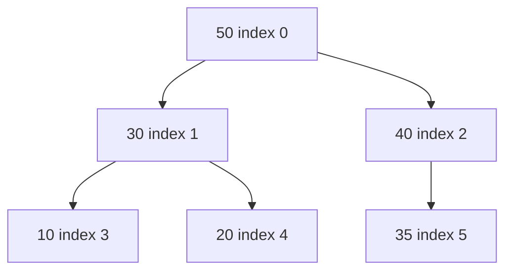
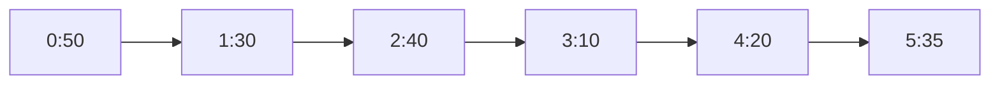
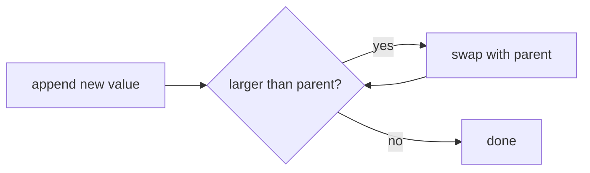
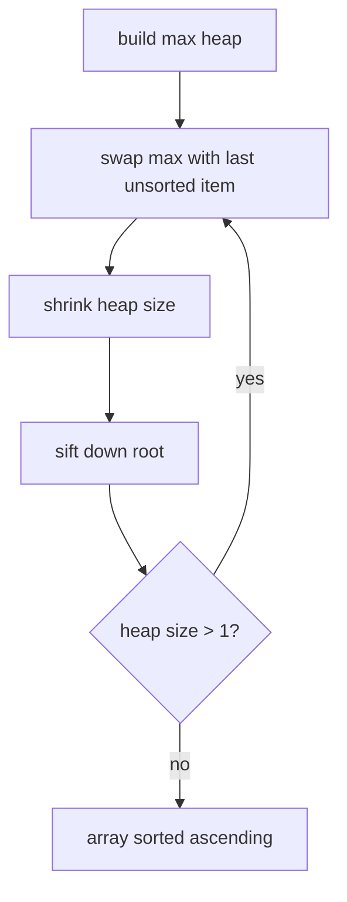

A binary heap is a complete binary tree stored in an array. A max-heap keeps every parent greater than or equal to its children. A min-heap keeps every parent less than or equal to its children.

## Conceptual tree and array storage





For index `i`, children are `2*i + 1` and `2*i + 2`. The parent is `(i - 1) / 2`.

<CodeBlock
  adapter="cpp"
  starterCode={`#include <iostream>
#include <vector>

int main() {
  std::vector<int> heap = {50, 30, 40, 10, 20, 35};
  for (int i = 0; i < static_cast<int>(heap.size()); i++) {
    std::cout << heap[i] << " at index " << i;
    if (i > 0)
      std::cout << " parent " << heap[(i - 1) / 2];
    std::cout << "
                 ";
  }
  return 0;
}
`}
/>

## Push: sift up

Insert at the end to preserve completeness, then swap upward until the heap property is restored.



<CodeBlock
  adapter="cpp"
  starterCode={`#include <iostream>
#include <utility>
#include <vector>

void pushMax(std::vector<int> &heap, int x) {
  heap.push_back(x);
  int i = static_cast<int>(heap.size()) - 1;
  while (i > 0) {
    int p = (i - 1) / 2;
    if (heap[p] >= heap[i])
      break;
    std::swap(heap[p], heap[i]);
    i = p;
  }
}

int main() {
  std::vector<int> heap = {50, 30, 40, 10, 20, 35};
  pushMax(heap, 60);
  for (int x : heap)
    std::cout << x
              << "
                 ";
        return 0;
}
`}
/>

## Pop: sift down

Remove the root by moving the last value to index 0, then swapping down with the larger child.

<CodeBlock
  adapter="cpp"
  starterCode={`#include <iostream>
#include <utility>
#include <vector>

int popMax(std::vector<int> &heap) {
  int ans = heap[0];
  heap[0] = heap.back();
  heap.pop_back();
  int i = 0;
  while (true) {
    int left = 2 * i + 1;
    int right = 2 * i + 2;
    int best = i;
    if (left < static_cast<int>(heap.size()) && heap[left] > heap[best])
      best = left;
    if (right < static_cast<int>(heap.size()) && heap[right] > heap[best])
      best = right;
    if (best == i)
      break;
    std::swap(heap[i], heap[best]);
    i = best;
  }
  return ans;
}

int main() {
  std::vector<int> heap = {50, 30, 40, 10, 20, 35};
  std::cout << popMax(heap)
            << "
               ";
      std::cout
            << heap[0]
            << "
               ";
      return 0;
}
`}
/>

`push` and `pop` take O(log n), because they move along the height of the tree. `top` is O(1), because the best value is at index 0.

## Bottom-up heapify

Building a heap by repeatedly pushing is O(n log n). Bottom-up heapify runs sift-down from the last internal node to the root and takes O(n).

```text
for i from parent(last_index) down to 0:
    siftDown(i)
```

<CodeBlock
  adapter="cpp"
  starterCode={`#include <iostream>
#include <utility>
#include <vector>

void siftDown(std::vector<int> &a, int i, int n) {
  while (true) {
    int left = 2 * i + 1;
    int right = 2 * i + 2;
    int best = i;
    if (left < n && a[left] > a[best])
      best = left;
    if (right < n && a[right] > a[best])
      best = right;
    if (best == i)
      break;
    std::swap(a[i], a[best]);
    i = best;
  }
}

void heapify(std::vector<int> &a) {
  for (int i = static_cast<int>(a.size()) / 2 - 1; i >= 0; i--)
    siftDown(a, i, static_cast<int>(a.size()));
}

int main() {
  std::vector<int> a = {3, 1, 6, 5, 2, 4};
  heapify(a);
  for (int x : a)
    std::cout << x
              << "
                 ";
        return 0;
}
`}
/>

## Heap sort

Heap sort builds a max-heap, then repeatedly swaps the root with the end and shrinks the heap.



<CodeBlock
  adapter="cpp"
  starterCode={`#include <iostream>
#include <utility>
#include <vector>

void siftDown(std::vector<int> &a, int i, int n) {
  while (true) {
    int left = 2 * i + 1, right = 2 * i + 2, best = i;
    if (left < n && a[left] > a[best])
      best = left;
    if (right < n && a[right] > a[best])
      best = right;
    if (best == i)
      break;
    std::swap(a[i], a[best]);
    i = best;
  }
}

void heapSort(std::vector<int> &a) {
  int n = static_cast<int>(a.size());
  for (int i = n / 2 - 1; i >= 0; i--)
    siftDown(a, i, n);
  for (int end = n - 1; end > 0; end--) {
    std::swap(a[0], a[end]);
    siftDown(a, 0, end);
  }
}

int main() {
  std::vector<int> a = {4, 10, 3, 5, 1};
  heapSort(a);
  for (int x : a)
    std::cout << x
              << "
                 ";
        return 0;
}
`}
/>

## `std::priority_queue`

The standard priority queue is a max-heap by default. Use `std::greater<int>` to make a min-heap.

<CodeBlock
  adapter="cpp"
  starterCode={`#include <functional>
#include <iostream>
#include <queue>
#include <vector>

int main() {
  std::priority_queue<int> maxHeap;
  for (int x : {4, 1, 7})
    maxHeap.push(x);
  std::cout << maxHeap.top()
            << "
               ";

      std::priority_queue<int, std::vector<int>, std::greater<int>>
          minHeap;
  for (int x : {4, 1, 7})
    minHeap.push(x);
  std::cout << minHeap.top()
            << "
               ";
      return 0;
}
`}
/>

## Applications

Heaps appear whenever you need the next best item quickly.

* Top-k elements: keep a min-heap of size k.
* Streaming median: use a max-heap for the lower half and a min-heap for the upper half.
* Dijkstra preview: repeatedly extract the unvisited node with smallest tentative distance.

<CodeBlock
  adapter="cpp"
  starterCode={`#include <functional>
#include <iostream>
#include <queue>
#include <vector>

int main() {
  std::vector<int> nums = {5, 1, 9, 3, 7, 2};
  int k = 3;
  std::priority_queue<int, std::vector<int>, std::greater<int>> pq;
  for (int x : nums) {
    pq.push(x);
    if (static_cast<int>(pq.size()) > k)
      pq.pop();
  }
  std::cout << "third largest = " << pq.top()
            << "
               ";
      return 0;
}
`}
/>

<Callout type="warn" title="Heap is not a sorted array">
A heap only guarantees that the top element has highest priority. Siblings and cousins are not globally sorted.
</Callout>

## Practice: Kth largest element

<ChallengeCard
  adapter="cpp"
  title="Kth largest element"
  instructions={`Implement \`int kthLargest(std::vector<int> nums, int k)\` using a min-heap of size \`k\`.`}
  starterCode={`#include <functional>
#include <iostream>
#include <queue>
#include <vector>

int kthLargest(std::vector<int> nums, int k) {
  // your code here
  return -1;
}

int main() {
  std::cout << kthLargest({3, 2, 1, 5, 6, 4}, 2)
            << "
               ";
      return 0;
}
`}
  solutionCode={`#include <functional>
#include <iostream>
#include <queue>
#include <vector>

int kthLargest(std::vector<int> nums, int k) {
  std::priority_queue<int, std::vector<int>, std::greater<int>> pq;
  for (int x : nums) {
    pq.push(x);
    if (static_cast<int>(pq.size()) > k)
      pq.pop();
  }
  return pq.top();
}

int main() {
  std::cout << kthLargest({3, 2, 1, 5, 6, 4}, 2)
            << "
               ";
      return 0;
}
`}
  tests={[{ id: "kth", name: "Finds second largest", expect: { stdoutEquals: "5" } }]}
/>

## Practice: Merge K sorted lists

<ChallengeCard
  adapter="cpp"
  title="Merge K sorted lists"
  instructions={`Merge K sorted vectors into one sorted vector. The driver prints one merged value per line.`}
  starterCode={`#include <iostream>
#include <queue>
#include <tuple>
#include <vector>

std::vector<int> mergeK(const std::vector<std::vector<int>> &lists) {
  // your code here
  return {};
}

int main() {
  std::vector<std::vector<int>> lists = {{1, 4, 5}, {1, 3, 4}, {2, 6}};
  for (int x : mergeK(lists))
    std::cout << x
              << "
                 ";
        return 0;
}
`}
  solutionCode={`#include <functional>
#include <iostream>
#include <queue>
#include <tuple>
#include <vector>

std::vector<int> mergeK(const std::vector<std::vector<int>> &lists) {
  using Item = std::tuple<int, int, int>;
  std::priority_queue<Item, std::vector<Item>, std::greater<Item>> pq;
  for (int i = 0; i < static_cast<int>(lists.size()); i++) {
    if (!lists[i].empty())
      pq.push({lists[i][0], i, 0});
  }
  std::vector<int> ans;
  while (!pq.empty()) {
    auto [value, listIndex, elemIndex] = pq.top();
    pq.pop();
    ans.push_back(value);
    int next = elemIndex + 1;
    if (next < static_cast<int>(lists[listIndex].size()))
      pq.push({lists[listIndex][next], listIndex, next});
  }
  return ans;
}

int main() {
  std::vector<std::vector<int>> lists = {{1, 4, 5}, {1, 3, 4}, {2, 6}};
  for (int x : mergeK(lists))
    std::cout << x
              << "
                 ";
        return 0;
}
`}
  tests={[{ id: "merge", name: "Merges sorted lists", expect: { stdoutLines: ["1", "1", "2", "3", "4", "4", "5", "6"], stdoutLinesExact: true } }]}
/>

## Practice: Last stone weight

<ChallengeCard
  adapter="cpp"
  title="Last stone weight"
  instructions={`Repeatedly take the two largest stones. If they differ, push their difference back. Return the final stone weight or 0.`}
  starterCode={`#include <iostream>
#include <queue>
#include <vector>

int lastStoneWeight(std::vector<int> stones) {
  // your code here
  return 0;
}

int main() {
  std::cout << lastStoneWeight({2, 7, 4, 1, 8, 1})
            << "
               ";
      return 0;
}
`}
  solutionCode={`#include <iostream>
#include <queue>
#include <vector>

int lastStoneWeight(std::vector<int> stones) {
  std::priority_queue<int> pq(stones.begin(), stones.end());
  while (pq.size() > 1) {
    int a = pq.top();
    pq.pop();
    int b = pq.top();
    pq.pop();
    if (a != b)
      pq.push(a - b);
  }
  return pq.empty() ? 0 : pq.top();
}

int main() {
  std::cout << lastStoneWeight({2, 7, 4, 1, 8, 1})
            << "
               ";
      return 0;
}
`}
  tests={[{ id: "stones", name: "LeetCode sample", expect: { stdoutEquals: "1" } }]}
/>

## Check your understanding

<MultipleChoice markdown={`What is the time complexity of pushing into a binary heap?

- O(1) always
  > The new value may need to move up the tree.
- [o] O(log n)
  > Sift-up follows the tree height.
- O(n)
  > A single push does not scan every element in a heap.
- O(n log n)
  > That is closer to sorting many elements.`} />

<MultipleChoice markdown={`When might a heap be preferred over a BST?

- [o] When you only need repeated access to the minimum or maximum item.
  > Heaps optimize top, push, and pop for priority behavior.
- When you need sorted iteration over all keys at all times.
  > A BST is better for ordered traversal.
- When you need fast search for any arbitrary value.
  > Heaps do not support efficient arbitrary search.
- When duplicate values are impossible.
  > Both structures can be designed to handle duplicates.`} />

<MultipleChoice markdown={`What is the default behavior of std::priority_queue<int>?

- It is a min-heap.
  > The smallest value is not on top by default.
- [o] It is a max-heap.
  > The largest value appears at top.
- It keeps all values sorted in ascending iteration.
  > Priority queues do not expose sorted iteration.
- It removes elements in insertion order.
  > That describes a queue, not a priority queue.`} />
