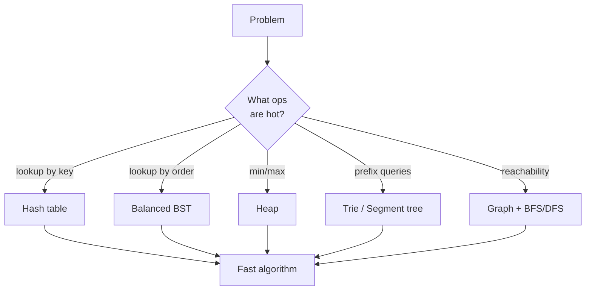

Welcome to **Mastering Data Structures & Algorithms in C++**, a course
that takes you from the basics of `std::vector` all the way to graph
algorithms, dynamic programming, and the algorithmic patterns that
power systems software, game engines, competitive programming, and
technical interviews.

C++ is one of the best languages on the planet for *learning* data
structures and algorithms. It is close enough to the hardware that you
can reason about memory layout, but its Standard Template Library (STL)
gives you battle-tested containers and algorithms so you never have to
re-implement a hash table just to solve a problem. By the end of this
course you will both *use* the STL fluently and be able to *implement
the same structures from scratch* — the two skills are complementary.

## What you will learn

Each page mixes prose with three kinds of interactive widgets:

1. **Executable code blocks.** Every C++ snippet compiles to
   WebAssembly with `clang++` in your browser and runs as a tiny WASI
   binary. No installation, no toolchain setup. Edit any block and
   click *Run*.
2. **Challenge cards.** Hidden-test coding problems. Some are
   single-file, some span multiple translation units so you can
   practice header/implementation splitting.
3. **Multiple choice questions.** Quick checks at the end of most
   pages. Each option has its own explanation, so a wrong answer
   still teaches you something.

<Callout type="info" title="How to use the interactive widgets">
Every code block runs in a fresh process, so a variable defined in one
block is not visible in the next. This keeps examples self-contained
and easy to reason about. For a persistent multi-file workspace, open
the [C++ Playground](/playground/cpp) in a new tab.
</Callout>

## Why "data structures *and* algorithms"?

You cannot really separate them. A data structure is a way of arranging
data so that the algorithms you care about become fast. Choose a hash
table and `contains?` becomes O(1); choose a sorted array and you can
binary-search in O(log n); choose a heap and you can always pull the
minimum in O(log n). Every chapter of this course pairs a structure
with the operations it makes cheap (and the ones it makes expensive).

## Course outline

The pages are ordered so each chapter builds on earlier material, but
each one stands alone if you want to jump to a specific topic.

### 1. Foundations
Why C++ is a great teaching language for DSA, the slice of modern C++
you need (references, pointers, templates, iterators), and the
mathematics of running-time analysis with Big-O, Big-Ω, and Big-Θ.

### 2. Linear structures
Arrays, the STL containers built on top of them (`std::vector`,
`std::array`, `std::string`), linked lists you implement yourself,
then `std::list` and `std::deque`, and the abstract data types of
stacks and queues.

### 3. Recursion, searching, and sorting
How to write and reason about recursive functions, why binary search
is a 30-line algorithm with a *lot* of off-by-one traps, and the
classic sorting algorithms: bubble, selection, insertion, merge, and
quicksort — culminating in `std::sort` (introsort).

### 4. Hashing and trees
Hash tables and `std::unordered_map`, binary trees and their
traversals, binary search trees, binary heaps and `std::priority_queue`,
and the trie — a tree keyed by characters.

### 5. Graphs
Adjacency-list and adjacency-matrix representations, BFS and DFS,
Dijkstra's shortest paths, and the union-find structure that powers
Kruskal's MST and dynamic connectivity.

### 6. Algorithmic paradigms
Dynamic programming, greedy algorithms, and backtracking — three
families of techniques that, together, solve a remarkable fraction of
real-world combinatorial problems.

### 7. Going further
A roadmap for what to study after this course: advanced graph
algorithms, string algorithms, computational geometry, randomized and
parallel algorithms, and where to practice (competitive programming
judges, system design, low-latency engineering).
