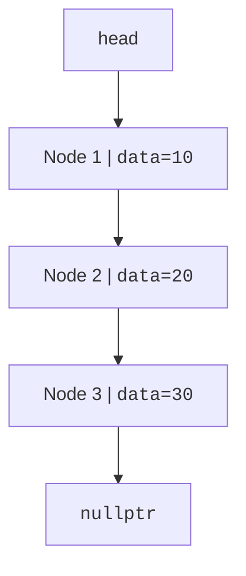

A singly linked list stores values in separate nodes connected by `next` pointers. Unlike a vector, nodes are not contiguous in memory. That means no O(1) random access, but adding to the front is simple and O(1).

<svg
  viewBox="0 0 640 210"
  role="img"
  aria-label="Four numbered nodes scattered across memory are threaded in order by a winding dotted path from a head flag to a red null ring — a linked list's logical order is not its memory order"
  style={{ display: "block", width: "100%", maxWidth: "640px", height: "auto", margin: "2.5rem auto" }}
>
  <g style={{ color: "var(--ds-yellow-500)" }} fill="currentColor">
    <polygon points="102,46 118,46 110,60" />
  </g>
  <g style={{ color: "var(--ds-blue-500)" }} fill="currentColor">
    <circle cx="110" cy="84" r="14" />
    <circle cx="300" cy="56" r="14" />
    <circle cx="210" cy="154" r="14" />
    <circle cx="450" cy="114" r="14" />
  </g>
  <g style={{ fill: "var(--ds-blue-50)" }} fontFamily="ui-monospace, monospace" fontSize="13" fontWeight="700" textAnchor="middle">
    <text x="110" y="89">1</text>
    <text x="300" y="61">2</text>
    <text x="210" y="159">3</text>
    <text x="450" y="119">4</text>
  </g>
  <g fill="currentColor" opacity="0.3">
    <circle cx="148" cy="78" r="2.5" />
    <circle cx="186" cy="72" r="2.5" />
    <circle cx="224" cy="67" r="2.5" />
    <circle cx="262" cy="62" r="2.5" />
    <circle cx="278" cy="81" r="2.5" />
    <circle cx="255" cy="105" r="2.5" />
    <circle cx="233" cy="130" r="2.5" />
    <circle cx="258" cy="146" r="2.5" />
    <circle cx="306" cy="138" r="2.5" />
    <circle cx="354" cy="130" r="2.5" />
    <circle cx="402" cy="122" r="2.5" />
    <circle cx="487" cy="96" r="2.5" />
    <circle cx="523" cy="80" r="2.5" />
  </g>
  <g style={{ color: "var(--ds-red-500)" }} fill="currentColor">
    <path fillRule="evenodd" d="M560 64 m-12 0 a12 12 0 1 0 24 0 a12 12 0 1 0 -24 0 M560 64 m-5.5 0 a5.5 5.5 0 1 1 11 0 a5.5 5.5 0 1 1 -11 0" />
  </g>
</svg>

## Nodes and links

A minimal node stores data and a pointer to the next node.

<CodeBlock
  adapter="cpp"
  files={[
    {
      filename: "main.cpp",
      starterCode: `#include <iostream>

struct Node {
  int data;
  Node *next;
};

int main() {
  Node a{10, nullptr};
  Node b{20, nullptr};
  a.next = &b;

  std::cout << a.data << " -> " << a.next->data << "\\n";
  return 0;
}
`,
    },
  ]}
/>

## Build and traverse a list

Traversal starts at `head` and follows `next` until `nullptr`.

<CodeBlock
  adapter="cpp"
  files={[
    {
      filename: "main.cpp",
      starterCode: `#include <iostream>

struct Node {
  int data;
  Node *next;
};

void printList(Node *head) {
  for (Node *cur = head; cur != nullptr; cur = cur->next) {
    std::cout << cur->data << "\\n";
  }
}

int main() {
  Node n3{30, nullptr};
  Node n2{20, &n3};
  Node n1{10, &n2};
  printList(&n1);
  return 0;
}
`,
    },
  ]}
/>

A vector jumps directly to `v[i]`. A linked list must walk one link at a time to reach the ith node.

## Prepend with `push_front`

Prepending creates a new node, points it at the old head, then updates the head pointer.

<CodeBlock
  adapter="cpp"
  files={[
    {
      filename: "main.cpp",
      starterCode: `#include <iostream>

struct Node {
  int data;
  Node *next;
};

void pushFront(Node *&head, int value) { head = new Node{value, head}; }

void destroy(Node *head) {
  while (head != nullptr) {
    Node *next = head->next;
    delete head;
    head = next;
  }
}

int main() {
  Node *head = nullptr;
  pushFront(head, 30);
  pushFront(head, 20);
  pushFront(head, 10);
  for (Node *cur = head; cur != nullptr; cur = cur->next) {
    std::cout << cur->data << "\\n";
  }
  destroy(head);
  return 0;
}
`,
    },
  ]}
/>

## Append, search, and delete

Appending without a tail pointer requires walking to the end. Deleting a value requires tracking both the current node and the previous link.

<CodeBlock
  adapter="cpp"
  files={[
    {
      filename: "main.cpp",
      starterCode: `#include <iostream>

struct Node {
  int data;
  Node *next;
};

void pushBack(Node *&head, int value) {
  Node *node = new Node{value, nullptr};
  if (head == nullptr) {
    head = node;
    return;
  }
  Node *cur = head;
  while (cur->next != nullptr)
    cur = cur->next;
  cur->next = node;
}

bool contains(Node *head, int value) {
  for (Node *cur = head; cur != nullptr; cur = cur->next) {
    if (cur->data == value)
      return true;
  }
  return false;
}

bool deleteValue(Node *&head, int value) {
  Node **link = &head;
  while (*link != nullptr) {
    if ((*link)->data == value) {
      Node *victim = *link;
      *link = victim->next;
      delete victim;
      return true;
    }
    link = &((*link)->next);
  }
  return false;
}

void destroy(Node *head) {
  while (head != nullptr) {
    Node *next = head->next;
    delete head;
    head = next;
  }
}

int main() {
  Node *head = nullptr;
  for (int x : {10, 20, 30})
    pushBack(head, x);
  std::cout << contains(head, 20) << "\\n";
  deleteValue(head, 20);
  std::cout << contains(head, 20) << "\\n";
  destroy(head);
  return 0;
}
`,
    },
  ]}
/>

<Callout type="info" title="Linked list operation costs">

| Operation | Complexity | Note |
| --- | --- | --- |
| access ith element | O(n) | Must follow links from the head |
| prepend | O(1) | Change one pointer |
| append without tail pointer | O(n) | Must find the last node |
| search by value | O(n) | May inspect every node |

</Callout>

## Memory management with `std::unique_ptr`

Manual `new` and `delete` are useful for learning pointers, but production C++ should prefer ownership types. A node can own its successor with `std::unique_ptr<Node>`.

<CodeBlock
  adapter="cpp"
  files={[
    {
      filename: "main.cpp",
      starterCode: `#include <iostream>
#include <memory>

struct Node {
  int data;
  std::unique_ptr<Node> next;
};

void pushFront(std::unique_ptr<Node> &head, int value) {
  auto node = std::make_unique<Node>();
  node->data = value;
  node->next = std::move(head);
  head = std::move(node);
}

int main() {
  std::unique_ptr<Node> head;
  pushFront(head, 3);
  pushFront(head, 2);
  pushFront(head, 1);

  for (Node *cur = head.get(); cur != nullptr; cur = cur->next.get()) {
    std::cout << cur->data << "\\n";
  }
  return 0;
}
`,
    },
  ]}
/>

<Callout type="warn" title="Pointers are links, not values">
When you reverse or delete nodes, you are rewiring addresses. Draw the links before changing them; losing the only pointer to a node causes a memory leak.
</Callout>

## Practice: reverse a linked list

<ChallengeCard
  adapter="cpp"
  title="Reverse a linked list"
  instructions={`Implement \`Node* reverse(Node* head)\`. The driver builds \`1->2->3->4\` and prints the reversed values.`}
  files={[
    {
      filename: "main.cpp",
      starterCode: `#include <iostream>

struct Node {
  int data;
  Node *next;
};

Node *reverse(Node *head) {
  // your code here
}

void destroy(Node *head) {
  while (head != nullptr) {
    Node *next = head->next;
    delete head;
    head = next;
  }
}

int main() {
  Node *head = new Node{1, new Node{2, new Node{3, new Node{4, nullptr}}}};
  head = reverse(head);
  for (Node *cur = head; cur != nullptr; cur = cur->next) {
    std::cout << cur->data << "\\n";
  }
  destroy(head);
  return 0;
}
`,
      solutionCode: `#include <iostream>

struct Node {
  int data;
  Node *next;
};

Node *reverse(Node *head) {
  Node *previous = nullptr;
  Node *current = head;
  while (current != nullptr) {
    Node *next = current->next;
    current->next = previous;
    previous = current;
    current = next;
  }
  return previous;
}

void destroy(Node *head) {
  while (head != nullptr) {
    Node *next = head->next;
    delete head;
    head = next;
  }
}

int main() {
  Node *head = new Node{1, new Node{2, new Node{3, new Node{4, nullptr}}}};
  head = reverse(head);
  for (Node *cur = head; cur != nullptr; cur = cur->next) {
    std::cout << cur->data << "\\n";
  }
  destroy(head);
  return 0;
}
`,
    },
  ]}
  tests={[{ id: "reverse_list", name: "Reverses links", expect: { stdoutLines: ["4", "3", "2", "1"], stdoutLinesExact: true } }]}
/>

## Practice: length of a linked list

<ChallengeCard
  adapter="cpp"
  title="Length of a linked list"
  instructions={`Implement \`length\` by traversing from head to null and counting nodes.`}
  files={[
    {
      filename: "main.cpp",
      starterCode: `#include <iostream>

struct Node {
  int data;
  Node *next;
};

int length(Node *head) {
  // your code here
}

int main() {
  Node n4{4, nullptr};
  Node n3{3, &n4};
  Node n2{2, &n3};
  Node n1{1, &n2};
  std::cout << length(&n1) << "\\n";
  return 0;
}
`,
      solutionCode: `#include <iostream>

struct Node {
  int data;
  Node *next;
};

int length(Node *head) {
  int count = 0;
  for (Node *cur = head; cur != nullptr; cur = cur->next) {
    ++count;
  }
  return count;
}

int main() {
  Node n4{4, nullptr};
  Node n3{3, &n4};
  Node n2{2, &n3};
  Node n1{1, &n2};
  std::cout << length(&n1) << "\\n";
  return 0;
}
`,
    },
  ]}
  tests={[{ id: "length", name: "Counts nodes", expect: { stdoutEquals: "4" } }]}
/>

## Check your understanding

<MultipleChoice
  markdown={`Which operation is O(1) on a singly linked list when you have the head pointer?

- Accessing the element at index 900
  > You must walk node by node from the head.
- [o] Prepending a new node to the front
  > The new node points to the old head, then head changes.
- Searching for a value
  > Search may inspect every node.
- Sorting the list
  > Sorting is not a constant-time operation.`}
/>

<MultipleChoice
  markdown={`Why does a singly linked list not support efficient random access like a vector?

- [o] Nodes are connected by pointers, so reaching position i requires following i links.
  > There is no direct address calculation for an arbitrary index.
- Each node stores too many integers.
  > A node can store one integer and still lack random access.
- The compiler forbids indexing syntax for structs.
  > Syntax is not the real limitation; memory layout is.
- A linked list is always sorted.
  > Lists can be in any order.`}
/>

<MultipleChoice
  markdown={`What must you avoid when manually deleting nodes allocated with \`new\`?

- Updating the head pointer
  > Updating head is often required after deleting the first node.
- [o] Losing the only pointer to a node before calling \`delete\`
  > That leaks memory because the allocation can no longer be freed.
- Traversing with a temporary pointer
  > Temporary traversal pointers are normal.
- Comparing node values
  > Comparisons are fine and often needed.`}
/>
