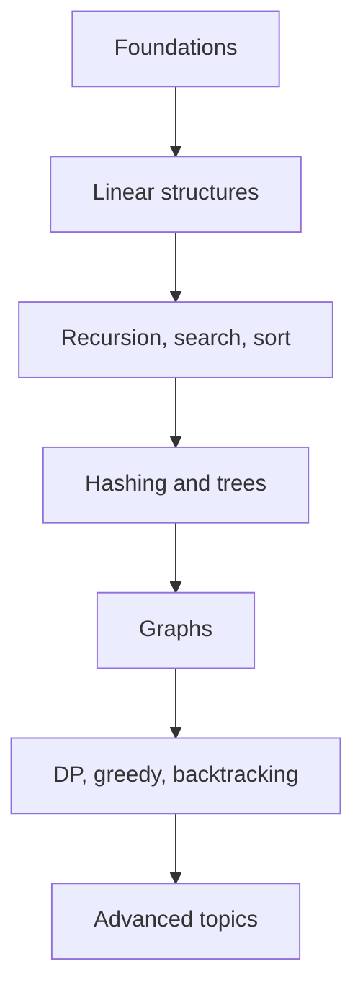

Congratulations. You have traveled from foundations to linear structures, recursion, search, sort, hashing, trees, graphs, and algorithmic paradigms.

<Callout type="success" title="Well done">
You now have the toolkit to read serious algorithmic code, solve interview-style problems, and build systems that depend on efficient data structures. Thank you for learning with this course.
</Callout>

## Advanced data structures

Explore segment trees, Fenwick trees (BIT), suffix arrays, sparse tables, treaps, and splay trees.

## Advanced graph algorithms

Study Bellman-Ford, Floyd-Warshall, A*, max-flow with Edmonds-Karp and Dinic, Tarjan/Kosaraju SCC, articulation points, bridges, and 2-SAT.

## String algorithms

Learn KMP, Z-algorithm, Aho-Corasick, suffix automata, and Manacher's algorithm.

## Computational geometry

Try convex hulls with Graham scan and Andrew's monotone chain, sweep line methods, and line intersection.

## Randomized and approximation algorithms

Look into randomized quicksort, randomized hashing, Bloom filters, and MCMC.

## Parallel and concurrent DSA

Study lock-free queues, persistent data structures, concurrent hash maps, and the memory-model ideas behind them.

## Modern C++ worth investing in

- Move semantics and rvalue references
- Smart pointers: `unique_ptr` and `shared_ptr`
- C++20 ranges and views
- Templates and concepts
- Coroutines in C++20

## Where to practice

LeetCode, Codeforces, AtCoder, HackerRank, and USACO all give different styles of repetition. Also build toy projects: a JSON parser, a key-value store, or a simple compiler. Each forces you to use DSA in a real design.

## Books worth reading

- CLRS
- Algorithms by Sedgewick
- Competitive Programming by Halim
- Algorithm Design by Kleinberg-Tardos
- The Algorithm Design Manual by Skiena
- Effective Modern C++ by Scott Meyers
- C++ Primer

## A final C++ wave-off

<CodeBlock adapter="cpp" starterCode={`#include <algorithm>
#include <iostream>
#include <map>
#include <string>
#include <vector>

int main() {
    std::vector<std::string> words = {"tree", "graph", "tree", "dp", "graph", "tree"};
    std::map<std::string, int> freq;
    for (const auto& word : words) freq[word]++;

    std::vector<std::pair<std::string, int>> items(freq.begin(), freq.end());
    std::sort(items.begin(), items.end(),  {
        if (a.second != b.second) return a.second > b.second;
        return a.first < b.first;
    });

    for (const auto& [word, count] : items) {
        std::cout << word << ": " << count << "\n";
    }
    return 0;
}
`} />

<MultipleChoice markdown={`What is a good next step after this course?

- Stop practicing algorithms forever.
  > Skills fade without use.
- [o] Pick a roadmap topic and build or solve problems with it.
  > Practice makes the ideas durable.
- Only memorize code templates.
  > Understanding matters more.
- Avoid modern C++ features.
  > Modern C++ helps express solutions safely.`} />
