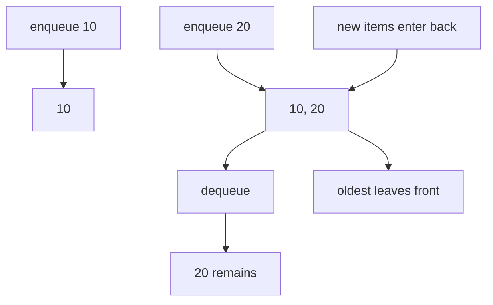

A queue is a **first in, first out** data structure. The oldest item waiting in line is served first. Queues model printers, web requests, breadth-first search frontiers, and producer-consumer pipelines.

## The queue ADT

| Operation | Meaning |
| --- | --- |
| enqueue / `push` | Add an item to the back |
| dequeue / `pop` | Remove the front item |
| `front` | Read the next item to leave |
| `empty` | Check whether the queue has no items |

## `std::queue<T>`

`std::queue` is an adapter. By default it uses `std::deque`, exposing only FIFO operations.

<CodeBlock
  adapter="cpp"
  starterCode={`#include <iostream>
#include <queue>

int main() {
  std::queue<int> line;
  line.push(101);
  line.push(102);
  line.push(103);

  while (!line.empty()) {
    std::cout << "serving " << line.front() << "\\n";
    line.pop();
  }
  return 0;
}
`}
/>

## Producer-consumer style

One part of a program can produce work while another consumes it in the same order.

<CodeBlock
  adapter="cpp"
  starterCode={`#include <iostream>
#include <queue>
#include <string>

int main() {
  std::queue<std::string> jobs;
  for (std::string job : {"parse", "validate", "save"}) {
    jobs.push(job);
    std::cout << "queued " << job << "\\n";
  }

  while (!jobs.empty()) {
    std::cout << "running " << jobs.front() << "\\n";
    jobs.pop();
  }
  return 0;
}
`}
/>

## `std::deque<T>`

A deque is a double-ended queue. It supports O(1) push and pop at both the front and the back. It is the unsung hero of competitive C++ because it handles queue and stack-like workloads well.

<CodeBlock
  adapter="cpp"
  starterCode={`#include <deque>
#include <iostream>

int main() {
  std::deque<int> dq;
  dq.push_back(20);
  dq.push_front(10);
  dq.push_back(30);

  std::cout << dq.front() << " " << dq.back() << "\\n";
  dq.pop_front();
  dq.pop_back();
  std::cout << dq.front() << "\\n";
  return 0;
}
`}
/>

Unlike `std::vector`, popping from the front of a deque does not shift every remaining element.

<Callout type="success" title="Queue and deque costs">
`std::queue` backed by `std::deque` gives O(1) `push`, `pop`, `front`, and `empty`. `std::deque` also gives O(1) push/pop at both ends.
</Callout>

## Vector front-pop versus deque front-pop

This example shows the operation shape: vector erases from the front by shifting, while deque simply removes its first element.

<CodeBlock
  adapter="cpp"
  starterCode={`#include <deque>
#include <iostream>
#include <vector>

int main() {
  std::vector<int> v = {1, 2, 3, 4};
  v.erase(v.begin());

  std::deque<int> d = {1, 2, 3, 4};
  d.pop_front();

  std::cout << "vector front now " << v.front() << "\\n";
  std::cout << "deque front now " << d.front() << "\\n";
  return 0;
}
`}
/>

## Priority queues teaser

`std::priority_queue` is not FIFO. It returns the highest-priority item first and is usually implemented with a heap. We will cover it later in the heaps section.

<CodeBlock
  adapter="cpp"
  starterCode={`#include <iostream>
#include <queue>

int main() {
  std::priority_queue<int> scores;
  for (int x : {30, 99, 12})
    scores.push(x);
  std::cout << scores.top() << "\\n";
  return 0;
}
`}
/>

## Breadth-first flavor

Queues also power breadth-first search: visit a node, enqueue its neighbors, then process nodes in discovery order.

<CodeBlock
  adapter="cpp"
  starterCode={`#include <iostream>
#include <queue>
#include <vector>

int main() {
  std::vector<std::vector<int>> graph = {{1, 2}, {3}, {}, {}};
  std::queue<int> q;
  q.push(0);

  while (!q.empty()) {
    int node = q.front();
    q.pop();
    std::cout << node << "\\n";
    for (int next : graph[node])
      q.push(next);
  }
  return 0;
}
`}
/>

<Callout type="info" title="Choose deque before list for queue ends">
A linked list can push and pop at ends, but a deque usually has better locality and lower allocation overhead.
</Callout>

## Practice: first non-repeating character in a stream

<ChallengeCard
  adapter="cpp"
  title="Implement first non-repeating character in a stream"
  instructions={`Given a stream of lowercase characters, after each character print the first character so far with frequency one, or \`#\` if none exists. Use a queue plus a frequency table.`}
  starterCode={`#include <array>
#include <iostream>
#include <queue>
#include <string>

void printFirstNonRepeating(const std::string &stream) {
  // your code here
}

int main() {
  std::string stream = "aabc";
  printFirstNonRepeating(stream);
  return 0;
}
`}
  solutionCode={`#include <array>
#include <iostream>
#include <queue>
#include <string>

void printFirstNonRepeating(const std::string &stream) {
  std::array<int, 26> freq{};
  std::queue<char> candidates;

  for (char c : stream) {
    ++freq[c - 'a'];
    candidates.push(c);
    while (!candidates.empty() && freq[candidates.front() - 'a'] > 1) {
      candidates.pop();
    }
    if (candidates.empty())
      std::cout << "#\\n";
    else
      std::cout << candidates.front() << "\\n";
  }
}

int main() {
  std::string stream = "aabc";
  printFirstNonRepeating(stream);
  return 0;
}
`}
  tests={[{ id: "first_unique", name: "Prints first non-repeating after each step", expect: { stdoutLines: ["a", "#", "b", "b"], stdoutLinesExact: true } }]}
/>

## Practice: reverse the first k elements

<ChallengeCard
  adapter="cpp"
  title="Reverse the first k elements of a queue"
  instructions={`Given queue \`1,2,3,4,5\` and \`k=3\`, reverse the first three elements and keep the rest in order. Print the resulting queue in order.`}
  starterCode={`#include <iostream>
#include <queue>
#include <stack>

void reverseFirstK(std::queue<int> &q, int k) {
  // your code here
}

int main() {
  std::queue<int> q;
  for (int x : {1, 2, 3, 4, 5})
    q.push(x);
  reverseFirstK(q, 3);
  while (!q.empty()) {
    std::cout << q.front() << "\\n";
    q.pop();
  }
  return 0;
}
`}
  solutionCode={`#include <iostream>
#include <queue>
#include <stack>

void reverseFirstK(std::queue<int> &q, int k) {
  std::stack<int> st;
  for (int i = 0; i < k; ++i) {
    st.push(q.front());
    q.pop();
  }
  while (!st.empty()) {
    q.push(st.top());
    st.pop();
  }
  int rest = static_cast<int>(q.size()) - k;
  for (int i = 0; i < rest; ++i) {
    q.push(q.front());
    q.pop();
  }
}

int main() {
  std::queue<int> q;
  for (int x : {1, 2, 3, 4, 5})
    q.push(x);
  reverseFirstK(q, 3);
  while (!q.empty()) {
    std::cout << q.front() << "\\n";
    q.pop();
  }
  return 0;
}
`}
  tests={[{ id: "reverse_k", name: "Reverses first three", expect: { stdoutLines: ["3", "2", "1", "4", "5"], stdoutLinesExact: true } }]}
/>

## Check your understanding

<MultipleChoice
  markdown={`Which phrase describes a queue?

- Last in, first out
  > That describes a stack.
- [o] First in, first out
  > The oldest enqueued element is served first.
- Highest value, first out
  > That describes a priority queue pattern, not a normal queue.
- Random element, first out
  > A queue has deterministic front/back order.`}
/>

<MultipleChoice
  markdown={`Why is \`std::deque\` often preferred over \`std::list\` for queue-like work?

- [o] It supports efficient end operations with better locality and fewer per-element allocations.
  > Deque storage is usually friendlier to caches than linked nodes.
- It makes every operation O(log n).
  > Queue end operations are constant time.
- It automatically removes duplicates.
  > Deque does not enforce uniqueness.
- It cannot grow dynamically.
  > A deque grows dynamically.`}
/>

<MultipleChoice
  markdown={`What is the complexity of removing the front element from a \`std::vector\` with \`erase(begin())\` compared with \`std::deque::pop_front()\`?

- Both are always O(1).
  > Vector must shift remaining elements.
- [o] Vector front erase is O(n), while deque pop_front is O(1).
  > This is why deque is a natural queue backing container.
- Vector front erase is O(log n), while deque pop_front is O(n).
  > These are not the usual complexities.
- Both are O(n^2).
  > Removing one element is not quadratic here.`}
/>
