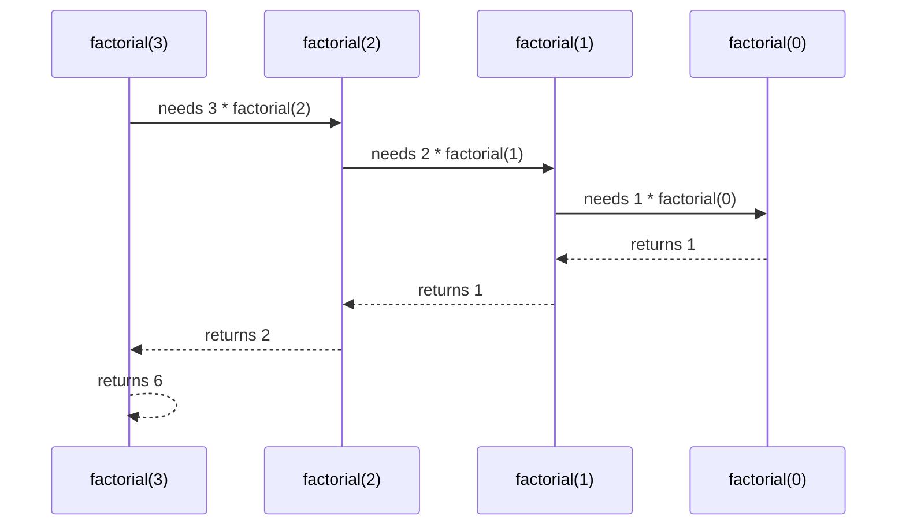
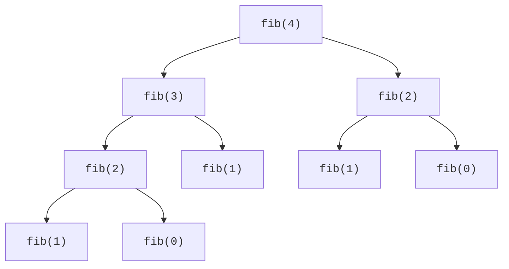

Recursion is a technique where a function solves a problem by calling itself on a smaller version of the same problem. It is a natural fit for trees, divide-and-conquer algorithms, backtracking, and definitions that already refer to themselves.

<svg
  viewBox="0 0 640 220"
  role="img"
  aria-label="Self-similar triangles nest and shrink toward the center, where a dotted descent ends at one solid green base-case dot — recursion reducing a problem to its smallest case"
  style={{ display: "block", width: "100%", maxWidth: "560px", height: "auto", margin: "2.5rem auto" }}
>
  <g style={{ color: "var(--ds-blue-500)" }} fill="currentColor">
    <polygon points="320,28 170,196 470,196" fillOpacity="0.1" />
    <polygon points="320,57 209,181 431,181" fillOpacity="0.14" />
    <polygon points="320,82 242,169 398,169" fillOpacity="0.18" />
    <polygon points="320,103 271,159 369,159" fillOpacity="0.22" />
  </g>
  <g fill="currentColor" opacity="0.35">
    <circle cx="320" cy="44" r="2.5" />
    <circle cx="320" cy="69" r="2.5" />
    <circle cx="320" cy="92" r="2.5" />
    <circle cx="320" cy="115" r="2.5" />
  </g>
  <g style={{ color: "var(--ds-green-500)" }} fill="currentColor">
    <circle cx="320" cy="140" r="7" />
  </g>
</svg>

## Recursive thinking

Every correct recursive function needs two parts:

| Part | Purpose |
| --- | --- |
| Base case | Stops on the smallest input |
| Recursive case | Reduces the problem and calls the same function |

This mirrors mathematical induction: prove the smallest case, then show that a correct answer for a smaller input leads to a correct answer for the next input.

<Callout type="info" title="Ask two questions">
What is the smallest input I can answer immediately? How does every other input move closer to that input?
</Callout>

## The call stack

Each call gets its own **stack frame** containing parameters, local variables, and a return address. Recursive calls add frames until a base case returns.

## Factorial

`n!` means `n * (n - 1) * ... * 1`, and `0!` is `1`.

<CodeBlock
  adapter="cpp"
  files={[
    {
      filename: "main.cpp",
      starterCode: `#include <iostream>
long long factorial(int n) {
  if (n == 0)
    return 1;
  return n * factorial(n - 1);
}
int main() {
  std::cout << factorial(5) << "\\n";
  return 0;
}
`,
    },
  ]}
/>

## Naive Fibonacci

The Fibonacci sequence is recursive by definition: `fib(n) = fib(n - 1) + fib(n - 2)`. The direct version is short, but exponential because it repeats subproblems.

<CodeBlock
  adapter="cpp"
  files={[
    {
      filename: "main.cpp",
      starterCode: `#include <iostream>
int fib(int n) {
  if (n <= 1)
    return n;
  return fib(n - 1) + fib(n - 2);
}
int main() {
  for (int i = 0; i <= 7; i++) {
    std::cout << fib(i) << "\\n";
  }
  return 0;
}
`,
    },
  ]}
/>

Repeated calls motivate **memoization**, a dynamic programming idea we will revisit later.

## Recursive array sum

A recursive array function often carries an index that moves toward the end.

<CodeBlock
  adapter="cpp"
  files={[
    {
      filename: "main.cpp",
      starterCode: `#include <iostream>
#include <vector>
int sumFrom(const std::vector<int> &v, int index) {
  if (index == static_cast<int>(v.size()))
    return 0;
  return v[index] + sumFrom(v, index + 1);
}
int main() {
  std::vector<int> values = {4, 8, 15, 16, 23, 42};
  std::cout << sumFrom(values, 0) << "\\n";
  return 0;
}
`,
    },
  ]}
/>

## Power: naive and fast

Naive recursive power multiplies by `a` exactly `n` times, so it is O(n).

<CodeBlock
  adapter="cpp"
  files={[
    {
      filename: "main.cpp",
      starterCode: `#include <iostream>
long long powerNaive(long long a, int n) {
  if (n == 0)
    return 1;
  return a * powerNaive(a, n - 1);
}
int main() {
  std::cout << powerNaive(2, 10) << "\\n";
  return 0;
}
`,
    },
  ]}
/>

Fast exponentiation squares a half-power and reduces the exponent by half, giving O(log n).

<CodeBlock
  adapter="cpp"
  files={[
    {
      filename: "main.cpp",
      starterCode: `#include <iostream>
long long powerFast(long long a, int n) {
  if (n == 0)
    return 1;
  long long half = powerFast(a, n / 2);
  if (n % 2 == 0)
    return half * half;
  return a * half * half;
}
int main() {
  std::cout << powerFast(3, 13) << "\\n";
  return 0;
}
`,
    },
  ]}
/>

## Stack overflow and tail recursion

A **stack overflow** happens when recursive calls create more frames than the stack can hold. Causes include missing base cases, huge inputs, or recursion that shrinks too slowly. Avoid it by verifying the base case, switching to iteration for deep inputs, converting tail recursion to a loop, or increasing stack size only when you control the runtime.

Tail recursion means the recursive call is the final action. Clang may optimize some tail calls, but C++ does not guarantee this optimization.

<CodeBlock
  adapter="cpp"
  files={[
    {
      filename: "main.cpp",
      starterCode: `#include <iostream>
long long factorialTail(int n, long long acc) {
  if (n == 0)
    return acc;
  return factorialTail(n - 1, acc * n);
}
int main() {
  std::cout << factorialTail(6, 1) << "\\n";
  return 0;
}
`,
    },
  ]}
/>

<Callout type="success" title="Recursion vs iteration">
Recursion can make tree-shaped logic elegant and close to the math. Iteration usually uses less memory, avoids stack-depth limits, and can be faster. Choose clarity first, then adapt when constraints require it.
</Callout>

## Practice: count digits recursively

<ChallengeCard
  adapter="cpp"
  title="Count digits of a positive integer recursively"
  instructions={`Implement \`int countDigits(int n)\`. The input is positive. Do not print inside the function; the driver prints several calls.`}
  files={[
    {
      filename: "main.cpp",
      starterCode: `#include <iostream>
int countDigits(int n) {
  // your code here
}
int main() {
  std::cout << countDigits(7) << "\\n";
  std::cout << countDigits(42) << "\\n";
  std::cout << countDigits(1000) << "\\n";
  std::cout << countDigits(123456) << "\\n";
  return 0;
}
`,
      solutionCode: `#include <iostream>
int countDigits(int n) {
  if (n < 10)
    return 1;
  return 1 + countDigits(n / 10);
}
int main() {
  std::cout << countDigits(7) << "\\n";
  std::cout << countDigits(42) << "\\n";
  std::cout << countDigits(1000) << "\\n";
  std::cout << countDigits(123456) << "\\n";
  return 0;
}
`,
    },
  ]}
  tests={[
    { id: "digit_counts", name: "Counts digits", expect: { stdoutLines: ["1", "2", "4", "6"], stdoutLinesExact: true } },
  ]}
/>

## Practice: reverse a string recursively

<ChallengeCard
  adapter="cpp"
  title="Reverse a string recursively"
  instructions={`Implement \`std::string reverseStr(const std::string& s)\` recursively. The driver prints the reverse of \`recursion\`.`}
  files={[
    {
      filename: "main.cpp",
      starterCode: `#include <iostream>
#include <string>
std::string reverseStr(const std::string &s) {
  // your code here
}
int main() {
  std::cout << reverseStr("recursion") << "\\n";
  return 0;
}
`,
      solutionCode: `#include <iostream>
#include <string>
std::string reverseStr(const std::string &s) {
  if (s.empty())
    return "";
  return reverseStr(s.substr(1)) + s[0];
}
int main() {
  std::cout << reverseStr("recursion") << "\\n";
  return 0;
}
`,
    },
  ]}
  tests={[
    { id: "reverse_recursion", name: "Reverses recursion", expect: { stdoutEquals: "noisrucer" } },
  ]}
/>

## Check your understanding

<MultipleChoice
  markdown={`Why is a base case necessary in recursion?

- It makes the function run in O(1) time.
  > A base case does not guarantee constant time; it only defines when recursion stops.
- [o] It stops recursive calls from continuing forever.
  > Without a reachable base case, calls keep stacking until failure.
- It stores all previous answers automatically.
  > That describes memoization, not a base case.
- It lets C++ allocate variables on the heap.
  > Recursive calls normally use stack frames, not heap allocation.

A base case is the smallest input that can be answered directly.`}
/>

<MultipleChoice
  markdown={`What is the time complexity of naive recursive Fibonacci?

- O(n)
  > This fits iterative or memoized Fibonacci, not the naive recursive version.
- O(n log n)
  > The branching recurrence is larger than this.
- [o] Exponential, often written as O(2^n)
  > Each call branches and repeats work.
- O(log n)
  > O(log n) fits fast exponentiation, not naive Fibonacci.

Repeated subproblems are what dynamic programming fixes.`}
/>

<MultipleChoice
  markdown={`What does recursion use under the hood to remember unfinished calls?

- A priority queue
  > A priority queue orders values by priority, not function calls.
- A hash table
  > Hash tables help memoization but are not required for recursion itself.
- [o] The call stack
  > Each active call has its own stack frame.
- A sorted vector
  > Sorting is unrelated to tracking recursive calls.

The call stack explains returns and stack overflow.`}
/>
