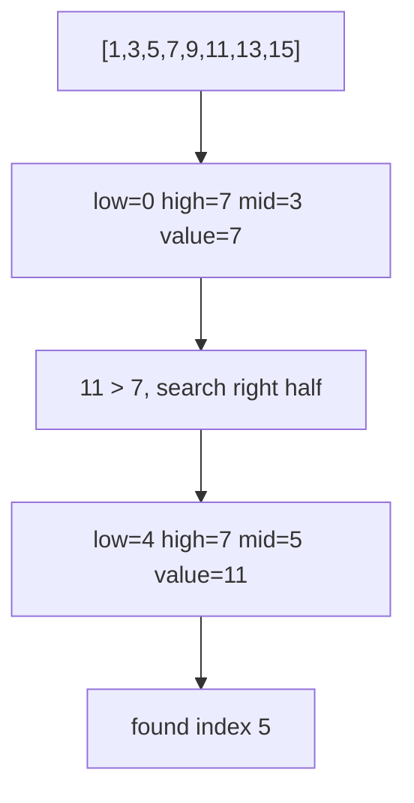

Searching means locating a target value in a collection. The right technique depends mainly on whether the data is sorted.

## Linear search

Linear search checks each element from left to right until it finds the target or reaches the end. It works on unsorted data and runs in O(n).

<CodeBlock
  adapter="cpp"
  starterCode={`#include <iostream>
#include <vector>
int linearSearch(const std::vector<int>& v, int target) {
    for (int i = 0; i < static_cast<int>(v.size()); i++) {
        if (v[i] == target) return i;
    }
    return -1;
}
int main() {
    std::vector<int> values = {9, 4, 7, 2, 8};
    std::cout << linearSearch(values, 7) << "\\n";
    std::cout << linearSearch(values, 5) << "\\n";
    return 0;
}
`}
/>

Linear search is often right for tiny arrays, one-time scans, linked lists, or unsorted data that is not worth sorting first.

## Binary search

Binary search only works on sorted data. It keeps a search interval, checks the middle, and discards half the remaining values each step. That gives O(log n) time.

Use `low <= high` when both endpoints are inclusive. Compute `mid` as `low + (high - low) / 2` to avoid overflow.

<CodeBlock
  adapter="cpp"
  starterCode={`#include <iostream>
#include <vector>
int binarySearch(const std::vector<int>& v, int target) {
    int low = 0;
    int high = static_cast<int>(v.size()) - 1;
    while (low <= high) {
        int mid = low + (high - low) / 2;
        if (v[mid] == target) return mid;
        if (v[mid] < target) low = mid + 1;
        else high = mid - 1;
    }
    return -1;
}
int main() {
    std::vector<int> values = {1, 3, 5, 7, 9, 11, 13, 15};
    std::cout << binarySearch(values, 11) << "\\n";
    std::cout << binarySearch(values, 6) << "\\n";
    return 0;
}
`}
/>

## STL search helpers

C++ already includes binary-search algorithms for sorted ranges.

<CodeBlock
  adapter="cpp"
  starterCode={`#include <algorithm>
#include <iostream>
#include <vector>
int main() {
    std::vector<int> v = {1, 2, 2, 2, 4, 7};
    bool hasTwo = std::binary_search(v.begin(), v.end(), 2);
    auto lower = std::lower_bound(v.begin(), v.end(), 2);
    auto upper = std::upper_bound(v.begin(), v.end(), 2);
    std::cout << hasTwo << "\\n";
    std::cout << (lower - v.begin()) << "\\n";
    std::cout << (upper - v.begin()) << "\\n";
    return 0;
}
`}
/>

* `std::binary_search` returns `true` or `false`.
* `std::lower_bound` returns an iterator to the first element `>= target`.
* `std::upper_bound` returns an iterator to the first element `> target`.

<Callout type="warn" title="Binary search requires sorted data">
If the range is not sorted according to the same comparison used by the search, binary search results are meaningless.
</Callout>

Another classic bug is calculating `mid` as `(low + high) / 2`. For very large indices, `low + high` can overflow, so use `low + (high - low) / 2`.

## Variants

When duplicates exist, ordinary binary search may return any matching index. To find the first occurrence, keep searching left after a match.

<CodeBlock
  adapter="cpp"
  starterCode={`#include <iostream>
#include <vector>
int firstOccurrence(const std::vector<int>& v, int target) {
    int low = 0, high = static_cast<int>(v.size()) - 1;
    int answer = -1;
    while (low <= high) {
        int mid = low + (high - low) / 2;
        if (v[mid] >= target) {
            if (v[mid] == target) answer = mid;
            high = mid - 1;
        } else {
            low = mid + 1;
        }
    }
    return answer;
}
int main() {
    std::vector<int> v = {1, 2, 2, 2, 3, 4, 4, 5};
    std::cout << firstOccurrence(v, 2) << "\\n";
    return 0;
}
`}
/>

The insert position is the first index where the target could be placed while keeping the vector sorted. It is exactly what `lower_bound` computes.

<CodeBlock
  adapter="cpp"
  starterCode={`#include <algorithm>
#include <iostream>
#include <vector>
int insertPosition(const std::vector<int>& v, int target) {
    return static_cast<int>(std::lower_bound(v.begin(), v.end(), target) - v.begin());
}
int main() {
    std::vector<int> v = {1, 3, 5, 7};
    std::cout << insertPosition(v, 0) << "\\n";
    std::cout << insertPosition(v, 6) << "\\n";
    std::cout << insertPosition(v, 9) << "\\n";
    return 0;
}
`}
/>

## Practice: implement binary search

<ChallengeCard
  adapter="cpp"
  title="Implement binary search"
  instructions={`Implement \`int binarySearch(const std::vector<int>& v, int target)\` for a sorted vector. Return the index if found, or \`-1\` if missing.`}
  starterCode={`#include <iostream>
#include <vector>
int binarySearch(const std::vector<int>& v, int target) {
    // your code here
}
int main() {
    std::vector<int> v = {1, 3, 5, 7, 9, 11, 13, 15};
    std::cout << binarySearch(v, 1) << "\\n";
    std::cout << binarySearch(v, 11) << "\\n";
    std::cout << binarySearch(v, 15) << "\\n";
    std::cout << binarySearch(v, 8) << "\\n";
    return 0;
}
`}
  solutionCode={`#include <iostream>
#include <vector>
int binarySearch(const std::vector<int>& v, int target) {
    int low = 0;
    int high = static_cast<int>(v.size()) - 1;
    while (low <= high) {
        int mid = low + (high - low) / 2;
        if (v[mid] == target) return mid;
        if (v[mid] < target) low = mid + 1;
        else high = mid - 1;
    }
    return -1;
}
int main() {
    std::vector<int> v = {1, 3, 5, 7, 9, 11, 13, 15};
    std::cout << binarySearch(v, 1) << "\\n";
    std::cout << binarySearch(v, 11) << "\\n";
    std::cout << binarySearch(v, 15) << "\\n";
    std::cout << binarySearch(v, 8) << "\\n";
    return 0;
}
`}
  tests={[{ id: "binary_lookup", name: "Finds values", expect: { stdoutLines: ["0", "5", "7", "-1"], stdoutLinesExact: true } }]}
/>

## Practice: first occurrence with duplicates

<ChallengeCard
  adapter="cpp"
  title="Find first occurrence in a sorted array with duplicates"
  instructions={`Implement \`int firstOccurrence(const std::vector<int>& v, int target)\`. Return the first matching index, or \`-1\` if absent.`}
  starterCode={`#include <iostream>
#include <vector>
int firstOccurrence(const std::vector<int>& v, int target) {
    // your code here
}
int main() {
    std::vector<int> v = {1, 2, 2, 2, 3, 4, 4, 5};
    std::cout << firstOccurrence(v, 2) << "\\n";
    std::cout << firstOccurrence(v, 4) << "\\n";
    std::cout << firstOccurrence(v, 7) << "\\n";
    return 0;
}
`}
  solutionCode={`#include <iostream>
#include <vector>
int firstOccurrence(const std::vector<int>& v, int target) {
    int low = 0, high = static_cast<int>(v.size()) - 1, answer = -1;
    while (low <= high) {
        int mid = low + (high - low) / 2;
        if (v[mid] >= target) {
            if (v[mid] == target) answer = mid;
            high = mid - 1;
        } else {
            low = mid + 1;
        }
    }
    return answer;
}
int main() {
    std::vector<int> v = {1, 2, 2, 2, 3, 4, 4, 5};
    std::cout << firstOccurrence(v, 2) << "\\n";
    std::cout << firstOccurrence(v, 4) << "\\n";
    std::cout << firstOccurrence(v, 7) << "\\n";
    return 0;
}
`}
  tests={[{ id: "first_occurrence", name: "Finds first duplicate positions", expect: { stdoutLines: ["1", "5", "-1"], stdoutLinesExact: true } }]}
/>

## Check your understanding

<MultipleChoice
  markdown={`What is the worst-case time complexity of linear search over \`n\` elements?

- [o] O(n)
  > It may inspect every element.
- O(log n)
  > That is binary search on sorted data.
- O(1)
  > Linear search is not constant time in the worst case.
- O(n log n)
  > That is common for efficient sorting, not linear search.`}
/>

<MultipleChoice
  markdown={`What must be true before using binary search on a vector?

- The vector must have no duplicates.
  > Duplicates are allowed.
- [o] The vector must be sorted according to the search comparison.
  > Binary search relies on sorted order.
- The vector must contain only positive integers.
  > It works for any comparable values.
- The vector must be stored on the heap.
  > Storage location is irrelevant.`}
/>

<MultipleChoice
  markdown={`What does \`std::lower_bound(first, last, x)\` return?

- The first element strictly greater than \`x\`.
  > That is \`std::upper_bound\`.
- A boolean indicating whether \`x\` exists.
  > That is \`std::binary_search\`.
- [o] An iterator to the first element not less than \`x\`.
  > It finds the first value \`>= x\`.
- The last occurrence of \`x\`.
  > It returns the insertion position before equal values.`}
/>

<MultipleChoice
  markdown={`In an inclusive binary search loop, which update is correct after \`v[mid] < target\`?

- \`high = mid - 1\`
  > That searches left, but the target must be to the right.
- \`low = mid\`
  > This can repeat the same middle index forever.
- [o] \`low = mid + 1\`
  > Exclude the too-small middle value.
- \`high = mid\`
  > This keeps the too-small middle in the interval.`}
/>
