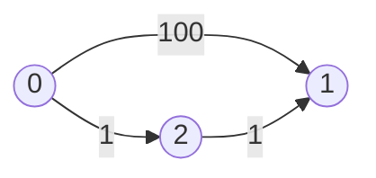
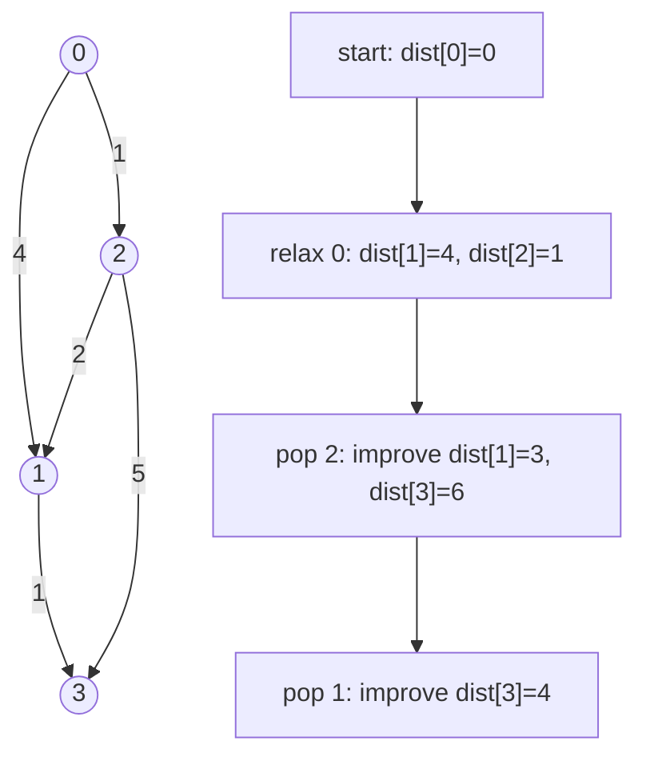
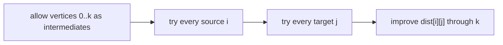

The shortest path problem asks for the minimum total edge weight needed to travel from a source vertex to other vertices. This page focuses on **single-source shortest paths** in weighted graphs with **non-negative** edge weights.

## Why BFS is not enough

BFS minimizes the number of edges. In a weighted graph, fewer edges may cost more.



BFS would see `0 -> 1` as one edge, but the cheaper path is `0 -> 2 -> 1` with cost `2`.

<CodeBlock
  adapter="cpp"
  initialCode={`#include <iostream>

int main() {
    int direct = 100;
    int viaTwo = 1 + 1;
    std::cout << "direct=" << direct << " viaTwo=" << viaTwo << "\\n";
    return 0;
}
`}
/>

## Dijkstra's idea

Dijkstra's algorithm repeatedly chooses the unprocessed vertex with the smallest known distance, then **relaxes** its outgoing edges.

```text
Dijkstra(adj, src):
    dist[*] = infinity
    dist[src] = 0
    push (0, src) into min-heap
    while heap not empty:
        (d, u) = pop smallest distance
        if d is stale, skip it
        for each edge u -> v with weight w:
            if dist[u] + w < dist[v]:
                dist[v] = dist[u] + w
                parent[v] = u
                push (dist[v], v)
```



The greedy choice is safe only when edge weights are non-negative. Once the smallest distance leaves the heap, no future non-negative edge can make it smaller.

<Callout type="info" title="Priority queues can contain stale entries">
C++ `priority_queue` has no decrease-key operation. The common competitive-programming pattern is to push a new pair when a distance improves, then skip a popped pair if it no longer matches `dist[u]`.
</Callout>

## Full C++ implementation

Use an adjacency list where each edge is `(neighbor, weight)`. The min-heap stores `(distance, vertex)`.

<CodeBlock
  adapter="cpp"
  initialCode={`#include <climits>
#include <functional>
#include <iostream>
#include <queue>
#include <utility>
#include <vector>

std::vector<int> dijkstra(int n, const std::vector<std::vector<std::pair<int, int>>>& adj, int src) {
    std::vector<int> dist(n, INT_MAX);
    using State = std::pair<int, int>;
    std::priority_queue<State, std::vector<State>, std::greater<State>> pq;

    dist[src] = 0;
    pq.push({0, src});

    while (!pq.empty()) {
        auto [d, u] = pq.top();
        pq.pop();
        if (d != dist[u]) continue;

        for (auto [v, w] : adj[u]) {
            if (dist[u] != INT_MAX && dist[u] + w < dist[v]) {
                dist[v] = dist[u] + w;
                pq.push({dist[v], v});
            }
        }
    }
    return dist;
}

int main() {
    int n = 4;
    std::vector<std::vector<std::pair<int, int>>> adj(n);
    adj[0].push_back({1, 4});
    adj[0].push_back({2, 1});
    adj[2].push_back({1, 2});
    adj[1].push_back({3, 1});
    adj[2].push_back({3, 5});

    for (int d : dijkstra(n, adj, 0)) std::cout << d << " ";
    std::cout << "\\n";
    return 0;
}
`}
/>

With a binary heap, the time complexity is **O((V + E) log V)**. The adjacency list contributes the `V + E` scan; heap pushes and pops cost `log V`.

## Relaxation in isolation

Relaxation means: if going through `u` improves `v`, update `dist[v]`.

<CodeBlock
  adapter="cpp"
  initialCode={`#include <climits>
#include <iostream>
#include <vector>

int main() {
    std::vector<int> dist = {0, 10, INT_MAX};
    int u = 0;
    int v = 1;
    int w = 4;

    if (dist[u] != INT_MAX && dist[u] + w < dist[v]) {
        dist[v] = dist[u] + w;
    }

    std::cout << dist[v] << "\\n";
    return 0;
}
`}
/>

## Reconstructing the path

Maintain a `parent` array whenever a relaxation improves a vertex. To reconstruct a target path, walk parent pointers backward and reverse the result.

<CodeBlock
  adapter="cpp"
  initialCode={`#include <algorithm>
#include <climits>
#include <functional>
#include <iostream>
#include <queue>
#include <utility>
#include <vector>

int main() {
    int n = 4, src = 0, target = 3;
    std::vector<std::vector<std::pair<int, int>>> adj(n);
    adj[0] = {{1, 4}, {2, 1}};
    adj[2] = {{1, 2}, {3, 5}};
    adj[1] = {{3, 1}};

    std::vector<int> dist(n, INT_MAX), parent(n, -1);
    using State = std::pair<int, int>;
    std::priority_queue<State, std::vector<State>, std::greater<State>> pq;
    dist[src] = 0;
    pq.push({0, src});

    while (!pq.empty()) {
        auto [d, u] = pq.top();
        pq.pop();
        if (d != dist[u]) continue;
        for (auto [v, w] : adj[u]) {
            if (dist[u] + w < dist[v]) {
                dist[v] = dist[u] + w;
                parent[v] = u;
                pq.push({dist[v], v});
            }
        }
    }

    std::vector<int> path;
    for (int cur = target; cur != -1; cur = parent[cur]) path.push_back(cur);
    std::reverse(path.begin(), path.end());

    std::cout << "distance " << dist[target] << " path";
    for (int x : path) std::cout << " " << x;
    std::cout << "\\n";
    return 0;
}
`}
/>

## When Dijkstra fails

Dijkstra fails with negative edges because a vertex that looked finalized may later become cheaper through a negative edge.

<Callout type="warn" title="Negative weights need a different algorithm">
If negative weights are possible, use Bellman-Ford for single-source shortest paths. If a negative cycle is reachable from the source, no finite shortest path exists for affected vertices.
</Callout>

Bellman-Ford relaxes every edge repeatedly:

```text
BellmanFord(edges, n, src):
    dist[*] = infinity
    dist[src] = 0
    repeat n - 1 times:
        for each edge (u, v, w):
            if dist[u] + w < dist[v]:
                dist[v] = dist[u] + w
    one more pass can detect negative cycles
```

<CodeBlock
  adapter="cpp"
  initialCode={`#include <iostream>

int main() {
    std::cout << "Dijkstra: non-negative weights\\n";
    std::cout << "Bellman-Ford: can handle negative edges\\n";
    return 0;
}
`}
/>

## Floyd-Warshall for all pairs

Floyd-Warshall computes shortest paths between every pair of vertices in **O(V³)** time. It is often useful for dense graphs and supports negative edges as long as there are no negative cycles.

```text
for k in 0..n-1:
    for i in 0..n-1:
        for j in 0..n-1:
            dist[i][j] = min(dist[i][j], dist[i][k] + dist[k][j])
```



<CodeBlock
  adapter="cpp"
  initialCode={`#include <algorithm>
#include <iostream>
#include <vector>

int main() {
    const int INF = 1'000'000;
    std::vector<std::vector<int>> dist = {
        {0, 3, INF},
        {INF, 0, 2},
        {5, INF, 0}
    };

    int n = static_cast<int>(dist.size());
    for (int k = 0; k < n; k++) {
        for (int i = 0; i < n; i++) {
            for (int j = 0; j < n; j++) {
                if (dist[i][k] < INF && dist[k][j] < INF) {
                    dist[i][j] = std::min(dist[i][j], dist[i][k] + dist[k][j]);
                }
            }
        }
    }

    std::cout << dist[0][2] << "\\n";
    return 0;
}
`}
/>

## Challenge: Shortest distance from source

<ChallengeCard
  adapter="cpp"
  title="Shortest distance from source"
  instructions={`Implement \`dijkstra\` for a directed weighted graph with non-negative edge weights. Return \`INT_MAX\` for unreachable vertices.`}
  initialCode={`#include <climits>
#include <functional>
#include <iostream>
#include <queue>
#include <utility>
#include <vector>

std::vector<int> dijkstra(int n, const std::vector<std::vector<std::pair<int, int>>>& adj, int src) {
    // your code here
    return {};
}

int main() {
    int n = 5;
    std::vector<std::vector<std::pair<int, int>>> adj(n);
    adj[0] = {{1, 2}, {2, 5}};
    adj[1] = {{2, 1}, {3, 2}};
    adj[2] = {{3, 1}};

    std::vector<int> dist = dijkstra(n, adj, 0);
    for (int i = 0; i < n; i++) {
        if (i) std::cout << " ";
        if (dist[i] == INT_MAX) std::cout << "INF";
        else std::cout << dist[i];
    }
    std::cout << "\\n";
    return 0;
}
`}
  solutionCode={`#include <climits>
#include <functional>
#include <iostream>
#include <queue>
#include <utility>
#include <vector>

std::vector<int> dijkstra(int n, const std::vector<std::vector<std::pair<int, int>>>& adj, int src) {
    std::vector<int> dist(n, INT_MAX);
    using State = std::pair<int, int>;
    std::priority_queue<State, std::vector<State>, std::greater<State>> pq;
    dist[src] = 0;
    pq.push({0, src});

    while (!pq.empty()) {
        auto [d, u] = pq.top();
        pq.pop();
        if (d != dist[u]) continue;
        for (auto [v, w] : adj[u]) {
            if (dist[u] != INT_MAX && dist[u] + w < dist[v]) {
                dist[v] = dist[u] + w;
                pq.push({dist[v], v});
            }
        }
    }
    return dist;
}

int main() {
    int n = 5;
    std::vector<std::vector<std::pair<int, int>>> adj(n);
    adj[0] = {{1, 2}, {2, 5}};
    adj[1] = {{2, 1}, {3, 2}};
    adj[2] = {{3, 1}};

    std::vector<int> dist = dijkstra(n, adj, 0);
    for (int i = 0; i < n; i++) {
        if (i) std::cout << " ";
        if (dist[i] == INT_MAX) std::cout << "INF";
        else std::cout << dist[i];
    }
    std::cout << "\\n";
    return 0;
}
`}
  tests={[
    {
      id: "distances",
      name: "Computes source-to-all distances",
      expect: { stdoutEquals: "0 2 3 4 INF" },
    },
  ]}
/>

## Challenge: Network delay time

<ChallengeCard
  adapter="cpp"
  title="Network delay time"
  instructions={`Implement \`networkDelayTime\`. Nodes are numbered from 1 to \`n\`. Return the maximum shortest distance from \`k\`, or -1 if any node is unreachable.`}
  initialCode={`#include <algorithm>
#include <climits>
#include <functional>
#include <iostream>
#include <queue>
#include <tuple>
#include <utility>
#include <vector>

int networkDelayTime(const std::vector<std::tuple<int, int, int>>& times, int n, int k) {
    // your code here
    return 0;
}

int main() {
    std::vector<std::tuple<int, int, int>> times = {
        {2, 1, 1}, {2, 3, 1}, {3, 4, 1}
    };
    std::cout << networkDelayTime(times, 4, 2) << "\\n";
    return 0;
}
`}
  solutionCode={`#include <algorithm>
#include <climits>
#include <functional>
#include <iostream>
#include <queue>
#include <tuple>
#include <utility>
#include <vector>

int networkDelayTime(const std::vector<std::tuple<int, int, int>>& times, int n, int k) {
    std::vector<std::vector<std::pair<int, int>>> adj(n + 1);
    for (auto [u, v, w] : times) adj[u].push_back({v, w});

    std::vector<int> dist(n + 1, INT_MAX);
    using State = std::pair<int, int>;
    std::priority_queue<State, std::vector<State>, std::greater<State>> pq;
    dist[k] = 0;
    pq.push({0, k});

    while (!pq.empty()) {
        auto [d, u] = pq.top();
        pq.pop();
        if (d != dist[u]) continue;
        for (auto [v, w] : adj[u]) {
            if (dist[u] + w < dist[v]) {
                dist[v] = dist[u] + w;
                pq.push({dist[v], v});
            }
        }
    }

    int answer = 0;
    for (int node = 1; node <= n; node++) {
        if (dist[node] == INT_MAX) return -1;
        answer = std::max(answer, dist[node]);
    }
    return answer;
}

int main() {
    std::vector<std::tuple<int, int, int>> times = {
        {2, 1, 1}, {2, 3, 1}, {3, 4, 1}
    };
    std::cout << networkDelayTime(times, 4, 2) << "\\n";
    return 0;
}
`}
  tests={[
    {
      id: "delay",
      name: "Computes network delay",
      expect: { stdoutEquals: "2" },
    },
  ]}
/>

## Check your understanding

<MultipleChoice
  markdown={`Why does Dijkstra's algorithm require non-negative edge weights?

- It uses recursion, which cannot handle negative numbers
  > Dijkstra is usually iterative, and C++ can store negative integers.
- [o] A finalized smallest distance could later be improved by a negative edge
  > Correct. Negative edges break the greedy guarantee.
- Priority queues cannot store negative values
  > Priority queues can store negative values just fine.
- Weighted graphs are always acyclic
  > Weighted graphs may contain cycles.

Use Bellman-Ford when negative edges are allowed.`}
/>

<MultipleChoice
  markdown={`What is the usual time complexity of Dijkstra with an adjacency list and binary heap?

- O(V²E)
  > This is far larger than the standard heap implementation.
- O(log V)
  > A single heap operation is logarithmic, but the whole algorithm processes vertices and edges.
- [o] O((V + E) log V)
  > Correct. Heap operations occur as distances are pushed and popped while edges are scanned.
- O(1)
  > Shortest paths require examining graph structure.

The exact bound is often written O(E log V) for connected sparse graphs, but O((V + E) log V) is a safe general form.`}
/>

<MultipleChoice
  markdown={`Why do we use a min-heap for Dijkstra instead of a max-heap?

- To process the largest vertex id first
  > Vertex id is not the priority.
- [o] To always expand the currently smallest known distance
  > Correct. That is Dijkstra's greedy step.
- To make all edges positive
  > A heap does not change edge weights.
- To store the graph itself
  > The graph is stored in an adjacency list; the heap stores frontier states.

C++ \`priority_queue\` is a max-heap by default, so use \`greater<>\` for a min-heap.`}
/>
