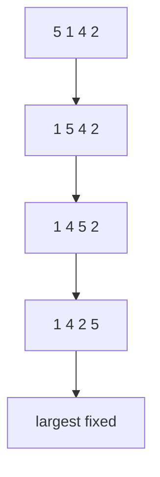

Sorting rearranges data into an order, usually ascending or descending. These algorithms are not the fastest for large inputs, but they teach loop invariants and the structure of comparison-based sorting.

<svg
  viewBox="0 0 640 200"
  role="img"
  aria-label="A row of bars mid bubble sort — two adjacent yellow bars circle around each other in a swap while the tallest bars already sit settled and green at the right end"
  style={{ display: "block", width: "100%", maxWidth: "640px", height: "auto", margin: "2.5rem auto" }}
>
  <rect x="100" y="170" width="440" height="4" rx="2" fill="currentColor" opacity="0.15" />
  <g style={{ color: "var(--ds-blue-500)" }} fill="currentColor">
    <rect x="112" y="130" width="34" height="40" rx="6" fillOpacity="0.8" />
    <rect x="160" y="104" width="34" height="66" rx="6" fillOpacity="0.8" />
    <rect x="208" y="140" width="34" height="30" rx="6" fillOpacity="0.8" />
    <rect x="352" y="96" width="34" height="74" rx="6" fillOpacity="0.8" />
    <rect x="400" y="112" width="34" height="58" rx="6" fillOpacity="0.8" />
  </g>
  <g style={{ color: "var(--ds-yellow-500)" }} fill="currentColor">
    <rect x="256" y="78" width="34" height="92" rx="6" />
    <rect x="304" y="122" width="34" height="48" rx="6" />
    <circle cx="279" cy="50" r="2.5" fillOpacity="0.7" />
    <circle cx="297" cy="42" r="2.5" fillOpacity="0.7" />
    <circle cx="315" cy="50" r="2.5" fillOpacity="0.7" />
    <polygon points="313,50 325,54 315,64" fillOpacity="0.7" />
    <circle cx="315" cy="66" r="2.5" fillOpacity="0.7" />
    <circle cx="297" cy="74" r="2.5" fillOpacity="0.7" />
    <circle cx="279" cy="66" r="2.5" fillOpacity="0.7" />
    <polygon points="281,66 269,62 279,52" fillOpacity="0.7" />
  </g>
  <g style={{ color: "var(--ds-green-500)" }} fill="currentColor">
    <rect x="448" y="60" width="34" height="110" rx="6" />
    <rect x="496" y="44" width="34" height="126" rx="6" />
  </g>
</svg>

## Why study slow sorts?
Basic sorts make hidden ideas visible: sorted prefixes and suffixes grow, comparisons decide order, and swaps or shifts move elements into place. These ideas reappear in efficient sorting and interview problems.
## Bubble sort
Bubble sort repeatedly compares adjacent elements and swaps them if they are out of order. After one full pass, the largest value has bubbled to the end.

With an early-exit flag, bubble sort is O(n) on already sorted input. Its average and worst cases are O(n^2).

<CodeBlock
  adapter="cpp"
  files={[
    {
      filename: "main.cpp",
      starterCode: `#include <iostream>
#include <utility>
#include <vector>
void bubbleSort(std::vector<int> &v) {
  int n = static_cast<int>(v.size());
  for (int pass = 0; pass < n - 1; pass++) {
    bool swapped = false;
    for (int i = 0; i < n - 1 - pass; i++) {
      if (v[i] > v[i + 1]) {
        std::swap(v[i], v[i + 1]);
        swapped = true;
      }
    }
    if (!swapped)
      break;
  }
}
int main() {
  std::vector<int> v = {5, 1, 4, 2, 8};
  bubbleSort(v);
  for (int x : v)
    std::cout << x << "\\n";
  return 0;
}
`,
    },
  ]}
/>

## Selection sort

Selection sort finds the smallest element in the unsorted suffix and swaps it into the next position. The sorted prefix grows by one each pass.

<CodeBlock
  adapter="cpp"
  files={[
    {
      filename: "main.cpp",
      starterCode: `#include <iostream>
#include <utility>
#include <vector>
void selectionSort(std::vector<int> &v) {
  int n = static_cast<int>(v.size());
  for (int i = 0; i < n; i++) {
    int minIndex = i;
    for (int j = i + 1; j < n; j++) {
      if (v[j] < v[minIndex])
        minIndex = j;
    }
    std::swap(v[i], v[minIndex]);
  }
}
int main() {
  std::vector<int> v = {64, 25, 12, 22, 11};
  selectionSort(v);
  for (int x : v)
    std::cout << x << "\\n";
  return 0;
}
`,
    },
  ]}
/>

Selection sort always does O(n^2) comparisons, even if the input is already sorted, and uses O(1) extra space.

## Insertion sort

Insertion sort builds a sorted prefix. For each new value, it shifts larger elements right until the correct position opens.

<CodeBlock
  adapter="cpp"
  files={[
    {
      filename: "main.cpp",
      starterCode: `#include <iostream>
#include <vector>
void insertionSort(std::vector<int> &v) {
  for (int i = 1; i < static_cast<int>(v.size()); i++) {
    int key = v[i];
    int j = i - 1;
    while (j >= 0 && v[j] > key) {
      v[j + 1] = v[j];
      j--;
    }
    v[j + 1] = key;
  }
}
int main() {
  std::vector<int> v = {5, 2, 4, 6, 1, 3};
  insertionSort(v);
  for (int x : v)
    std::cout << x << "\\n";
  return 0;
}
`,
    },
  ]}
/>

Insertion sort is O(n^2) in the worst case, but O(n) on nearly sorted data. Many hybrid sorts use it for tiny partitions.

<Callout type="success" title="Stability">
A stable sort keeps equal elements in their original relative order. Insertion sort is stable when it shifts only values greater than the key. Selection sort is not stable in its typical swap-based form.
</Callout>

## Comparing basic sorts

| Algorithm | Best | Average | Worst | Extra space | Stable? |
| --- | --- | --- | --- | --- | --- |
| Bubble sort with early exit | O(n) | O(n^2) | O(n^2) | O(1) | Yes |
| Selection sort | O(n^2) | O(n^2) | O(n^2) | O(1) | No |
| Insertion sort | O(n) | O(n^2) | O(n^2) | O(1) | Yes |

A helper that prints vectors cleanly is useful while debugging sorts.

<CodeBlock
  adapter="cpp"
  files={[
    {
      filename: "main.cpp",
      starterCode: `#include <iostream>
#include <vector>
void printCommaSeparated(const std::vector<int> &v) {
  for (int i = 0; i < static_cast<int>(v.size()); i++) {
    if (i > 0)
      std::cout << ",";
    std::cout << v[i];
  }
  std::cout << "\\n";
}
int main() {
  std::vector<int> v = {1, 2, 3};
  printCommaSeparated(v);
  return 0;
}
`,
    },
  ]}
/>

Insertion sort's invariant is: before each outer-loop iteration, elements before `i` are already sorted.

## Practice: bubble sort with early exit

<ChallengeCard
  adapter="cpp"
  title="Implement bubble sort with early exit"
  instructions={`Implement \`void bubbleSort(std::vector<int>& v)\` using adjacent swaps and an early-exit flag. The driver prints the sorted vector with comma separators.`}
  files={[
    {
      filename: "main.cpp",
      starterCode: `#include <iostream>
#include <utility>
#include <vector>
void bubbleSort(std::vector<int> &v) {
  // your code here
}
void printVector(const std::vector<int> &v) {
  for (int i = 0; i < static_cast<int>(v.size()); i++) {
    if (i > 0)
      std::cout << ",";
    std::cout << v[i];
  }
  std::cout << "\\n";
}
int main() {
  std::vector<int> v = {9, 1, 5, 3, 5, 2};
  bubbleSort(v);
  printVector(v);
  return 0;
}
`,
      solutionCode: `#include <iostream>
#include <utility>
#include <vector>
void bubbleSort(std::vector<int> &v) {
  int n = static_cast<int>(v.size());
  for (int pass = 0; pass < n - 1; pass++) {
    bool swapped = false;
    for (int i = 0; i < n - 1 - pass; i++) {
      if (v[i] > v[i + 1]) {
        std::swap(v[i], v[i + 1]);
        swapped = true;
      }
    }
    if (!swapped)
      break;
  }
}
void printVector(const std::vector<int> &v) {
  for (int i = 0; i < static_cast<int>(v.size()); i++) {
    if (i > 0)
      std::cout << ",";
    std::cout << v[i];
  }
  std::cout << "\\n";
}
int main() {
  std::vector<int> v = {9, 1, 5, 3, 5, 2};
  bubbleSort(v);
  printVector(v);
  return 0;
}
`,
    },
  ]}
  tests={[{ id: "bubble_sorted", name: "Sorts values ascending", expect: { stdoutEquals: "1,2,3,5,5,9" } }]}
/>

## Practice: insertion sort

<ChallengeCard
  adapter="cpp"
  title="Implement insertion sort"
  instructions={`Implement \`void insertionSort(std::vector<int>& v)\`. The driver prints the sorted result with comma separators.`}
  files={[
    {
      filename: "main.cpp",
      starterCode: `#include <iostream>
#include <vector>
void insertionSort(std::vector<int> &v) {
  // your code here
}
void printVector(const std::vector<int> &v) {
  for (int i = 0; i < static_cast<int>(v.size()); i++) {
    if (i > 0)
      std::cout << ",";
    std::cout << v[i];
  }
  std::cout << "\\n";
}
int main() {
  std::vector<int> v = {8, 4, 2, 9, 5};
  insertionSort(v);
  printVector(v);
  return 0;
}
`,
      solutionCode: `#include <iostream>
#include <vector>
void insertionSort(std::vector<int> &v) {
  for (int i = 1; i < static_cast<int>(v.size()); i++) {
    int key = v[i];
    int j = i - 1;
    while (j >= 0 && v[j] > key) {
      v[j + 1] = v[j];
      j--;
    }
    v[j + 1] = key;
  }
}
void printVector(const std::vector<int> &v) {
  for (int i = 0; i < static_cast<int>(v.size()); i++) {
    if (i > 0)
      std::cout << ",";
    std::cout << v[i];
  }
  std::cout << "\\n";
}
int main() {
  std::vector<int> v = {8, 4, 2, 9, 5};
  insertionSort(v);
  printVector(v);
  return 0;
}
`,
    },
  ]}
  tests={[{ id: "insertion_sorted", name: "Sorts values ascending", expect: { stdoutEquals: "2,4,5,8,9" } }]}
/>

## Check your understanding

<MultipleChoice
  markdown={`Which basic sort can run in O(n) on already sorted input with an early-exit flag?

- [o] Bubble sort
  > A pass with no swaps proves the array is sorted.
- Selection sort
  > It still searches for a minimum each pass.
- Merge sort
  > Merge sort is efficient, but not one of these basic slow sorts.
- Quicksort
  > Quicksort depends on partitions and pivots.`}
/>

<MultipleChoice
  markdown={`What does it mean for a sorting algorithm to be stable?

- It never uses extra memory.
  > Stability is about equal elements, not memory.
- It always runs in O(n log n).
  > Runtime and stability are separate properties.
- [o] Equal elements keep their original relative order.
  > This matters for records with multiple fields.
- It never swaps elements.
  > Stable algorithms can move elements while preserving equal-key order.`}
/>

<MultipleChoice
  markdown={`Which algorithm repeatedly selects the minimum element from the unsorted suffix and swaps it to the front?

- Bubble sort
  > Bubble sort swaps adjacent out-of-order pairs.
- [o] Selection sort
  > It selects the next minimum for the sorted prefix.
- Insertion sort
  > It inserts a key into a sorted prefix.
- Binary search
  > Binary search searches; it does not sort.`}
/>
