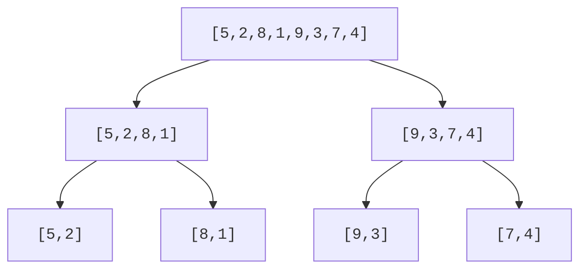
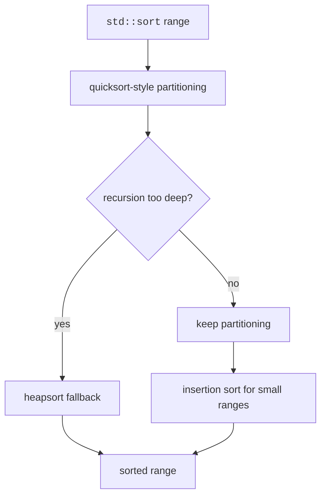

Efficient sorting algorithms reduce the cost from O(n^2) to O(n log n) for large inputs. They rely on divide and conquer, partitioning, and hybrid engineering.

<svg
  viewBox="0 0 640 210"
  role="img"
  aria-label="Two small sorted runs of bars flow down dotted paths and interleave into one fully sorted row below — merge sort combining sorted halves"
  style={{ display: "block", width: "100%", maxWidth: "640px", height: "auto", margin: "2.5rem auto" }}
>
  <g style={{ color: "var(--ds-blue-500)" }} fill="currentColor">
    <rect x="150" y="70" width="20" height="18" rx="5" />
    <rect x="176" y="58" width="20" height="30" rx="5" />
    <rect x="202" y="46" width="20" height="42" rx="5" />
    <rect x="228" y="34" width="20" height="54" rx="5" />
  </g>
  <g style={{ color: "var(--ds-yellow-500)" }} fill="currentColor">
    <rect x="360" y="74" width="20" height="14" rx="5" />
    <rect x="386" y="62" width="20" height="26" rx="5" />
    <rect x="412" y="50" width="20" height="38" rx="5" />
    <rect x="438" y="38" width="20" height="50" rx="5" />
  </g>
  <g fill="currentColor" opacity="0.3">
    <circle cx="212" cy="106" r="2.5" />
    <circle cx="230" cy="120" r="2.5" />
    <circle cx="248" cy="134" r="2.5" />
    <circle cx="428" cy="106" r="2.5" />
    <circle cx="410" cy="120" r="2.5" />
    <circle cx="392" cy="134" r="2.5" />
  </g>
  <rect x="200" y="185" width="240" height="4" rx="2" fill="currentColor" opacity="0.15" />
  <g style={{ color: "var(--ds-yellow-500)" }} fill="currentColor">
    <rect x="219" y="171" width="20" height="14" rx="5" />
    <rect x="271" y="159" width="20" height="26" rx="5" />
    <rect x="323" y="147" width="20" height="38" rx="5" />
    <rect x="375" y="135" width="20" height="50" rx="5" />
  </g>
  <g style={{ color: "var(--ds-blue-500)" }} fill="currentColor">
    <rect x="245" y="167" width="20" height="18" rx="5" />
    <rect x="297" y="155" width="20" height="30" rx="5" />
    <rect x="349" y="143" width="20" height="42" rx="5" />
    <rect x="401" y="131" width="20" height="54" rx="5" />
  </g>
</svg>

## Merge sort

Merge sort divides the array in half, recursively sorts each half, then merges the sorted halves. It guarantees O(n log n) time, uses O(n) extra memory, and is stable when merging prefers the left element on ties.

```text
mergeSort(a): if size <= 1 return; sort left; sort right; merge
```



<CodeBlock
  adapter="cpp"
  files={[
    {
      filename: "main.cpp",
      starterCode: `#include <iostream>
#include <vector>
void mergeRange(std::vector<int> &v, int left, int mid, int right) {
  std::vector<int> temp;
  int i = left, j = mid + 1;
  while (i <= mid && j <= right) {
    if (v[i] <= v[j])
      temp.push_back(v[i++]);
    else
      temp.push_back(v[j++]);
  }
  while (i <= mid)
    temp.push_back(v[i++]);
  while (j <= right)
    temp.push_back(v[j++]);
  for (int k = 0; k < static_cast<int>(temp.size()); k++)
    v[left + k] = temp[k];
}
void mergeSortRange(std::vector<int> &v, int left, int right) {
  if (left >= right)
    return;
  int mid = left + (right - left) / 2;
  mergeSortRange(v, left, mid);
  mergeSortRange(v, mid + 1, right);
  mergeRange(v, left, mid, right);
}
int main() {
  std::vector<int> v = {5, 2, 8, 1, 9, 3, 7, 4};
  mergeSortRange(v, 0, static_cast<int>(v.size()) - 1);
  for (int x : v)
    std::cout << x << "\\n";
  return 0;
}
`,
    },
  ]}
/>

## Quicksort

Quicksort chooses a pivot, partitions values around it, then recursively sorts both sides. It is in-place and O(n log n) on average, but O(n^2) in the worst case with bad pivots. This version uses Lomuto partition.

<CodeBlock
  adapter="cpp"
  files={[
    {
      filename: "main.cpp",
      starterCode: `#include <iostream>
#include <utility>
#include <vector>
int partition(std::vector<int> &v, int low, int high) {
  int pivot = v[high];
  int i = low;
  for (int j = low; j < high; j++) {
    if (v[j] <= pivot) {
      std::swap(v[i], v[j]);
      i++;
    }
  }
  std::swap(v[i], v[high]);
  return i;
}
void quickSort(std::vector<int> &v, int low, int high) {
  if (low >= high)
    return;
  int p = partition(v, low, high);
  quickSort(v, low, p - 1);
  quickSort(v, p + 1, high);
}
int main() {
  std::vector<int> v = {10, 7, 8, 9, 1, 5};
  quickSort(v, 0, static_cast<int>(v.size()) - 1);
  for (int x : v)
    std::cout << x << "\\n";
  return 0;
}
`,
    },
  ]}
/>

<Callout type="warn" title="Pivot strategy matters">
Naive quicksort can degrade to O(n^2). Random pivots and median-of-three pivots reduce the chance of consistently bad partitions.
</Callout>

## `std::sort`

Prefer `std::sort` unless you specifically need stability. It is an introsort-style hybrid: quicksort for speed, heapsort fallback to avoid quadratic worst cases, and insertion sort for tiny ranges.



<CodeBlock
  adapter="cpp"
  files={[
    {
      filename: "main.cpp",
      starterCode: `#include <algorithm>
#include <iostream>
#include <vector>
int main() {
  std::vector<int> v = {4, 1, 7, 3, 9, 2};
  std::sort(v.begin(), v.end());
  for (int x : v)
    std::cout << x << "\\n";
  return 0;
}
`,
    },
  ]}
/>

## `std::stable_sort` and comparators

Use `std::stable_sort` when equal keys must keep their original relative order. A comparator returns `true` when the first argument should come before the second.

<CodeBlock
  adapter="cpp"
  files={[
    {
      filename: "main.cpp",
      starterCode: `#include <algorithm>
#include <iostream>
#include <string>
#include <vector>
struct Record {
  std::string name;
  int group;
};
int main() {
  std::vector<Record> rows = {{"alice", 2}, {"bob", 1}, {"cara", 2}};
  std::stable_sort(
      rows.begin(), rows.end(),
      [](const Record &a, const Record &b) { return a.group < b.group; });
  for (const Record &r : rows)
    std::cout << r.group << ":" << r.name << "\\n";
  return 0;
}
`,
    },
  ]}
/>

Sorting `std::pair` values by their second field is a common lambda example.

<CodeBlock
  adapter="cpp"
  files={[
    {
      filename: "main.cpp",
      starterCode: `#include <algorithm>
#include <iostream>
#include <string>
#include <utility>
#include <vector>
int main() {
  std::vector<std::pair<std::string, int>> scores = {
      {"apple", 3}, {"banana", 1}, {"cherry", 2}, {"date", 5}};
  std::sort(scores.begin(), scores.end(),
            [](const auto &a, const auto &b) { return a.second > b.second; });
  for (const auto &item : scores)
    std::cout << item.first << "=" << item.second << "\\n";
  return 0;
}
`,
    },
  ]}
/>

## Practice: implement merge sort

<ChallengeCard
  adapter="cpp"
  title="Implement merge sort"
  instructions={`Implement \`void mergeSort(std::vector<int>& v)\`. The driver sorts \`{5,2,8,1,9,3,7,4}\` and prints each value on its own line.`}
  files={[
    {
      filename: "main.cpp",
      starterCode: `#include <iostream>
#include <vector>
void mergeSort(std::vector<int> &v) {
  // your code here
}
int main() {
  std::vector<int> v = {5, 2, 8, 1, 9, 3, 7, 4};
  mergeSort(v);
  for (int x : v)
    std::cout << x << "\\n";
  return 0;
}
`,
      solutionCode: `#include <iostream>
#include <vector>
void mergeRange(std::vector<int> &v, std::vector<int> &temp, int left, int mid,
                int right) {
  int i = left, j = mid + 1, k = left;
  while (i <= mid && j <= right) {
    if (v[i] <= v[j])
      temp[k++] = v[i++];
    else
      temp[k++] = v[j++];
  }
  while (i <= mid)
    temp[k++] = v[i++];
  while (j <= right)
    temp[k++] = v[j++];
  for (int p = left; p <= right; p++)
    v[p] = temp[p];
}
void mergeSortRange(std::vector<int> &v, std::vector<int> &temp, int left,
                    int right) {
  if (left >= right)
    return;
  int mid = left + (right - left) / 2;
  mergeSortRange(v, temp, left, mid);
  mergeSortRange(v, temp, mid + 1, right);
  mergeRange(v, temp, left, mid, right);
}
void mergeSort(std::vector<int> &v) {
  if (v.empty())
    return;
  std::vector<int> temp(v.size());
  mergeSortRange(v, temp, 0, static_cast<int>(v.size()) - 1);
}
int main() {
  std::vector<int> v = {5, 2, 8, 1, 9, 3, 7, 4};
  mergeSort(v);
  for (int x : v)
    std::cout << x << "\\n";
  return 0;
}
`,
    },
  ]}
  tests={[{ id: "merge_sorted", name: "Sorts values ascending", expect: { stdoutLines: ["1", "2", "3", "4", "5", "7", "8", "9"], stdoutLinesExact: true } }]}
/>

## Practice: sort pairs by score

<ChallengeCard
  adapter="cpp"
  title="Sort vector of pairs by second value descending"
  instructions={`Sort the given \`std::vector<std::pair<std::string,int>>\` by the integer value in descending order, then print each pair as \`name=value\`.`}
  files={[
    {
      filename: "main.cpp",
      starterCode: `#include <algorithm>
#include <iostream>
#include <string>
#include <utility>
#include <vector>
int main() {
  std::vector<std::pair<std::string, int>> items = {
      {"apple", 3}, {"banana", 1}, {"cherry", 2}, {"date", 5}};
  // your code here
  return 0;
}
`,
      solutionCode: `#include <algorithm>
#include <iostream>
#include <string>
#include <utility>
#include <vector>
int main() {
  std::vector<std::pair<std::string, int>> items = {
      {"apple", 3}, {"banana", 1}, {"cherry", 2}, {"date", 5}};
  std::sort(items.begin(), items.end(),
            [](const auto &a, const auto &b) { return a.second > b.second; });
  for (const auto &item : items)
    std::cout << item.first << "=" << item.second << "\\n";
  return 0;
}
`,
    },
  ]}
  tests={[{ id: "pairs_descending", name: "Sorts pairs by value descending", expect: { stdoutLines: ["date=5", "apple=3", "cherry=2", "banana=1"], stdoutLinesExact: true } }]}
/>

## Check your understanding

<MultipleChoice
  markdown={`Which statement best compares merge sort and naive quicksort worst-case time?

- Merge sort can be O(n^2), while quicksort is always O(n log n).
  > This reverses the usual guarantee.
- [o] Merge sort guarantees O(n log n), while naive quicksort can be O(n^2).
  > Bad pivots make partitions unbalanced.
- Both are always O(n^2).
  > Both are designed to be faster than quadratic on typical inputs.
- Both require O(n) extra arrays in standard forms.
  > Merge sort usually does; quicksort is commonly in-place aside from recursion stack.`}
/>

<MultipleChoice
  markdown={`What strategy does \`std::sort\` commonly use in modern C++ implementations?

- Pure bubble sort
  > Bubble sort is too slow for a library sort.
- Pure merge sort only
  > Merge-sort-like algorithms are more associated with stable sorting.
- [o] Introsort: quicksort-style partitioning with safeguards and small-range optimizations
  > It combines speed with fallback protection.
- Linear search followed by insertion
  > Searching alone does not sort a range.`}
/>

<MultipleChoice
  markdown={`When does sort stability matter most?

- When all elements are distinct integers.
  > If no elements compare equal, equal-order is irrelevant.
- When sorting descending instead of ascending.
  > Direction does not determine stability.
- [o] When equal keys should preserve their previous relative order.
  > This is common with records and multiple fields.
- When the vector is stored contiguously.
  > Contiguous storage is unrelated to stability.`}
/>
