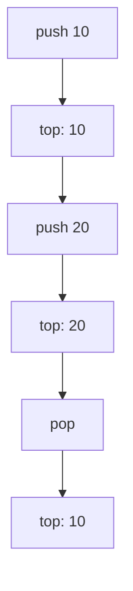
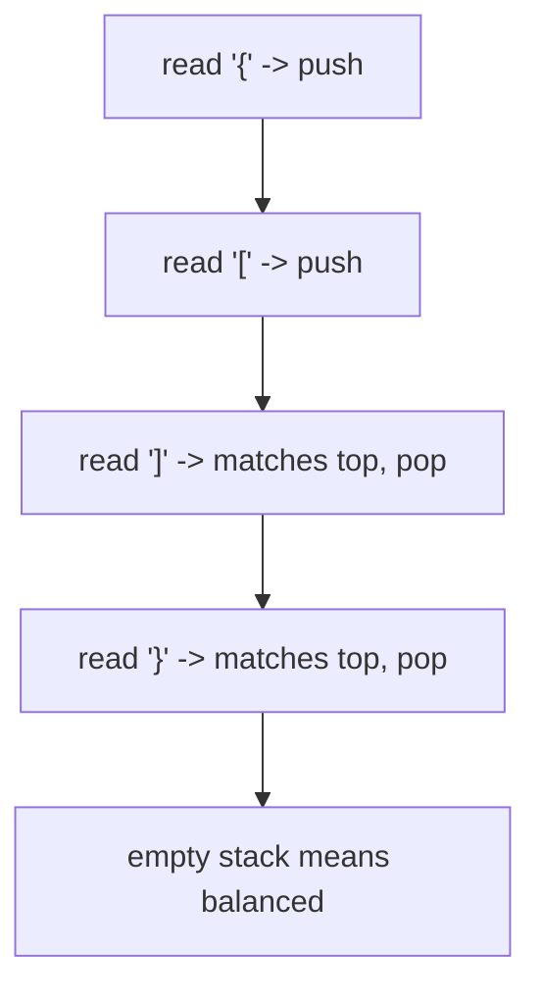
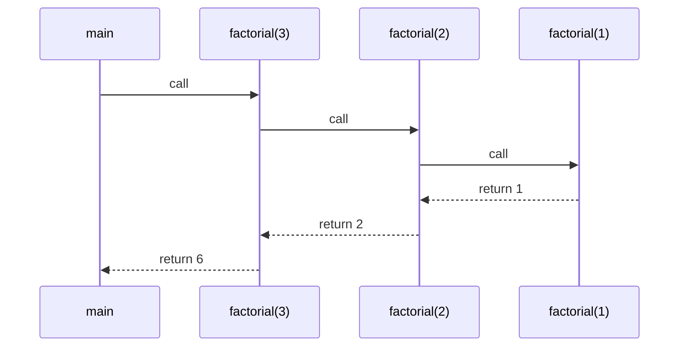

A stack is a **last in, first out** data structure: the most recently pushed item is the first one popped. Think of plates in a cafeteria tray stack or browser pages in a back-button history.

## The stack ADT

The abstract operations are small:

| Operation | Meaning |
| --- | --- |
| `push(x)` | Add `x` to the top |
| `pop()` | Remove the top item |
| `top()` | Read the top item |
| `empty()` | Check whether the stack has no items |

## `std::stack<T>`

`std::stack` is a container adapter. By default, it uses `std::deque` underneath and exposes only stack operations.

<CodeBlock
  adapter="cpp"
  initialCode={`#include <iostream>
#include <stack>

int main() {
    std::stack<int> tasks;
    tasks.push(10);
    tasks.push(20);
    tasks.push(30);

    while (!tasks.empty()) {
        std::cout << tasks.top() << "\\n";
        tasks.pop();
    }
    return 0;
}
`}
/>

`top()` is only valid when the stack is not empty.

## Implement a stack with `std::vector`

A vector already has the right back operations: `push_back`, `back`, and `pop_back` are efficient.

<CodeBlock
  adapter="cpp"
  initialCode={`#include <iostream>
#include <vector>

class IntStack {
    std::vector<int> data;

public:
    void push(int value) {
        data.push_back(value);
    }

    void pop() {
        data.pop_back();
    }

    int top() const {
        return data.back();
    }

    bool empty() const {
        return data.empty();
    }
};

int main() {
    IntStack st;
    st.push(5);
    st.push(8);
    std::cout << st.top() << "\\n";
    st.pop();
    std::cout << st.top() << "\\n";
    return 0;
}
`}
/>

<Callout type="success" title="Stack operation costs">
For `std::stack` backed by `std::deque`, `push`, `pop`, `top`, and `empty` are O(1). A vector-backed stack also gives amortized O(1) `push`.
</Callout>

## Balanced parentheses

A stack is perfect when recent history matters. For parentheses, push opening brackets; when a closing bracket appears, the top must be the matching opener.

<CodeBlock
  adapter="cpp"
  initialCode={`#include <iostream>
#include <stack>
#include <string>

bool matches(char open, char close) {
    return (open == '(' && close == ')') ||
           (open == '[' && close == ']') ||
           (open == '{' && close == '}');
}

int main() {
    std::string s = "{[()]}";
    std::stack<char> opens;
    bool ok = true;
    for (char c : s) {
        if (c == '(' || c == '[' || c == '{') opens.push(c);
        else if (c == ')' || c == ']' || c == '}') {
            if (opens.empty() || !matches(opens.top(), c)) {
                ok = false;
                break;
            }
            opens.pop();
        }
    }
    std::cout << (ok && opens.empty() ? "balanced" : "not balanced") << "\\n";
    return 0;
}
`}
/>

## Reversing a sequence

Pushing items and popping them reverses their order.

<CodeBlock
  adapter="cpp"
  initialCode={`#include <iostream>
#include <stack>
#include <string>

int main() {
    std::string input = "desserts";
    std::stack<char> chars;
    for (char c : input) chars.push(c);

    std::string reversed;
    while (!chars.empty()) {
        reversed += chars.top();
        chars.pop();
    }
    std::cout << reversed << "\\n";
    return 0;
}
`}
/>

## Function call stack

Every function call needs a place to remember local variables and where to return. Recursive calls naturally form a stack.

<CodeBlock
  adapter="cpp"
  initialCode={`#include <iostream>

int factorial(int n) {
    if (n <= 1) return 1;
    return n * factorial(n - 1);
}

int main() {
    std::cout << factorial(5) << "\\n";
    return 0;
}
`}
/>

## Expression evaluation

Many parsers use stacks for operators and operands. You will see this idea again with monotonic stacks, expression parsing, and depth-first search.

<CodeBlock
  adapter="cpp"
  initialCode={`#include <iostream>
#include <stack>
#include <string>

int main() {
    std::string postfix = "23+4*";
    std::stack<int> values;
    for (char c : postfix) {
        if (c >= '0' && c <= '9') values.push(c - '0');
        else {
            int b = values.top(); values.pop();
            int a = values.top(); values.pop();
            values.push(c == '+' ? a + b : a * b);
        }
    }
    std::cout << values.top() << "\\n";
    return 0;
}
`}
/>

<Callout type="info" title="Adapters limit the interface">
`std::stack` intentionally hides iteration and random access. If you need those, use the underlying container directly, such as `std::vector` or `std::deque`.
</Callout>

## Practice: balanced parentheses

<ChallengeCard
  adapter="cpp"
  title="Balanced parentheses"
  instructions={`Implement \`isBalanced\` for \`() [] {}\`. The driver prints \`true\` or \`false\` for a test string.`}
  initialCode={`#include <iostream>
#include <stack>
#include <string>

bool isBalanced(const std::string& s) {
    // your code here
}

int main() {
    std::string test = "{[()()]()}";
    std::cout << (isBalanced(test) ? "true" : "false") << "\\n";
    return 0;
}
`}
  solutionCode={`#include <iostream>
#include <stack>
#include <string>

bool matches(char open, char close) {
    return (open == '(' && close == ')') ||
           (open == '[' && close == ']') ||
           (open == '{' && close == '}');
}

bool isBalanced(const std::string& s) {
    std::stack<char> opens;
    for (char c : s) {
        if (c == '(' || c == '[' || c == '{') {
            opens.push(c);
        } else if (c == ')' || c == ']' || c == '}') {
            if (opens.empty() || !matches(opens.top(), c)) return false;
            opens.pop();
        }
    }
    return opens.empty();
}

int main() {
    std::string test = "{[()()]()}";
    std::cout << (isBalanced(test) ? "true" : "false") << "\\n";
    return 0;
}
`}
  tests={[{ id: "balanced", name: "Recognizes balanced brackets", expect: { stdoutEquals: "true" } }]}
/>

## Practice: reverse with a stack

<ChallengeCard
  adapter="cpp"
  title="Reverse a string using a stack"
  instructions={`Push each character into a stack, then pop characters into the output string. The driver prints the reversed string.`}
  initialCode={`#include <iostream>
#include <stack>
#include <string>

std::string reverseWithStack(const std::string& s) {
    // your code here
}

int main() {
    std::string text = "stressed";
    std::cout << reverseWithStack(text) << "\\n";
    return 0;
}
`}
  solutionCode={`#include <iostream>
#include <stack>
#include <string>

std::string reverseWithStack(const std::string& s) {
    std::stack<char> chars;
    for (char c : s) chars.push(c);
    std::string out;
    while (!chars.empty()) {
        out += chars.top();
        chars.pop();
    }
    return out;
}

int main() {
    std::string text = "stressed";
    std::cout << reverseWithStack(text) << "\\n";
    return 0;
}
`}
  tests={[{ id: "reverse_stack", name: "Reverses string", expect: { stdoutEquals: "desserts" } }]}
/>

## Check your understanding

<MultipleChoice
  markdown={`What does LIFO mean?

- Lowest input, first output
  > LIFO is about insertion order, not numeric value.
- [o] Last in, first out
  > The newest pushed element is removed first.
- Linear index, fast offset
  > That is not a stack term.
- Linked item, fixed order
  > A stack can be implemented with different containers.`}
/>

<MultipleChoice
  markdown={`What is the usual time complexity of \`push\` and \`pop\` on \`std::stack\`?

- [o] O(1)
  > Correct for the default deque-backed stack.
- O(log n)
  > No tree operation is required.
- O(n)
  > Stack operations touch only one end.
- O(n^2)
  > That would be far too expensive for a stack adapter.`}
/>

<MultipleChoice
  markdown={`Why is \`std::deque\` a good default underlying container for \`std::stack\`?

- [o] It supports efficient insertion and removal at the back without requiring contiguous reallocation like a vector.
  > It gives stable, efficient end operations.
- It sorts stack values automatically.
  > A stack preserves LIFO order; it does not sort.
- It makes \`top\` O(n).
  > \`top\` remains constant time.
- It forbids storing characters.
  > A deque can store many element types.`}
/>
