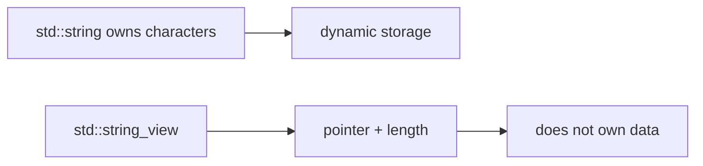

`std::string` is the C++ text container you will use constantly. Think of it as a dynamic array of characters with extra operations for concatenation, search, comparison, and slicing.

## Creating and reading strings

A string owns its characters and tracks its length. Like `std::vector`, indexing is O(1), and the string can grow as needed.

<CodeBlock
  adapter="cpp"
  initialCode={`#include <iostream>
#include <string>

int main() {
    std::string language = "C++";
    std::string topic("strings");
    std::cout << language << " " << topic << "\\n";
    std::cout << "length: " << topic.length() << "\\n";
    std::cout << "first char: " << topic[0] << "\\n";
    return 0;
}
`}
/>

Use `.size()` or `.length()`; they mean the same thing for `std::string`.

## Iterating over characters

Characters are values of type `char`. You can iterate by index when you need positions, or by range-for when you only need each character.

<CodeBlock
  adapter="cpp"
  initialCode={`#include <iostream>
#include <string>

int main() {
    std::string word = "algorithm";
    for (std::size_t i = 0; i < word.size(); ++i) {
        std::cout << i << ":" << word[i] << "\\n";
    }

    int vowels = 0;
    for (char c : word) {
        if (c == 'a' || c == 'e' || c == 'i' || c == 'o' || c == 'u') {
            ++vowels;
        }
    }
    std::cout << "vowels: " << vowels << "\\n";
    return 0;
}
`}
/>

## Common operations

`find` returns the index of a match, or `std::string::npos` when no match exists. `substr(pos, count)` copies a substring. `replace` modifies a range.

<CodeBlock
  adapter="cpp"
  initialCode={`#include <iostream>
#include <string>

int main() {
    std::string text = "data structures and algorithms";
    std::size_t pos = text.find("structures");
    if (pos != std::string::npos) {
        std::cout << "found at " << pos << "\\n";
    }

    std::string first = text.substr(0, 4);
    std::string changed = text;
    changed.replace(5, 10, "types");

    std::cout << first << "\\n";
    std::cout << changed << "\\n";
    std::cout << text.compare(changed) << "\\n";
    return 0;
}
`}
/>

## Concatenation

`+` creates a new string. `+=` appends to an existing string and is often better inside loops.

<CodeBlock
  adapter="cpp"
  initialCode={`#include <iostream>
#include <string>
#include <vector>

int main() {
    std::vector<std::string> parts = {"binary", "search", "tree"};
    std::string label;
    for (const std::string& part : parts) {
        if (!label.empty()) label += "-";
        label += part;
    }
    std::cout << label << "\\n";
    return 0;
}
`}
/>

## C-strings and conversion

A C-string is a null-terminated character array usually represented as `const char*`. C++ string literals can initialize `std::string`, and `.c_str()` gives a pointer view for APIs that need C-style strings.

<CodeBlock
  adapter="cpp"
  initialCode={`#include <cstring>
#include <iostream>
#include <string>

int main() {
    const char* raw = "hello";
    std::string owned = raw;
    const char* back_to_c = owned.c_str();

    std::cout << owned << "\\n";
    std::cout << std::strlen(back_to_c) << "\\n";
    return 0;
}
`}
/>

<Callout type="warn" title="Do not store dangling C-string pointers">
A pointer returned by `.c_str()` is only valid while the string object is alive and not modified in a way that reallocates its storage.
</Callout>

## `std::string_view`

`std::string_view` is a non-owning view into characters. It is great for read-only function parameters when you want to accept `std::string`, string literals, and slices without copying.

<CodeBlock
  adapter="cpp"
  initialCode={`#include <iostream>
#include <string>
#include <string_view>

bool starts_with(std::string_view text, std::string_view prefix) {
    return text.size() >= prefix.size() && text.substr(0, prefix.size()) == prefix;
}

int main() {
    std::string name = "queue";
    std::cout << starts_with(name, "qu") << "\\n";
    std::cout << starts_with("stack", "qu") << "\\n";
    return 0;
}
`}
/>

## Splitting by a delimiter

A simple split helper repeatedly calls `find` and `substr`. This is a useful pattern for parsing CSV-like toy inputs and interview strings.

<CodeBlock
  adapter="cpp"
  initialCode={`#include <iostream>
#include <string>
#include <vector>

std::vector<std::string> split(const std::string& text, char delimiter) {
    std::vector<std::string> parts;
    std::size_t start = 0;
    while (true) {
        std::size_t pos = text.find(delimiter, start);
        if (pos == std::string::npos) {
            parts.push_back(text.substr(start));
            break;
        }
        parts.push_back(text.substr(start, pos - start));
        start = pos + 1;
    }
    return parts;
}

int main() {
    for (const std::string& part : split("red,green,blue", ',')) {
        std::cout << part << "\\n";
    }
    return 0;
}
`}
/>

## Reversing and palindrome checks

A two-pointer scan can compare the first and last characters, then move inward.

<CodeBlock
  adapter="cpp"
  initialCode={`#include <iostream>
#include <string>

bool isPalindrome(const std::string& s) {
    std::size_t left = 0;
    std::size_t right = s.empty() ? 0 : s.size() - 1;
    while (left < right) {
        if (s[left] != s[right]) return false;
        ++left;
        --right;
    }
    return true;
}

int main() {
    std::string word = "level";
    std::cout << isPalindrome(word) << "\\n";
    return 0;
}
`}
/>

<Callout type="info" title="String is dynamic">
Like `std::vector<char>`, `std::string` can reallocate when it grows. Prefer appending with `+=` when building text gradually.
</Callout>

## Practice: palindrome function

<ChallengeCard
  adapter="cpp"
  title="isPalindrome(const std::string& s)"
  instructions={`Implement \`isPalindrome\` using a two-pointer scan. The driver prints \`true\` or \`false\` for a hardcoded test string.`}
  initialCode={`#include <iostream>
#include <string>

bool isPalindrome(const std::string& s) {
    // your code here
}

int main() {
    std::string test = "racecar";
    std::cout << (isPalindrome(test) ? "true" : "false") << "\\n";
    return 0;
}
`}
  solutionCode={`#include <iostream>
#include <string>

bool isPalindrome(const std::string& s) {
    std::size_t left = 0;
    std::size_t right = s.empty() ? 0 : s.size() - 1;
    while (left < right) {
        if (s[left] != s[right]) return false;
        ++left;
        --right;
    }
    return true;
}

int main() {
    std::string test = "racecar";
    std::cout << (isPalindrome(test) ? "true" : "false") << "\\n";
    return 0;
}
`}
  tests={[{ id: "palindrome", name: "Detects a palindrome", expect: { stdoutEquals: "true" } }]}
/>

## Practice: count vowels

<ChallengeCard
  adapter="cpp"
  title="countVowels(const std::string& s)"
  instructions={`Implement \`countVowels\` for lowercase vowels \`a/e/i/o/u\`. The driver prints the count for a hardcoded string.`}
  initialCode={`#include <iostream>
#include <string>

int countVowels(const std::string& s) {
    // your code here
}

int main() {
    std::string text = "data structures";
    std::cout << countVowels(text) << "\\n";
    return 0;
}
`}
  solutionCode={`#include <iostream>
#include <string>

int countVowels(const std::string& s) {
    int count = 0;
    for (char c : s) {
        if (c == 'a' || c == 'e' || c == 'i' || c == 'o' || c == 'u') {
            ++count;
        }
    }
    return count;
}

int main() {
    std::string text = "data structures";
    std::cout << countVowels(text) << "\\n";
    return 0;
}
`}
  tests={[{ id: "vowels", name: "Counts lowercase vowels", expect: { stdoutEquals: "5" } }]}
/>

## Check your understanding

<MultipleChoice
  markdown={`What is the time complexity of indexing a valid position in a \`std::string\` with \`s[i]\`?

- [o] O(1)
  > Correct. A string stores characters contiguously and computes the address directly.
- O(log n)
  > There is no tree search involved.
- O(n)
  > Linear scans are used for operations like searching, not direct indexing.
- O(n log n)
  > Sorting-like complexity is not involved.`}
/>

<MultipleChoice
  markdown={`Why might a function take \`std::string_view\` instead of \`const std::string&\`?

- [o] It can accept strings, literals, and slices without owning or copying the characters.
  > Correct. A view is just a pointer and a length.
- It always extends the lifetime of temporary character data.
  > It does not own data, so lifetime must still be valid.
- It allows mutation of the original string.
  > A plain string_view is read-only access to characters.
- It stores characters more compactly than char.
  > It does not store the characters at all.`}
/>

<MultipleChoice
  markdown={`What does \`s.substr(pos, count)\` return for a \`std::string s\`?

- A pointer into the original string that can mutate it.
  > \`substr\` returns a string object, not a mutable pointer.
- [o] A new string containing up to \`count\` characters starting at \`pos\`.
  > Correct. The result owns its copied characters.
- The number of characters after \`pos\`.
  > That would be a length calculation, not \`substr\`.
- A boolean indicating whether the substring exists.
  > Search functions such as \`find\` are used for that.`}
/>
