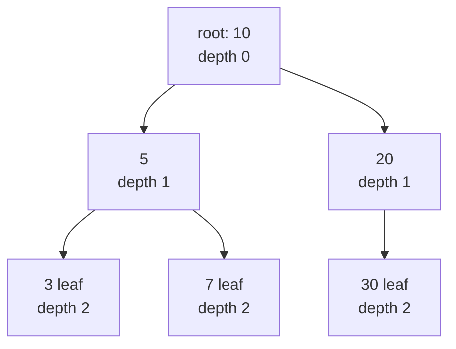
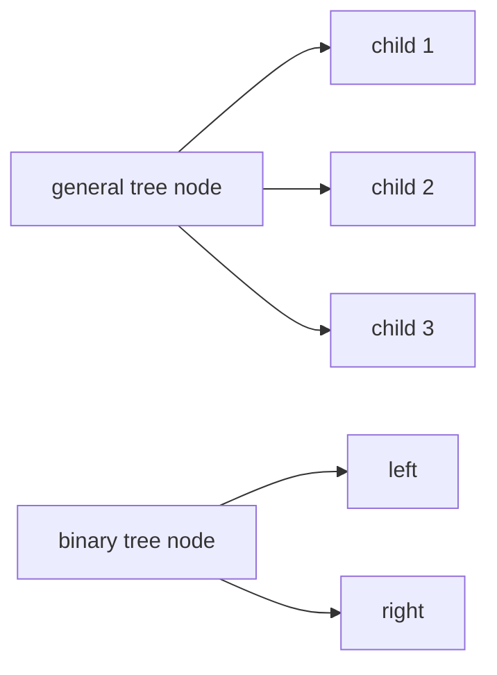
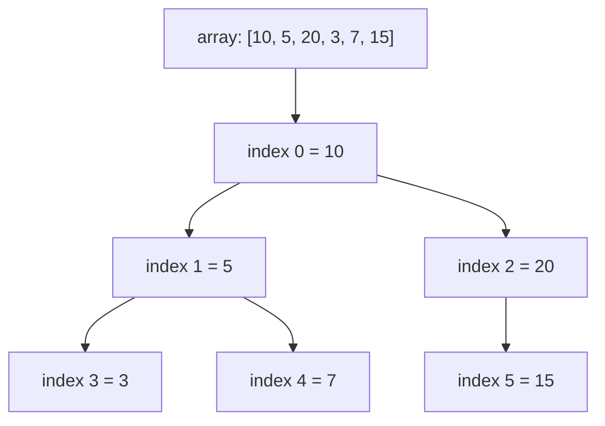
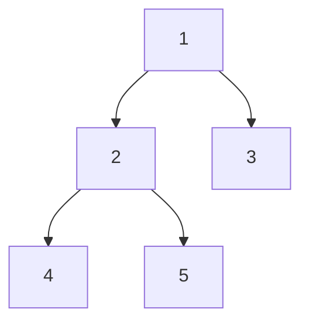

A tree is a connected acyclic graph. In a rooted tree, one node is the root, every non-root node has a parent, and edges lead from parent to child.

## Tree vocabulary

* The **root** is the top node.
* A **leaf** has no children.
* **Depth** counts edges from the root to a node.
* **Height** measures the longest downward path. Many coding problems define maximum depth as a number of nodes.
* A **level** contains all nodes at the same depth.

<CodeBlock
  adapter="cpp"
  files={[
    {
      filename: "main.cpp",
      starterCode: `#include <iostream>

struct TreeNode {
  int val;
  TreeNode *left;
  TreeNode *right;
};

int main() {
  TreeNode left{5, nullptr, nullptr};
  TreeNode right{20, nullptr, nullptr};
  TreeNode root{10, &left, &right};
  std::cout << root.val << " has children " << root.left->val << " and "
            << root.right->val << "\\n";
  return 0;
}
`,
    },
  ]}
/>

## General trees vs binary trees

A general tree node can have any number of children. A binary tree node has at most two children, usually called `left` and `right`.

<CodeBlock
  adapter="cpp"
  files={[
    {
      filename: "main.cpp",
      starterCode: `#include <iostream>
#include <vector>

struct GeneralNode {
  int val;
  std::vector<GeneralNode *> children;
};

int main() {
  GeneralNode a{1, {}};
  GeneralNode b{2, {}};
  GeneralNode c{3, {}};
  a.children = {&b, &c};
  std::cout << a.children.size() << " children\\n";
  return 0;
}
`,
    },
  ]}
/>

## Binary tree representations

A linked representation is flexible and works well for sparse trees.

<CodeBlock
  adapter="cpp"
  files={[
    {
      filename: "main.cpp",
      starterCode: `#include <iostream>

struct TreeNode {
  int val;
  TreeNode *left;
  TreeNode *right;
};

int main() {
  TreeNode n3{3, nullptr, nullptr};
  TreeNode n2{2, nullptr, nullptr};
  TreeNode n1{1, &n2, &n3};
  std::cout << n1.left->val << " " << n1.right->val << "\\n";
  return 0;
}
`,
    },
  ]}
/>

Complete binary trees are often stored in arrays. For index `i`, the left child is `2*i + 1`, the right child is `2*i + 2`, and the parent is `(i - 1) / 2`.

<CodeBlock
  adapter="cpp"
  files={[
    {
      filename: "main.cpp",
      starterCode: `#include <iostream>
#include <vector>

int main() {
  std::vector<int> tree = {10, 5, 20, 3, 7, 15};
  for (int i = 0; i < static_cast<int>(tree.size()); i++) {
    int left = 2 * i + 1;
    int right = 2 * i + 2;
    std::cout << tree[i] << ":";
    if (left < static_cast<int>(tree.size()))
      std::cout << " L=" << tree[left];
    if (right < static_cast<int>(tree.size()))
      std::cout << " R=" << tree[right];
    std::cout << "\\n";
  }
  return 0;
}
`,
    },
  ]}
/>

<Callout type="info" title="Arrays are best for complete trees">
The array formulas are perfect for heaps. Sparse trees waste many array positions, so linked nodes are usually better there.
</Callout>

## Depth-first traversals

Pre-order visits root, left, right. In-order visits left, root, right. Post-order visits left, right, root.

For this tree:

* Pre-order: `1 2 4 5 3`
* In-order: `4 2 5 1 3`
* Post-order: `4 5 2 3 1`

<CodeBlock
  adapter="cpp"
  files={[
    {
      filename: "main.cpp",
      starterCode: `#include <iostream>

struct TreeNode {
  int val;
  TreeNode *left;
  TreeNode *right;
};

void preorder(TreeNode *root) {
  if (!root)
    return;
  std::cout << root->val << " ";
  preorder(root->left);
  preorder(root->right);
}

void inorder(TreeNode *root) {
  if (!root)
    return;
  inorder(root->left);
  std::cout << root->val << " ";
  inorder(root->right);
}

void postorder(TreeNode *root) {
  if (!root)
    return;
  postorder(root->left);
  postorder(root->right);
  std::cout << root->val << " ";
}

int main() {
  TreeNode n4{4, nullptr, nullptr}, n5{5, nullptr, nullptr},
      n3{3, nullptr, nullptr};
  TreeNode n2{2, &n4, &n5};
  TreeNode n1{1, &n2, &n3};
  preorder(&n1);
  std::cout << "\\n";
  inorder(&n1);
  std::cout << "\\n";
  postorder(&n1);
  std::cout << "\\n";
  return 0;
}
`,
    },
  ]}
/>

The three depth-first orders differ only in when the root is visited relative to its subtrees:

| Traversal | Visit order |
| --- | --- |
| Pre-order | root → left → right |
| In-order | left → root → right |
| Post-order | left → right → root |

## Level-order traversal

Level-order is breadth-first search. A queue processes nodes one level at a time.

<CodeBlock
  adapter="cpp"
  files={[
    {
      filename: "main.cpp",
      starterCode: `#include <iostream>
#include <queue>

struct TreeNode {
  int val;
  TreeNode *left;
  TreeNode *right;
};

void levelOrder(TreeNode *root) {
  if (!root)
    return;
  std::queue<TreeNode *> q;
  q.push(root);
  while (!q.empty()) {
    TreeNode *node = q.front();
    q.pop();
    std::cout << node->val << "\\n";
    if (node->left)
      q.push(node->left);
    if (node->right)
      q.push(node->right);
  }
}

int main() {
  TreeNode n2{2, nullptr, nullptr}, n3{3, nullptr, nullptr}, n1{1, &n2, &n3};
  levelOrder(&n1);
  return 0;
}
`,
    },
  ]}
/>

## Iterative in-order traversal

The recursion stack can be simulated with `std::stack`.

<CodeBlock
  adapter="cpp"
  files={[
    {
      filename: "main.cpp",
      starterCode: `#include <iostream>
#include <stack>

struct TreeNode {
  int val;
  TreeNode *left;
  TreeNode *right;
};

void iterativeInorder(TreeNode *root) {
  std::stack<TreeNode *> st;
  TreeNode *cur = root;
  while (cur || !st.empty()) {
    while (cur) {
      st.push(cur);
      cur = cur->left;
    }
    cur = st.top();
    st.pop();
    std::cout << cur->val << "\\n";
    cur = cur->right;
  }
}

int main() {
  TreeNode n1{1, nullptr, nullptr}, n3{3, nullptr, nullptr}, n2{2, &n1, &n3};
  iterativeInorder(&n2);
  return 0;
}
`,
    },
  ]}
/>

## Calculating tree properties

Most tree properties are naturally recursive: solve the left subtree, solve the right subtree, then combine the answers.

<CodeBlock
  adapter="cpp"
  files={[
    {
      filename: "main.cpp",
      starterCode: `#include <algorithm>
#include <climits>
#include <cstdlib>
#include <iostream>

struct TreeNode {
  int val;
  TreeNode *left;
  TreeNode *right;
};

int height(TreeNode *root) {
  if (!root)
    return 0;
  return 1 + std::max(height(root->left), height(root->right));
}

int countNodes(TreeNode *root) {
  if (!root)
    return 0;
  return 1 + countNodes(root->left) + countNodes(root->right);
}

int maxValue(TreeNode *root) {
  if (!root)
    return INT_MIN;
  return std::max({root->val, maxValue(root->left), maxValue(root->right)});
}

int checkHeight(TreeNode *root) {
  if (!root)
    return 0;
  int left = checkHeight(root->left);
  int right = checkHeight(root->right);
  if (left == -1 || right == -1 || std::abs(left - right) > 1)
    return -1;
  return 1 + std::max(left, right);
}

bool isBalanced(TreeNode *root) { return checkHeight(root) != -1; }

int main() {
  TreeNode n4{4, nullptr, nullptr}, n5{5, nullptr, nullptr}, n2{2, &n4, &n5},
      n3{3, nullptr, nullptr}, n1{1, &n2, &n3};
  std::cout << height(&n1) << "\\n";
  std::cout << countNodes(&n1) << "\\n";
  std::cout << maxValue(&n1) << "\\n";
  std::cout << std::boolalpha << isBalanced(&n1) << "\\n";
  return 0;
}
`,
    },
  ]}
/>

## Practice: Sum of all node values

<ChallengeCard
  adapter="cpp"
  title="Sum of all node values"
  instructions={`Implement \`int sumTree(TreeNode* root)\`. The driver builds a binary tree and prints the sum of all values.`}
  files={[
    {
      filename: "main.cpp",
      starterCode: `#include <iostream>

struct TreeNode {
  int val;
  TreeNode *left;
  TreeNode *right;
};

int sumTree(TreeNode *root) {
  // your code here
  return 0;
}

int main() {
  TreeNode n4{4, nullptr, nullptr}, n5{5, nullptr, nullptr};
  TreeNode n2{2, &n4, &n5}, n3{3, nullptr, nullptr}, n1{1, &n2, &n3};
  std::cout << sumTree(&n1) << "\\n";
  return 0;
}
`,
      solutionCode: `#include <iostream>

struct TreeNode {
  int val;
  TreeNode *left;
  TreeNode *right;
};

int sumTree(TreeNode *root) {
  if (!root)
    return 0;
  return root->val + sumTree(root->left) + sumTree(root->right);
}

int main() {
  TreeNode n4{4, nullptr, nullptr}, n5{5, nullptr, nullptr};
  TreeNode n2{2, &n4, &n5}, n3{3, nullptr, nullptr}, n1{1, &n2, &n3};
  std::cout << sumTree(&n1) << "\\n";
  return 0;
}
`,
    },
  ]}
  tests={[{ id: "sum", name: "Computes tree sum", expect: { stdoutEquals: "15" } }]}
/>

## Practice: Maximum depth of binary tree

<ChallengeCard
  adapter="cpp"
  title="Maximum depth of binary tree"
  instructions={`Implement \`int maxDepth(TreeNode* root)\`. Count nodes on the longest root-to-leaf path.`}
  files={[
    {
      filename: "main.cpp",
      starterCode: `#include <algorithm>
#include <iostream>

struct TreeNode {
  int val;
  TreeNode *left;
  TreeNode *right;
};

int maxDepth(TreeNode *root) {
  // your code here
  return 0;
}

int main() {
  TreeNode n7{7, nullptr, nullptr}, n4{4, &n7, nullptr};
  TreeNode n2{2, &n4, nullptr}, n3{3, nullptr, nullptr}, n1{1, &n2, &n3};
  std::cout << maxDepth(&n1) << "\\n";
  return 0;
}
`,
      solutionCode: `#include <algorithm>
#include <iostream>

struct TreeNode {
  int val;
  TreeNode *left;
  TreeNode *right;
};

int maxDepth(TreeNode *root) {
  if (!root)
    return 0;
  return 1 + std::max(maxDepth(root->left), maxDepth(root->right));
}

int main() {
  TreeNode n7{7, nullptr, nullptr}, n4{4, &n7, nullptr};
  TreeNode n2{2, &n4, nullptr}, n3{3, nullptr, nullptr}, n1{1, &n2, &n3};
  std::cout << maxDepth(&n1) << "\\n";
  return 0;
}
`,
    },
  ]}
  tests={[{ id: "depth", name: "Finds max depth", expect: { stdoutEquals: "4" } }]}
/>

## Practice: Level-order traversal

<ChallengeCard
  adapter="cpp"
  title="Level-order traversal"
  instructions={`Return the tree values grouped by level as \`std::vector<std::vector<int>>\`. The driver prints each level on its own line.`}
  files={[
    {
      filename: "main.cpp",
      starterCode: `#include <iostream>
#include <queue>
#include <vector>

struct TreeNode {
  int val;
  TreeNode *left;
  TreeNode *right;
};

std::vector<std::vector<int>> levelOrder(TreeNode *root) {
  // your code here
  return {};
}

int main() {
  TreeNode n4{4, nullptr, nullptr}, n5{5, nullptr, nullptr},
      n6{6, nullptr, nullptr};
  TreeNode n2{2, &n4, &n5}, n3{3, nullptr, &n6}, n1{1, &n2, &n3};
  for (const auto &level : levelOrder(&n1)) {
    for (int x : level)
      std::cout << x << " ";
    std::cout << "\\n";
  }
  return 0;
}
`,
      solutionCode: `#include <iostream>
#include <queue>
#include <vector>

struct TreeNode {
  int val;
  TreeNode *left;
  TreeNode *right;
};

std::vector<std::vector<int>> levelOrder(TreeNode *root) {
  std::vector<std::vector<int>> ans;
  if (!root)
    return ans;
  std::queue<TreeNode *> q;
  q.push(root);
  while (!q.empty()) {
    int n = static_cast<int>(q.size());
    std::vector<int> level;
    for (int i = 0; i < n; i++) {
      TreeNode *node = q.front();
      q.pop();
      level.push_back(node->val);
      if (node->left)
        q.push(node->left);
      if (node->right)
        q.push(node->right);
    }
    ans.push_back(level);
  }
  return ans;
}

int main() {
  TreeNode n4{4, nullptr, nullptr}, n5{5, nullptr, nullptr},
      n6{6, nullptr, nullptr};
  TreeNode n2{2, &n4, &n5}, n3{3, nullptr, &n6}, n1{1, &n2, &n3};
  for (const auto &level : levelOrder(&n1)) {
    for (int x : level)
      std::cout << x << " ";
    std::cout << "\\n";
  }
  return 0;
}
`,
    },
  ]}
  tests={[{ id: "levels", name: "Prints levels", expect: { stdoutLines: ["1 ", "2 3 ", "4 5 6 "], stdoutLinesExact: true } }]}
/>

## Check your understanding

<MultipleChoice markdown={`Which statement best defines a leaf in a rooted tree?

- The node with the largest value
  > Values do not determine whether a node is a leaf.
- The root node only
  > The root can be a leaf only when the tree has one node.
- [o] A node with no children
  > Leaves are endpoints in the rooted structure.
- Any node at depth one
  > Depth one nodes may have children.`} />

<MultipleChoice markdown={`For a binary tree with root 1, left child 2, and right child 3, what is pre-order traversal?

- 2 1 3
  > That is in-order for this small tree.
- [o] 1 2 3
  > Pre-order visits root before subtrees.
- 2 3 1
  > That resembles post-order.
- 3 1 2
  > Right child is not visited first in normal pre-order.`} />

<MultipleChoice markdown={`When is array representation usually better than linked nodes for a binary tree?

- When the tree is very sparse
  > Sparse trees waste many array slots.
- [o] When the tree is complete or nearly complete
  > Complete trees map cleanly to parent and child formulas.
- When every node needs a parent pointer
  > Arrays can compute parents, but that is not the main reason.
- When traversal must be recursive
  > Both representations can be traversed recursively.`} />
