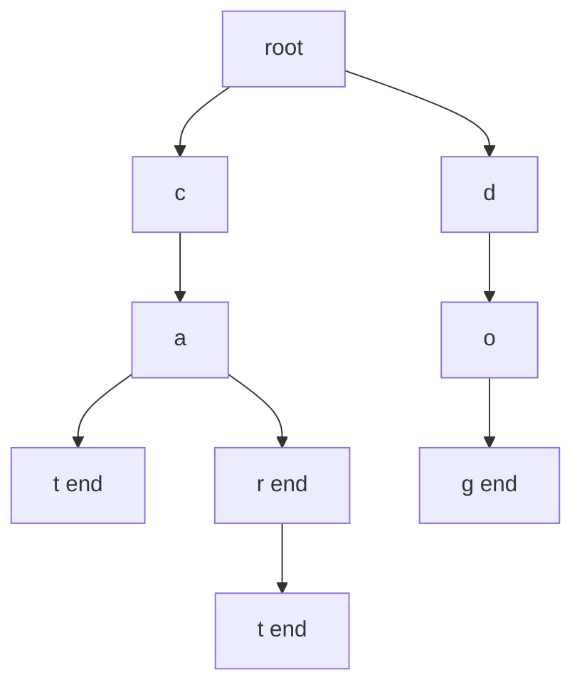
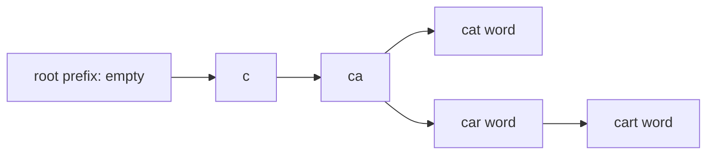
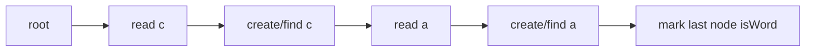

A trie, or prefix tree, stores strings by sharing common prefixes. Each node represents a prefix. Edges represent characters, and a boolean flag marks whether the prefix is a complete word.

## Trie shape

This trie contains `cat`, `car`, `cart`, and `dog`.

Compared with `std::unordered_set<std::string>`, a trie often uses more memory because every node stores child links. In exchange, prefix queries are fast and natural.

<Callout type="info" title="Length-based complexity">
Trie insert, exact search, and prefix search are O(L), where L is the length of the key, independent of how many other words are stored.
</Callout>

## Node representation

For lowercase English letters, `std::array<TrieNode*, 26>` is compact and fast. For arbitrary characters, `std::unordered_map<char, TrieNode*>` is flexible.

<CodeBlock
  adapter="cpp"
  starterCode={`#include <array>
#include <iostream>

struct TrieNode {
  std::array<TrieNode *, 26> child{};
  bool isWord = false;
};

int main() {
  TrieNode root;
  root.child[0] = new TrieNode();
  root.child[0]->isWord = true;
  std::cout << root.child[0]->isWord
            << "
               ";
               delete root.child[0];
  return 0;
}
`}
/>

## Full implementation with `unordered_map`

This version is easy to read and works for any character.

<CodeBlock
  adapter="cpp"
  starterCode={`#include <iostream>
#include <string>
#include <unordered_map>

struct TrieNode {
  std::unordered_map<char, TrieNode *> child;
  bool isWord = false;
};

class Trie {
  TrieNode *root = new TrieNode();

public:
  void insert(const std::string &word) {
    TrieNode *cur = root;
    for (char ch : word) {
      if (!cur->child.count(ch))
        cur->child[ch] = new TrieNode();
      cur = cur->child[ch];
    }
    cur->isWord = true;
  }

  bool search(const std::string &word) const {
    TrieNode *node = walk(word);
    return node && node->isWord;
  }

  bool startsWith(const std::string &prefix) const {
    return walk(prefix) != nullptr;
  }

private:
  TrieNode *walk(const std::string &s) const {
    TrieNode *cur = root;
    for (char ch : s) {
      auto it = cur->child.find(ch);
      if (it == cur->child.end())
        return nullptr;
      cur = it->second;
    }
    return cur;
  }
};

int main() {
  Trie trie;
  trie.insert("cat");
  trie.insert("car");
  std::cout << std::boolalpha << trie.search("cat")
            << "
               ";
      std::cout
            << trie.search("ca")
            << "
               ";
      std::cout
            << trie.startsWith("ca")
            << "
               ";
      return 0;
}
`}
/>

## Insert

Insertion creates missing nodes along the word path, then marks the final node as a complete word.

<CodeBlock
  adapter="cpp"
  starterCode={`#include <iostream>
#include <string>
#include <unordered_map>

struct Node {
  std::unordered_map<char, Node *> next;
  bool word = false;
};

void insert(Node *root, const std::string &s) {
  Node *cur = root;
  for (char ch : s) {
    if (!cur->next.count(ch))
      cur->next[ch] = new Node();
    cur = cur->next[ch];
  }
  cur->word = true;
}

int main() {
  Node root;
  insert(&root, "hi");
  std::cout << root.next['h']->next['i']->word
            << "
               ";
      return 0;
}
`}
/>

## Search vs prefix search

Exact search requires the final node to have `isWord = true`. Prefix search only needs the path to exist.

<CodeBlock
  adapter="cpp"
  starterCode={`#include <iostream>
#include <string>
#include <unordered_map>

struct Node {
  std::unordered_map<char, Node *> next;
  bool word = false;
};

Node *walk(Node *root, const std::string &s) {
  Node *cur = root;
  for (char ch : s) {
    auto it = cur->next.find(ch);
    if (it == cur->next.end())
      return nullptr;
    cur = it->second;
  }
  return cur;
}

int main() {
  Node root;
  root.next['c'] = new Node();
  root.next['c']->next['a'] = new Node();
  root.next['c']->next['a']->next['t'] = new Node();
  root.next['c']->next['a']->next['t']->word = true;
  std::cout << std::boolalpha << (walk(&root, "ca") != nullptr)
            << "
               ";
      std::cout
            << (walk(&root, "ca") && walk(&root, "ca")->word)
            << "
               ";
      return 0;
}
`}
/>

## Autocomplete by DFS

Once you walk to a prefix node, collect all words below that node.

<CodeBlock
  adapter="cpp"
  starterCode={`#include <iostream>
#include <string>
#include <unordered_map>
#include <vector>

struct Node {
  std::unordered_map<char, Node *> next;
  bool word = false;
};

void dfs(Node *node, std::string &path, std::vector<std::string> &out) {
  if (node->word)
    out.push_back(path);
  for (auto &[ch, child] : node->next) {
    path.push_back(ch);
    dfs(child, path, out);
    path.pop_back();
  }
}

int main() {
  Node root;
  root.next['a'] = new Node();
  root.next['a']->word = true;
  root.next['a']->next['t'] = new Node();
  root.next['a']->next['t']->word = true;
  std::string path;
  std::vector<std::string> words;
  dfs(&root, path, words);
  for (const std::string &w : words)
    std::cout << w
              << "
                 ";
        return 0;
}
`}
/>

## Use cases

Tries are useful for autocomplete, spellcheck, IP routing, longest-prefix matching, and dictionary-word search on a board.

<CodeBlock
  adapter="cpp"
  starterCode={`#include <iostream>
#include <string>
#include <vector>

int main() {
  std::vector<std::string> useCases = {"autocomplete", "spellcheck", "routing",
                                       "board search"};
  for (const std::string &item : useCases)
    std::cout << item
              << "
                 ";
        return 0;
}
`}
/>

## Practice: Implement a Trie

<ChallengeCard
  adapter="cpp"
  title="Implement a Trie"
  instructions={`Complete the \`Trie\` class with \`insert\`, \`search\`, and \`startsWith\`.`}
  starterCode={`#include <iostream>
#include <string>
#include <unordered_map>

struct TrieNode {
  std::unordered_map<char, TrieNode *> child;
  bool isWord = false;
};

class Trie {
  TrieNode *root = new TrieNode();

public:
  void insert(const std::string &w) {
    // your code here
  }

  bool search(const std::string &w) {
    // your code here
    return false;
  }

  bool startsWith(const std::string &p) {
    // your code here
    return false;
  }
};

int main() {
  Trie trie;
  trie.insert("cat");
  trie.insert("car");
  trie.insert("dog");
  std::cout << std::boolalpha;
  std::cout << trie.search("cat")
            << "
               ";
      std::cout
            << trie.search("ca")
            << "
               ";
      std::cout
            << trie.startsWith("ca")
            << "
               ";
      std::cout
            << trie.startsWith("do")
            << "
               ";
      return 0;
}
`}
  solutionCode={`#include <iostream>
#include <string>
#include <unordered_map>

struct TrieNode {
  std::unordered_map<char, TrieNode *> child;
  bool isWord = false;
};

class Trie {
  TrieNode *root = new TrieNode();

  TrieNode *walk(const std::string &s) {
    TrieNode *cur = root;
    for (char ch : s) {
      auto it = cur->child.find(ch);
      if (it == cur->child.end())
        return nullptr;
      cur = it->second;
    }
    return cur;
  }

public:
  void insert(const std::string &w) {
    TrieNode *cur = root;
    for (char ch : w) {
      if (!cur->child.count(ch))
        cur->child[ch] = new TrieNode();
      cur = cur->child[ch];
    }
    cur->isWord = true;
  }

  bool search(const std::string &w) {
    TrieNode *node = walk(w);
    return node && node->isWord;
  }

  bool startsWith(const std::string &p) { return walk(p) != nullptr; }
};

int main() {
  Trie trie;
  trie.insert("cat");
  trie.insert("car");
  trie.insert("dog");
  std::cout << std::boolalpha;
  std::cout << trie.search("cat")
            << "
               ";
      std::cout
            << trie.search("ca")
            << "
               ";
      std::cout
            << trie.startsWith("ca")
            << "
               ";
      std::cout
            << trie.startsWith("do")
            << "
               ";
      return 0;
}
`}
  tests={[{ id: "trie", name: "Searches words and prefixes", expect: { stdoutLines: ["true", "false", "true", "true"], stdoutLinesExact: true } }]}
/>

## Practice: Count words starting with prefix

<ChallengeCard
  adapter="cpp"
  title="Count words starting with prefix"
  instructions={`Build a trie from the words and return how many inserted words start with the given prefix.`}
  starterCode={`#include <iostream>
#include <string>
#include <unordered_map>
#include <vector>

int countWithPrefix(const std::vector<std::string> &words,
                    const std::string &prefix) {
  // your code here
  return 0;
}

int main() {
  std::vector<std::string> words = {"cat", "car", "cart", "dog", "door"};
  std::cout << countWithPrefix(words, "ca")
            << "
               ";
      std::cout
            << countWithPrefix(words, "car")
            << "
               ";
      std::cout
            << countWithPrefix(words, "z")
            << "
               ";
      return 0;
}
`}
  solutionCode={`#include <iostream>
#include <string>
#include <unordered_map>
#include <vector>

struct Node {
  std::unordered_map<char, Node *> child;
  int pass = 0;
};

int countWithPrefix(const std::vector<std::string> &words,
                    const std::string &prefix) {
  Node root;
  for (const std::string &word : words) {
    Node *cur = &root;
    for (char ch : word) {
      if (!cur->child.count(ch))
        cur->child[ch] = new Node();
      cur = cur->child[ch];
      cur->pass++;
    }
  }
  Node *cur = &root;
  for (char ch : prefix) {
    auto it = cur->child.find(ch);
    if (it == cur->child.end())
      return 0;
    cur = it->second;
  }
  return cur->pass;
}

int main() {
  std::vector<std::string> words = {"cat", "car", "cart", "dog", "door"};
  std::cout << countWithPrefix(words, "ca")
            << "
               ";
      std::cout
            << countWithPrefix(words, "car")
            << "
               ";
      std::cout
            << countWithPrefix(words, "z")
            << "
               ";
      return 0;
}
`}
  tests={[{ id: "prefix-count", name: "Counts prefix matches", expect: { stdoutLines: ["3", "2", "0"], stdoutLinesExact: true } }]}
/>

## Practice: Longest common prefix

<ChallengeCard
  adapter="cpp"
  title="Longest common prefix"
  instructions={`Build a trie and walk while there is exactly one child and the current node is not the end of a word.`}
  starterCode={`#include <iostream>
#include <string>
#include <unordered_map>
#include <vector>

std::string longestCommonPrefix(const std::vector<std::string> &words) {
  // your code here
  return "";
}

int main() {
  std::cout << longestCommonPrefix({"flower", "flow", "flight"})
            << "
               ";
      return 0;
}
`}
  solutionCode={`#include <iostream>
#include <string>
#include <unordered_map>
#include <vector>

struct Node {
  std::unordered_map<char, Node *> child;
  bool word = false;
};

std::string longestCommonPrefix(const std::vector<std::string> &words) {
  if (words.empty())
    return "";
  Node root;
  for (const std::string &s : words) {
    Node *cur = &root;
    for (char ch : s) {
      if (!cur->child.count(ch))
        cur->child[ch] = new Node();
      cur = cur->child[ch];
    }
    cur->word = true;
  }
  std::string ans;
  Node *cur = &root;
  while (!cur->word && cur->child.size() == 1) {
    auto it = cur->child.begin();
    ans.push_back(it->first);
    cur = it->second;
  }
  return ans;
}

int main() {
  std::cout << longestCommonPrefix({"flower", "flow", "flight"})
            << "
               ";
      return 0;
}
`}
  tests={[{ id: "lcp", name: "Finds fl", expect: { stdoutEquals: "fl" } }]}
/>

## Check your understanding

<MultipleChoice markdown={`What is the time complexity of searching for a word of length L in a trie?

- O(1) always
  > Each character must be followed.
- [o] O(L)
  > One edge is followed per character.
- O(n log n)
  > The number of stored words is not directly multiplied this way.
- O(26 to the power L)
  > Search follows one path, not all possible paths.`} />

<MultipleChoice markdown={`When can a trie beat a hash set of strings?

- [o] When many prefix queries such as starts-with or autocomplete are needed.
  > Prefix navigation is the trie specialty.
- When memory must always be minimized.
  > Tries often use more memory because of child links.
- When only exact membership is needed and no prefixes matter.
  > A hash set is usually simpler for exact membership only.
- When strings cannot share prefixes.
  > Shared prefixes are where tries shine.`} />

<MultipleChoice markdown={`What does a node in a trie represent?

- A whole independent hash table of all words
  > A node may store child links, but it represents a prefix position.
- [o] A prefix formed by the path from the root to that node
  > The end flag says whether that prefix is also a complete word.
- Always exactly one complete word
  > Internal nodes can be prefixes for many words and may or may not end a word.
- The sorted rank of a string
  > Tries are organized by characters, not by sorted rank.`} />
