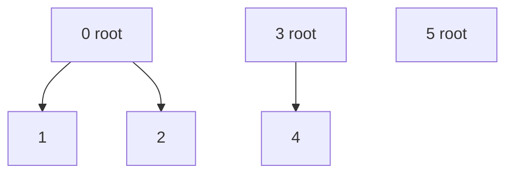
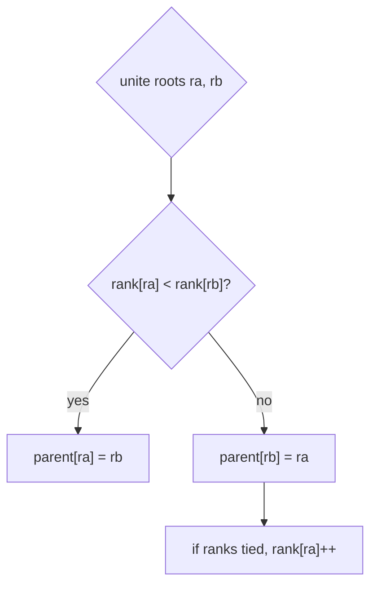
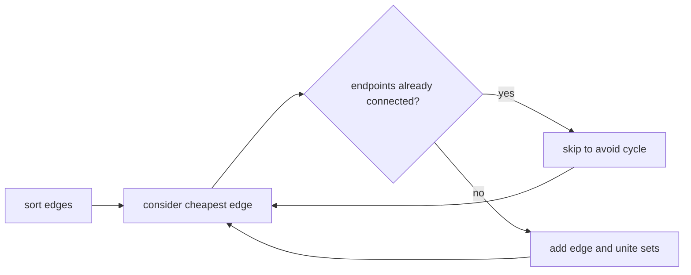

**Union-Find**, also called **Disjoint Set Union (DSU)**, maintains a partition of elements into disjoint sets. It supports two operations:

* `find(x)`: which representative identifies the set containing `x`?
* `unite(x, y)`: merge the sets containing `x` and `y`.

DSU shines when connectivity changes over time by adding edges.

<svg
  viewBox="0 0 640 200"
  role="img"
  aria-label="Two translucent sets, each with members linking up to their representative, merge along a dotted arrow into one set where the old green root now answers to the surviving blue one"
  style={{ display: "block", width: "100%", maxWidth: "640px", height: "auto", margin: "2.5rem auto" }}
>
  <g style={{ color: "var(--ds-blue-500)" }} fill="currentColor">
    <circle cx="150" cy="100" r="56" fillOpacity="0.1" />
    <circle cx="150" cy="76" r="9" />
    <circle cx="124" cy="114" r="5.5" fillOpacity="0.7" />
    <circle cx="172" cy="118" r="5.5" fillOpacity="0.7" />
  </g>
  <g fill="currentColor" opacity="0.35">
    <circle cx="133" cy="101" r="1.8" />
    <circle cx="142" cy="88" r="1.8" />
    <circle cx="164" cy="104" r="1.8" />
    <circle cx="157" cy="90" r="1.8" />
    <circle cx="310" cy="109" r="1.8" />
    <circle cx="310" cy="94" r="1.8" />
  </g>
  <g style={{ color: "var(--ds-green-500)" }} fill="currentColor">
    <circle cx="310" cy="100" r="44" fillOpacity="0.1" />
    <circle cx="310" cy="80" r="8" />
    <circle cx="310" cy="124" r="5.5" fillOpacity="0.7" />
  </g>
  <g fill="currentColor" opacity="0.3">
    <circle cx="380" cy="100" r="3" />
    <circle cx="400" cy="100" r="3" />
    <circle cx="420" cy="100" r="3" />
    <polygon points="432,92 432,108 444,100" />
  </g>
  <g style={{ color: "var(--ds-blue-500)" }} fill="currentColor">
    <circle cx="530" cy="100" r="62" fillOpacity="0.1" />
    <circle cx="530" cy="68" r="9" />
    <circle cx="500" cy="114" r="5.5" fillOpacity="0.7" />
  </g>
  <g style={{ color: "var(--ds-green-500)" }} fill="currentColor">
    <circle cx="556" cy="108" r="8" />
    <circle cx="548" cy="134" r="5.5" fillOpacity="0.7" />
  </g>
  <g fill="currentColor" opacity="0.35">
    <circle cx="548" cy="95" r="1.8" />
    <circle cx="539" cy="82" r="1.8" />
    <circle cx="552" cy="121" r="1.8" />
    <circle cx="510" cy="99" r="1.8" />
    <circle cx="520" cy="84" r="1.8" />
  </g>
</svg>

## Parent trees

Each set is represented as a tree. Every node points to a parent, and the root points to itself.



If `find(2)` reaches root `0`, then `2` belongs to the set represented by `0`.

## Naive implementation

A basic DSU stores a parent array. `find` walks up to the root. Without optimizations, a tree can become a long chain, making `find` O(n).

<CodeBlock
  adapter="cpp"
  files={[
    {
      filename: "main.cpp",
      starterCode: `#include <iostream>
#include <vector>

class NaiveDSU {
  std::vector<int> parent;

public:
  explicit NaiveDSU(int n) : parent(n) {
    for (int i = 0; i < n; i++)
      parent[i] = i;
  }

  int find(int x) {
    while (parent[x] != x)
      x = parent[x];
    return x;
  }

  void unite(int a, int b) {
    int ra = find(a);
    int rb = find(b);
    if (ra != rb)
      parent[rb] = ra;
  }
};

int main() {
  NaiveDSU dsu(4);
  dsu.unite(0, 1);
  dsu.unite(2, 3);
  std::cout << (dsu.find(0) == dsu.find(1)) << "\\n";
  return 0;
}
`,
    },
  ]}
/>

## Path compression

Path compression rewires every node on a find path directly to the root. Future finds become much faster.


<CodeBlock
  adapter="cpp"
  files={[
    {
      filename: "main.cpp",
      starterCode: `#include <iostream>
#include <vector>

class DSUPathCompression {
  std::vector<int> parent;

public:
  explicit DSUPathCompression(int n) : parent(n) {
    for (int i = 0; i < n; i++)
      parent[i] = i;
  }

  int find(int x) {
    if (parent[x] == x)
      return x;
    parent[x] = find(parent[x]);
    return parent[x];
  }
};

int main() {
  DSUPathCompression dsu(3);
  std::cout << dsu.find(2) << "\\n";
  return 0;
}
`,
    },
  ]}
/>

## Union by rank or size

Union by rank attaches the shallower tree under the deeper tree. Union by size attaches the smaller set under the larger set. Both keep trees short.



With both path compression and union by rank or size, operations take near **O(α(n)) amortized time**, where `α` is the inverse Ackermann function. Tarjan's analysis showed this is practically constant for any realistic input size.

## Production DSU class

<CodeBlock
  adapter="cpp"
  files={[
    {
      filename: "main.cpp",
      starterCode: `#include <iostream>
#include <numeric>
#include <utility>
#include <vector>

class DSU {
  std::vector<int> parent;
  std::vector<int> rank;

public:
  explicit DSU(int n) : parent(n), rank(n, 0) {
    std::iota(parent.begin(), parent.end(), 0);
  }

  int find(int x) {
    if (parent[x] == x)
      return x;
    parent[x] = find(parent[x]);
    return parent[x];
  }

  bool unite(int a, int b) {
    int ra = find(a);
    int rb = find(b);
    if (ra == rb)
      return false;
    if (rank[ra] < rank[rb])
      std::swap(ra, rb);
    parent[rb] = ra;
    if (rank[ra] == rank[rb])
      rank[ra]++;
    return true;
  }
};

int main() {
  DSU dsu(5);
  dsu.unite(0, 1);
  dsu.unite(1, 2);
  std::cout << (dsu.find(0) == dsu.find(2)) << "\\n";
  return 0;
}
`,
    },
  ]}
/>

<Callout type="success" title="Return a bool from unite">
A `bool unite(a, b)` is useful: `true` means a merge happened, while `false` means `a` and `b` were already connected. Kruskal's algorithm and cycle detection both use this pattern.
</Callout>

## Connected components with DSU

Start with `n` separate sets. Every successful union reduces the component count by one.

<CodeBlock
  adapter="cpp"
  files={[
    {
      filename: "main.cpp",
      starterCode: `#include <iostream>
#include <numeric>
#include <utility>
#include <vector>

class DSU {
  std::vector<int> parent, size;

public:
  explicit DSU(int n) : parent(n), size(n, 1) {
    std::iota(parent.begin(), parent.end(), 0);
  }
  int find(int x) {
    if (parent[x] == x)
      return x;
    return parent[x] = find(parent[x]);
  }
  bool unite(int a, int b) {
    int ra = find(a), rb = find(b);
    if (ra == rb)
      return false;
    if (size[ra] < size[rb])
      std::swap(ra, rb);
    parent[rb] = ra;
    size[ra] += size[rb];
    return true;
  }
};

int main() {
  int n = 5;
  std::vector<std::pair<int, int>> edges = {{0, 1}, {1, 2}, {3, 4}};
  DSU dsu(n);
  int components = n;
  for (auto [u, v] : edges)
    if (dsu.unite(u, v))
      components--;
  std::cout << components << "\\n";
  return 0;
}
`,
    },
  ]}
/>

## Cycle detection in an undirected graph

When processing an undirected edge `(u, v)`, if `u` and `v` are already in the same set, adding the edge creates a cycle.

<CodeBlock
  adapter="cpp"
  files={[
    {
      filename: "main.cpp",
      starterCode: `#include <iostream>
#include <numeric>
#include <utility>
#include <vector>

class DSU {
  std::vector<int> parent, rank;

public:
  explicit DSU(int n) : parent(n), rank(n, 0) {
    std::iota(parent.begin(), parent.end(), 0);
  }
  int find(int x) { return parent[x] == x ? x : parent[x] = find(parent[x]); }
  bool unite(int a, int b) {
    int ra = find(a), rb = find(b);
    if (ra == rb)
      return false;
    if (rank[ra] < rank[rb])
      std::swap(ra, rb);
    parent[rb] = ra;
    if (rank[ra] == rank[rb])
      rank[ra]++;
    return true;
  }
};

int main() {
  std::vector<std::pair<int, int>> edges = {{0, 1}, {1, 2}, {2, 0}};
  DSU dsu(3);
  bool cycle = false;
  for (auto [u, v] : edges) {
    if (!dsu.unite(u, v))
      cycle = true;
  }
  std::cout << (cycle ? "cycle" : "acyclic") << "\\n";
  return 0;
}
`,
    },
  ]}
/>

## Kruskal's minimum spanning tree algorithm

A minimum spanning tree (MST) connects all vertices of an undirected weighted graph with minimum total weight and no cycles.

```text
Kruskal(edges, n):
    sort edges by weight
    make DSU with n singleton sets
    total = 0
    for edge (u, v, w) in sorted order:
        if unite(u, v) succeeds:
            add w to total
    return total
```



<CodeBlock
  adapter="cpp"
  files={[
    {
      filename: "main.cpp",
      starterCode: `#include <algorithm>
#include <iostream>
#include <numeric>
#include <tuple>
#include <utility>
#include <vector>

class DSU {
  std::vector<int> parent, size;

public:
  explicit DSU(int n) : parent(n), size(n, 1) {
    std::iota(parent.begin(), parent.end(), 0);
  }
  int find(int x) { return parent[x] == x ? x : parent[x] = find(parent[x]); }
  bool unite(int a, int b) {
    int ra = find(a), rb = find(b);
    if (ra == rb)
      return false;
    if (size[ra] < size[rb])
      std::swap(ra, rb);
    parent[rb] = ra;
    size[ra] += size[rb];
    return true;
  }
};

int kruskal(int n, std::vector<std::tuple<int, int, int>> edges) {
  std::sort(edges.begin(), edges.end(), [](const auto &a, const auto &b) {
    return std::get<2>(a) < std::get<2>(b);
  });

  DSU dsu(n);
  int total = 0;
  for (auto [u, v, w] : edges) {
    if (dsu.unite(u, v))
      total += w;
  }
  return total;
}

int main() {
  std::vector<std::tuple<int, int, int>> edges = {
      {0, 1, 10}, {0, 2, 6}, {0, 3, 5}, {1, 3, 15}, {2, 3, 4}};
  std::cout << kruskal(4, edges) << "\\n";
  return 0;
}
`,
    },
  ]}
/>

<Callout type="warn" title="DSU handles added edges, not removed edges">
Classic DSU is excellent for incremental connectivity where edges are added. Fully dynamic connectivity with deletions needs more advanced data structures or offline tricks.
</Callout>

## Challenge: Number of connected components using DSU

<ChallengeCard
  adapter="cpp"
  title="Number of connected components using DSU"
  instructions={`Implement \`countComponents\` using DSU. Start with \`n\` components and decrement only when a union succeeds.`}
  files={[
    {
      filename: "main.cpp",
      starterCode: `#include <iostream>
#include <numeric>
#include <utility>
#include <vector>

class DSU {
  std::vector<int> parent, size;

public:
  explicit DSU(int n) : parent(n), size(n, 1) {
    std::iota(parent.begin(), parent.end(), 0);
  }
  int find(int x) {
    if (parent[x] == x)
      return x;
    return parent[x] = find(parent[x]);
  }
  bool unite(int a, int b) {
    int ra = find(a), rb = find(b);
    if (ra == rb)
      return false;
    if (size[ra] < size[rb])
      std::swap(ra, rb);
    parent[rb] = ra;
    size[ra] += size[rb];
    return true;
  }
};

int countComponents(int n, const std::vector<std::pair<int, int>> &edges) {
  // your code here
  return 0;
}

int main() {
  int n = 6;
  std::vector<std::pair<int, int>> edges = {{0, 1}, {1, 2}, {3, 4}};
  std::cout << countComponents(n, edges) << "\\n";
  return 0;
}
`,
      solutionCode: `#include <iostream>
#include <numeric>
#include <utility>
#include <vector>

class DSU {
  std::vector<int> parent, size;

public:
  explicit DSU(int n) : parent(n), size(n, 1) {
    std::iota(parent.begin(), parent.end(), 0);
  }
  int find(int x) {
    if (parent[x] == x)
      return x;
    return parent[x] = find(parent[x]);
  }
  bool unite(int a, int b) {
    int ra = find(a), rb = find(b);
    if (ra == rb)
      return false;
    if (size[ra] < size[rb])
      std::swap(ra, rb);
    parent[rb] = ra;
    size[ra] += size[rb];
    return true;
  }
};

int countComponents(int n, const std::vector<std::pair<int, int>> &edges) {
  DSU dsu(n);
  int components = n;
  for (auto [u, v] : edges) {
    if (dsu.unite(u, v))
      components--;
  }
  return components;
}

int main() {
  int n = 6;
  std::vector<std::pair<int, int>> edges = {{0, 1}, {1, 2}, {3, 4}};
  std::cout << countComponents(n, edges) << "\\n";
  return 0;
}
`,
    },
  ]}
  tests={[
    {
      id: "dsu-components",
      name: "Counts three components",
      expect: { stdoutEquals: "3" },
    },
  ]}
/>

## Challenge: Kruskal's MST total weight

<ChallengeCard
  adapter="cpp"
  title="Kruskal's MST total weight"
  instructions={`Implement \`mstWeight\`. Sort edges by weight and add an edge only when DSU says it connects two different components.`}
  files={[
    {
      filename: "main.cpp",
      starterCode: `#include <algorithm>
#include <iostream>
#include <numeric>
#include <tuple>
#include <utility>
#include <vector>

class DSU {
  std::vector<int> parent, rank;

public:
  explicit DSU(int n) : parent(n), rank(n, 0) {
    std::iota(parent.begin(), parent.end(), 0);
  }
  int find(int x) {
    if (parent[x] == x)
      return x;
    return parent[x] = find(parent[x]);
  }
  bool unite(int a, int b) {
    int ra = find(a), rb = find(b);
    if (ra == rb)
      return false;
    if (rank[ra] < rank[rb])
      std::swap(ra, rb);
    parent[rb] = ra;
    if (rank[ra] == rank[rb])
      rank[ra]++;
    return true;
  }
};

int mstWeight(int n, std::vector<std::tuple<int, int, int>> edges) {
  // your code here
  return 0;
}

int main() {
  std::vector<std::tuple<int, int, int>> edges = {
      {0, 1, 1}, {0, 2, 4}, {1, 2, 2}, {1, 3, 6}, {2, 3, 3}};
  std::cout << mstWeight(4, edges) << "\\n";
  return 0;
}
`,
      solutionCode: `#include <algorithm>
#include <iostream>
#include <numeric>
#include <tuple>
#include <utility>
#include <vector>

class DSU {
  std::vector<int> parent, rank;

public:
  explicit DSU(int n) : parent(n), rank(n, 0) {
    std::iota(parent.begin(), parent.end(), 0);
  }
  int find(int x) {
    if (parent[x] == x)
      return x;
    return parent[x] = find(parent[x]);
  }
  bool unite(int a, int b) {
    int ra = find(a), rb = find(b);
    if (ra == rb)
      return false;
    if (rank[ra] < rank[rb])
      std::swap(ra, rb);
    parent[rb] = ra;
    if (rank[ra] == rank[rb])
      rank[ra]++;
    return true;
  }
};

int mstWeight(int n, std::vector<std::tuple<int, int, int>> edges) {
  std::sort(edges.begin(), edges.end(), [](const auto &a, const auto &b) {
    return std::get<2>(a) < std::get<2>(b);
  });
  DSU dsu(n);
  int total = 0;
  for (auto [u, v, w] : edges) {
    if (dsu.unite(u, v))
      total += w;
  }
  return total;
}

int main() {
  std::vector<std::tuple<int, int, int>> edges = {
      {0, 1, 1}, {0, 2, 4}, {1, 2, 2}, {1, 3, 6}, {2, 3, 3}};
  std::cout << mstWeight(4, edges) << "\\n";
  return 0;
}
`,
    },
  ]}
  tests={[
    {
      id: "mst-weight",
      name: "Computes MST weight six",
      expect: { stdoutEquals: "6" },
    },
  ]}
/>

## Check your understanding

<MultipleChoice
  markdown={`With path compression and union by rank or size, what is DSU's amortized complexity per operation?

- O(n)
  > Naive find can degrade to O(n), but the optimizations avoid that in amortized analysis.
- O(log n) exactly
  > The optimized bound is even tighter asymptotically.
- [o] Near O(α(n)), practically constant
  > α(n) is the inverse Ackermann function.
- O(n²)
  > DSU operations are much faster than quadratic.

Tarjan's analysis gives the famous inverse-Ackermann amortized bound.`}
/>

<MultipleChoice
  markdown={`What does path compression do during \`find(x)\`?

- It sorts all elements in the set
  > DSU does not maintain sorted set contents.
- [o] It makes nodes on the search path point directly to the root
  > This flattens the tree for future finds.
- It deletes the set containing x
  > Find is a query/update optimization, not deletion.
- It always chooses the larger root
  > Choosing roots is union by size or rank, not path compression.

Path compression is why repeated finds become extremely fast.`}
/>

<MultipleChoice
  markdown={`Why is DSU often preferred over rerunning BFS for incremental connectivity queries where edges are only added?

- [o] DSU updates connectivity with very fast unite operations
  > Each added edge can be processed almost constantly.
- BFS cannot traverse graphs
  > BFS traverses graphs well, but rerunning it after every edge can be expensive.
- DSU stores shortest paths
  > DSU only tracks components, not distances or paths.
- DSU works only on directed graphs
  > Classic connectivity DSU is typically used for undirected graphs.

For many online connectivity checks, DSU avoids repeated whole-graph traversals.`}
/>
