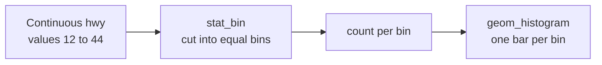
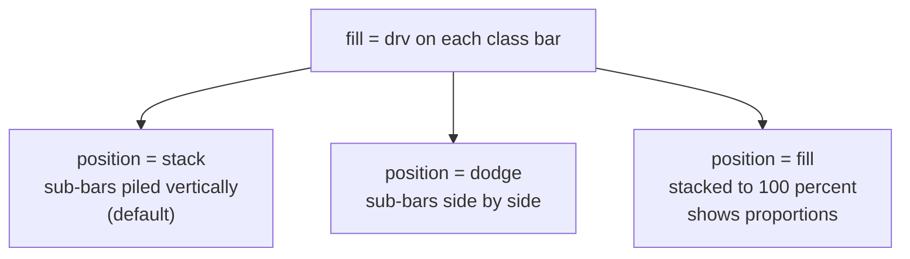

Bars are everywhere in analytics, and almost every bar chart is really
a *statistic* made visible. This page goes deep on the two most common
counting stats — `stat_count` (bars) and `stat_bin` (histograms) — and
the **position adjustments** that decide how bars share space.

## A histogram is binning + counting

A histogram answers: *how is one continuous variable distributed?* The
stat slices the range of x into equal **bins** and counts how many
values land in each.

The single most important knob is the **bin width** — it changes the
story the histogram tells:

<CodeBlock
  adapter="r"
  initialCode={`library(ggplot2)

# Too few bins: detail is hidden.
ggplot(mpg, aes(hwy)) +
  geom_histogram(bins = 5, fill = "steelblue", color = "white")
`}
/>

<CodeBlock
  adapter="r"
  initialCode={`library(ggplot2)

# Too many bins: noisy and spiky.
ggplot(mpg, aes(hwy)) +
  geom_histogram(bins = 50, fill = "steelblue", color = "white")
`}
/>

<Callout type="warn" title="Always choose your bins consciously">
ggplot2 defaults to 30 bins and *prints a message telling you to pick a
better value*. The default is rarely ideal. Set `bins =` or
`binwidth =` deliberately — the same data can look unimodal or jagged
depending on this one choice.
</Callout>

## Bar charts: counts across categories

`geom_bar()` is the categorical cousin: count rows per category.
Mapping a second categorical variable to `fill` splits each bar — and
now we must decide *how* the sub-bars share space. That decision is the
**position adjustment**.

## Position adjustments: stack, dodge, fill

When bars (or their sub-pieces) would occupy the same place, a
**position** controls the arrangement:

See all three on the same data:

<CodeBlock
  adapter="r"
  initialCode={`library(ggplot2)

# STACK (default): total height = count, split into drv segments.
ggplot(mpg, aes(x = class, fill = drv)) +
  geom_bar(position = "stack")
`}
/>

<CodeBlock
  adapter="r"
  initialCode={`library(ggplot2)

# DODGE: sub-bars side by side -> compare drv WITHIN each class.
ggplot(mpg, aes(x = class, fill = drv)) +
  geom_bar(position = "dodge")
`}
/>

<CodeBlock
  adapter="r"
  initialCode={`library(ggplot2)

# FILL: every bar stretched to 1.0 -> compare PROPORTIONS, lose totals.
ggplot(mpg, aes(x = class, fill = drv)) +
  geom_bar(position = "fill")
`}
/>

Each position answers a different question from the *same* data:

- **stack** — "what is the total, and its composition?"
- **dodge** — "how do the groups compare within each category?"
- **fill** — "what is the proportion mix, ignoring totals?"

This is the grammar again: you do not switch chart *types*, you switch
one *position* argument and the chart re-poses to answer a new
question.

<Callout type="info" title="Position is its own grammar component">
Position adjustments also apply beyond bars. \`position = "jitter"\` on
points nudges overlapping dots apart so you can see density —
\`geom_jitter()\` is just \`geom_point(position = "jitter")\`.
</Callout>

<CodeBlock
  adapter="r"
  initialCode={`library(ggplot2)

# class vs drv are both discrete -> points overlap perfectly.
# Jitter spreads them so you can see how many fall on each combination.
ggplot(mpg, aes(x = drv, y = class)) +
  geom_jitter(width = 0.2, height = 0.2, alpha = 0.5)
`}
/>

<MultipleChoice
  markdown={`In a histogram, what does the bin width control, and why does it matter?

- The color of the bars.
  > Bin width has nothing to do with color.
- The number of rows in the data set.
  > The data is fixed; bin width only changes how it is grouped for display.
- [o] How finely the continuous range is sliced before counting — too wide hides structure, too narrow makes the histogram noisy.
  > Bin width is the central choice; it can make one data set look smooth or spiky.
- Whether the x-axis is continuous or discrete.
  > The x variable is continuous regardless; bin width affects the grouping, not the type.

Because the histogram's stat bins then counts, the bin width is the
knob that shapes the entire picture. Always set it deliberately.`}
/>

<MultipleChoice
  markdown={`You map \`fill = drv\` on a bar chart of \`class\` and want to compare drivetrains *side by side within each class*. Which position adjustment do you use?

- \`position = "stack"\`.
  > Stacking piles the segments vertically, making within-class comparison harder.
- [o] \`position = "dodge"\`.
  > Dodging places the sub-bars next to each other, which is ideal for within-category comparison.
- \`position = "fill"\`.
  > Fill normalizes each bar to 100% and hides counts, answering a proportion question instead.
- \`position = "jitter"\`.
  > Jitter is for scattering overlapping points, not arranging bars.

The same fill mapping can answer different questions; \`dodge\` is the
one for side-by-side group comparison.`}
/>

<MultipleChoice
  markdown={`What does \`position = "fill"\` show that \`position = "stack"\` does not?

- The raw counts within each segment.
  > Stack preserves totals; fill is the one that *hides* raw totals.
- Side-by-side bars for direct height comparison.
  > That describes dodge, not fill.
- [o] The proportion (relative composition) within each category, by stretching every bar to the same full height.
  > Fill normalizes to 1.0 so you compare mix, at the cost of losing absolute totals.
- Nothing different; they are identical.
  > They answer different questions — composition-with-totals vs. proportions.

\`fill\` trades away absolute counts to make proportional composition
directly comparable across categories.`}
/>

## Key takeaways

- A **histogram** = `stat_bin` (slice x into bins, count) drawn as
  bars; **bin width** is the decisive choice.
- A **bar chart** = `stat_count` (count rows per category) drawn as
  bars.
- **Position adjustments** decide how overlapping bars share space:
  `stack` (totals + composition), `dodge` (side-by-side), `fill`
  (proportions).
- Positions extend beyond bars — `jitter` separates overlapping points.
- Switching the *question* often means switching a *position*, not the
  chart type.
