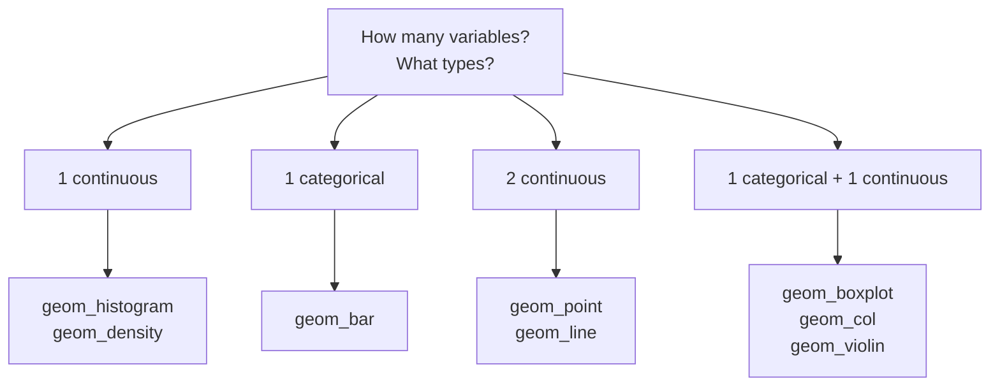

With the *concept* of a geom in hand, let us build a working
vocabulary. The goal is not to memorize a list but to develop a reflex:
*look at your variables, and the right geom suggests itself.*

## Let the variables choose the geom

A reliable way to pick a geom is to count and classify the variables
you want to show:

This is a starting point, not a law — but it resolves most "which geom
do I use?" questions.

## One continuous variable: distributions

To see the *shape* of a single numeric variable, use a histogram or a
density:

<CodeBlock
  adapter="r"
  initialCode={`library(ggplot2)

ggplot(mpg, aes(x = hwy)) +
  geom_histogram(bins = 15, fill = "steelblue", color = "white")
`}
/>

<CodeBlock
  adapter="r"
  initialCode={`library(ggplot2)

ggplot(mpg, aes(x = hwy)) +
  geom_density(fill = "steelblue", alpha = 0.4)
`}
/>

## One categorical variable: counts

To count how many rows fall in each category, use `geom_bar()`:

<CodeBlock
  adapter="r"
  initialCode={`library(ggplot2)

ggplot(mpg, aes(x = class)) +
  geom_bar(fill = "darkorange")
`}
/>

## Two continuous variables: relationships

The classic scatter plot, optionally with a trend line:

<CodeBlock
  adapter="r"
  initialCode={`library(ggplot2)

ggplot(mpg, aes(x = displ, y = hwy)) +
  geom_point()
`}
/>

## Categorical + continuous: compare distributions across groups

Boxplots and violins compare a numeric variable *across* categories:

<CodeBlock
  adapter="r"
  initialCode={`library(ggplot2)

ggplot(mpg, aes(x = class, y = hwy)) +
  geom_boxplot(fill = "lightblue")
`}
/>

<CodeBlock
  adapter="r"
  initialCode={`library(ggplot2)

ggplot(mpg, aes(x = class, y = hwy)) +
  geom_violin(fill = "plum")
`}
/>

## geom_bar vs. geom_col — a crucial distinction

Both draw bars, but they answer different questions, and mixing them up
is a top-five beginner error:

- **`geom_bar()`** takes **only x** and draws bars whose height is the
  **count** of rows in each category. *ggplot2 computes the height.*
- **`geom_col()`** takes **x and y** and draws bars whose height is the
  **y value you supply**. *You provide the height.*

<CodeBlock
  adapter="r"
  initialCode={`library(ggplot2)

# geom_col: heights are GIVEN by a column.
sales <- data.frame(
  product = c("A", "B", "C"),
  revenue = c(120, 85, 47)
)

ggplot(sales, aes(x = product, y = revenue)) +
  geom_col(fill = "seagreen")
`}
/>

If you tried `geom_bar()` on this data expecting bars of height
`revenue`, you would instead get three bars all of height **1** —
because each product appears once, so the *count* is 1. The fix is
`geom_col()` (or, equivalently, `geom_bar(stat = "identity")`, which
the next section explains).

<Callout type="warn" title="The mnemonic">
**`geom_col()` = heights you already have in a column.**
**`geom_bar()` = let ggplot2 count for you.**
If your data already has the y-values, you almost always want
`geom_col()`.
</Callout>

<MultipleChoice
  markdown={`You have a data frame with columns \`product\` and \`revenue\`, one row per product, and you want bar heights equal to \`revenue\`. Which geom is correct?

- [o] \`geom_col()\`, because the bar heights are values you already have in the \`revenue\` column.
  > \`geom_col()\` draws bars at the supplied y-values — exactly what you want.
- \`geom_bar()\`, because it always reads the y column for heights.
  > \`geom_bar()\` ignores y and counts rows; each product appears once, giving bars of height 1.
- \`geom_histogram()\`, because revenue is numeric.
  > Histograms bin a single continuous variable; they do not draw one bar per product.
- \`geom_point()\`, because the data is tabular.
  > Points would not give the bar chart you want.

\`geom_col()\` uses supplied heights; \`geom_bar()\` computes heights as
counts. With pre-computed values, reach for \`geom_col()\`.`}
/>

<MultipleChoice
  markdown={`You want to compare the distribution of highway MPG (\`hwy\`) *across* vehicle classes (\`class\`). Which geom fits the "one categorical + one continuous" shape best?

- \`geom_point()\` with \`class\` on x.
  > Points would overplot heavily and not summarize each group's distribution.
- \`geom_histogram()\`.
  > A histogram shows one variable's distribution, not a comparison across categories in one panel.
- [o] \`geom_boxplot()\` (or \`geom_violin()\`), which summarizes the continuous variable separately for each category.
  > Boxplots/violins are built for categorical-vs-continuous distribution comparisons.
- \`geom_col()\`.
  > \`geom_col()\` draws single bar heights, not distributions.

Counting and classifying your variables (one categorical + one
continuous) points directly to boxplots or violins.`}
/>

## Key takeaways

- Pick a geom by **counting and typing your variables**: 1 continuous →
  histogram/density; 1 categorical → bar; 2 continuous → point/line;
  categorical + continuous → boxplot/violin/col.
- **`geom_bar()`** counts rows (needs only x); **`geom_col()`** uses
  supplied y-values. Confusing them is a classic bug.
- Geoms are interchangeable views — start from the question and the
  variables, not from a chart name.
