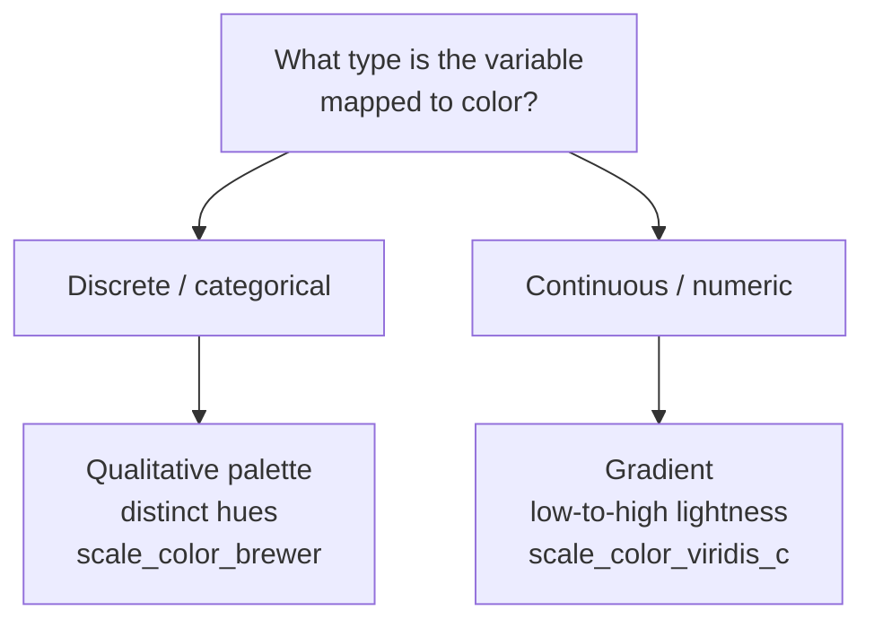

Color is the most powerful — and most abused — aesthetic. ggplot2
handles it through **color and fill scales**, and understanding them
turns color from a guessing game into a deliberate choice. This is a
foundational page, so it has extra practice questions.

## color vs. fill, one more time

Two color aesthetics exist because marks have an outline and an
interior:

- **`color`** — the *outline* of points, the stroke of lines, the
  border of bars.
- **`fill`** — the *interior* of areas: bars, boxes, ribbons, tiles.

Each has its own family of scales: `scale_color_*()` and
`scale_fill_*()`. Use the one that matches the aesthetic you mapped.

<CodeBlock
  adapter="r"
  starterCode={`library(ggplot2)

# Bars are areas -> use fill, and therefore scale_fill_*.
ggplot(mpg, aes(class, fill = drv)) +
  geom_bar() +
  scale_fill_brewer(palette = "Set2")
`}
/>

## Discrete vs. continuous color

The single biggest fork: is the mapped variable **categorical** or
**continuous**? It determines the *kind* of color scale entirely.

### Discrete: distinct hues for distinct categories

Categories have no order, so use a **qualitative** palette where colors
are easy to tell apart but none looks "bigger":

<CodeBlock
  adapter="r"
  starterCode={`library(ggplot2)

ggplot(mpg, aes(displ, hwy, color = class)) +
  geom_point(size = 2) +
  scale_color_brewer(palette = "Dark2")
`}
/>

### Continuous: a gradient for ordered magnitude

A numeric variable has order and magnitude, so use a **gradient** where
the color changes smoothly from low to high:

<CodeBlock
  adapter="r"
  starterCode={`library(ggplot2)

ggplot(mpg, aes(displ, hwy, color = cty)) +
  geom_point(size = 2) +
  scale_color_viridis_c()
`}
/>

<Callout type="info" title="Why viridis?">
The **viridis** palettes are designed to be *perceptually uniform*
(equal data steps look like equal color steps) and to stay legible for
viewers with color-vision deficiency, *and* when printed in greyscale.
A classic rainbow palette fails all three: it has misleading bright
bands and is hostile to color-blind readers. Prefer viridis for
continuous data.
</Callout>

## Build-your-own gradients

For full control, `scale_color_gradient()` interpolates between two
colors, and `scale_color_gradient2()` builds a **diverging** scale
around a meaningful midpoint (great for "above/below average"):

<CodeBlock
  adapter="r"
  starterCode={`library(ggplot2)

# Diverging scale centered at the mean: below = blue, above = red.
mean_cty <- mean(mpg$cty)

ggplot(mpg, aes(displ, hwy, color = cty)) +
  geom_point(size = 2) +
  scale_color_gradient2(
    low = "blue", mid = "grey90", high = "red",
    midpoint = mean_cty
  )
`}
/>

A diverging scale only makes sense when the midpoint *means* something
(zero, an average, a target). Using one for data without a natural
center misleads the reader into seeing a division that is not there.

## Manual scales: exact control

When you need specific brand or semantic colors, map them by hand with
`scale_*_manual()`:

<CodeBlock
  adapter="r"
  starterCode={`library(ggplot2)

ggplot(mpg, aes(class, fill = drv)) +
  geom_bar() +
  scale_fill_manual(values = c("4" = "#1b9e77",
                               "f" = "#d95f02",
                               "r" = "#7570b3"))
`}
/>

<Callout type="warn" title="Color is not free">
Mapping color always asks the reader to decode a legend. Do not map
color to a variable you could show through position instead, and avoid
encoding a continuous variable with a rainbow of hues. The right color
scale clarifies; the wrong one invents patterns that are not in the
data.
</Callout>

<MultipleChoice
  markdown={`You map a *categorical* variable to color. Which kind of color scale is appropriate?

- A continuous gradient from light to dark.
  > A gradient implies order and magnitude, which categories do not have.
- [o] A qualitative palette of distinct, easily distinguished hues (e.g. \`scale_color_brewer(palette = "Dark2")\`).
  > Distinct hues suit unordered categories, with no color implying "more."
- A diverging scale centered on a midpoint.
  > Diverging scales are for continuous data with a meaningful center, not categories.
- No scale at all; categorical variables cannot use color.
  > They can and often do — via a qualitative scale.

Categorical data has no order, so it needs distinct hues rather than a
gradient that would imply a ranking.`}
/>

<MultipleChoice
  markdown={`Why are the viridis palettes recommended for mapping a *continuous* variable to color?

- They use the brightest possible colors.
  > Brightness is not the goal; perceptual honesty is.
- They are the only palettes ggplot2 includes.
  > ggplot2 includes many palettes; viridis is recommended for specific reasons.
- [o] They are perceptually uniform (equal data steps look like equal color steps) and remain readable for color-blind viewers and in greyscale.
  > Viridis is designed so the color encoding faithfully reflects the data and stays accessible.
- They automatically reverse direction for negative numbers.
  > That is a diverging-scale behavior, not what makes viridis recommended.

Viridis maps magnitude honestly and accessibly, unlike rainbow palettes
that create misleading bright bands.`}
/>

<MultipleChoice
  markdown={`When is a *diverging* color scale (e.g. \`scale_color_gradient2()\`) the right choice?

- Always, for any continuous variable.
  > A diverging scale implies a meaningful center; not all data has one.
- For categorical variables with many levels.
  > Categorical data needs a qualitative palette, not a diverging gradient.
- [o] When the variable has a meaningful midpoint — like zero, an average, or a target — so values above and below it should read as opposite directions.
  > Diverging scales encode "below vs. above" a real center.
- Whenever you want the plot to look more colorful.
  > Color choice should reflect the data's structure, not decoration.

A diverging scale communicates deviation from a center. Using one
without a real midpoint invents a division that is not in the data.`}
/>

<MultipleChoice
  markdown={`You mapped \`fill = drv\` on a bar chart but tried to style it with \`scale_color_brewer()\` and nothing changed. Why?

- \`scale_color_brewer\` does not exist.
  > It exists; it simply targets the wrong aesthetic here.
- Brewer palettes do not work on bars.
  > Brewer palettes work on bars — via the *fill* scale.
- [o] The bars use the \`fill\` aesthetic, so they are governed by \`scale_fill_*\`; a \`scale_color_*\` controls the unused outline aesthetic instead.
  > You must match the scale family to the aesthetic you mapped (\`fill\` here).
- You needed to set \`color = drv\` as a constant.
  > The issue is the scale family, not mapping vs. setting.

Color scales and fill scales are separate families. Style the aesthetic
you actually mapped — \`fill\` for bar interiors.`}
/>

## Key takeaways

- **`color`** styles outlines/lines; **`fill`** styles interiors —
  match the scale family (`scale_color_*` vs `scale_fill_*`) to the
  aesthetic you mapped.
- **Categorical** color → a *qualitative* palette of distinct hues;
  **continuous** color → a *gradient* (prefer **viridis**).
- **Diverging** scales suit data with a meaningful midpoint only.
- Use **`scale_*_manual()`** for exact, semantic colors.
- Color always costs the reader decoding effort — map it only when it
  earns its place.
