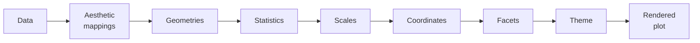

Welcome to **Mastering ggplot2: The Grammar of Graphics in R**.

You have almost certainly made a chart before. Maybe in Excel or
Google Sheets, maybe in Tableau or Power BI, maybe with `matplotlib`,
`seaborn`, Plotly, or base R's `plot()`. You know what a scatter plot
is. You know a bar chart from a histogram. You are *not* a beginner at
visualization.

So why a whole course on one R package?

Because `ggplot2` is not "another charting library." It is the
practical embodiment of a **theory** — the *Grammar of Graphics* —
that quietly reorganizes how you think about every chart you will ever
make. Once it clicks, you stop asking *"which function draws the chart
I want?"* and start asking *"which **components** does my chart
need?"* That shift is the entire point of this course.

<Callout type="info" title="Who this course is for">
- Analysts who can already make charts in **some** tool and want to
  understand the *system* behind ggplot2, not just its syntax.
- People with **basic R** familiarity (vectors, data frames,
  functions) who want a principled mental model.
- Anyone who has felt that ggplot2 code is a magic incantation and
  wants it to feel *obvious* instead.
</Callout>

## What makes this course different

Most tutorials teach ggplot2 as a pile of recipes: *"to make a
boxplot, type `geom_boxplot()`."* That works until you hit a chart no
recipe covers — and then you are stuck.

This course teaches the **grammar**. Every ggplot, from a one-line
scatter plot to a publication figure with faceting, custom scales, and
a hand-built theme, is assembled from the *same* small set of
components:

Learn the components once, and every chart becomes a *combination* you
can reason about — including charts you have never seen before.

## What we focus on — and what we skip

This is a **ggplot2** course, not a general data-visualization course.

This course **is** about:

- The Grammar of Graphics and *why* it exists
- Layered graphics and plot construction
- Aesthetic mappings, geometries, statistics, scales, coordinates,
  facets, and themes
- Building deep intuition for how a plot is assembled from components
- Advanced ggplot2 workflows

This course is **not** about:

- General visualization theory or perception science
- Dashboards, Shiny, or interactive web apps
- JavaScript charting libraries or front-end work
- Plotly, machine learning, or statistical modeling
- Business-intelligence platforms

We will use other ideas only when they help explain ggplot2.

## How the interactive pages work

Every R code block on these pages runs **in your browser** through
[WebR](https://docs.r-wasm.org/webr/latest/) — a full build of R
compiled to WebAssembly. `ggplot2` is already available; there is
nothing to install. Edit any snippet and click **Run**; plots render
inline as images.

You will meet three kinds of widgets:

1. **Executable R code blocks.** Change them, run them, break them,
   fix them.
2. **Multiple-choice questions.** Quick conceptual checks. The harder
   or more foundational a page is, the more of these you will find —
   getting the mental model right early saves hours later.
3. **Callouts** for tips, warnings, and "why does this matter?"
   moments.

<Callout type="info" title="Each block is isolated">
Variables defined in one `<CodeBlock>` are **not** visible in the
next, even on the same page. Every example is self-contained, so each
one usually starts with `library(ggplot2)`. For a long-lived
workspace, open the [R Playground](/playground/r) in a new tab.
</Callout>

## A taste of where we are going

Here is a complete, layered ggplot. It will look like a lot right now.
By the end of this course every line will feel *inevitable* — you will
be able to name the component each line belongs to.

<CodeBlock
  adapter="r"
  initialCode={`library(ggplot2)

ggplot(mpg, aes(x = displ, y = hwy, color = drv)) +
  geom_point(alpha = 0.7) +
  geom_smooth(method = "lm", se = FALSE) +
  scale_color_brewer(palette = "Set1") +
  facet_wrap(~ class) +
  labs(
    title = "Engine size vs. highway efficiency",
    subtitle = "Split by vehicle class, colored by drivetrain",
    x = "Engine displacement (litres)",
    y = "Highway miles per gallon",
    color = "Drivetrain"
  ) +
  theme_minimal()
`}
/>

Do not worry about understanding it yet. Notice only this: the plot is
*added together*, one component at a time, with `+`. That is the
grammar at work.

<Callout type="success">
Ready? Open **Plotting Systems That Don't Scale** in the sidebar to
see the problem ggplot2 was invented to solve.
</Callout>
